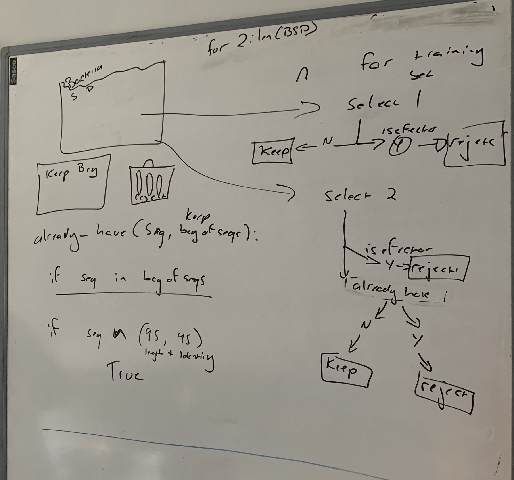

# January 2020 Lab Report 

### [Ruth Kristianingsih](https://github.com/ruthkr)

## 02–10 January 2020

Commits:
0

<!-- Total time: `#r get_total_worktime(curr_date, time_in = "9:00", time_out = "NA", time_lunch = "1:00")` -->

#### Worked on:

  - getting secreted protein for each organism using ensemblgenomes.org
  - tried to understand how biomart package in R works, so that I can
    retrieve the sequence data randomly using R
  - However, I could not figure out how biomart package in R is used to
    to retrieve protein sequences that specifically have signal peptide.
  - From biomart webtool, retrive one by one secreted data from fungi,
    oomycete (I retrieved data one by one per organism – with unique
    filter, and making it double the count of effector data so that in
    case it’s duplicate), and all sucessfully downloaded fungi data are:
      - Blumeria graminis.txt  
      - Parastagonospora nodorum.txt
      - Botrytis cinerea.txt  
      - Puccinia striiformis.txt
      - Colletotrichum orbiculare.txt
      - Ustilago maydis.txt
      - Dothistroma septosporum.txt  
      - Verticillium dahliae JR2.txt
      - Fusarium oxysporum.txt  
      - Verticillium dahliae.txt
      - Leptosphaeria maculans.txt  
      - Zymoseptoria tritici.txt
      - Magnaporthe oryzae.txt

And for oomycete data are:

  - Hyaloperonospora arabidopsidis.txt
  - Phytophthora sojae.txt
  - Phytophthora infestans.txt  
  - Pythium aphanidermatum .txt
  - Phytophthora parasitica.txt

There is another problem of using biomart webtools to retrieve the data,
which is not all of the oraganism are available in biomart webtools, the
ftp ensembl genome are more complete.

  - Since there is no biomart for ensembl bacteria, then need to
    download the whole fasta data in the whole ensemble genome. And the
    plan next will be use SignalP 3.0 to get all of the secreted data.
    \>\> from all of the secreted data then select randomly same as the
    count as effector

## 13–17 January 2020

Commits:
0

<!-- Total time: `#r get_total_worktime(curr_date, time_in = "9:25", time_out = "20:38", time_lunch = "00:45")` -->

#### Worked on

  - In order to make it more consistent and to make the retriving data
    easier among bacteria, oomycete, and fungi. We need to retrieve all
    of data from ftp, and using SignalP 3.0 to predict secreted protein
    and select randomly.
  - Made bash scripts to get the organism name, predict signal peptide
    using signalp and save them into `.csv` file, and get the organism
    name for each data (organism name is written in each single files,
    and we need that information attach in every sequence) – complete
    information can be found in [Process signalp prediction
    results](https://github.com/TeamMacLean/ruth-effectors-prediction/blob/master/reports/getting-data-secreted/0005_process_signalp_data.md)
  - The process are:
      - Create scripts that contain all of the list of pathogen organism
      - Create scripts to use SignalP 3.0 to predict all of the signalP
        existence
      - The instructions for complete pepline is in [Process signalp
        prediction
        results](https://github.com/TeamMacLean/ruth-effectors-prediction/blob/master/reports/getting-data-secreted/0005_process_signalp_data.md),
        there are several bash scripts used to run this pipeline
  - After getting all of the secreted sequence, then now is getting the
    sample data, the file is [Getting the sample
    data](https://github.com/TeamMacLean/ruth-effectors-prediction/blob/master/reports/getting-data-secreted/0006_getting_sample_data.md)
  - getting report of the results of hyperparameters scan of both models
    CNN-GRU and CNN-LSTM for each pathogen bacteria, oomycete, and fungi
    [Hyperparameter Scan of CNN GRU, and CNN LSTM for each datasets
    bacteria, oomycete, and
    fungi](https://github.com/TeamMacLean/ruth-effectors-prediction/blob/master/reports/model_scripts/multi_class/results_multi_class.md)

-----

## 21 January 2020 (Tuesday)

Commits:
0

<!-- Total time: `#r get_total_worktime(curr_date, time_in = "9:25", time_out = "20:38", time_lunch = "00:45")` -->

#### Weekly catch up meeting

##### Effector and non-effector prediction

  - Base factor method can be applied at the end of the pipeline, to see
    better the likelihood of two distribution
  - continue with the data splitting - encoding and train the data

#### Worked on

  - checking the bugs on the lookup table and the sampling results for
    each pathogen organisms, the scripts
  - fixed the function of for the getting the data
    `sample_from_lookup_table()`, and also checking the merge data
  - making a function to do blast the data
  - there is some missing data for fungi organism, therefore, need to
    retrive and do SignalP separately for the organism:
    “cercospora\_beticola” (it exists in `wget` scripts) and
    “pyrenophora\_tritici-repentis” (it is not exist in wget bash
    scripts, but it exists in the long list of fungi organism), need to
    get this data

## 22 January 2020 (Wednesday)

Commits:
5

<!-- Total time: `#r get_total_worktime(curr_date, time_in = "9:25", time_out = "20:38", time_lunch = "00:45")` -->

#### Worked on

  - finished the functions to blast data in R and also for reading the
    results from the [report on blast-ing the negative
    datasets](https://github.com/TeamMacLean/ruth-effectors-prediction/blob/master/reports/getting-data-secreted/0007_blast_result_random_sampling.md)

  - found that there are no identical protein sequence between the
    effector data and the negative datasets

## 23 January 2020 (Thursday)

Commits:
4

<!-- Total time: `#r get_total_worktime(curr_date, time_in = "9:25", time_out = "20:38", time_lunch = "00:45")` -->

#### Worked on

  - On the [SignalP 3.0 usage
    instructions](http://www.cbs.dtu.dk/services/SignalP-3.0/instructions.php)
    , it is explained that to use SignalP 3.0 at once, there should not
    be more than `2,000 sequences` and `200,000 amino acids in toto` in
    one submission. And also the sequences may not be longer than 6,000
    amino acids. In my `.fasta` data, I usually have more than 2000
    sequences. Therefore I splited up one fasta file per organism into
    several fasta files that for each file only contains less then 200o
    sequences. However, for some reason the signalP 3.0 did not work,
    and I tried to split them into smaller sequence number (which was
    500 sequences per file). It worked. However, Wednesday (23/01), I
    tried to split the data into smaller number of sequences which are
    around 100 sequences per file, apparently signalP can give more
    prediction. Therefore the last updated sampling results are from the
    newest signalP prediction with only 100 sequences per file.

  - Updated [Process signalp prediction
    results](https://github.com/TeamMacLean/ruth-effectors-prediction/blob/master/reports/getting-data-secreted/0005_process_signalp_data.md),
    there are several bash scripts used to run this pipeline and [report
    on blast-ing the negative datasets using the newest SignalP
    prediction
    results](https://github.com/TeamMacLean/ruth-effectors-prediction/blob/master/reports/getting-data-secreted/0007_blast_result_random_sampling.md)

  - created a scripts in .R scripts to label the data into binary and
    multiclass classification, and also function to to split the data
    into different datasets

## 27 January 2020 (Monday)

Commits: 2

#### Worked on

  - Tuning the bacteria splitting and blasting function
  - Encoding the data set for oomycete and fungi
  - Making the the scripts CNN-LSTM and CNN-GRU for oomycete and fungi

## 28 January 2020 (Tuesday)

Commits: 4

#### Weekly catch up-meeting

##### Effector prediction

  - Wrong method in randomly sampling data –\> should have done BLAST
    while selecting for the sequences, not in splitting data. Dan’s
    method:

  - After getting all of the data, continue doing the hyperparameter
    scan for all of the new datasets (with the Cross-Validation of of
    course since the data is very small. It will help.)

##### Subcellular - Localisation

  - trying to do ensembling and see how it will help to improve the
    perfomance

## 29–31 January 2020

Commits: 0

#### Worked on

  - Created the function to get the sample randomly (including checking
    manually with blast inside function and also with R)
  - use the function to get for the bacteria and identify how imbalance
    between the effector and non-effector (there is enough samples, so
    problem solved)
  - finished the scripts of binary classification for subcellular
    classification

## 03 February 2020 (Monday)

Commits: 4

#### Weekly catch up-meeting

##### Effector prediction

  - continue with other models (LSTM-Embd and GRU-Embd) for each dataset
  - continue with the new way for making the ensembl (consensues)

#### Subcellular Localisation

  - continue with training the multiclass with GRU embedding, and see
    how it will work
