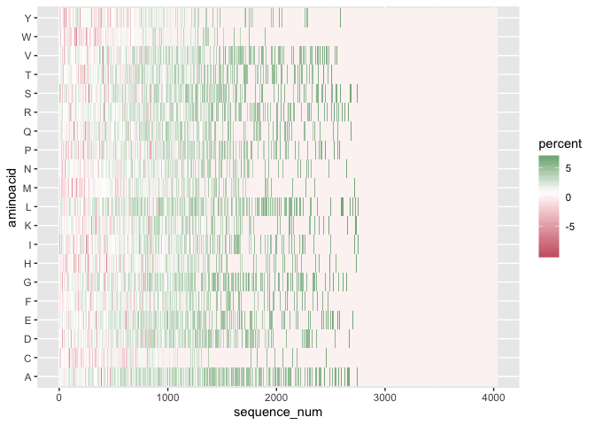
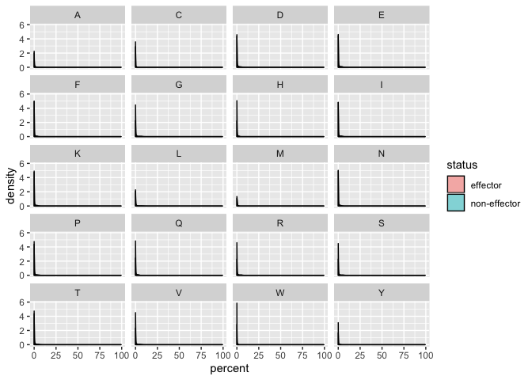
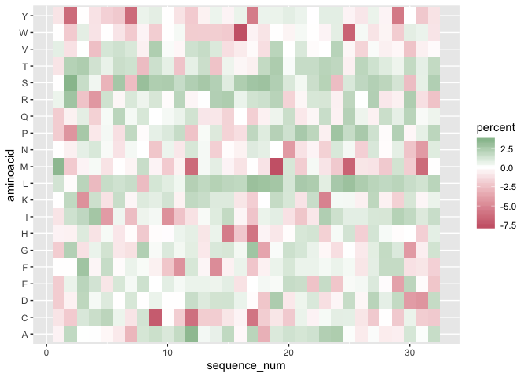
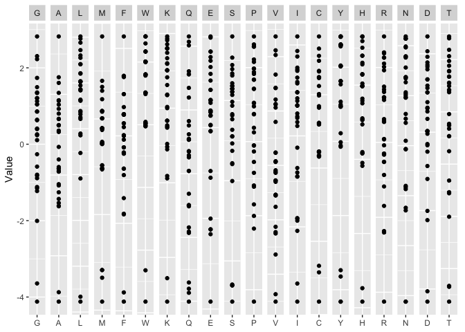
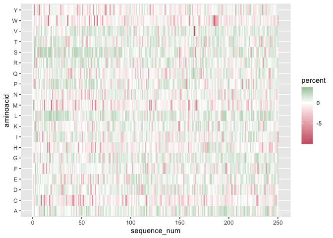
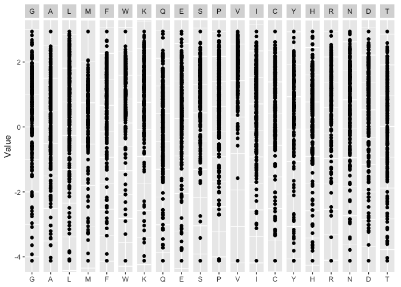

Identify the amino acid that make big difference between effector and non-effector sequence data
================================================================================================

Aim
---

### Question

Are there any difference in sequence composition or amino acids sequence
between effectors and non-effectors? Previously a proportion plot was
done but only limiting the length of the sequence until length = 32,
which is not reasonable unless for seqlogo that require the sequences to
have the same length of sequences.

### Purpose

My purpose is trying to identify the difference in sequence composition
between effector and non effectors without limiting the length of the
sequence to the minimum length.

Method
------

### Procedure

Creating proportion of amino acids in each position for both effector
and noneffector data. And then create the heatmap plot from the
difference between those two matrix data.

Execution
---------

Here are some functions that have been created to do the tasks, which
are:

    1. Function to get the proportion data
    2. Function to get the data ready for the plots (hist and heatmap)
    3. Function to create the scatter plot
    4. Function to plot the heatmap
    5. Function to plot the density function and histogram

### Load all of the libraries

### Read the datasets from then CSV

``` r
# Read CSV of the effector data
effector_data <- data.table::fread("effector_data.csv")

# Read CSV of the noneffector data 
non_effector_data <- data.table::fread("non_effector_data.csv")
```

``` r
# Getting the sequence of effector data
effector_seq <- effector_data %>% 
  dplyr::select(Sequence) %>% 
  rename(sequence = Sequence) %>% 
  mutate(length = stringr::str_length(sequence))
  
# Getting the sequence of non effector data
non_effector_seq <- non_effector_data %>% 
  dplyr::select(sequence) %>% 
  mutate(length = stringr::str_length(sequence))
```

``` r
all_len_seq <- effector_seq %>% 
  select(length) %>% 
  rbind (non_effector_seq %>% 
           select(length))

max_all_data <- max(all_len_seq)
min_all_data <- min(all_len_seq)
```

### Function to get the proportion data

``` r
get_data_prop <- function(data_seq, max_len){
  
  # Separate the sequence string
  data_seq_sep <- data_seq %>% 
    tidyr::separate(sequence, into = as.character(1:max_len), sep = 1:max_len, remove = FALSE) 
  
  # Transpose the data so that we can count the proportion for each position
  data_seq_sep_transpose <- data_seq_sep %>% 
    dplyr::select(paste0(1:max_len)) %>% 
    t() %>% 
    as.data.frame() %>% 
    tidyr::unite(new_seq, as.character(paste0("V", 1:nrow(data_seq_sep))), sep = "", remove = FALSE) %>% 
    select(new_seq)  
  
  # Rename the column 
  data_seq_sep_transpose$seq <- data_seq_sep_transpose$new_seq

  # Counts the number of each amino acids for each position
  data_amino_counts <- data_seq_sep_transpose %>% 
    rowwise() %>% 
    mutate(
    G_count = stringr::str_count(new_seq, "G"),
    A_count = stringr::str_count(new_seq, "A"),
    L_count = stringr::str_count(new_seq, "L"),
    M_count = stringr::str_count(new_seq, "M"),
    F_count = stringr::str_count(new_seq, "F"),
    W_count = stringr::str_count(new_seq, "W"),
    K_count = stringr::str_count(new_seq, "K"),
    Q_count = stringr::str_count(new_seq, "Q"),
    E_count = stringr::str_count(new_seq, "E"),
    S_count = stringr::str_count(new_seq, "S"),
    P_count = stringr::str_count(new_seq, "P"),
    V_count = stringr::str_count(new_seq, "V"),
    I_count = stringr::str_count(new_seq, "I"),
    C_count = stringr::str_count(new_seq, "C"),
    Y_count = stringr::str_count(new_seq, "Y"),
    H_count = stringr::str_count(new_seq, "H"),
    R_count = stringr::str_count(new_seq, "R"),
    N_count = stringr::str_count(new_seq, "N"),
    D_count = stringr::str_count(new_seq, "D"),
    T_count = stringr::str_count(new_seq, "T")
  )

  # Calculate the proportion over the number of amino acids in every position
  data_amino_prop_over_length_each_row <- data_amino_counts %>% 
  rowwise() %>% 
  mutate(
  G_percent = G_count / stringr::str_length(new_seq) * 100,
  A_percent = A_count / stringr::str_length(new_seq) * 100,
  L_percent = L_count / stringr::str_length(new_seq) * 100,
  M_percent = M_count / stringr::str_length(new_seq) * 100,
  F_percent = F_count / stringr::str_length(new_seq) * 100,
  W_percent = W_count / stringr::str_length(new_seq) * 100,
  K_percent = K_count / stringr::str_length(new_seq) * 100,
  Q_percent = Q_count / stringr::str_length(new_seq) * 100,
  E_percent = E_count / stringr::str_length(new_seq) * 100,
  S_percent = S_count / stringr::str_length(new_seq) * 100,
  P_percent = P_count / stringr::str_length(new_seq) * 100,
  V_percent = V_count / stringr::str_length(new_seq) * 100,
  I_percent = I_count / stringr::str_length(new_seq) * 100,
  C_percent = C_count / stringr::str_length(new_seq) * 100,
  Y_percent = Y_count / stringr::str_length(new_seq) * 100,
  H_percent = H_count / stringr::str_length(new_seq) * 100,
  R_percent = R_count / stringr::str_length(new_seq) * 100,
  N_percent = N_count / stringr::str_length(new_seq) * 100,
  D_percent = D_count / stringr::str_length(new_seq) * 100,
  T_percent = T_count / stringr::str_length(new_seq) * 100
  ) %>% 
  select(ends_with("_percent"))
  
  # Getting maximum number of amino acids in all position
  data_len <- max(str_length(data_amino_counts$new_seq))
  
  # Calculate the proportion for each amino acids in each position
  data_amino_prop <- data_amino_counts %>% 
    rowwise() %>% 
    mutate(
    G_percent = G_count / data_len * 100,
    A_percent = A_count / data_len * 100,
    L_percent = L_count / data_len * 100,
    M_percent = M_count / data_len * 100,
    F_percent = F_count / data_len * 100,
    W_percent = W_count / data_len * 100,
    K_percent = K_count / data_len * 100,
    Q_percent = Q_count / data_len * 100,
    E_percent = E_count / data_len * 100,
    S_percent = S_count / data_len * 100,
    P_percent = P_count / data_len * 100,
    V_percent = V_count / data_len * 100,
    I_percent = I_count / data_len * 100,
    C_percent = C_count / data_len * 100,
    Y_percent = Y_count / data_len * 100,
    H_percent = H_count / data_len * 100,
    R_percent = R_count / data_len * 100,
    N_percent = N_count / data_len * 100,
    D_percent = D_count / data_len * 100,
    T_percent = T_count / data_len * 100
  ) %>% 
    select(ends_with("_percent"))
  
  # Melt the data
  data_amino_prop_melt <- data_amino_prop  %>% 
  # Transform rowids into a column
  tibble::rowid_to_column(var = "sequence_num") %>% 
  # Melt the data to make is sparse instead of a matrix
  reshape2::melt(id.var = "sequence_num", value.name = "percent") %>% 
  # Rename aminoacids
  mutate(variable = stringr::str_remove_all(variable, "_percent")) %>% 
  rename(aminoacid = variable)

  # Create list for the results
  results_list <- list(
    data_prop_over_length_each_row = data_amino_prop_over_length_each_row,
    data_prop_over_max_all_data = data_amino_prop,
    data_prop_melt = data_amino_prop_melt
  )

  return(results_list)
  
}
```

### Function to get the data ready for the plots (hist and heatmap)

``` r
# Function to get the log data of effector and non-effector
get_data_for_plots <- function(effector_prop, 
                               non_effector_prop, 
                               effector_melt, 
                               non_effector_melt){
  
  # Getting the absolute difference between effector and non-effector data
  effector_non_effector_diff <- (abs(effector_prop - non_effector_prop))
  
  # Taking the log of the difference
  log_diff <- log2(effector_non_effector_diff)
  # log_diff <- effector_non_effector_diff
  
  # Getting the clean data without NA and Inf
  heatmap_data <- log_diff %>% 
  mutate_all(function(x) ifelse(is.nan(x), 0, x)) %>% 
  mutate_all(function(x) ifelse(is.infinite(x), 0, x))
  
  # Melting the data for heatmap plot
  heatmap_data <- heatmap_data  %>% 
  # Transform rowids into a column
  tibble::rowid_to_column(var = "sequence_num") %>% 
  # Melt the data to make is sparse instead of a matrix
  reshape2::melt(id.var = "sequence_num", value.name = "percent") %>% 
  # Rename aminoacids
  mutate(variable = stringr::str_remove_all(variable, "_percent")) %>% 
  rename(aminoacid = variable)
  
  # Getting data for histogram 
  effector_with_status <- effector_melt %>% 
  mutate(status = "effector")

  non_effector_with_status <- non_effector_melt %>% 
  mutate(status = "non-effector")

  hist_data <- rbind(effector_with_status, non_effector_with_status)
  
  # Create list for the results
  results_list <- list(
    heatmap_data = heatmap_data,
    hist_data = hist_data
  )

  return(results_list)
}
```

### Function to create the scatter plot

``` r
# Function to get the individual plot of every amino acids
plot_each_amino <- function(data_melted, aminos){
plot <- ggplot(data = data_melted %>% 
         dplyr::filter(aminoacid == as.character({{ aminos }}))) +
  aes(x = aminoacid, y = percent) %>% 
  geom_point()
return(plot)
}

plot_all_aminos <- function(data) {
  plot_matrix <- GGally::ggmatrix(
    list(
      plot_each_amino(data, "G"),
      plot_each_amino(data, "A"),
      plot_each_amino(data, "L"),
      plot_each_amino(data, "M"),
      plot_each_amino(data, "F"),
      plot_each_amino(data, "W"),
      plot_each_amino(data, "K"), 
      plot_each_amino(data, "Q"),
      plot_each_amino(data, "E"), 
      plot_each_amino(data, "S"),
      plot_each_amino(data, "P"),
      plot_each_amino(data, "V"),
      plot_each_amino(data, "I"),
      plot_each_amino(data, "C"),
      plot_each_amino(data, "Y"),
      plot_each_amino(data, "H"),
      plot_each_amino(data, "R"), 
      plot_each_amino(data, "N"),
      plot_each_amino(data, "D"), 
      plot_each_amino(data, "T")
    ),
    nrow = 1, ncol = 20,
    xAxisLabels = c("G", "A", "L", "M", "F", "W", "K", "Q", "E", "S",
                    "P", "V", "I", "C", "Y", "H", "R", "N", "D", "T"),
    ylab = "Value", progress = FALSE
  ) +
    theme(strip.placement = "outside")

  return(plot_matrix)
}
```

### Function to plot the heatmap

``` r
plot_heatmap <- function(heatmap_data){
  heatmap_plot <- ggplot(data = heatmap_data , aes(x=sequence_num, y=aminoacid, fill=percent)) +
  geom_tile() +
  scale_fill_gradient2(midpoint = mean(heatmap_data$percent), mid="white",
                       low=rgb(204/255,102/255,119/255),
                       high=rgb(17/255,119/255,51/255),
                       limits = c(min(heatmap_data$percent),
                                  max(heatmap_data$percent)), 
                                  name="percent")
  return(heatmap_plot )
}
```

### Function to plot the density function and histogram

#### Plot density

``` r
plot_density <- function(hist_data){
  density_plot <- ggplot(hist_data) +
  aes(x = percent, group = status, fill = status) +
  geom_density(alpha = 0.5) +
  # scale_x_continuous(limits = c(0, 25)) +
  facet_wrap(~ aminoacid, nrow = 5)
  
  return(density_plot)
}
```

#### Plot histogram

``` r
plot_hist <- function(hist_data){
  hist_plot <- ggplot(hist_data) +
  aes(x = percent, group = status, fill = status) +
  geom_histogram(binwidth = 1, alpha = 0.5, position = "identity") +
  # scale_x_continuous(limits = c(0, 7.5)) +
  facet_wrap(~ aminoacid, nrow = 5)
  
  return(hist_plot)
}
```

Results
-------

### Figures with maximum data

``` r
# Get effector data 
effector_prop_with_all_max_data <- get_data_prop(effector_seq, max_len= max_all_data)
effector_prop <- effector_prop_with_all_max_data[["data_prop_over_length_each_row"]]
effector_prop_melt <- effector_prop_with_all_max_data[["data_prop_melt"]]

# Get non-effector data 
non_effector_prop_with_all_max_data <- get_data_prop(non_effector_seq, max_len= max_all_data)
non_effector_prop <- non_effector_prop_with_all_max_data[["data_prop_over_length_each_row"]]
non_effector_prop_melt <- non_effector_prop_with_all_max_data[["data_prop_melt"]]
```

``` r
data_test <- get_data_for_plots(effector_prop, 
                                non_effector_prop,
                                effector_prop_melt, 
                                non_effector_prop_melt)
heatmap_all_max_data <- data_test[["heatmap_data"]]
hist_all_max_data <- data_test[["hist_data"]]
```

#### Heatmap plots

``` r
plot_heatmap(heatmap_all_max_data)
```



#### Histogram Plot

``` r
plot_density(hist_all_max_data)
```



#### Histogram Plot

``` r
plot_hist(hist_all_max_data)
```


``` r
plot_density(hist_all_max_data)
```


### Figures with minimum of length

``` r
# Get effector data 
effector_prop_with_all_min_data <- get_data_prop(effector_seq, max_len= min_all_data)
effector_prop_len_min_data <- effector_prop_with_all_min_data[["data_prop_over_length_each_row"]]
effector_prop_melt <- effector_prop_with_all_min_data[["data_prop_melt"]]

# Get non-effector data 
non_effector_prop_with_all_min_data <- get_data_prop(non_effector_seq, max_len= min_all_data)
non_effector_prop_len_min_data <- non_effector_prop_with_all_min_data[["data_prop_over_length_each_row"]]
non_effector_prop_melt <- non_effector_prop_with_all_min_data[["data_prop_melt"]]
```

``` r
data_test <- get_data_for_plots(effector_prop_len_min_data, 
                                non_effector_prop_len_min_data,
                                effector_prop_melt, 
                                non_effector_prop_melt)
heatmap_all_min_data <- data_test[["heatmap_data"]]
hist_all_min_data <- data_test[["hist_data"]]
```

#### Heatmap plot

``` r
# Function to draw the graph and histogram 
ggplot(data = heatmap_all_min_data , aes(x=sequence_num, y=aminoacid, fill=percent)) +
  geom_tile() +
  scale_fill_gradient2(midpoint = mean(heatmap_all_min_data$percent), mid="white",
                       low=rgb(204/255,102/255,119/255),
                       high=rgb(17/255,119/255,51/255),
                       limits = c(min(heatmap_all_min_data$percent),
                                  max(heatmap_all_min_data$percent)), 
                                  name="percent")
```



#### Scatter Plot

``` r
plot_all_aminos(heatmap_all_min_data)
```



### Figures with length = 250

``` r
# Get effector data 
effector_prop_with_len250 <- get_data_prop(effector_seq, max_len=250)
effector_prop_len250 <- effector_prop_with_len250[["data_prop_over_length_each_row"]]
effector_prop_melt_len250 <- effector_prop_with_len250[["data_prop_melt"]]

# Get non-effector data 
non_effector_prop_with_len250 <- get_data_prop(non_effector_seq, max_len=250)
non_effector_prop_len250 <- non_effector_prop_with_len250[["data_prop_over_length_each_row"]]
non_effector_prop_melt_len250 <- non_effector_prop_with_len250[["data_prop_melt"]]
```

``` r
data_for_plot_len250 <- get_data_for_plots(effector_prop_len250, 
                                          non_effector_prop_len250,
                                          effector_prop_melt_len250, 
                                          non_effector_prop_melt_len250)

heatmap_len250 <- data_for_plot_len250[["heatmap_data"]]
hist_len250 <- data_for_plot_len250[["hist_data"]]
```

#### Heatmap Plot

``` r
plot_heatmap(heatmap_len250)
```



#### Scatter Plot

``` r
plot_all_aminos(heatmap_len250)
```


