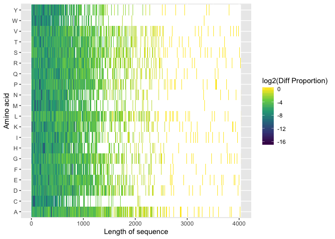
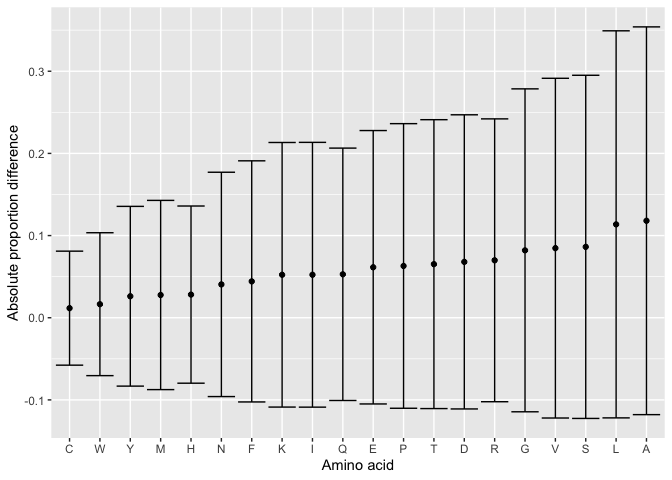
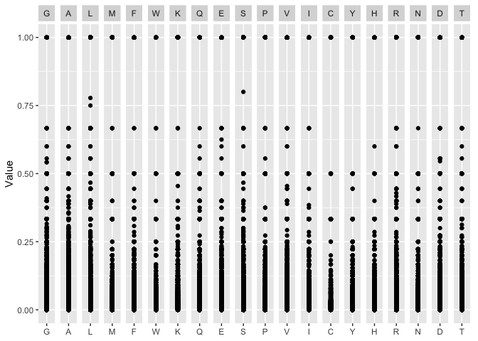
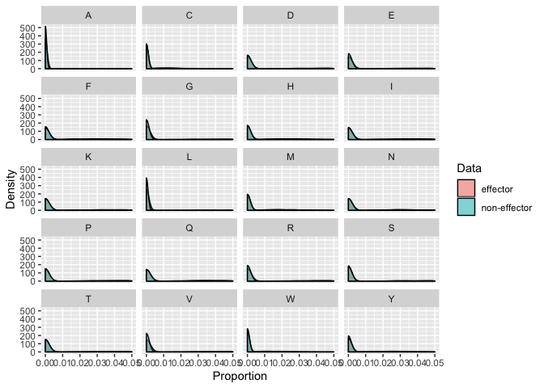
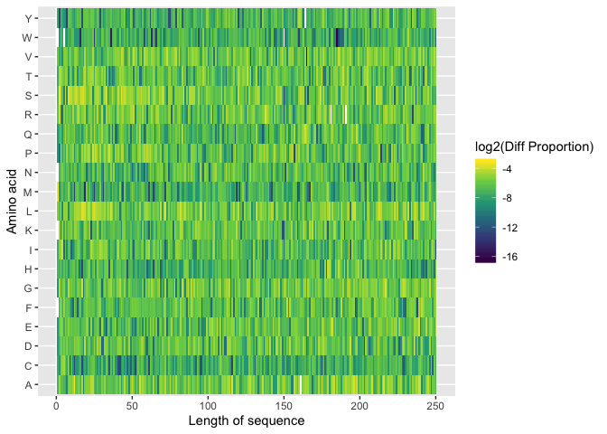
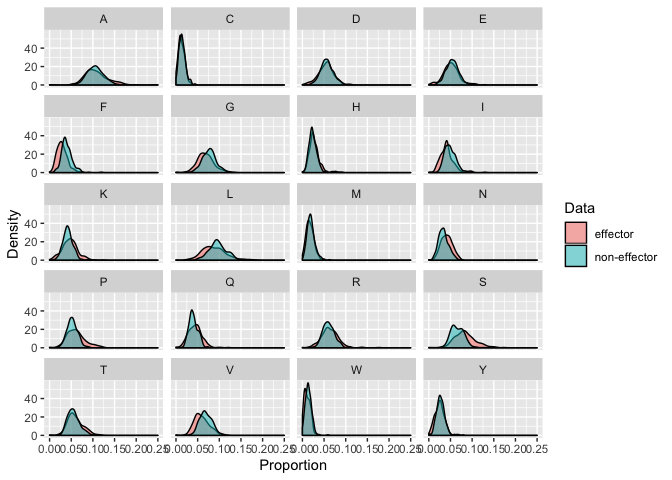
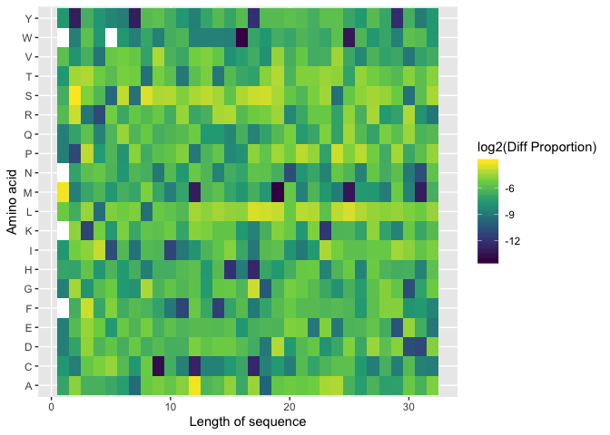

Identify amino acids that make big difference between effector and non-effector sequence data
=============================================================================================

Aim
---

### Question

Are there any difference in sequence composition or amino acids sequence
between effectors and non-effectors? In order to answer this question,
previously a proportion plot was done but only limiting the length of
the sequence until length = 32, which is not reasonable unless if we
want to create a seqlogo that requires the same length of sequences on
amino acid protein data.

### Purpose

My purpose is trying to identify the difference in sequence composition
between effector and non effectors without limiting the length of the
sequence to the minimum length.

Method
------

### Procedure

In order to achieve the purpose above, we need to do the following
steps:

1.  Calculate the proportion of amino acids in each position for both
    effector and noneffector data.
2.  Calculate the difference between the proportion of effector and
    non-effector data.
3.  Lastly, create the heatmap plot from the difference between those
    two proportion data.

Execution
---------

Here are some functions that have been created to do the tasks, which
are:

    1. Function to get the proportion of amino acids
    2. Function to get the data ready for the plots (hist and heatmap)
    3. Function to create the scatter plot
    4. Function to plot the heatmap
    5. Function to plot the density function and histogram

### Load all of the libraries

``` r
# Load all of the library that we need to process and plot the data
library(tidyverse)
```

    ## ── Attaching packages ────────────────────────────────────────────────────────────────────────────────────── tidyverse 1.2.1 ──

    ## ✔ ggplot2 3.2.0     ✔ purrr   0.3.2
    ## ✔ tibble  2.1.3     ✔ dplyr   0.8.3
    ## ✔ tidyr   0.8.3     ✔ stringr 1.4.0
    ## ✔ readr   1.3.1     ✔ forcats 0.4.0

    ## ── Conflicts ───────────────────────────────────────────────────────────────────────────────────────── tidyverse_conflicts() ──
    ## ✖ dplyr::filter() masks stats::filter()
    ## ✖ dplyr::lag()    masks stats::lag()

``` r
library(reshape2)
```

    ## 
    ## Attaching package: 'reshape2'

    ## The following object is masked from 'package:tidyr':
    ## 
    ##     smiths

``` r
library(ggplot2)
```

### Read the datasets from then CSV

#### Data preparation

``` r
# Read CSV of the effector data
effector_data <- data.table::fread("effector_data.csv")

# Read CSV of the noneffector data
non_effector_data <- data.table::fread("non_effector_data.csv")
```

``` r
# Getting the sequence of effector data
effector_seq <- effector_data %>%
  dplyr::select(Sequence) %>%
  # Rename the name of the column Sequence
  rename(sequence = Sequence) %>%
  mutate(length = stringr::str_length(sequence))

# Getting the sequence of non effector data
non_effector_seq <- non_effector_data %>%
  dplyr::select(sequence) %>%
  mutate(length = stringr::str_length(sequence))
```

``` r
# Put all of the effector and non-effector data together
all_len_seq <- effector_seq %>%
  select(length) %>%
  rbind(non_effector_seq %>%
    select(length))
```

``` r
# Get the maximum length of the data 
max_len_all_data <- max(all_len_seq)

max_len_all_data %>% 
  knitr::kable()
```

|     x|
|-----:|
|  4034|

``` r
# Get the minimum length of the data 
min_len_all_data <- min(all_len_seq)

min_len_all_data %>% 
  knitr::kable()
```

|    x|
|----:|
|   32|

### Function to get the proportion data

``` r
get_data_prop <- function(data_seq, max_len) {

  # Separate the sequence string
  data_seq_sep <- data_seq %>%
    tidyr::separate(sequence, into = as.character(1:max_len), sep = 1:max_len, remove = FALSE)

  # Transpose the data so that we can count the proportion for each position
  data_seq_sep_transpose <- data_seq_sep %>%
    dplyr::select(paste0(1:max_len)) %>%
    t() %>%
    as.data.frame() %>%
    tidyr::unite(new_seq, as.character(paste0("V", 1:nrow(data_seq_sep))), sep = "", remove = FALSE) %>%
    select(new_seq)

  # Rename the column
  data_seq_sep_transpose$seq <- data_seq_sep_transpose$new_seq

  # Counts the number of each amino acids for each position
  data_amino_counts <- data_seq_sep_transpose %>%
    rowwise() %>%
    mutate(
      G_count = stringr::str_count(new_seq, "G"),
      A_count = stringr::str_count(new_seq, "A"),
      L_count = stringr::str_count(new_seq, "L"),
      M_count = stringr::str_count(new_seq, "M"),
      F_count = stringr::str_count(new_seq, "F"),
      W_count = stringr::str_count(new_seq, "W"),
      K_count = stringr::str_count(new_seq, "K"),
      Q_count = stringr::str_count(new_seq, "Q"),
      E_count = stringr::str_count(new_seq, "E"),
      S_count = stringr::str_count(new_seq, "S"),
      P_count = stringr::str_count(new_seq, "P"),
      V_count = stringr::str_count(new_seq, "V"),
      I_count = stringr::str_count(new_seq, "I"),
      C_count = stringr::str_count(new_seq, "C"),
      Y_count = stringr::str_count(new_seq, "Y"),
      H_count = stringr::str_count(new_seq, "H"),
      R_count = stringr::str_count(new_seq, "R"),
      N_count = stringr::str_count(new_seq, "N"),
      D_count = stringr::str_count(new_seq, "D"),
      T_count = stringr::str_count(new_seq, "T")
    )

  # Calculate the proportion over the number of amino acids in every position
  data_amino_prop_over_length_each_row <- data_amino_counts %>%
    rowwise() %>%
    mutate(
      G_proportion = G_count / stringr::str_length(new_seq),
      A_proportion = A_count / stringr::str_length(new_seq),
      L_proportion = L_count / stringr::str_length(new_seq),
      M_proportion = M_count / stringr::str_length(new_seq),
      F_proportion = F_count / stringr::str_length(new_seq),
      W_proportion = W_count / stringr::str_length(new_seq),
      K_proportion = K_count / stringr::str_length(new_seq),
      Q_proportion = Q_count / stringr::str_length(new_seq),
      E_proportion = E_count / stringr::str_length(new_seq),
      S_proportion = S_count / stringr::str_length(new_seq),
      P_proportion = P_count / stringr::str_length(new_seq),
      V_proportion = V_count / stringr::str_length(new_seq),
      I_proportion = I_count / stringr::str_length(new_seq),
      C_proportion = C_count / stringr::str_length(new_seq),
      Y_proportion = Y_count / stringr::str_length(new_seq),
      H_proportion = H_count / stringr::str_length(new_seq),
      R_proportion = R_count / stringr::str_length(new_seq),
      N_proportion = N_count / stringr::str_length(new_seq),
      D_proportion = D_count / stringr::str_length(new_seq),
      T_proportion = T_count / stringr::str_length(new_seq)
    ) %>%
    select(ends_with("_proportion"))
  
  data_amino_prop_over_length_each_row <- data_amino_prop_over_length_each_row %>% 
    mutate_all(function(x) ifelse(is.nan(x), 0, x))

  # Melt the data
  data_amino_prop_melt <- data_amino_prop_over_length_each_row %>%
    # Transform rowids into a column
    tibble::rowid_to_column(var = "sequence_num") %>%
    # Melt the data to make is sparse instead of a matrix
    reshape2::melt(id.var = "sequence_num", value.name = "proportion") %>%
    # Rename aminoacids
    mutate(variable = stringr::str_remove_all(variable, "_proportion")) %>%
    rename(aminoacid = variable)

  # Create list for the results
  results_list <- list(
    data_prop = data_amino_prop_over_length_each_row,
    data_prop_melt = data_amino_prop_melt
  )

  # Return the list of the results
  return(results_list)
}
```

### Function to get the data ready for the plots (histogram and heatmap)

``` r
# Function to get the log data of effector and non-effector
get_data_for_plots <- function(effector_prop,
                               non_effector_prop,
                               effector_melt,
                               non_effector_melt) {

  # Getting the absolute difference between effector and non-effector data
  effector_non_effector_diff <- (abs(effector_prop - non_effector_prop))

  # Taking the log of the difference
  log_diff <- log2(effector_non_effector_diff)

  # Getting the clean data without NaN and Inf and make it NA
  heatmap_data <- log_diff %>%
    mutate_all(function(x) ifelse(is.nan(x), NA, x)) %>%
    mutate_all(function(x) ifelse(is.infinite(x), NA, x))

  # Melting the data for heatmap plot
  heatmap_data <- heatmap_data %>%
    # Transform rowids into a column
    tibble::rowid_to_column(var = "sequence_num") %>%
    # Melt the data to make is sparse instead of a matrix
    reshape2::melt(id.var = "sequence_num", value.name = "proportion") %>%
    # Rename aminoacids
    mutate(variable = stringr::str_remove_all(variable, "_proportion")) %>%
    rename(aminoacid = variable)
  
  # Get the melted version of difference effector and non-effector data 
  effector_non_effector_diff_melt <- effector_non_effector_diff %>% 
    # Transform rowids into a column
    tibble::rowid_to_column(var = "sequence_num") %>%
    # Melt the data to make is sparse instead of a matrix
    reshape2::melt(id.var = "sequence_num", value.name = "proportion") %>%
    # Rename aminoacids
    mutate(variable = stringr::str_remove_all(variable, "_proportion")) %>%
    rename(aminoacid = variable)
  
  # Getting data for histogram
  effector_with_status <- effector_melt %>%
    mutate(status = "effector")

  non_effector_with_status <- non_effector_melt %>%
    mutate(status = "non-effector")

  hist_data <- rbind(effector_with_status, non_effector_with_status)

  # Create list for the results
  results_list <- list(
    diff_data_melted = effector_non_effector_diff_melt,
    heatmap_data = heatmap_data,
    hist_data = hist_data
  )

  return(results_list)
}
```

### Function to create the scatter plot

``` r
# Function to get the individual plot of every amino acids
plot_each_amino <- function(data_melted, aminos) {
  plot <- ggplot(data = data_melted %>%
    dplyr::filter(aminoacid == as.character({
      {
        aminos
      }
    }))) +
    aes(x = aminoacid, y = proportion) %>%
    geom_point()
  return(plot)
}

plot_all_aminos <- function(data) {
  plot_matrix <- GGally::ggmatrix(
    list(
      plot_each_amino(data, "G"),
      plot_each_amino(data, "A"),
      plot_each_amino(data, "L"),
      plot_each_amino(data, "M"),
      plot_each_amino(data, "F"),
      plot_each_amino(data, "W"),
      plot_each_amino(data, "K"),
      plot_each_amino(data, "Q"),
      plot_each_amino(data, "E"),
      plot_each_amino(data, "S"),
      plot_each_amino(data, "P"),
      plot_each_amino(data, "V"),
      plot_each_amino(data, "I"),
      plot_each_amino(data, "C"),
      plot_each_amino(data, "Y"),
      plot_each_amino(data, "H"),
      plot_each_amino(data, "R"),
      plot_each_amino(data, "N"),
      plot_each_amino(data, "D"),
      plot_each_amino(data, "T")
    ),
    nrow = 1, ncol = 20,
    xAxisLabels = c(
      "G", "A", "L", "M", "F", "W", "K", "Q", "E", "S",
      "P", "V", "I", "C", "Y", "H", "R", "N", "D", "T"
    ),
    ylab = "Value", progress = FALSE
  ) +
    theme(strip.placement = "outside")

  return(plot_matrix)
}
```

### Function to plot the heatmap

``` r
# Function to plot the heatmap
plot_heatmap <- function(heatmap_data) {
  heatmap_plot <- ggplot(data = heatmap_data, aes(x = sequence_num, y = aminoacid, fill = proportion)) +
    geom_tile() +
    scale_fill_viridis_c(na.value = "white") +
    labs(x = "Length of sequence", y = "Amino acid", fill = "log2(Diff Proportion)")
  return(heatmap_plot)
}
```

### Function to plot the density function and histogram

#### Plot density

``` r
# Function to plot the density function
plot_density <- function(hist_data, x_max = 1) {
  density_plot <- ggplot(hist_data) +
    aes(x = proportion, group = status, fill = status) +
    geom_density(alpha = 0.5) +
    scale_x_continuous(limits = c(0, x_max)) +
    facet_wrap(~aminoacid, nrow = 5) +
    labs(x = "Proportion", y = "Density", fill = "Data")

  return(density_plot)
}
```

#### Plot histogram

``` r
# Function to plot the histogram
plot_hist <- function(hist_data, x_max = 1) {
  hist_plot <- ggplot(hist_data) +
    aes(x = proportion, group = status, fill = status) +
    geom_histogram(binwidth = 1, alpha = 0.5, position = "identity") +
    scale_x_continuous(limits = c(0, x_max)) +
    facet_wrap(~aminoacid, nrow = 5) +
    labs(x = "Proportion", y = "Count", fill = "Data")

  return(hist_plot)
}
```

Results
-------

We are going to create the heatmap for all of the data without limiting
the length of the sequences.

Since we are not going to limit the data, then we can take the maximum
length of data

``` r
# Effector data
effector_prop_without_limiting <- get_data_prop(effector_seq, max_len = max_len_all_data)
# Get the proportion of the amino acids 
effector_prop <- effector_prop_without_limiting[["data_prop"]]
# Melt the proportion data above
effector_prop_melt <- effector_prop_without_limiting[["data_prop_melt"]]

# Non-effector data
non_effector_prop_without_limiting <- get_data_prop(non_effector_seq, max_len = max_len_all_data)
# Get the proportion of the amino acids
non_effector_prop <- non_effector_prop_without_limiting[["data_prop"]]
# Melt the proportion data above
non_effector_prop_melt <- non_effector_prop_without_limiting[["data_prop_melt"]]
```

``` r
data_without_limiting <- get_data_for_plots(
  effector_prop,
  non_effector_prop,
  effector_prop_melt,
  non_effector_prop_melt
)

heatmap_without_limiting <- data_without_limiting[["heatmap_data"]]
hist_without_limiting <- data_without_limiting[["hist_data"]]
diff_data_without_limiting <- data_without_limiting[["diff_data_melted"]]
```

``` r
plot_heatmap(
  heatmap_without_limiting 
)
```



Heatmap figure above depicts the importance of amino acids in each
positions of the sequence, where yellow color shows that an amino acid
in certain position has very big difference between effector and
non-effector, and as we can see from the legend, as the color getting
darker to green and purple, the the amino acid has less difference
between the two datasets. Since the sequences data do not have the same
length, therefore we can see that there are many amino acids are filled
with white which does not have any value (see the legend).

By looking at the figure briefly, in general, we can see that some of
amino acids have lighter color than others (for instance amino acid `A`,
`D`, `E`,`G`, `L`, etc). It means that the difference of those amino
acids between effector and non-effector data are bigger than other amino
acids.

In order to see further how the proportion values of these amino acids
spreads, we can take a look on this statistical summary below.

``` r
prop_diff_data <- (effector_prop - non_effector_prop) %>%
  # Take absolute value
  mutate_all(function(x) abs(x)) %>%
  # Transpose
  t() %>%
  as.data.frame() %>%
  # Recover aminoacid as a variable
  tibble::rownames_to_column(var = "aminoacid") %>%
  mutate(
    aminoacid = stringr::str_remove_all(aminoacid, "_proportion")
    # aminoacid = as.factor(aminoacid)
  ) 

prop_diff_data <- prop_diff_data %>%
  # Calculate mean and sd ignoring zeros
  mutate_all(function(x) ifelse(x == 0, NA, x)) %>%
  mutate(
    mean = matrixStats::rowMeans2(select(prop_diff_data, dplyr::starts_with("V")) %>% as.matrix(), na.rm = TRUE),
    sd = matrixStats::rowSds(select(prop_diff_data, dplyr::starts_with("V")) %>% as.matrix(), na.rm = TRUE)
  ) %>%
  # Select final results
  select(aminoacid, mean, sd)


ggplot(prop_diff_data) +
  aes(x = reorder(aminoacid, mean), y = mean) +
  geom_point() +
  geom_errorbar(aes(ymin = mean - sd, ymax = mean + sd)) +
  labs(x = "Amino acid", y = "Absolute proportion difference")
```



The black dot on the figure above shows the average value of the proportion
of each amino acid. Amino acid A has the highest average value, followed
by amino acid L with almost similar average value and standard deviation
with amino acid A. It can be seen that the higher the average value, the
larger spread the data around the mean (higher standard deviation). The
spread of the amino acid proportion is shown by the scatter plot below.

``` r
plot_all_aminos(diff_data_without_limiting)
```



``` r
plot_density(hist_without_limiting, x_max = 0.05)
```

Plot of density function below also can give you clue of how difference effector and noneffctor data for each amino acid. However, it can barely seen. 



If we take a closer look on the first heatmap figure, we can see that
not every amino acids has the same color in every position. For
instance, amino acid `A` has darker color in the beginning of the
position, but getting lighter in general as the position increases. In
order to have closer look, we can try to limit the length of the
sequences just to see what is really happening on the first 250
positions of sequence for instance.

``` r
# Get effector data
effector_prop_with_len250 <- get_data_prop(effector_seq, max_len = 250)
effector_prop_len250 <- effector_prop_with_len250[["data_prop"]]
effector_prop_melt_len250 <- effector_prop_with_len250[["data_prop_melt"]]

# Get non-effector data
non_effector_prop_with_len250 <- get_data_prop(non_effector_seq, max_len = 250)
non_effector_prop_len250 <- non_effector_prop_with_len250[["data_prop"]]
non_effector_prop_melt_len250 <- non_effector_prop_with_len250[["data_prop_melt"]]
```

``` r
data_for_plot_len250 <- get_data_for_plots(
  effector_prop_len250,
  non_effector_prop_len250,
  effector_prop_melt_len250,
  non_effector_prop_melt_len250
)

heatmap_len250 <- data_for_plot_len250[["heatmap_data"]]
hist_len250 <- data_for_plot_len250[["hist_data"]]
```

``` r
plot_heatmap(heatmap_len250)
```



Apparently, as we plot the heatmap with limiting the length of the
sequence, we have better idea about the composition of amino acids in
protein sequences. Amino acid `A` between effector and non effector data
in the first 100 position has quite bigger difference (depicted by
yellow color) in comparison to amino acid `C` in general. However, not
in every position it has the same exact color, as it suggests that the
impact of each amino acid in every position is not always the same.

By looking at the plot of density function below, we can see that there are 
some amino acids that have obvious difference between effector and non-effector data, 
such as amino acid `F`, `G`, `L`, `S`, and so on. 

``` r
plot_density(hist_len250, x_max = 0.25)
```




Note here that since the length of the sequence varies, therefore it has
impact on the proportion values of each amino acid. But, what if we
limit the length of the sequence to the minimum value = 32, so that we
can get same length of sequence.

``` r
# Get effector data
effector_prop_with_min_length <- get_data_prop(effector_seq, max_len = min_len_all_data)
effector_prop_min_length <- effector_prop_with_min_length[["data_prop"]]
effector_prop_with_min_length_melt <- effector_prop_with_min_length[["data_prop_melt"]]

# Get non-effector data
non_effector_prop_with_min_length <- get_data_prop(non_effector_seq, max_len = min_len_all_data)
non_effector_prop_min_length <- non_effector_prop_with_min_length[["data_prop"]]
non_effector_prop_with_min_length_melt <- non_effector_prop_with_min_length[["data_prop_melt"]]
```

``` r
data_with_min_length <- get_data_for_plots(
  effector_prop_min_length,
  non_effector_prop_min_length,
  effector_prop_with_min_length_melt,
  non_effector_prop_with_min_length_melt
)
heatmap_with_min_length <- data_with_min_length[["heatmap_data"]]
```

``` r
plot_heatmap(heatmap_with_min_length)
```



From the heatmap above, we can get the information of how differ each
amino acid between effector and non-effector with limiting the sequences
to the minimum length.

The composition of the amino acid varies from a position to other
positions. At glance, for first 32 position, amino acid `S` give the
biggest difference. After position 10, amino acid `L` is dominated by
yellow, meaning that `L` has high influence on how differ the
composition of amino acis sequence between effector and non-effector mainly on the poisition after 10.

Conclusion
----------

From the short analysis discussed above, there are some conclusion we
can draw:

1.  In general, from the heatmap generated without limiting the length
    of the sequence, amino acids `A`, `L`, `S`, `V`, `G` are the first
    five amino acids that make the biggest influence on how the
    composition of effector and non-effector sequence differ.

2.  If we take a look closer by creating new heatmap with limiting the
    length of sequences, we can see that not every amino acids always
    has the same impact on every position of the sequences.

3.  Since the length of sequences varies, it may impact on the result of
    analysis.
