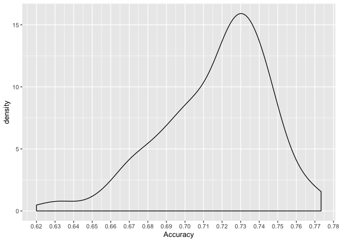

Manual tuning of the RandomizedSearchCV() results
=================================================

Aim
---

### Question

Can the manual tunning on the results of previous RandomizedSearchCV()
can obtain the better accuracy of the test datasets evaluation?

### Purpose

The purpose of this exepriment is to get better accuracy by tuning near
the hyperparamaters space of the highest prediction accuracy score using
RandomizedSearchCV().

Method
------

### Procedure

In order to achieve what I aim for, I will conduct a manual
hyperparameter scan using simple fully connected dense network as a base
model. I will start by tuning the epochs and batch sizes while compiling
the training data. My plan will be tuning the three best models.

Execution
---------

``` r
# Read the CSV of the prediction results on the test data
predict_results_first_hyperparscan <- data.table::fread("data/df_result_prediction_old.csv", drop = "V1")
predict_results_second_hyperparscan <- data.table::fread("data/df_result_prediction_100_combination.csv", drop ="V1")

# Combine two results of prediction
combined <- predict_results_first_hyperparscan %>% 
  rbind(predict_results_second_hyperparscan)

# Show the results by sort the accuracy
combined %>% 
  arrange(Accuracy) %>%  
  tail(6) %>% 
  knitr::kable()
```

|     | Parameters                                                                                                                                                                                                                                                                         |   Accuracy|  Sensitivity|  Specifity|
|-----|:-----------------------------------------------------------------------------------------------------------------------------------------------------------------------------------------------------------------------------------------------------------------------------------|----------:|------------:|----------:|
| 150 | {‘shuffle’: True, ‘optim\_methods’: ‘Adadelta’, ‘num\_hidden\_layers’: \[2, 3, 3\], ‘l2\_rate’: 0.001, ‘input\_num\_hidden\_units’: 16, ‘input\_dropout\_rates’: 0.5, ‘epochs’: 30, ‘dropout\_rates’: 0.25, ‘batch\_size’: 8, ‘batch\_norm’: ‘no’, ‘activation\_function’: ‘relu’} |  0.7533333|    0.8157895|  0.6891892|
| 151 | {‘shuffle’: True, ‘optim\_methods’: ‘Adadelta’, ‘num\_hidden\_layers’: \[1, 2, 2\], ‘l2\_rate’: 0.01, ‘input\_num\_hidden\_units’: 8, ‘input\_dropout\_rates’: 0.5, ‘epochs’: 30, ‘dropout\_rates’: 0.25, ‘batch\_size’: 8, ‘batch\_norm’: ‘no’, ‘activation\_function’: ‘relu’}   |  0.7533333|    0.8289474|  0.6756757|
| 152 | {‘shuffle’: True, ‘optim\_methods’: ‘SGD’, ‘num\_hidden\_layers’: \[2, 2, 3\], ‘l2\_rate’: 0.001, ‘input\_num\_hidden\_units’: 8, ‘input\_dropout\_rates’: 0.5, ‘epochs’: 30, ‘dropout\_rates’: 0.5, ‘batch\_size’: 16, ‘batch\_norm’: ‘no’, ‘activation\_function’: ‘relu’}       |  0.7533333|    0.7894737|  0.7162162|
| 153 | {‘shuffle’: True, ‘optim\_methods’: ‘SGD’, ‘num\_hidden\_layers’: \[3\], ‘l2\_rate’: 0.001, ‘input\_num\_hidden\_units’: 16, ‘input\_dropout\_rates’: 0.5, ‘epochs’: 20, ‘dropout\_rates’: 0.5, ‘batch\_size’: 16, ‘batch\_norm’: ‘no’, ‘activation\_function’: ‘relu’}            |  0.7600000|    0.8289474|  0.6891892|
| 154 | {‘shuffle’: True, ‘optim\_methods’: ‘Adadelta’, ‘num\_hidden\_layers’: \[1, 2\], ‘l2\_rate’: 0.001, ‘input\_num\_hidden\_units’: 8, ‘input\_dropout\_rates’: 0.25, ‘epochs’: 20, ‘dropout\_rates’: 0.25, ‘batch\_size’: 8, ‘batch\_norm’: ‘no’, ‘activation\_function’: ‘relu’}    |  0.7666667|    0.8157895|  0.7162162|
| 155 | {‘shuffle’: True, ‘optim\_methods’: ‘SGD’, ‘num\_hidden\_layers’: \[1, 3\], ‘l2\_rate’: 0.01, ‘input\_num\_hidden\_units’: 3, ‘input\_dropout\_rates’: 0.5, ‘epochs’: 30, ‘dropout\_rates’: 0.5, ‘batch\_size’: 8, ‘batch\_norm’: ‘no’, ‘activation\_function’: ‘relu’}            |  0.7733333|    0.8026316|  0.7432432|

We will do the manual tuning on the three best models above.

Tune manually the models
------------------------

We will then try to tune the model with the best results manually.

### Tune the batch sizes and epochs with different epochs

#### Settings

The setting of the hyperparamaters will be:

``` bash
num_epochs = [10, 20, 30, 40]
num_batch_size = [4, 8, 16]
seed = [0, 1, 2, 3]
```

And we can see the results as follows

### Make the GridSearchCV() to the results of the RandomSearchCV()

Doing the GridSearch on the results of RandomSearchCV can be very tricky
since we need to see which parameters or hyperparamaters to tune. In
order to understand which paramaters that is important the most, we can
perform the RandomForest approach. Based on the random forest approaach
result, that we can see that mainly, the important hyperparamaters are
the hyperparamaters on the model constructions or models’ building
blocks, such as number of layers, number of node, and number of hidden
units.

Thus, for each model above, we will see how the results of GridSearchCV
and the accuracy improvement the models can achieve. Based on the
starting point of the hyperparamaters above, we can then tune the a
little bit the hyperparamaters as shown in the table below:

<table>
<colgroup>
<col style="width: 8%" />
<col style="width: 25%" />
<col style="width: 25%" />
<col style="width: 24%" />
<col style="width: 15%" />
</colgroup>
<thead>
<tr class="header">
<th>Model</th>
<th>Hidden Units (Input)</th>
<th>Number hidden layers</th>
<th>Optimization method</th>
<th>Batch size</th>
</tr>
</thead>
<tbody>
<tr class="odd">
<td>1</td>
<td>[2, 3, 4]</td>
<td>[[1, 2], [1, 4]]</td>
<td>[‘Adadelta’, ’SGD’]</td>
<td>[4, 8, 16]</td>
</tr>
<tr class="even">
<td>2</td>
<td>[6, 8, 10]</td>
<td>[[1, 1], [1, 3]]</td>
<td>[‘Adadelta’, ’SGD’]</td>
<td>[4, 8, 16]</td>
</tr>
<tr class="odd">
<td>3</td>
<td>[8, 16, 20]</td>
<td>[2, 4]</td>
<td>[‘Adadelta’, ’SGD’]</td>
<td>[8, 16, 20]</td>
</tr>
<tr class="even">
<td>4</td>
<td>[4, 8, 16]</td>
<td>[0, 1, 2]</td>
<td>[‘Adadelta’, ’SGD’]</td>
<td>[8, 16, 32]</td>
</tr>
<tr class="odd">
<td>5</td>
<td>[4, 8, 16]</td>
<td>[[1, 2], [2, 2]]</td>
<td>[‘Adadelta’, ’SGD’]</td>
<td>[4, 8, 16]</td>
</tr>
<tr class="even">
<td>6</td>
<td>[4, 8, 16]</td>
<td>[[1, 2], [3, 3]]</td>
<td>[‘Adadelta’, ’SGD’]</td>
<td>[4, 8, 16]</td>
</tr>
</tbody>
</table>

### Results

``` r
data_path <- "../../jupyter-note/"
df1 <- data.table::fread(paste0(data_path, "df_result_prediction_model1_gridsearch.csv"), drop = "V1")
df2 <- data.table::fread(paste0(data_path, "df_result_prediction_model2_gridsearch.csv"), drop = "V1")
df3 <- data.table::fread(paste0(data_path, "df_result_prediction_model3_gridsearch.csv"), drop = "V1")
df4 <- data.table::fread(paste0(data_path, "df_result_prediction_model4_gridsearch.csv"), drop = "V1")
df5 <- data.table::fread(paste0(data_path, "df_result_prediction_model5_gridsearch.csv"), drop = "V1")
df6 <- data.table::fread(paste0(data_path, "df_result_prediction_model6_gridsearch.csv"), drop = "V1")
```

``` r
results_gridsearch <- rbind(
cbind(df1, model = "model1"),
cbind(df2, model = "model2"),
cbind(df3, model = "model3"),
cbind(df4, model = "model4"),
cbind(df5, model = "model5"),
cbind(df6, model = "model6")
)

rm(df1, df2, df3, df4, df5, df6)
results_gridsearch %>% 
  filter(model == "model6") %>% 
  knitr::kable()
```

| Parameters                                                                                                                                                                                                                                                                       |   Accuracy|  Sensitivity|  Specifity| model  |
|:---------------------------------------------------------------------------------------------------------------------------------------------------------------------------------------------------------------------------------------------------------------------------------|----------:|------------:|----------:|:-------|
| {‘activation\_function’: ‘relu’, ‘batch\_norm’: ‘no’, ‘batch\_size’: 4, ‘dropout\_rates’: 0.25, ‘epochs’: 30, ‘input\_dropout\_rates’: 0.25, ‘input\_num\_hidden\_units’: 4, ‘l2\_rate’: 0.01, ‘num\_hidden\_layers’: \[1, 2\], ‘optim\_methods’: ‘Adadelta’, ‘shuffle’: True}   |  0.6666667|    0.7105263|  0.6216216| model6 |
| {‘activation\_function’: ‘relu’, ‘batch\_norm’: ‘no’, ‘batch\_size’: 4, ‘dropout\_rates’: 0.25, ‘epochs’: 30, ‘input\_dropout\_rates’: 0.25, ‘input\_num\_hidden\_units’: 4, ‘l2\_rate’: 0.01, ‘num\_hidden\_layers’: \[1, 2\], ‘optim\_methods’: ‘SGD’, ‘shuffle’: True}        |  0.6733333|    0.4736842|  0.8783784| model6 |
| {‘activation\_function’: ‘relu’, ‘batch\_norm’: ‘no’, ‘batch\_size’: 4, ‘dropout\_rates’: 0.25, ‘epochs’: 30, ‘input\_dropout\_rates’: 0.25, ‘input\_num\_hidden\_units’: 4, ‘l2\_rate’: 0.01, ‘num\_hidden\_layers’: \[3, 3\], ‘optim\_methods’: ‘Adadelta’, ‘shuffle’: True}   |  0.6733333|    0.6710526|  0.6756757| model6 |
| {‘activation\_function’: ‘relu’, ‘batch\_norm’: ‘no’, ‘batch\_size’: 4, ‘dropout\_rates’: 0.25, ‘epochs’: 30, ‘input\_dropout\_rates’: 0.25, ‘input\_num\_hidden\_units’: 4, ‘l2\_rate’: 0.01, ‘num\_hidden\_layers’: \[3, 3\], ‘optim\_methods’: ‘SGD’, ‘shuffle’: True}        |  0.6800000|    0.5657895|  0.7972973| model6 |
| {‘activation\_function’: ‘relu’, ‘batch\_norm’: ‘no’, ‘batch\_size’: 4, ‘dropout\_rates’: 0.25, ‘epochs’: 30, ‘input\_dropout\_rates’: 0.25, ‘input\_num\_hidden\_units’: 8, ‘l2\_rate’: 0.01, ‘num\_hidden\_layers’: \[1, 2\], ‘optim\_methods’: ‘Adadelta’, ‘shuffle’: True}   |  0.7333333|    0.7894737|  0.6756757| model6 |
| {‘activation\_function’: ‘relu’, ‘batch\_norm’: ‘no’, ‘batch\_size’: 4, ‘dropout\_rates’: 0.25, ‘epochs’: 30, ‘input\_dropout\_rates’: 0.25, ‘input\_num\_hidden\_units’: 8, ‘l2\_rate’: 0.01, ‘num\_hidden\_layers’: \[1, 2\], ‘optim\_methods’: ‘SGD’, ‘shuffle’: True}        |  0.6866667|    0.4736842|  0.9054054| model6 |
| {‘activation\_function’: ‘relu’, ‘batch\_norm’: ‘no’, ‘batch\_size’: 4, ‘dropout\_rates’: 0.25, ‘epochs’: 30, ‘input\_dropout\_rates’: 0.25, ‘input\_num\_hidden\_units’: 8, ‘l2\_rate’: 0.01, ‘num\_hidden\_layers’: \[3, 3\], ‘optim\_methods’: ‘Adadelta’, ‘shuffle’: True}   |  0.7200000|    0.6315789|  0.8108108| model6 |
| {‘activation\_function’: ‘relu’, ‘batch\_norm’: ‘no’, ‘batch\_size’: 4, ‘dropout\_rates’: 0.25, ‘epochs’: 30, ‘input\_dropout\_rates’: 0.25, ‘input\_num\_hidden\_units’: 8, ‘l2\_rate’: 0.01, ‘num\_hidden\_layers’: \[3, 3\], ‘optim\_methods’: ‘SGD’, ‘shuffle’: True}        |  0.7200000|    0.6842105|  0.7567568| model6 |
| {‘activation\_function’: ‘relu’, ‘batch\_norm’: ‘no’, ‘batch\_size’: 4, ‘dropout\_rates’: 0.25, ‘epochs’: 30, ‘input\_dropout\_rates’: 0.25, ‘input\_num\_hidden\_units’: 16, ‘l2\_rate’: 0.01, ‘num\_hidden\_layers’: \[1, 2\], ‘optim\_methods’: ‘Adadelta’, ‘shuffle’: True}  |  0.7400000|    0.8026316|  0.6756757| model6 |
| {‘activation\_function’: ‘relu’, ‘batch\_norm’: ‘no’, ‘batch\_size’: 4, ‘dropout\_rates’: 0.25, ‘epochs’: 30, ‘input\_dropout\_rates’: 0.25, ‘input\_num\_hidden\_units’: 16, ‘l2\_rate’: 0.01, ‘num\_hidden\_layers’: \[1, 2\], ‘optim\_methods’: ‘SGD’, ‘shuffle’: True}       |  0.7533333|    0.7894737|  0.7162162| model6 |
| {‘activation\_function’: ‘relu’, ‘batch\_norm’: ‘no’, ‘batch\_size’: 4, ‘dropout\_rates’: 0.25, ‘epochs’: 30, ‘input\_dropout\_rates’: 0.25, ‘input\_num\_hidden\_units’: 16, ‘l2\_rate’: 0.01, ‘num\_hidden\_layers’: \[3, 3\], ‘optim\_methods’: ‘Adadelta’, ‘shuffle’: True}  |  0.6666667|    0.7631579|  0.5675676| model6 |
| {‘activation\_function’: ‘relu’, ‘batch\_norm’: ‘no’, ‘batch\_size’: 4, ‘dropout\_rates’: 0.25, ‘epochs’: 30, ‘input\_dropout\_rates’: 0.25, ‘input\_num\_hidden\_units’: 16, ‘l2\_rate’: 0.01, ‘num\_hidden\_layers’: \[3, 3\], ‘optim\_methods’: ‘SGD’, ‘shuffle’: True}       |  0.7466667|    0.8289474|  0.6621622| model6 |
| {‘activation\_function’: ‘relu’, ‘batch\_norm’: ‘no’, ‘batch\_size’: 8, ‘dropout\_rates’: 0.25, ‘epochs’: 30, ‘input\_dropout\_rates’: 0.25, ‘input\_num\_hidden\_units’: 4, ‘l2\_rate’: 0.01, ‘num\_hidden\_layers’: \[1, 2\], ‘optim\_methods’: ‘Adadelta’, ‘shuffle’: True}   |  0.7266667|    0.7763158|  0.6756757| model6 |
| {‘activation\_function’: ‘relu’, ‘batch\_norm’: ‘no’, ‘batch\_size’: 8, ‘dropout\_rates’: 0.25, ‘epochs’: 30, ‘input\_dropout\_rates’: 0.25, ‘input\_num\_hidden\_units’: 4, ‘l2\_rate’: 0.01, ‘num\_hidden\_layers’: \[1, 2\], ‘optim\_methods’: ‘SGD’, ‘shuffle’: True}        |  0.6533333|    0.3815789|  0.9324324| model6 |
| {‘activation\_function’: ‘relu’, ‘batch\_norm’: ‘no’, ‘batch\_size’: 8, ‘dropout\_rates’: 0.25, ‘epochs’: 30, ‘input\_dropout\_rates’: 0.25, ‘input\_num\_hidden\_units’: 4, ‘l2\_rate’: 0.01, ‘num\_hidden\_layers’: \[3, 3\], ‘optim\_methods’: ‘Adadelta’, ‘shuffle’: True}   |  0.7466667|    0.8552632|  0.6351351| model6 |
| {‘activation\_function’: ‘relu’, ‘batch\_norm’: ‘no’, ‘batch\_size’: 8, ‘dropout\_rates’: 0.25, ‘epochs’: 30, ‘input\_dropout\_rates’: 0.25, ‘input\_num\_hidden\_units’: 4, ‘l2\_rate’: 0.01, ‘num\_hidden\_layers’: \[3, 3\], ‘optim\_methods’: ‘SGD’, ‘shuffle’: True}        |  0.7066667|    0.8421053|  0.5675676| model6 |
| {‘activation\_function’: ‘relu’, ‘batch\_norm’: ‘no’, ‘batch\_size’: 8, ‘dropout\_rates’: 0.25, ‘epochs’: 30, ‘input\_dropout\_rates’: 0.25, ‘input\_num\_hidden\_units’: 8, ‘l2\_rate’: 0.01, ‘num\_hidden\_layers’: \[1, 2\], ‘optim\_methods’: ‘Adadelta’, ‘shuffle’: True}   |  0.7533333|    0.8157895|  0.6891892| model6 |
| {‘activation\_function’: ‘relu’, ‘batch\_norm’: ‘no’, ‘batch\_size’: 8, ‘dropout\_rates’: 0.25, ‘epochs’: 30, ‘input\_dropout\_rates’: 0.25, ‘input\_num\_hidden\_units’: 8, ‘l2\_rate’: 0.01, ‘num\_hidden\_layers’: \[1, 2\], ‘optim\_methods’: ‘SGD’, ‘shuffle’: True}        |  0.7200000|    0.7631579|  0.6756757| model6 |
| {‘activation\_function’: ‘relu’, ‘batch\_norm’: ‘no’, ‘batch\_size’: 8, ‘dropout\_rates’: 0.25, ‘epochs’: 30, ‘input\_dropout\_rates’: 0.25, ‘input\_num\_hidden\_units’: 8, ‘l2\_rate’: 0.01, ‘num\_hidden\_layers’: \[3, 3\], ‘optim\_methods’: ‘Adadelta’, ‘shuffle’: True}   |  0.7200000|    0.6842105|  0.7567568| model6 |
| {‘activation\_function’: ‘relu’, ‘batch\_norm’: ‘no’, ‘batch\_size’: 8, ‘dropout\_rates’: 0.25, ‘epochs’: 30, ‘input\_dropout\_rates’: 0.25, ‘input\_num\_hidden\_units’: 8, ‘l2\_rate’: 0.01, ‘num\_hidden\_layers’: \[3, 3\], ‘optim\_methods’: ‘SGD’, ‘shuffle’: True}        |  0.6800000|    0.5131579|  0.8513514| model6 |
| {‘activation\_function’: ‘relu’, ‘batch\_norm’: ‘no’, ‘batch\_size’: 8, ‘dropout\_rates’: 0.25, ‘epochs’: 30, ‘input\_dropout\_rates’: 0.25, ‘input\_num\_hidden\_units’: 16, ‘l2\_rate’: 0.01, ‘num\_hidden\_layers’: \[1, 2\], ‘optim\_methods’: ‘Adadelta’, ‘shuffle’: True}  |  0.7266667|    0.6842105|  0.7702703| model6 |
| {‘activation\_function’: ‘relu’, ‘batch\_norm’: ‘no’, ‘batch\_size’: 8, ‘dropout\_rates’: 0.25, ‘epochs’: 30, ‘input\_dropout\_rates’: 0.25, ‘input\_num\_hidden\_units’: 16, ‘l2\_rate’: 0.01, ‘num\_hidden\_layers’: \[1, 2\], ‘optim\_methods’: ‘SGD’, ‘shuffle’: True}       |  0.7266667|    0.7236842|  0.7297297| model6 |
| {‘activation\_function’: ‘relu’, ‘batch\_norm’: ‘no’, ‘batch\_size’: 8, ‘dropout\_rates’: 0.25, ‘epochs’: 30, ‘input\_dropout\_rates’: 0.25, ‘input\_num\_hidden\_units’: 16, ‘l2\_rate’: 0.01, ‘num\_hidden\_layers’: \[3, 3\], ‘optim\_methods’: ‘Adadelta’, ‘shuffle’: True}  |  0.7400000|    0.7236842|  0.7567568| model6 |
| {‘activation\_function’: ‘relu’, ‘batch\_norm’: ‘no’, ‘batch\_size’: 8, ‘dropout\_rates’: 0.25, ‘epochs’: 30, ‘input\_dropout\_rates’: 0.25, ‘input\_num\_hidden\_units’: 16, ‘l2\_rate’: 0.01, ‘num\_hidden\_layers’: \[3, 3\], ‘optim\_methods’: ‘SGD’, ‘shuffle’: True}       |  0.7733333|    0.8552632|  0.6891892| model6 |
| {‘activation\_function’: ‘relu’, ‘batch\_norm’: ‘no’, ‘batch\_size’: 16, ‘dropout\_rates’: 0.25, ‘epochs’: 30, ‘input\_dropout\_rates’: 0.25, ‘input\_num\_hidden\_units’: 4, ‘l2\_rate’: 0.01, ‘num\_hidden\_layers’: \[1, 2\], ‘optim\_methods’: ‘Adadelta’, ‘shuffle’: True}  |  0.7333333|    0.7500000|  0.7162162| model6 |
| {‘activation\_function’: ‘relu’, ‘batch\_norm’: ‘no’, ‘batch\_size’: 16, ‘dropout\_rates’: 0.25, ‘epochs’: 30, ‘input\_dropout\_rates’: 0.25, ‘input\_num\_hidden\_units’: 4, ‘l2\_rate’: 0.01, ‘num\_hidden\_layers’: \[1, 2\], ‘optim\_methods’: ‘SGD’, ‘shuffle’: True}       |  0.7066667|    0.8815789|  0.5270270| model6 |
| {‘activation\_function’: ‘relu’, ‘batch\_norm’: ‘no’, ‘batch\_size’: 16, ‘dropout\_rates’: 0.25, ‘epochs’: 30, ‘input\_dropout\_rates’: 0.25, ‘input\_num\_hidden\_units’: 4, ‘l2\_rate’: 0.01, ‘num\_hidden\_layers’: \[3, 3\], ‘optim\_methods’: ‘Adadelta’, ‘shuffle’: True}  |  0.7133333|    0.6578947|  0.7702703| model6 |
| {‘activation\_function’: ‘relu’, ‘batch\_norm’: ‘no’, ‘batch\_size’: 16, ‘dropout\_rates’: 0.25, ‘epochs’: 30, ‘input\_dropout\_rates’: 0.25, ‘input\_num\_hidden\_units’: 4, ‘l2\_rate’: 0.01, ‘num\_hidden\_layers’: \[3, 3\], ‘optim\_methods’: ‘SGD’, ‘shuffle’: True}       |  0.6333333|    0.9210526|  0.3378378| model6 |
| {‘activation\_function’: ‘relu’, ‘batch\_norm’: ‘no’, ‘batch\_size’: 16, ‘dropout\_rates’: 0.25, ‘epochs’: 30, ‘input\_dropout\_rates’: 0.25, ‘input\_num\_hidden\_units’: 8, ‘l2\_rate’: 0.01, ‘num\_hidden\_layers’: \[1, 2\], ‘optim\_methods’: ‘Adadelta’, ‘shuffle’: True}  |  0.7333333|    0.7894737|  0.6756757| model6 |
| {‘activation\_function’: ‘relu’, ‘batch\_norm’: ‘no’, ‘batch\_size’: 16, ‘dropout\_rates’: 0.25, ‘epochs’: 30, ‘input\_dropout\_rates’: 0.25, ‘input\_num\_hidden\_units’: 8, ‘l2\_rate’: 0.01, ‘num\_hidden\_layers’: \[1, 2\], ‘optim\_methods’: ‘SGD’, ‘shuffle’: True}       |  0.7333333|    0.6973684|  0.7702703| model6 |
| {‘activation\_function’: ‘relu’, ‘batch\_norm’: ‘no’, ‘batch\_size’: 16, ‘dropout\_rates’: 0.25, ‘epochs’: 30, ‘input\_dropout\_rates’: 0.25, ‘input\_num\_hidden\_units’: 8, ‘l2\_rate’: 0.01, ‘num\_hidden\_layers’: \[3, 3\], ‘optim\_methods’: ‘Adadelta’, ‘shuffle’: True}  |  0.7266667|    0.7105263|  0.7432432| model6 |
| {‘activation\_function’: ‘relu’, ‘batch\_norm’: ‘no’, ‘batch\_size’: 16, ‘dropout\_rates’: 0.25, ‘epochs’: 30, ‘input\_dropout\_rates’: 0.25, ‘input\_num\_hidden\_units’: 8, ‘l2\_rate’: 0.01, ‘num\_hidden\_layers’: \[3, 3\], ‘optim\_methods’: ‘SGD’, ‘shuffle’: True}       |  0.7333333|    0.6973684|  0.7702703| model6 |
| {‘activation\_function’: ‘relu’, ‘batch\_norm’: ‘no’, ‘batch\_size’: 16, ‘dropout\_rates’: 0.25, ‘epochs’: 30, ‘input\_dropout\_rates’: 0.25, ‘input\_num\_hidden\_units’: 16, ‘l2\_rate’: 0.01, ‘num\_hidden\_layers’: \[1, 2\], ‘optim\_methods’: ‘Adadelta’, ‘shuffle’: True} |  0.6933333|    0.7500000|  0.6351351| model6 |
| {‘activation\_function’: ‘relu’, ‘batch\_norm’: ‘no’, ‘batch\_size’: 16, ‘dropout\_rates’: 0.25, ‘epochs’: 30, ‘input\_dropout\_rates’: 0.25, ‘input\_num\_hidden\_units’: 16, ‘l2\_rate’: 0.01, ‘num\_hidden\_layers’: \[1, 2\], ‘optim\_methods’: ‘SGD’, ‘shuffle’: True}      |  0.7200000|    0.7631579|  0.6756757| model6 |
| {‘activation\_function’: ‘relu’, ‘batch\_norm’: ‘no’, ‘batch\_size’: 16, ‘dropout\_rates’: 0.25, ‘epochs’: 30, ‘input\_dropout\_rates’: 0.25, ‘input\_num\_hidden\_units’: 16, ‘l2\_rate’: 0.01, ‘num\_hidden\_layers’: \[3, 3\], ‘optim\_methods’: ‘Adadelta’, ‘shuffle’: True} |  0.7466667|    0.7631579|  0.7297297| model6 |
| {‘activation\_function’: ‘relu’, ‘batch\_norm’: ‘no’, ‘batch\_size’: 16, ‘dropout\_rates’: 0.25, ‘epochs’: 30, ‘input\_dropout\_rates’: 0.25, ‘input\_num\_hidden\_units’: 16, ‘l2\_rate’: 0.01, ‘num\_hidden\_layers’: \[3, 3\], ‘optim\_methods’: ‘SGD’, ‘shuffle’: True}      |  0.7466667|    0.7894737|  0.7027027| model6 |

``` r
results_gridsearch <- results_gridsearch %>%
  dplyr::select(Parameters, Accuracy) %>%
  mutate(
    Parameters = stringr::str_remove_all(Parameters, "\\{"),
    Parameters = stringr::str_remove_all(Parameters, "\\}")
  ) %>%
  tidyr::separate(
    col = Parameters,
    c(
      "activation_function", "batch_norm", "batch_size",
      "dropout_rates", "epochs", "input_dropout_rates",
      "input_num_hidden_units", "l2_rate", "num_hidden_layers",
      "optim_methods", "shuffle"
    ),
    sep = ", '"
  ) %>%
  dplyr::mutate(
    shuffle = stringr::str_split(shuffle, ":", simplify = TRUE)[, 2],
    optim_methods = stringr::str_split(optim_methods, ":", simplify = TRUE)[, 2],
    num_hidden_layers = stringr::str_split(num_hidden_layers, ":", simplify = TRUE)[, 2],
    l2_rate = stringr::str_split(l2_rate, ":", simplify = TRUE)[, 2],
    input_num_hidden_units = stringr::str_split(input_num_hidden_units, ":", simplify = TRUE)[, 2],
    input_dropout_rates = stringr::str_split(input_dropout_rates, ":", simplify = TRUE)[, 2],
    epochs = stringr::str_split(epochs, ":", simplify = TRUE)[, 2],
    dropout_rates = stringr::str_split(dropout_rates, ":", simplify = TRUE)[, 2],
    batch_size = stringr::str_split(batch_size, ":", simplify = TRUE)[, 2],
    batch_norm = stringr::str_split(batch_norm, ":", simplify = TRUE)[, 2],
    activation_function = stringr::str_split(activation_function, ":", simplify = TRUE)[, 2]
  ) %>%
  dplyr::mutate(
    num_hidden_layers = str_remove_all(num_hidden_layers, "\\["),
    num_hidden_layers = str_remove_all(num_hidden_layers, "\\]")
  ) %>%
  separate(num_hidden_layers, c("Layer1", "Layer2", "Layer3"), sep = "([,])") %>%
  mutate_all(function(x) ifelse(is.na(x), 0, x)) %>%
  dplyr::mutate(
    hidden_layers = (Layer1 != 0) + (Layer2 != 0) + (Layer3 != 0)
  )
```

    ## Warning: Expected 3 pieces. Missing pieces filled with `NA` in 198 rows [1,
    ## 2, 3, 4, 5, 6, 7, 8, 9, 10, 11, 12, 13, 14, 15, 16, 17, 18, 19, 20, ...].

We can plot the density function of the accuracy results of the model as
shown below.

``` r
ggplot(results_gridsearch) +
  aes(x = Accuracy) +
  geom_density() +
  scale_x_continuous(breaks = seq(0.6, 0.8, 0.01))
```



According the result above, we can see that from the Gridsearch of the
hyperparamaters space we cannot get the results with accuracy more than
the best accuracy that also obtained from RandomSearchCV().

Conclusion
----------

According to the small experiment performed above, we can then draw
conclusion that fully connected dense network cannot perfom better then
the results we ontained from the previous results from RandomSearchCV.

Therefore, in order to obtain better results, we can move on to another
type of neural network architecure.
