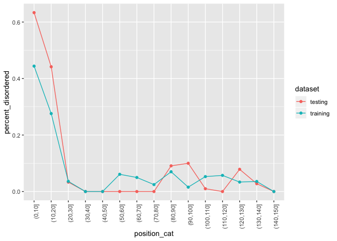

``` r
library(tidyverse)
```

    ## ── Attaching packages ────────────────────────────────────────────────────────────────────────────────────────────── tidyverse 1.3.0 ──

    ## ✓ ggplot2 3.2.1     ✓ purrr   0.3.3
    ## ✓ tibble  2.1.3     ✓ dplyr   0.8.3
    ## ✓ tidyr   1.0.0     ✓ stringr 1.4.0
    ## ✓ readr   1.3.1     ✓ forcats 0.4.0

    ## ── Conflicts ───────────────────────────────────────────────────────────────────────────────────────────────── tidyverse_conflicts() ──
    ## x dplyr::filter() masks stats::filter()
    ## x dplyr::lag()    masks stats::lag()

Read data
=========

``` r
read_pbdat <- function(path) {
  filename <- path %>%
    stringr::str_split("/") %>%
    unlist() %>%
    .[[length(.)]] %>%
    stringr::str_remove_all(".pbdat")

  dataset <- filename %>%
    stringr::str_split("_") %>%
    unlist() %>%
    .[[2]]

  file_num <- filename %>%
    stringr::str_split("_") %>%
    unlist() %>%
    .[[3]]

  data <- path %>%
    data.table::fread(skip = 5) %>%
    dplyr::rename(position = V1, aa_letter = V2, pred = V3, percent = V4) %>%
    dplyr::mutate(
      pred = case_when(
        pred == "^" ~ "disordered_binding",
        pred == "-" ~ "disordered_notbinding",
        pred == "." ~ "ordered_aa",
        TRUE ~ "unknown"
      )
    ) %>%
    dplyr::mutate(
      dataset = dataset,
      seq_num = file_num
    ) %>%
    dplyr::select(dataset, seq_num, dplyr::everything())
}
```

``` r
data <- here::here("data/secreted_data/ready_to_process/disopred-oomycete/finished/*.pbdat") %>%
  Sys.glob() %>%
  purrr::map(read_pbdat) %>%
  purrr::reduce(rbind)
```

``` r
plot_disordered_percent <- function(data, max_pos = 150, pos_bin_size = 10, percent_threshold = 0.9) {
  data %>%
    dplyr::filter(
      position <= max_pos
    ) %>% 
    dplyr::mutate(
      position_cat = cut(position, breaks = seq(0, 1500, pos_bin_size))
    ) %>%
    group_by(dataset, position_cat) %>%
    summarise(
      percent_disordered = sum(stringr::str_detect(pred, "disordered") & percent >= percent_threshold) / n(),
    ) %>%
    ggplot() +
    aes(x = position_cat, y = percent_disordered, group = dataset, color = dataset) +
    geom_line() +
    geom_point() +
    theme(axis.text.x = element_text(angle = 90, hjust = 1))
}
```

``` r
data %>%
  plot_disordered_percent()
```


