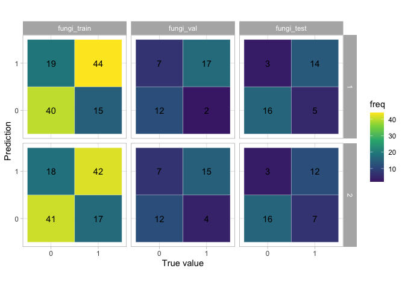

Evaluate the existed data on the EffectorP
==========================================

Introduction
------------

Since all of the ensemble results have been done, checking the
perfomance of the existed tools on the data we have is necessary as a
tool/parameter to compare how good or bad the perfomance of the model we
built.

Method
------

In this report, I will show the prediction results of both effectorP 1.0
and 2.0 on each dataset I have.

Hypothesis
----------

Since effectorP is a tool to predict effector protein, then this model
may perform better on fungi datasets than bacteria and oomycete
datasets.

Functions
---------

``` r
get_data_ready <- function(data){
  
  data <- data %>% 
  dplyr::select(-c("Probability")) %>% 
  `colnames<-`(c("identifier", "prediction")) %>% 
  dplyr::mutate(prediction = case_when(
    prediction == "Effector" ~ 1, 
    TRUE ~ 0
  )) %>% 
  dplyr::mutate(label = stringr::str_remove_all(identifier, ".*_"), 
                identifier =  stringr::str_extract(identifier, "[^_]*"))
  
  return(data)
}
```

``` r
calculate_accuracy <- function(data) {
  
  data <- get_data_ready(data)
  
  # Calculate tab
  tab <- table(data %>% 
                 dplyr::select(prediction) %>% 
                 pull(), 
               data %>% 
                 dplyr::select(label) %>% 
                 pull())

  # Calculate acc
  acc <- confusionMatrix(tab)$overall["Accuracy"]
  
  return(acc)
}
```

``` r
get_confusion_matrix_df <- function(data){
  
  df_name <- deparse(substitute(data))
  df_name_split <- df_name %>% stringr::str_split("_") %>% unlist() 
  
  data_ready <- get_data_ready(data)

  # Calculate confusion matrix
  tab <- table(data_ready %>% 
                 dplyr::select(prediction) %>% 
                 pull(), 
               data_ready %>% 
                 dplyr::select(label) %>% 
                 pull()) %>% 
    as.data.frame() %>% 
    `colnames<-`(c("prediction", "label", "freq")) %>% 
    dplyr::mutate(dataset = paste0(df_name_split[1], "_", df_name_split[2]),
                  effectorP_version = df_name_split[4])
  
  return(tab)
}
```

Results
-------

### Bacteria

``` r
# Load prediction results from EffectorP 1.0
bacteria_train_effectorp_1 <- data.table::fread("../../../data/secreted_data/pred_effectorP/effectorP_1/pred_effectorp_1_bacteria_training.csv")
bacteria_val_effectorp_1 <- data.table::fread("../../../data/secreted_data/pred_effectorP/effectorP_1/pred_effectorp_1_bacteria_validation.csv")
bacteria_test_effectorp_1 <- data.table::fread("../../../data/secreted_data/pred_effectorP/effectorP_1/pred_effectorp_1_bacteria_testing.csv")

# Load prediction results from EffectorP 2.0
bacteria_train_effectorp_2 <- data.table::fread("../../../data/secreted_data/pred_effectorP/effectorP_2/pred_effectorp_2_bacteria_training.csv")
bacteria_val_effectorp_2 <- data.table::fread("../../../data/secreted_data/pred_effectorP/effectorP_2/pred_effectorp_2_bacteria_validation.csv")
bacteria_test_effectorp_2 <- data.table::fread("../../../data/secreted_data/pred_effectorP/effectorP_2/pred_effectorp_2_bacteria_testing.csv")
```

``` r
bacteria_on_effectorP <- data.frame(data = c("bacteria_train", 
                                               "bacteria_val", 
                                               "bacteria_test"), 
                                      acc_effectorP_1 = c(calculate_accuracy(bacteria_train_effectorp_1), 
                                                         calculate_accuracy(bacteria_val_effectorp_1), 
                                                         calculate_accuracy(bacteria_test_effectorp_1)), 
                                      acc_effectorP_2 = c(calculate_accuracy(bacteria_train_effectorp_2), 
                                                         calculate_accuracy(bacteria_val_effectorp_2), 
                                                         calculate_accuracy(bacteria_test_effectorp_2)))
bacteria_on_effectorP 
```

    ##             data acc_effectorP_1 acc_effectorP_2
    ## 1 bacteria_train       0.4210526       0.4692982
    ## 2   bacteria_val       0.3947368       0.4605263
    ## 3  bacteria_test       0.3552632       0.4868421

### Fungi

``` r
# Load prediction results from EffectorP 1.0
fungi_train_effectorp_1 <- data.table::fread("../../../data/secreted_data/pred_effectorP/effectorP_1/pred_effectorp_1_fungi_training.csv")
fungi_val_effectorp_1 <- data.table::fread("../../../data/secreted_data/pred_effectorP/effectorP_1/pred_effectorp_1_fungi_validation.csv")
fungi_test_effectorp_1 <- data.table::fread("../../../data/secreted_data/pred_effectorP/effectorP_1/pred_effectorp_1_fungi_testing.csv")


# Load prediction results from EffectorP 2.0
fungi_train_effectorp_2 <- data.table::fread("../../../data/secreted_data/pred_effectorP/effectorP_2/pred_effectorp_2_fungi_training.csv")
fungi_val_effectorp_2 <- data.table::fread("../../../data/secreted_data/pred_effectorP/effectorP_2/pred_effectorp_2_fungi_validation.csv")
fungi_test_effectorp_2 <- data.table::fread("../../../data/secreted_data/pred_effectorP/effectorP_2/pred_effectorp_2_fungi_testing.csv")
```

``` r
fungi_on_effectorP <- data.frame(data = c("fungi_train", 
                                            "fungi_val", 
                                            "fungi_test"), 
                                  acc_effectorP_1 = c(calculate_accuracy(fungi_train_effectorp_1), 
                                                    calculate_accuracy(fungi_val_effectorp_1), 
                                                    calculate_accuracy(fungi_test_effectorp_1)),
                                   acc_effectorP_2 = c(calculate_accuracy(fungi_train_effectorp_2), 
                                                    calculate_accuracy(fungi_val_effectorp_2), 
                                                    calculate_accuracy(fungi_test_effectorp_2)))

fungi_on_effectorP
```

    ##          data acc_effectorP_1 acc_effectorP_2
    ## 1 fungi_train       0.7118644       0.7033898
    ## 2   fungi_val       0.7631579       0.7105263
    ## 3  fungi_test       0.7894737       0.7368421

### Oomycete

``` r
# Load prediction results from EffectorP 1.0
oomycete_train_effectorp_1 <- data.table::fread("../../../data/secreted_data/pred_effectorP/effectorP_1/pred_effectorp_1_oomycete_training.csv")
oomycete_val_effectorp_1 <- data.table::fread("../../../data/secreted_data/pred_effectorP/effectorP_1/pred_effectorp_1_oomycete_validation.csv")
oomycete_test_effectorp_1 <- data.table::fread("../../../data/secreted_data/pred_effectorP/effectorP_1/pred_effectorp_1_oomycete_testing.csv")

# Load prediction results from EffectorP 2.0
oomycete_train_effectorp_2 <- data.table::fread("../../../data/secreted_data/pred_effectorP/effectorP_2/pred_effectorp_2_oomycete_training.csv")
oomycete_val_effectorp_2 <- data.table::fread("../../../data/secreted_data/pred_effectorP/effectorP_2/pred_effectorp_2_oomycete_validation.csv")
oomycete_test_effectorp_2 <- data.table::fread("../../../data/secreted_data/pred_effectorP/effectorP_2/pred_effectorp_2_oomycete_testing.csv")
```

``` r
oomycete_on_effectorP <- data.frame(data = c("oomycete_train", 
                                            "oomycete_val", 
                                            "oomycete_test"), 
                                  acc_effectorP_1 = c(calculate_accuracy(oomycete_train_effectorp_1), 
                                                    calculate_accuracy(oomycete_val_effectorp_1), 
                                                    calculate_accuracy(oomycete_test_effectorp_1)), 
                                   acc_effectorP_2 = c(calculate_accuracy(oomycete_train_effectorp_2), 
                                                    calculate_accuracy(oomycete_val_effectorp_2), 
                                                    calculate_accuracy(oomycete_test_effectorp_2)))

oomycete_on_effectorP
```

    ##             data acc_effectorP_1 acc_effectorP_2
    ## 1 oomycete_train       0.5490196       0.5784314
    ## 2   oomycete_val       0.7058824       0.6764706
    ## 3  oomycete_test       0.5588235       0.5294118

All data together:

``` r
rbind(bacteria_on_effectorP, 
      oomycete_on_effectorP, 
      fungi_on_effectorP) %>% 
  knitr::kable()
```

| data            |  acc\_effectorP\_1|  acc\_effectorP\_2|
|:----------------|------------------:|------------------:|
| bacteria\_train |          0.4210526|          0.4692982|
| bacteria\_val   |          0.3947368|          0.4605263|
| bacteria\_test  |          0.3552632|          0.4868421|
| oomycete\_train |          0.5490196|          0.5784314|
| oomycete\_val   |          0.7058824|          0.6764706|
| oomycete\_test  |          0.5588235|          0.5294118|
| fungi\_train    |          0.7118644|          0.7033898|
| fungi\_val      |          0.7631579|          0.7105263|
| fungi\_test     |          0.7894737|          0.7368421|

### Further on fungi data

``` r
fungi_pred_both_effectorP <- rbind(get_confusion_matrix_df(fungi_train_effectorp_1), 
      get_confusion_matrix_df(fungi_val_effectorp_1), 
      get_confusion_matrix_df(fungi_test_effectorp_1), 
      get_confusion_matrix_df(fungi_train_effectorp_2), 
      get_confusion_matrix_df(fungi_val_effectorp_2), 
      get_confusion_matrix_df(fungi_test_effectorp_2))

fungi_pred_both_effectorP
```

    ##    prediction label freq     dataset effectorP_version
    ## 1           0     0   40 fungi_train                 1
    ## 2           1     0   19 fungi_train                 1
    ## 3           0     1   15 fungi_train                 1
    ## 4           1     1   44 fungi_train                 1
    ## 5           0     0   12   fungi_val                 1
    ## 6           1     0    7   fungi_val                 1
    ## 7           0     1    2   fungi_val                 1
    ## 8           1     1   17   fungi_val                 1
    ## 9           0     0   16  fungi_test                 1
    ## 10          1     0    3  fungi_test                 1
    ## 11          0     1    5  fungi_test                 1
    ## 12          1     1   14  fungi_test                 1
    ## 13          0     0   41 fungi_train                 2
    ## 14          1     0   18 fungi_train                 2
    ## 15          0     1   17 fungi_train                 2
    ## 16          1     1   42 fungi_train                 2
    ## 17          0     0   12   fungi_val                 2
    ## 18          1     0    7   fungi_val                 2
    ## 19          0     1    4   fungi_val                 2
    ## 20          1     1   15   fungi_val                 2
    ## 21          0     0   16  fungi_test                 2
    ## 22          1     0    3  fungi_test                 2
    ## 23          0     1    7  fungi_test                 2
    ## 24          1     1   12  fungi_test                 2

``` r
# Make the datasets in order
neworder <- c("fungi_train","fungi_val","fungi_test")

fungi_pred_both_effectorP <- fungi_pred_both_effectorP %>% 
  dplyr::mutate(dataset = factor(dataset, levels = neworder))

fungi_pred_both_effectorP  %>% 
  ggplot() +
  aes(x = label, y = prediction) +
  geom_tile(aes(fill = freq), colour = "white") +
  geom_text(aes(label = freq), vjust = 0.5) +
  scale_fill_viridis_c(begin = 0.1, end = 1) +
  labs(x = "True value", y = "Prediction") +
  facet_grid(effectorP_version ~ dataset) +
  coord_fixed() +
  theme_light()
```



Conclusion
----------

Since both version 1.0 and 2.0 are trained on fungi datasets, therefore,
it performs better on fungi dataset than other datasets.
