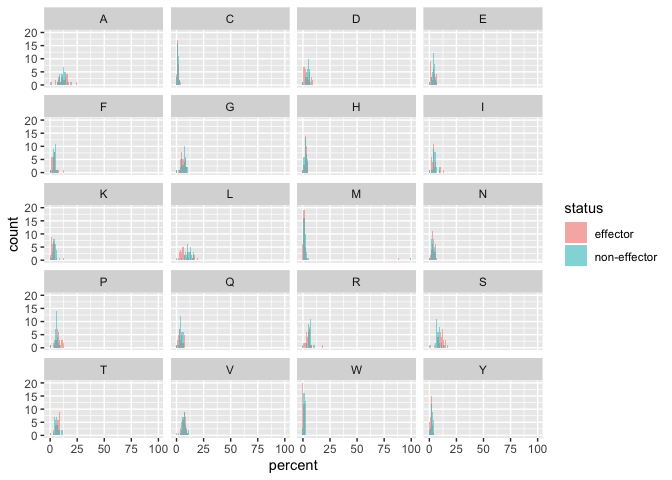
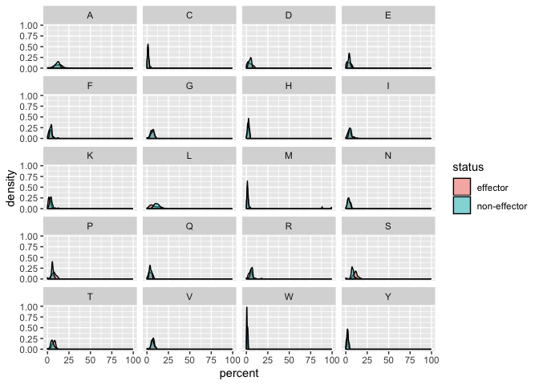

Identify the amino acids sequence within protein sequence
=========================================================

Aim
---

### Question

Are there any difference in sequence composition or amino acids sequence
between effectors and non-effectors?

### Purpose

My purpose is trying to identify the difference in sequence composition
between effector and non effectors.

Method
------

### Procedure

I will create a pair of sequence logo (Weblogo) figures and analyze if
there are obvious patterns or differences.

Execution
---------

Using `ggplot()` in R, we can make the figure of different composition
of each position of the sequence, with the length of position is limited
to the minimum length of all sequence which is 32.

``` r
# Read CSV of the effector data
effector_data <- data.table::fread("../../../../data/getting-data-new/binary-class-data/effector_data.csv")

# Read CSV of the noneffector data 
non_effector_data <- data.table::fread("../../../../data/getting-data-new/binary-class-data/non_effector_data.csv")
```

``` r
seq_effector <- effector_data %>% 
  mutate(sequence = substr(Sequence, 1, 32)) %>% 
  dplyr::select(sequence)

seq_noneffector <- non_effector_data %>% 
  mutate(sequence = substr(sequence, 1, 32))  %>% 
  dplyr::select(sequence)

# Effector
sep_seq_effector <- seq_effector %>% 
  tidyr::separate(sequence, c("1", "2", "3", "4", "5", "6", "7", "8", "9", "10",
                "11", "12", "13", "14", "15", "16", "17", "18", "19", "20", 
                "21", "22", "23", "24", "25", "26", "27", "28", "29", "30", 
                "31", "32"), remove = FALSE)
```

    ## Warning: Expected 32 pieces. Missing pieces filled with `NA` in 402 rows [1, 2,
    ## 3, 4, 5, 6, 7, 8, 9, 10, 11, 12, 13, 14, 15, 16, 17, 18, 19, 20, ...].

``` r
sep_seq_effector <- sep_seq_effector %>% 
  mutate(len = stringr::str_length(sequence)) %>% 
  tidyr::separate(sequence, into = as.character(1:max(.$len)), sep = 1:max(.$len), remove = FALSE) 


# Non effector
sep_seq_noneffector <- seq_noneffector %>% 
  tidyr::separate(sequence, into = as.character(1:32), sep = 1:32, remove = FALSE)
         
sep_seq_noneffector <- sep_seq_noneffector %>% 
  mutate(len = stringr::str_length(sequence)) %>% 
  tidyr::separate(sequence, into = as.character(1:max(.$len)), sep = 1:max(.$len), remove = FALSE)
```

``` r
# Effector data 
sep_seq_effector_transpose <- sep_seq_effector %>% 
  dplyr::select(paste0(1:32)) %>% 
  t() %>% 
  as.data.frame() %>% 
  tidyr::unite(new_seq, as.character(paste0("V", 1:402)), sep = "", remove = FALSE) %>% 
  select(new_seq) 

sep_seq_effector_transpose$seq <- sep_seq_effector_transpose$new_seq

sep_seq_effector_transpose_counts <- sep_seq_effector_transpose %>% 
  rowwise() %>% 
  mutate(
  G_count = stringr::str_count(new_seq, "G"),
  A_count = stringr::str_count(new_seq, "A"),
  L_count = stringr::str_count(new_seq, "L"),
  M_count = stringr::str_count(new_seq, "M"),
  F_count = stringr::str_count(new_seq, "F"),
  W_count = stringr::str_count(new_seq, "W"),
  K_count = stringr::str_count(new_seq, "K"),
  Q_count = stringr::str_count(new_seq, "Q"),
  E_count = stringr::str_count(new_seq, "E"),
  S_count = stringr::str_count(new_seq, "S"),
  P_count = stringr::str_count(new_seq, "P"),
  V_count = stringr::str_count(new_seq, "V"),
  I_count = stringr::str_count(new_seq, "I"),
  C_count = stringr::str_count(new_seq, "C"),
  Y_count = stringr::str_count(new_seq, "Y"),
  H_count = stringr::str_count(new_seq, "H"),
  R_count = stringr::str_count(new_seq, "R"),
  N_count = stringr::str_count(new_seq, "N"),
  D_count = stringr::str_count(new_seq, "D"),
  T_count = stringr::str_count(new_seq, "T")
)

sep_seq_effector_transpose_proportion <- sep_seq_effector_transpose_counts %>% 
  rowwise() %>% 
  mutate(
  G_percent = G_count / stringr::str_length(new_seq) * 100,
  A_percent = A_count / stringr::str_length(new_seq) * 100,
  L_percent = L_count / stringr::str_length(new_seq) * 100,
  M_percent = M_count / stringr::str_length(new_seq) * 100,
  F_percent = F_count / stringr::str_length(new_seq) * 100,
  W_percent = W_count / stringr::str_length(new_seq) * 100,
  K_percent = K_count / stringr::str_length(new_seq) * 100,
  Q_percent = Q_count / stringr::str_length(new_seq) * 100,
  E_percent = E_count / stringr::str_length(new_seq) * 100,
  S_percent = S_count / stringr::str_length(new_seq) * 100,
  P_percent = P_count / stringr::str_length(new_seq) * 100,
  V_percent = V_count / stringr::str_length(new_seq) * 100,
  I_percent = I_count / stringr::str_length(new_seq) * 100,
  C_percent = C_count / stringr::str_length(new_seq) * 100,
  Y_percent = Y_count / stringr::str_length(new_seq) * 100,
  H_percent = H_count / stringr::str_length(new_seq) * 100,
  R_percent = R_count / stringr::str_length(new_seq) * 100,
  N_percent = N_count / stringr::str_length(new_seq) * 100,
  D_percent = D_count / stringr::str_length(new_seq) * 100,
  T_percent = T_count / stringr::str_length(new_seq) * 100
) %>% 
  select(ends_with("_percent"))

sep_seq_effector_transpose_proportion_melt <- sep_seq_effector_transpose_proportion %>% 
  # Transform rowids into a column
  tibble::rowid_to_column(var = "sequence_num") %>% 
  # Melt the data to make is sparse instead of a matrix
  reshape2::melt(id.var = "sequence_num", value.name = "percent") %>% 
  # Rename aminoacids
  mutate(variable = stringr::str_remove_all(variable, "_percent")) %>% 
  rename(aminoacid = variable)
```

``` r
# Non effector data
sep_seq_noneffector_transpose <- sep_seq_noneffector %>% 
  dplyr::select(paste0(1:32)) %>% 
  t() %>% 
  as.data.frame() %>% 
  tidyr::unite(new_seq, as.character(paste0("V", 1:398)), sep = "", remove = FALSE) %>% 
  select(new_seq) 

sep_seq_noneffector_transpose$seq <- sep_seq_noneffector_transpose$new_seq

sep_seq_noneffector_transpose_counts <- sep_seq_noneffector_transpose %>% 
  rowwise() %>% 
  mutate(
  G_count = stringr::str_count(new_seq, "G"),
  A_count = stringr::str_count(new_seq, "A"),
  L_count = stringr::str_count(new_seq, "L"),
  M_count = stringr::str_count(new_seq, "M"),
  F_count = stringr::str_count(new_seq, "F"),
  W_count = stringr::str_count(new_seq, "W"),
  K_count = stringr::str_count(new_seq, "K"),
  Q_count = stringr::str_count(new_seq, "Q"),
  E_count = stringr::str_count(new_seq, "E"),
  S_count = stringr::str_count(new_seq, "S"),
  P_count = stringr::str_count(new_seq, "P"),
  V_count = stringr::str_count(new_seq, "V"),
  I_count = stringr::str_count(new_seq, "I"),
  C_count = stringr::str_count(new_seq, "C"),
  Y_count = stringr::str_count(new_seq, "Y"),
  H_count = stringr::str_count(new_seq, "H"),
  R_count = stringr::str_count(new_seq, "R"),
  N_count = stringr::str_count(new_seq, "N"),
  D_count = stringr::str_count(new_seq, "D"),
  T_count = stringr::str_count(new_seq, "T")
)

sep_seq_noneffector_transpose_proportion <- sep_seq_noneffector_transpose_counts %>% 
  rowwise() %>% 
  mutate(
  G_percent = G_count / stringr::str_length(new_seq) * 100,
  A_percent = A_count / stringr::str_length(new_seq) * 100,
  L_percent = L_count / stringr::str_length(new_seq) * 100,
  M_percent = M_count / stringr::str_length(new_seq) * 100,
  F_percent = F_count / stringr::str_length(new_seq) * 100,
  W_percent = W_count / stringr::str_length(new_seq) * 100,
  K_percent = K_count / stringr::str_length(new_seq) * 100,
  Q_percent = Q_count / stringr::str_length(new_seq) * 100,
  E_percent = E_count / stringr::str_length(new_seq) * 100,
  S_percent = S_count / stringr::str_length(new_seq) * 100,
  P_percent = P_count / stringr::str_length(new_seq) * 100,
  V_percent = V_count / stringr::str_length(new_seq) * 100,
  I_percent = I_count / stringr::str_length(new_seq) * 100,
  C_percent = C_count / stringr::str_length(new_seq) * 100,
  Y_percent = Y_count / stringr::str_length(new_seq) * 100,
  H_percent = H_count / stringr::str_length(new_seq) * 100,
  R_percent = R_count / stringr::str_length(new_seq) * 100,
  N_percent = N_count / stringr::str_length(new_seq) * 100,
  D_percent = D_count / stringr::str_length(new_seq) * 100,
  T_percent = T_count / stringr::str_length(new_seq) * 100
) %>% 
  select(ends_with("_percent"))

sep_seq_noneffector_transpose_proportion_melt <- sep_seq_noneffector_transpose_proportion  %>% 
  # Transform rowids into a column
  tibble::rowid_to_column(var = "sequence_num") %>% 
  # Melt the data to make is sparse instead of a matrix
  reshape2::melt(id.var = "sequence_num", value.name = "percent") %>% 
  # Rename aminoacids
  mutate(variable = stringr::str_remove_all(variable, "_percent")) %>% 
  rename(aminoacid = variable)
```

``` r
effector <- ggplot(sep_seq_effector_transpose_proportion_melt) +
  aes(x = sequence_num, y = percent, group = aminoacid, fill = aminoacid) +
  geom_col(position = "stack") +
  scale_fill_manual(values = c("M" = "palegreen3", 
                               "G" = "orangered3", 
                               "A" = "orchid4", 
                               "L" = "palegoldenrod",
                               "E" = "paleturquoise2", 
                               "W" = "palevioletred3",
                               "K" = "peachpuff2", 
                               "Q" = "pink", 
                               "E" = "plum", 
                               "S" = "purple2",
                               "P" = "royalblue2",
                               "V" = "salmon3",
                               "I" = "cyan",
                               "C" = "yellow1",
                               "Y" = "wheat1", 
                               "H" = "slategray1", 
                               "R" = "thistle1",
                               "N" = "mediumvioletred", 
                               "D" = "indianred1",
                               "T" = "forestgreen")) +
  scale_x_continuous(breaks = 1:32)

noneffector <- ggplot(sep_seq_noneffector_transpose_proportion_melt) +
  aes(x = sequence_num, y = percent, group = aminoacid, fill = aminoacid) +
  geom_col(position = "stack") +
  scale_fill_manual(values = c("M" = "palegreen3", 
                               "G" = "orangered3", 
                               "A" = "orchid4", 
                               "L" = "palegoldenrod",
                               "E" = "paleturquoise2", 
                               "W" = "palevioletred3",
                               "K" = "peachpuff2", 
                               "Q" = "pink", 
                               "E" = "plum", 
                               "S" = "purple2",
                               "P" = "royalblue2",
                               "V" = "salmon3",
                               "I" = "cyan",
                               "C" = "yellow1",
                               "Y" = "wheat1", 
                               "H" = "slategray1", 
                               "R" = "thistle1",
                               "N" = "mediumvioletred", 
                               "D" = "indianred1",
                               "T" = "forestgreen")) +
  scale_x_continuous(breaks = 1:32)
```

``` r
GGally::ggmatrix(
    list(
     effector, 
     noneffector
    ),
    nrow = 1, ncol = 2,
    xAxisLabels = c("effector", "noneffector"),
    ylab = "Percenatage", 
    xlab = "Position",
    legend = 1
  ) +
    theme(strip.placement = "outside")
```


``` r
ac_prop_effector <- sep_seq_effector_transpose_proportion_melt %>% 
  mutate(status = "effector")

ac_prop_noneffector <- sep_seq_noneffector_transpose_proportion_melt %>% 
  mutate(status = "non-effector")

ac_prop_all <- rbind(ac_prop_effector, ac_prop_noneffector)

# saveRDS(ac_prop_all, "ac_prop_all.rds")
```

``` r
ggplot(ac_prop_all) +
  aes(x = percent, group = status, fill = status) +
  geom_histogram(binwidth = 1, alpha = 0.5, position = "identity") +
  # scale_x_continuous(limits = c(0, 25)) +
  facet_wrap(~ aminoacid, nrow = 5)
```



``` r
ggplot(ac_prop_all) +
  aes(x = percent, group = status, fill = status) +
  geom_density(alpha = 0.5) +
  # scale_x_continuous(limits = c(0, 25)) +
  facet_wrap(~ aminoacid, nrow = 5)
```


