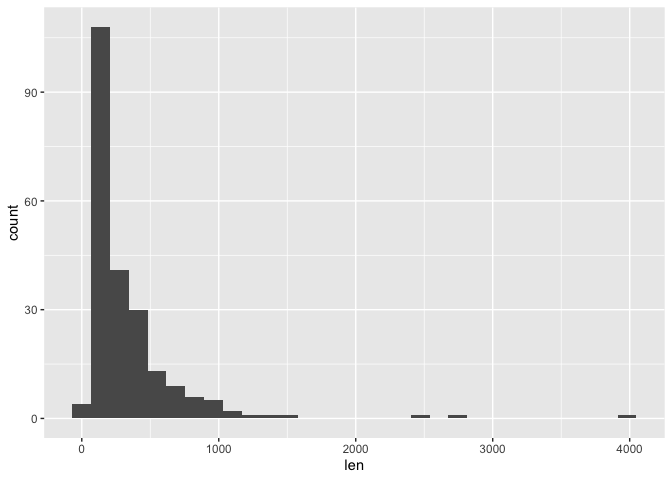

Short analysis of the sequences based on the class
==================================================

Introduction
------------

In this report, I am trying to get the information of the sequence of
each dataset based on the class, since the heatmap results behave
strangely (especially for fungi)

Execution
---------

``` r
library(tidyverse)
```

    ## ── Attaching packages ────────────────────────────────────────────────────────────────────────────────────────────── tidyverse 1.3.0 ──

    ## ✓ ggplot2 3.2.1     ✓ purrr   0.3.3
    ## ✓ tibble  2.1.3     ✓ dplyr   0.8.3
    ## ✓ tidyr   1.0.0     ✓ stringr 1.4.0
    ## ✓ readr   1.3.1     ✓ forcats 0.4.0

    ## ── Conflicts ───────────────────────────────────────────────────────────────────────────────────────────────── tidyverse_conflicts() ──
    ## x dplyr::filter() masks stats::filter()
    ## x dplyr::lag()    masks stats::lag()

``` r
library(stringr)
library(ggplot2)
```

``` r
fungi_train <- data.table::fread("../../../../data/getting-data-new/multi-class-data/data-sets/fungi/train.csv")
fungi_val <- data.table::fread("../../../../data/getting-data-new/multi-class-data/data-sets/fungi/val.csv")
fungi_test <- data.table::fread("../../../../data/getting-data-new/multi-class-data/data-sets/fungi/test.csv")

all_fungi <- fungi_train %>% 
  rbind(., fungi_val, fungi_test)
```

``` r
# Count the length of the string
fungi_seq_info <- all_fungi %>% 
  rowwise() %>% 
  dplyr::mutate(len = stringr::str_length(sequence))
```

``` r
fungi_seq_info %>% 
  summary(len)
```

    ##    sequence             label             len        
    ##  Length:224         Min.   :0.0000   Min.   :  53.0  
    ##  Class :character   1st Qu.:0.0000   1st Qu.: 128.0  
    ##  Mode  :character   Median :1.0000   Median : 209.5  
    ##                     Mean   :0.5045   Mean   : 341.5  
    ##                     3rd Qu.:1.0000   3rd Qu.: 395.0  
    ##                     Max.   :1.0000   Max.   :4034.0

``` r
ggplot(fungi_seq_info) +
  aes(len) +
  geom_histogram()
```

    ## `stat_bin()` using `bins = 30`. Pick better value with `binwidth`.



Getting fasta data
------------------

Since we know that all of effectors data are secreted, then we do not
need to use SignalP to identify wether it is secreted or not. Now we
just need to deal with the non-effector data.

### Change the dataframe in R to the fasta data

``` r
# Load all of the fungi data
fungi_train <- data.table::fread("../../../../data/getting-data-new/multi-class-data/data-sets/fungi/train.csv")
fungi_val <- data.table::fread("../../../../data/getting-data-new/multi-class-data/data-sets/fungi/val.csv")
fungi_test <- data.table::fread("../../../../data/getting-data-new/multi-class-data/data-sets/fungi/test.csv")

# Load all of the bacteria data
bacteria_train <- data.table::fread("../../../../data/getting-data-new/multi-class-data/data-sets/bacteria/train.csv")
bacteria_val <- data.table::fread("../../../../data/getting-data-new/multi-class-data/data-sets/bacteria/val.csv")
bacteria_test <- data.table::fread("../../../../data/getting-data-new/multi-class-data/data-sets/bacteria/test.csv")

# Load all of the oomycete data
oomycete_train <- data.table::fread("../../../../data/getting-data-new/multi-class-data/data-sets/oomycete/train.csv")
oomycete_val <- data.table::fread("../../../../data/getting-data-new/multi-class-data/data-sets/oomycete/val.csv")
oomycete_test <- data.table::fread("../../../../data/getting-data-new/multi-class-data/data-sets/oomycete/test.csv")
```

``` r
get_non_eff <- function(data){
  non_eff <- data %>% 
    dplyr::filter(label == 0) %>% 
    dplyr::select(sequence) %>% 
    tibble::rowid_to_column() %>% 
    `colnames<-` (c("seq_name", "sequence"))
  
  return(non_eff)
}
```

``` r
fungi_train_non_eff <- get_non_eff(fungi_train)
fungi_val_non_eff <- get_non_eff(fungi_val)
fungi_test_non_eff <- get_non_eff(fungi_test)

bacteria_train_non_eff <- get_non_eff(bacteria_train)
bacteria_val_non_eff <- get_non_eff(bacteria_val)
bacteria_test_non_eff <- get_non_eff(bacteria_test)

oomycete_train_non_eff <- get_non_eff(oomycete_train)
oomycete_val_non_eff <- get_non_eff(oomycete_val)
oomycete_test_non_eff <- get_non_eff(oomycete_test)
```

### Change the dataframe to fasta

``` r
library("seqRFLP")
```

``` r
# Define a function to get teh fasta from the df using package "seqRFLP"
get_fasta <- function(data){
  dat = dataframe2fas(get(data), file = paste0(data, ".fasta"))
}
```

``` r
get_fasta("fungi_val_non_eff")
```

``` r
list_data_name <- c("fungi_train_non_eff", 
                    "fungi_val_non_eff", 
                    "fungi_test_non_eff", 
                    "bacteria_train_non_eff", 
                    "bacteria_val_non_eff", 
                    "bacteria_test_non_eff", 
                    "oomycete_train_non_eff", 
                    "oomycete_val_non_eff", 
                    "oomycete_test_non_eff")
```

``` r
# Using for loop to make it easier to automatically run the function at once
for (data in list_data_name){
  get_fasta(data)
}
```
