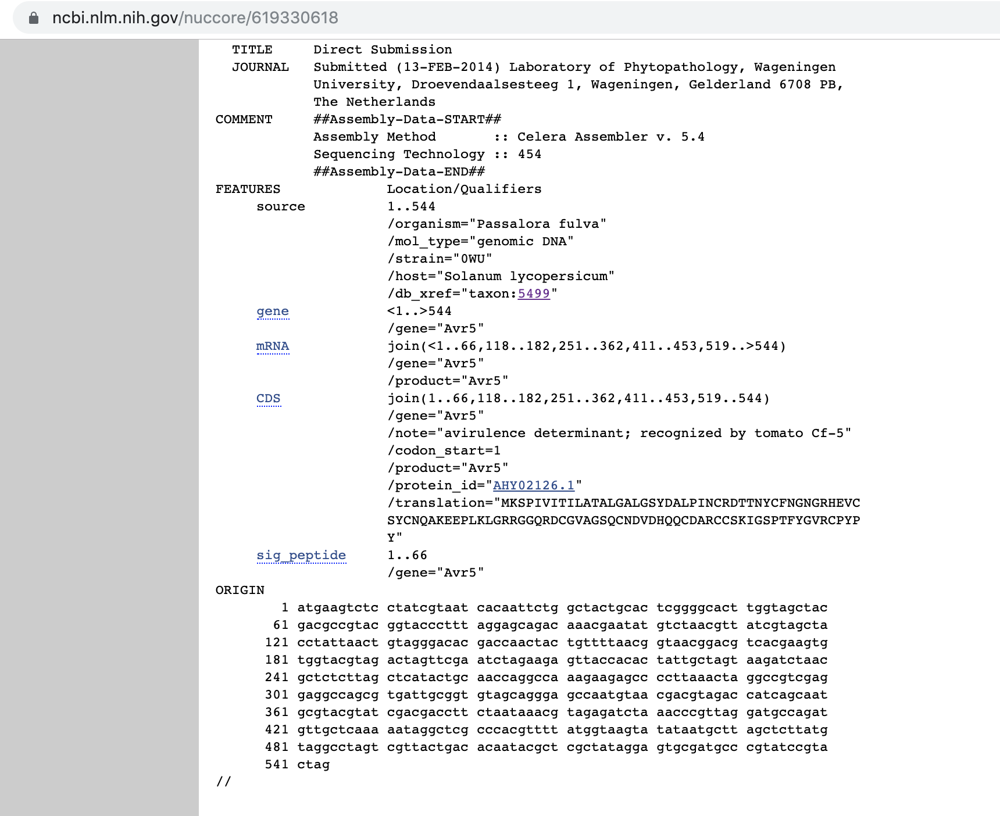
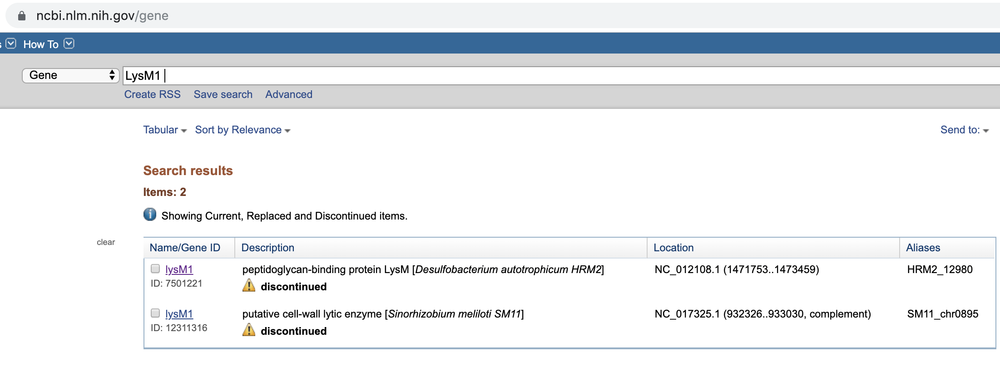
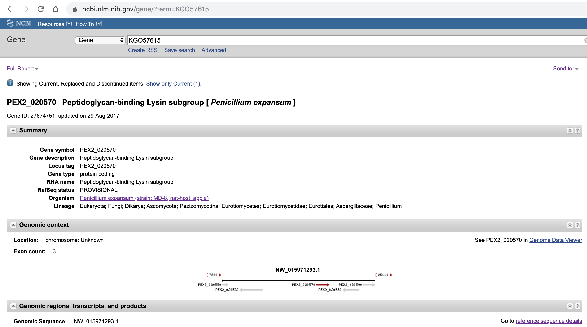

Checking how we can get negative (secreted) protein data from `rentrez` effectively
===================================================================================

Introduction
------------

In this report, I will check how the the `rentrez` works, for all of the
`GeneID`, in particularly (from `0001_get_secretd_data.Rmd`):

1.  Does have any NCBI ID
2.  Does not have

Experimental plan
-----------------

Taking an example of ID for each case above, and then check links of
database using known GeneID we have.

Execution
---------

### Protein that does not have GeneID

``` r
# Load lib
library(rentrez)
```

#### Example 1

``` r
# Take an example of protein with the ID = `W9ZT25`, GeneID = `EXK24251`, Gene = `AVRFOM2`
# Using both GeneID and Gene, let us check if we can find any id for gene ID in NCBI

# Using Gene
entrez_search(db = "gene", term = "AVRFOM2")$ids
```

    ## list()

``` r
# Using Gene ID
entrez_search(db = "gene", term = "EXK24251")$ids
```

    ## list()

Since there is no information regarding the unique gene id in NCBI, then
we can try to immediately check the entrez link database:

``` r
links_XK24251 <- entrez_link(dbfrom='protein', id = "EXK24251" , db='all')$links
links_XK24251
```

    ## elink result with information from 8 databases:
    ## [1] protein_nuccore                 protein_protein_cdart_summary  
    ## [3] protein_bioproject              protein_nuccore_wgs            
    ## [5] protein_nucleotide              protein_protein_cdart          
    ## [7] protein_protein_cdart_summary_2 protein_taxonomy

``` r
# Get the ID of protein in Nuccore database
links_XK24251$protein_nuccore
```

    ## [1] "385759978"

``` r
# Get the ID of protein in Nucleotide database
links_XK24251$protein_nucleotide
```

    ## [1] "385759978"

SInce the results are exactly the same ID, then I assume, they are
exactly same database. Also, according to this thread in Biostar
[Question: Biopython Entrez difference between nuccore and nucleotide
databases](https://www.biostars.org/p/161430/).

Then now, we can try to retrive proteinID, by doing these steps:

``` r
entrez_link(dbfrom = "nuccore", id = "385759978", db = "all")$links$nuccore_protein
```

    ## [1] "590022394" "590022393"

Here is how it looks when we enter the ID in NCBI website:


Then we will get two protein IDs(here is the look from the NCBI
website):

Using the protein IDs above then now we can easily retrive the sequence
data.

#### Example 2

``` r
# Take an example of protein with the ID = `A0A023UJQ9`, GeneID = `AHY02126`, Gene = `Avr5(CfCE1)`
# Using both GeneID and Gene, let us check if we can find any id for gene ID in NCBI

# Using Gene
entrez_search(db = "gene", term = "Avr5(CfCE1)")$ids
```

    ## list()

``` r
# Using Gene ID
entrez_search(db = "gene", term = "AHY02126")$ids
```

    ## list()

``` r
links_AHY02126 <- entrez_link(dbfrom='protein', id = "AHY02126" , db='all')$links
links_AHY02126
```

    ## elink result with information from 7 databases:
    ## [1] protein_nuccore                 protein_protein_cdart_summary  
    ## [3] protein_nucleotide              protein_protein_cdart          
    ## [5] protein_protein_cdart_summary_2 protein_pubmed                 
    ## [7] protein_taxonomy

``` r
# Get the ID of protein in Nuccore database
links_AHY02126$protein_nuccore
```

    ## [1] "619330618"

``` r
# Get the ID of protein in Nucleotide database
links_AHY02126$protein_nucleotide
```

    ## [1] "619330618"

``` r
entrez_link(dbfrom = "nuccore", id = "619330618", db = "all")$links$nuccore_protein
```

    ## [1] "619330619"

Here is the reults when we input the ID in NCBI website



If the result is only one proteinID, then it is actually protein that we
already have, then we can retrieve the protein from the known protein ID
and strains.

### Protein that does have GeneID

``` r
# Take an example of protein with the ID = `A0A0A2ILW0`, GeneID = `KGO57615`, Gene = `LysM1`
# Using both GeneID and Gene, let us check if we can find any id for gene ID in NCBI

# Using Gene
entrez_search(db = "gene", term = "LysM1")$ids
```

    ## [1] "12311316" "7501221"



``` r
# Using Gene ID
entrez_search(db = "gene", term = "KGO57615")$ids
```

    ## [1] "27674751"



Since using the GeneID is more unique and refer to the exact gene for
the protein we need, we will use the GeneID in this case:

``` r
links_KGO57615 <- entrez_link(dbfrom='protein', id = "KGO57615" , db='all')$links
links_KGO57615
```

    ## elink result with information from 17 databases:
    ##  [1] protein_cdd_concise_2           protein_cdd_superfamily_2      
    ##  [3] protein_nuccore                 protein_protein_cdart_summary  
    ##  [5] protein_sparcle                 protein_bioproject             
    ##  [7] protein_cdd                     protein_cdd_specific_2         
    ##  [9] protein_cdd_summary             protein_cdd_summary_nonpublic  
    ## [11] protein_gene                    protein_nuccore_wgs            
    ## [13] protein_nucleotide              protein_protein_cdart          
    ## [15] protein_protein_cdart_summary_2 protein_pubmed_weighted        
    ## [17] protein_taxonomy

``` r
links_KGO57615$protein_nuccore
```

    ## [1] "700469160"

``` r
links_KGO57615$protein_nucleotide
```

    ## [1] "700469160"

``` r
entrez_link(dbfrom = "nuccore", id = "700469160", db = "all")$links$nuccore_protein
```

    ##  [1] "700469201" "700469200" "700469199" "700469198" "700469197" "700469196"
    ##  [7] "700469195" "700469194" "700469193" "700469192" "700469191" "700469190"
    ## [13] "700469189" "700469188" "700469187" "700469186" "700469185" "700469184"
    ## [19] "700469183" "700469182" "700469181" "700469180" "700469179" "700469178"
    ## [25] "700469177" "700469176" "700469175" "700469174" "700469173" "700469172"
    ## [31] "700469171" "700469170" "700469169" "700469168" "700469167" "700469166"
    ## [37] "700469165" "700469164" "700469163" "700469162" "700469161"

In this case we have many protein, these proteins will later on will be
analysed using the SignalP.


