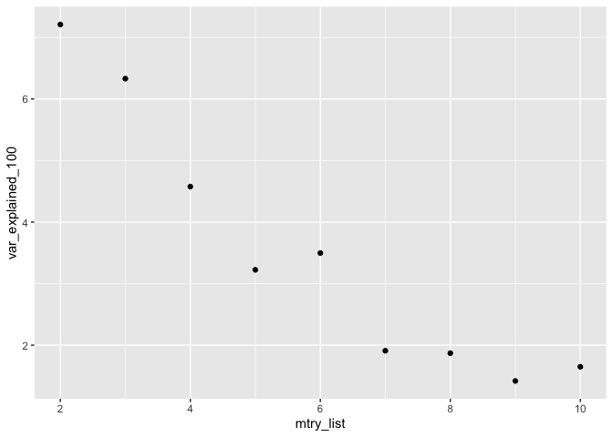
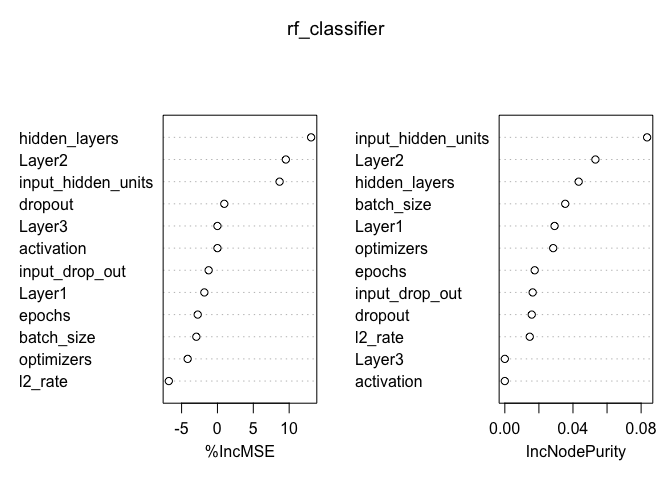
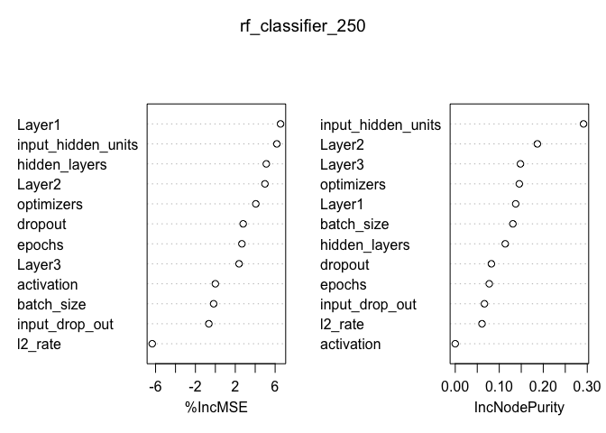
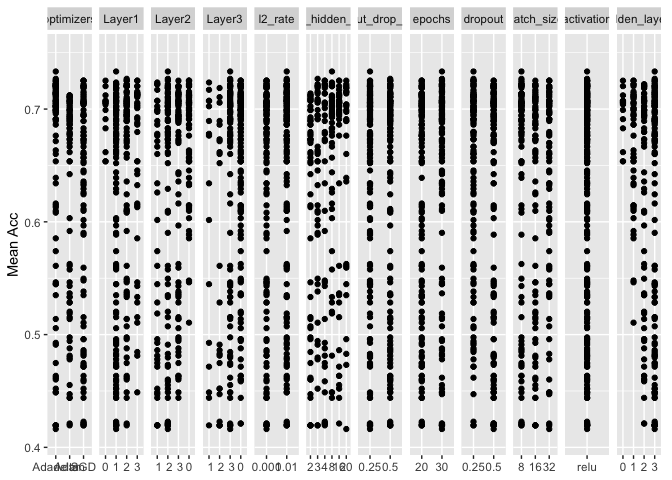

Can adding more number of iterations on RandomSearchCV() result on better accuracy? (Based on my hypothesis on the previous results)
====================================================================================================================================

Read the results
----------------

``` r
pred_results_old <- data.table::fread("../../../../data/model_scripts/df_result_prediction_old.csv",  drop = 'V1')
pred_results_new <- data.table::fread("../../../../data/model_scripts/df_result_prediction_100_combination.csv",  drop = 'V1')
```

Load the all of the results of hyperparameter scan and show the best 30
models.

``` r
# Read the CSV files
result_hyper_scan_new <- data.table::fread("../../../../data/model_scripts/result_hyper_tuned.csv", drop = 'V1') %>%
  dplyr::select(starts_with("param_"), mean_test_score, mean_train_score)

result_hyper_scan_old <- data.table::fread("../../../../data/model_scripts/result_hyper_tuned_old.csv", drop = 'V1') %>%
  dplyr::select(starts_with("param_"), mean_test_score, mean_train_score)

result_all <- result_hyper_scan_new  %>%
  rbind(result_hyper_scan_old)

results_hyper_scan_250iters <- result_hyper_scan_new %>%
   mutate(
  param_num_hidden_layers = str_remove_all(param_num_hidden_layers, "\\["),
  param_num_hidden_layers = str_remove_all(param_num_hidden_layers, "\\]")
  ) %>%
  separate(param_num_hidden_layers, c("Layer1","Layer2", "Layer3"), sep = "([,])") %>%
  dplyr::select(-param_shuffle) %>%
  rename(optimizers = param_optim_methods,
         l2_rate = param_l2_rate,
         input_hidden_units = param_input_num_hidden_units,
         input_drop_out = param_input_dropout_rates,
         epochs = param_epochs,
         dropout = param_dropout_rates,
         batch_size = param_batch_size,
         batch_norm = param_batch_norm,
         activation = param_activation_function) %>%
  mutate_all(function(x) ifelse(is.na(x), 0, x)) %>%
  mutate(
    hidden_layers = (Layer1 != 0) + (Layer2 != 0) + (Layer3 != 0)
  )
```

    ## Warning: Expected 3 pieces. Missing pieces filled with `NA` in 129 rows [1, 2,
    ## 3, 4, 5, 7, 8, 13, 14, 16, 18, 19, 21, 22, 23, 24, 26, 30, 31, 33, ...].

``` r
results_hyper_scan_100iters <- result_hyper_scan_old %>%
   mutate(
  param_num_hidden_layers = str_remove_all(param_num_hidden_layers, "\\["),
  param_num_hidden_layers = str_remove_all(param_num_hidden_layers, "\\]")
  ) %>%
  separate(param_num_hidden_layers, c("Layer1","Layer2", "Layer3"), sep = "([,])") %>%
  dplyr::select(-param_shuffle) %>%
  rename(optimizers = param_optim_methods,
         l2_rate = param_l2_rate,
         input_hidden_units = param_input_num_hidden_units,
         input_drop_out = param_input_dropout_rates,
         epochs = param_epochs,
         dropout = param_dropout_rates,
         batch_size = param_batch_size,
         batch_norm = param_batch_norm,
         activation = param_activation_function) %>%
  mutate_all(function(x) ifelse(is.na(x), 0, x)) %>%
  mutate(
    hidden_layers = (Layer1 != 0) + (Layer2 != 0) + (Layer3 != 0)
  )
```

    ## Warning: Expected 3 pieces. Missing pieces filled with `NA` in 100 rows [1, 2,
    ## 3, 4, 5, 6, 7, 8, 9, 10, 11, 12, 13, 14, 15, 16, 17, 18, 19, 20, ...].

Random forest
-------------

``` r
#import the package
library(randomForest)
```

    ## randomForest 4.6-14

    ## Type rfNews() to see new features/changes/bug fixes.

    ##
    ## Attaching package: 'randomForest'

    ## The following object is masked from 'package:dplyr':
    ##
    ##     combine

    ## The following object is masked from 'package:ggplot2':
    ##
    ##     margin

``` r
results_hyper_scan_250iters <- results_hyper_scan_250iters %>%
  select(-mean_train_score, -batch_norm)

results_hyper_scan_100iters <- results_hyper_scan_100iters %>%
  select(-mean_train_score, -batch_norm)

# Select all of the column names of hyperparameters in the dataframe
cols <- results_hyper_scan_250iters %>%
  dplyr::select(-c(mean_test_score)) %>%
  colnames()

cols_100 <- results_hyper_scan_100iters %>%
  dplyr::select(-c(mean_test_score)) %>%
  colnames()

# Change all of the hyperparameters variables as factors
results_hyper_scan_250iters[cols] <- lapply(results_hyper_scan_250iters[cols], factor)

results_hyper_scan_100iters[cols] <- lapply(results_hyper_scan_100iters[cols], factor)

test_100 <- randomForest(mean_test_score ~ .,
                            data = results_hyper_scan_100iters,
                            ntree = 100,
                            mtry = 2,
                            importance=TRUE)

test_100$rsq[100]*100
```

    ## [1] 8.908425

``` r
mtry_list <- c(2:10)

num_iter <- length(mtry_list)
var_explained_100 <- numeric(length = num_iter)
var_explained_250 <- numeric(length = num_iter)

for (i in 1:num_iter) {
  rf_classifier <- randomForest(
    mean_test_score  ~ .,
    data = results_hyper_scan_100iters,
    ntree = 1000,
    mtry = mtry_list[i],
    importance = TRUE
  )
  var_explained_100[i] <- rf_classifier$rsq[1000] * 100
}

for (i in 1:num_iter) {
  rf_classifier <- randomForest(
    mean_test_score  ~ .,
    data = results_hyper_scan_250iters,
    ntree = 1000,
    mtry = mtry_list[i],
    importance = TRUE
  )
  var_explained_250[i] <- rf_classifier$rsq[1000] * 100
}
```

``` r
df_100 <- data.frame(mtry_list, var_explained_100)
df_250 <- data.frame(mtry_list, var_explained_250)

df_100 %>%
  knitr::kable()
```

|  mtry\_list|  var\_explained\_100|
|-----------:|--------------------:|
|           2|             7.210956|
|           3|             6.330254|
|           4|             4.576387|
|           5|             3.223912|
|           6|             3.496336|
|           7|             1.909105|
|           8|             1.868780|
|           9|             1.417978|
|          10|             1.648214|

``` r
gg <- ggplot(df_100) +
  aes(x = mtry_list, y = var_explained_100) +
  geom_point()


gg
```



``` r
rf_classifier <- randomForest(
   mean_test_score  ~ .,
    data = results_hyper_scan_100iters,
    ntree = 1000,
    mtry = df_100[which.max(df_100$var_explained), "mtry_list"],
    importance = TRUE
  )
```

``` r
rf_classifier_250 <- randomForest(
   mean_test_score  ~ .,
    data = results_hyper_scan_250iters,
    ntree = 1000,
    mtry = df_250[which.max(df_250$var_explained), "mtry_list"],
    importance = TRUE
  )
```

``` r
rf_classifier
```

    ##
    ## Call:
    ##  randomForest(formula = mean_test_score ~ ., data = results_hyper_scan_100iters,      ntree = 1000, mtry = df_100[which.max(df_100$var_explained),          "mtry_list"], importance = TRUE)
    ##                Type of random forest: regression
    ##                      Number of trees: 1000
    ## No. of variables tried at each split: 2
    ##
    ##           Mean of squared residuals: 0.005716183
    ##                     % Var explained: 5.79

Since the best is when mtry = 9, then we will take that.

``` r
varImpPlot(rf_classifier)
```



``` r
varImpPlot(rf_classifier_250)
```



``` r
mean_test <- result_hyper_scan %>%
  select(mean_test_score)

mean_test %>%
  arrange(desc(mean_test$mean_test_score))
```

``` r
library(ggplot2)
library(tidyverse)

# results_all <- readRDS("../../scripts/model-scripts/Rmd/results_all.RDS")

plot_single_variable <- function(data, variable, filter_size, y_low_lim = 0.41, y_upp_lim = 0.75) {
  if(!is.null(filter_size)) {
    data <- data %>%
      dplyr::filter(filters == filter_size)
  }

  plot <- ggplot(data) +
    aes(x = {{ variable }}, y = mean_test_score) +
    geom_point() +
    scale_y_continuous(limits = c(y_low_lim, y_upp_lim)) +
    labs(
      y = "Mean accuracy"
    )

  return(plot)
}


plot_all_variables <- function(data, filter_size = NULL) {
  plot_matrix <- GGally::ggmatrix(
    list(
      plot_single_variable(data, optimizers, filter_size),
      plot_single_variable(data, Layer1, filter_size),
      plot_single_variable(data, Layer2, filter_size),
      plot_single_variable(data, Layer3, filter_size),
      plot_single_variable(data, l2_rate, filter_size),
      plot_single_variable(data, input_hidden_units, filter_size),
      plot_single_variable(data, input_drop_out, filter_size),
      plot_single_variable(data, epochs, filter_size),
      plot_single_variable(data, dropout, filter_size),
      plot_single_variable(data, batch_size, filter_size),
      # plot_single_variable(data, batch_norm, filter_size),
      plot_single_variable(data, activation, filter_size),
      plot_single_variable(data, hidden_layers, filter_size)
    ),
    nrow = 1, ncol = 13,
    xAxisLabels = c("optimizers",
                    "Layer1",
                    "Layer2",
                    "Layer3",
                    "l2_rate",
                    "input_hidden_units",
                    "input_drop_out",
                    "epochs",
                    "dropout",
                    "batch_size",
                    # "batch_norm",
                    "activation",
                    "hidden_layers"),
    ylab = "Mean Acc"
  ) +
    theme(strip.placement = "outside")

  return(plot_matrix)
}

gg_best_hyper_values <- plot_all_variables(results_hyper_scan_250iters)

gg_best_hyper_values
```



``` r
cols
```

    ##  [1] "optimizers"         "Layer1"             "Layer2"
    ##  [4] "Layer3"             "l2_rate"            "input_hidden_units"
    ##  [7] "input_drop_out"     "epochs"             "dropout"
    ## [10] "batch_size"         "activation"         "hidden_layers"

``` r
# Read the CSV of the prediction results on the test data
predict_results <- data.table::fread("../../../../data/model_scripts/df_result_prediction_100_combination.csv", drop = "V1")

# Show the results by sort the accuracy
predict_results %>%
  arrange(Accuracy) %>%
  knitr::kable()
```

| Parameters                                                                                                                                                                                                                                                                          |   Accuracy|  Sensitivity|  Specifity|
|:------------------------------------------------------------------------------------------------------------------------------------------------------------------------------------------------------------------------------------------------------------------------------------|----------:|------------:|----------:|
| {‘shuffle’: True, ‘optim\_methods’: ‘SGD’, ‘num\_hidden\_layers’: \[1, 2\], ‘l2\_rate’: 0.01, ‘input\_num\_hidden\_units’: 4, ‘input\_dropout\_rates’: 0.5, ‘epochs’: 20, ‘dropout\_rates’: 0.25, ‘batch\_size’: 32, ‘batch\_norm’: ‘no’, ‘activation\_function’: ‘relu’}           |  0.5466667|    0.8947368|  0.1891892|
| {‘shuffle’: True, ‘optim\_methods’: ‘SGD’, ‘num\_hidden\_layers’: \[0\], ‘l2\_rate’: 0.001, ‘input\_num\_hidden\_units’: 4, ‘input\_dropout\_rates’: 0.25, ‘epochs’: 20, ‘dropout\_rates’: 0.25, ‘batch\_size’: 32, ‘batch\_norm’: ‘no’, ‘activation\_function’: ‘relu’}            |  0.5933333|    0.3157895|  0.8783784|
| {‘shuffle’: True, ‘optim\_methods’: ‘Adadelta’, ‘num\_hidden\_layers’: \[0\], ‘l2\_rate’: 0.001, ‘input\_num\_hidden\_units’: 2, ‘input\_dropout\_rates’: 0.25, ‘epochs’: 20, ‘dropout\_rates’: 0.25, ‘batch\_size’: 8, ‘batch\_norm’: ‘no’, ‘activation\_function’: ‘relu’}        |  0.6133333|    0.3157895|  0.9189189|
| {‘shuffle’: True, ‘optim\_methods’: ‘SGD’, ‘num\_hidden\_layers’: \[1, 3\], ‘l2\_rate’: 0.001, ‘input\_num\_hidden\_units’: 4, ‘input\_dropout\_rates’: 0.25, ‘epochs’: 20, ‘dropout\_rates’: 0.5, ‘batch\_size’: 32, ‘batch\_norm’: ‘no’, ‘activation\_function’: ‘relu’}          |  0.6200000|    0.4078947|  0.8378378|
| {‘shuffle’: True, ‘optim\_methods’: ‘Adam’, ‘num\_hidden\_layers’: \[1, 1, 1\], ‘l2\_rate’: 0.01, ‘input\_num\_hidden\_units’: 2, ‘input\_dropout\_rates’: 0.5, ‘epochs’: 20, ‘dropout\_rates’: 0.5, ‘batch\_size’: 8, ‘batch\_norm’: ‘no’, ‘activation\_function’: ‘relu’}         |  0.6400000|    0.7631579|  0.5135135|
| {‘shuffle’: True, ‘optim\_methods’: ‘Adam’, ‘num\_hidden\_layers’: \[0\], ‘l2\_rate’: 0.01, ‘input\_num\_hidden\_units’: 20, ‘input\_dropout\_rates’: 0.5, ‘epochs’: 20, ‘dropout\_rates’: 0.25, ‘batch\_size’: 8, ‘batch\_norm’: ‘yes’, ‘activation\_function’: ‘relu’}            |  0.6466667|    0.4868421|  0.8108108|
| {‘shuffle’: True, ‘optim\_methods’: ‘Adam’, ‘num\_hidden\_layers’: \[2, 3, 3\], ‘l2\_rate’: 0.01, ‘input\_num\_hidden\_units’: 20, ‘input\_dropout\_rates’: 0.25, ‘epochs’: 20, ‘dropout\_rates’: 0.5, ‘batch\_size’: 8, ‘batch\_norm’: ‘no’, ‘activation\_function’: ‘relu’}       |  0.6466667|    0.5131579|  0.7837838|
| {‘shuffle’: True, ‘optim\_methods’: ‘SGD’, ‘num\_hidden\_layers’: \[2, 3\], ‘l2\_rate’: 0.01, ‘input\_num\_hidden\_units’: 4, ‘input\_dropout\_rates’: 0.25, ‘epochs’: 20, ‘dropout\_rates’: 0.25, ‘batch\_size’: 8, ‘batch\_norm’: ‘no’, ‘activation\_function’: ‘relu’}           |  0.6600000|    0.4210526|  0.9054054|
| {‘shuffle’: True, ‘optim\_methods’: ‘SGD’, ‘num\_hidden\_layers’: \[3, 3, 3\], ‘l2\_rate’: 0.001, ‘input\_num\_hidden\_units’: 2, ‘input\_dropout\_rates’: 0.5, ‘epochs’: 30, ‘dropout\_rates’: 0.25, ‘batch\_size’: 8, ‘batch\_norm’: ‘no’, ‘activation\_function’: ‘relu’}        |  0.6600000|    0.4736842|  0.8513514|
| {‘shuffle’: True, ‘optim\_methods’: ‘Adam’, ‘num\_hidden\_layers’: \[2\], ‘l2\_rate’: 0.001, ‘input\_num\_hidden\_units’: 8, ‘input\_dropout\_rates’: 0.5, ‘epochs’: 20, ‘dropout\_rates’: 0.5, ‘batch\_size’: 32, ‘batch\_norm’: ‘no’, ‘activation\_function’: ‘relu’}             |  0.6666667|    0.5657895|  0.7702703|
| {‘shuffle’: True, ‘optim\_methods’: ‘Adam’, ‘num\_hidden\_layers’: \[1, 2, 3\], ‘l2\_rate’: 0.001, ‘input\_num\_hidden\_units’: 3, ‘input\_dropout\_rates’: 0.25, ‘epochs’: 30, ‘dropout\_rates’: 0.5, ‘batch\_size’: 8, ‘batch\_norm’: ‘no’, ‘activation\_function’: ‘relu’}       |  0.6666667|    0.8947368|  0.4324324|
| {‘shuffle’: True, ‘optim\_methods’: ‘Adam’, ‘num\_hidden\_layers’: \[0\], ‘l2\_rate’: 0.001, ‘input\_num\_hidden\_units’: 4, ‘input\_dropout\_rates’: 0.5, ‘epochs’: 30, ‘dropout\_rates’: 0.25, ‘batch\_size’: 8, ‘batch\_norm’: ‘yes’, ‘activation\_function’: ‘relu’}            |  0.6733333|    0.5526316|  0.7972973|
| {‘shuffle’: True, ‘optim\_methods’: ‘Adam’, ‘num\_hidden\_layers’: \[1, 1\], ‘l2\_rate’: 0.01, ‘input\_num\_hidden\_units’: 2, ‘input\_dropout\_rates’: 0.5, ‘epochs’: 30, ‘dropout\_rates’: 0.5, ‘batch\_size’: 8, ‘batch\_norm’: ‘no’, ‘activation\_function’: ‘relu’}            |  0.6733333|    0.7105263|  0.6351351|
| {‘shuffle’: True, ‘optim\_methods’: ‘Adam’, ‘num\_hidden\_layers’: \[1, 3\], ‘l2\_rate’: 0.01, ‘input\_num\_hidden\_units’: 16, ‘input\_dropout\_rates’: 0.5, ‘epochs’: 30, ‘dropout\_rates’: 0.5, ‘batch\_size’: 16, ‘batch\_norm’: ‘no’, ‘activation\_function’: ‘relu’}          |  0.6733333|    0.7500000|  0.5945946|
| {‘shuffle’: True, ‘optim\_methods’: ‘Adam’, ‘num\_hidden\_layers’: \[1\], ‘l2\_rate’: 0.01, ‘input\_num\_hidden\_units’: 16, ‘input\_dropout\_rates’: 0.25, ‘epochs’: 20, ‘dropout\_rates’: 0.5, ‘batch\_size’: 16, ‘batch\_norm’: ‘yes’, ‘activation\_function’: ‘relu’}           |  0.6733333|    0.6842105|  0.6621622|
| {‘shuffle’: True, ‘optim\_methods’: ‘SGD’, ‘num\_hidden\_layers’: \[1, 1\], ‘l2\_rate’: 0.001, ‘input\_num\_hidden\_units’: 8, ‘input\_dropout\_rates’: 0.5, ‘epochs’: 20, ‘dropout\_rates’: 0.25, ‘batch\_size’: 32, ‘batch\_norm’: ‘no’, ‘activation\_function’: ‘relu’}          |  0.6733333|    0.7500000|  0.5945946|
| {‘shuffle’: True, ‘optim\_methods’: ‘SGD’, ‘num\_hidden\_layers’: \[1, 2\], ‘l2\_rate’: 0.001, ‘input\_num\_hidden\_units’: 8, ‘input\_dropout\_rates’: 0.5, ‘epochs’: 30, ‘dropout\_rates’: 0.5, ‘batch\_size’: 8, ‘batch\_norm’: ‘no’, ‘activation\_function’: ‘relu’}            |  0.6733333|    0.4605263|  0.8918919|
| {‘shuffle’: True, ‘optim\_methods’: ‘Adam’, ‘num\_hidden\_layers’: \[1\], ‘l2\_rate’: 0.01, ‘input\_num\_hidden\_units’: 20, ‘input\_dropout\_rates’: 0.5, ‘epochs’: 30, ‘dropout\_rates’: 0.25, ‘batch\_size’: 8, ‘batch\_norm’: ‘no’, ‘activation\_function’: ‘relu’}             |  0.6733333|    0.6578947|  0.6891892|
| {‘shuffle’: True, ‘optim\_methods’: ‘Adadelta’, ‘num\_hidden\_layers’: \[1, 2, 3\], ‘l2\_rate’: 0.001, ‘input\_num\_hidden\_units’: 16, ‘input\_dropout\_rates’: 0.5, ‘epochs’: 30, ‘dropout\_rates’: 0.5, ‘batch\_size’: 32, ‘batch\_norm’: ‘no’, ‘activation\_function’: ‘relu’}  |  0.6800000|    0.6447368|  0.7162162|
| {‘shuffle’: True, ‘optim\_methods’: ‘Adam’, ‘num\_hidden\_layers’: \[2, 3\], ‘l2\_rate’: 0.01, ‘input\_num\_hidden\_units’: 2, ‘input\_dropout\_rates’: 0.25, ‘epochs’: 30, ‘dropout\_rates’: 0.5, ‘batch\_size’: 16, ‘batch\_norm’: ‘no’, ‘activation\_function’: ‘relu’}          |  0.6800000|    0.5921053|  0.7702703|
| {‘shuffle’: True, ‘optim\_methods’: ‘Adam’, ‘num\_hidden\_layers’: \[1, 3\], ‘l2\_rate’: 0.01, ‘input\_num\_hidden\_units’: 2, ‘input\_dropout\_rates’: 0.25, ‘epochs’: 20, ‘dropout\_rates’: 0.5, ‘batch\_size’: 32, ‘batch\_norm’: ‘no’, ‘activation\_function’: ‘relu’}          |  0.6800000|    0.8947368|  0.4594595|
| {‘shuffle’: True, ‘optim\_methods’: ‘Adam’, ‘num\_hidden\_layers’: \[3, 3, 3\], ‘l2\_rate’: 0.01, ‘input\_num\_hidden\_units’: 8, ‘input\_dropout\_rates’: 0.5, ‘epochs’: 20, ‘dropout\_rates’: 0.5, ‘batch\_size’: 16, ‘batch\_norm’: ‘no’, ‘activation\_function’: ‘relu’}        |  0.6800000|    0.6973684|  0.6621622|
| {‘shuffle’: True, ‘optim\_methods’: ‘Adadelta’, ‘num\_hidden\_layers’: \[3, 3, 3\], ‘l2\_rate’: 0.01, ‘input\_num\_hidden\_units’: 2, ‘input\_dropout\_rates’: 0.25, ‘epochs’: 30, ‘dropout\_rates’: 0.25, ‘batch\_size’: 32, ‘batch\_norm’: ‘no’, ‘activation\_function’: ‘relu’}  |  0.6800000|    0.5789474|  0.7837838|
| {‘shuffle’: True, ‘optim\_methods’: ‘Adadelta’, ‘num\_hidden\_layers’: \[2, 3\], ‘l2\_rate’: 0.01, ‘input\_num\_hidden\_units’: 3, ‘input\_dropout\_rates’: 0.5, ‘epochs’: 30, ‘dropout\_rates’: 0.5, ‘batch\_size’: 32, ‘batch\_norm’: ‘no’, ‘activation\_function’: ‘relu’}       |  0.6800000|    0.6447368|  0.7162162|
| {‘shuffle’: True, ‘optim\_methods’: ‘SGD’, ‘num\_hidden\_layers’: \[3\], ‘l2\_rate’: 0.001, ‘input\_num\_hidden\_units’: 2, ‘input\_dropout\_rates’: 0.5, ‘epochs’: 20, ‘dropout\_rates’: 0.5, ‘batch\_size’: 32, ‘batch\_norm’: ‘no’, ‘activation\_function’: ‘relu’}              |  0.6800000|    0.5526316|  0.8108108|
| {‘shuffle’: True, ‘optim\_methods’: ‘SGD’, ‘num\_hidden\_layers’: \[2\], ‘l2\_rate’: 0.001, ‘input\_num\_hidden\_units’: 16, ‘input\_dropout\_rates’: 0.5, ‘epochs’: 20, ‘dropout\_rates’: 0.25, ‘batch\_size’: 32, ‘batch\_norm’: ‘no’, ‘activation\_function’: ‘relu’}            |  0.6800000|    0.6842105|  0.6756757|
| {‘shuffle’: True, ‘optim\_methods’: ‘Adam’, ‘num\_hidden\_layers’: \[1, 2, 3\], ‘l2\_rate’: 0.001, ‘input\_num\_hidden\_units’: 2, ‘input\_dropout\_rates’: 0.25, ‘epochs’: 20, ‘dropout\_rates’: 0.25, ‘batch\_size’: 32, ‘batch\_norm’: ‘no’, ‘activation\_function’: ‘relu’}     |  0.6800000|    0.6842105|  0.6756757|
| {‘shuffle’: True, ‘optim\_methods’: ‘Adadelta’, ‘num\_hidden\_layers’: \[1\], ‘l2\_rate’: 0.01, ‘input\_num\_hidden\_units’: 2, ‘input\_dropout\_rates’: 0.25, ‘epochs’: 30, ‘dropout\_rates’: 0.25, ‘batch\_size’: 16, ‘batch\_norm’: ‘no’, ‘activation\_function’: ‘relu’}        |  0.6866667|    0.9078947|  0.4594595|
| {‘shuffle’: True, ‘optim\_methods’: ‘Adam’, ‘num\_hidden\_layers’: \[3\], ‘l2\_rate’: 0.01, ‘input\_num\_hidden\_units’: 4, ‘input\_dropout\_rates’: 0.5, ‘epochs’: 20, ‘dropout\_rates’: 0.25, ‘batch\_size’: 16, ‘batch\_norm’: ‘no’, ‘activation\_function’: ‘relu’}             |  0.6866667|    0.7763158|  0.5945946|
| {‘shuffle’: True, ‘optim\_methods’: ‘Adam’, ‘num\_hidden\_layers’: \[2, 2, 3\], ‘l2\_rate’: 0.001, ‘input\_num\_hidden\_units’: 8, ‘input\_dropout\_rates’: 0.5, ‘epochs’: 20, ‘dropout\_rates’: 0.5, ‘batch\_size’: 16, ‘batch\_norm’: ‘no’, ‘activation\_function’: ‘relu’}       |  0.6866667|    0.6578947|  0.7162162|
| {‘shuffle’: True, ‘optim\_methods’: ‘SGD’, ‘num\_hidden\_layers’: \[3, 3, 3\], ‘l2\_rate’: 0.01, ‘input\_num\_hidden\_units’: 4, ‘input\_dropout\_rates’: 0.5, ‘epochs’: 20, ‘dropout\_rates’: 0.5, ‘batch\_size’: 8, ‘batch\_norm’: ‘no’, ‘activation\_function’: ‘relu’}          |  0.6866667|    0.8289474|  0.5405405|
| {‘shuffle’: True, ‘optim\_methods’: ‘SGD’, ‘num\_hidden\_layers’: \[3\], ‘l2\_rate’: 0.001, ‘input\_num\_hidden\_units’: 8, ‘input\_dropout\_rates’: 0.5, ‘epochs’: 20, ‘dropout\_rates’: 0.25, ‘batch\_size’: 16, ‘batch\_norm’: ‘no’, ‘activation\_function’: ‘relu’}             |  0.6866667|    0.7105263|  0.6621622|
| {‘shuffle’: True, ‘optim\_methods’: ‘Adam’, ‘num\_hidden\_layers’: \[3, 3, 3\], ‘l2\_rate’: 0.001, ‘input\_num\_hidden\_units’: 8, ‘input\_dropout\_rates’: 0.5, ‘epochs’: 30, ‘dropout\_rates’: 0.25, ‘batch\_size’: 16, ‘batch\_norm’: ‘no’, ‘activation\_function’: ‘relu’}      |  0.6866667|    0.6842105|  0.6891892|
| {‘shuffle’: True, ‘optim\_methods’: ‘Adadelta’, ‘num\_hidden\_layers’: \[2, 2, 3\], ‘l2\_rate’: 0.01, ‘input\_num\_hidden\_units’: 20, ‘input\_dropout\_rates’: 0.25, ‘epochs’: 30, ‘dropout\_rates’: 0.25, ‘batch\_size’: 32, ‘batch\_norm’: ‘no’, ‘activation\_function’: ‘relu’} |  0.6866667|    0.8815789|  0.4864865|
| {‘shuffle’: True, ‘optim\_methods’: ‘Adadelta’, ‘num\_hidden\_layers’: \[1, 2, 2\], ‘l2\_rate’: 0.01, ‘input\_num\_hidden\_units’: 3, ‘input\_dropout\_rates’: 0.25, ‘epochs’: 20, ‘dropout\_rates’: 0.5, ‘batch\_size’: 8, ‘batch\_norm’: ‘no’, ‘activation\_function’: ‘relu’}    |  0.6866667|    0.6315789|  0.7432432|
| {‘shuffle’: True, ‘optim\_methods’: ‘Adam’, ‘num\_hidden\_layers’: \[2, 2\], ‘l2\_rate’: 0.001, ‘input\_num\_hidden\_units’: 8, ‘input\_dropout\_rates’: 0.25, ‘epochs’: 30, ‘dropout\_rates’: 0.25, ‘batch\_size’: 8, ‘batch\_norm’: ‘no’, ‘activation\_function’: ‘relu’}         |  0.6866667|    0.6052632|  0.7702703|
| {‘shuffle’: True, ‘optim\_methods’: ‘Adadelta’, ‘num\_hidden\_layers’: \[1, 3\], ‘l2\_rate’: 0.001, ‘input\_num\_hidden\_units’: 4, ‘input\_dropout\_rates’: 0.25, ‘epochs’: 20, ‘dropout\_rates’: 0.5, ‘batch\_size’: 8, ‘batch\_norm’: ‘no’, ‘activation\_function’: ‘relu’}      |  0.6933333|    0.5657895|  0.8243243|
| {‘shuffle’: True, ‘optim\_methods’: ‘Adam’, ‘num\_hidden\_layers’: \[2, 2, 3\], ‘l2\_rate’: 0.01, ‘input\_num\_hidden\_units’: 16, ‘input\_dropout\_rates’: 0.5, ‘epochs’: 20, ‘dropout\_rates’: 0.25, ‘batch\_size’: 16, ‘batch\_norm’: ‘no’, ‘activation\_function’: ‘relu’}      |  0.6933333|    0.6842105|  0.7027027|
| {‘shuffle’: True, ‘optim\_methods’: ‘Adadelta’, ‘num\_hidden\_layers’: \[3, 3, 3\], ‘l2\_rate’: 0.01, ‘input\_num\_hidden\_units’: 2, ‘input\_dropout\_rates’: 0.25, ‘epochs’: 20, ‘dropout\_rates’: 0.5, ‘batch\_size’: 8, ‘batch\_norm’: ‘no’, ‘activation\_function’: ‘relu’}    |  0.6933333|    0.5263158|  0.8648649|
| {‘shuffle’: True, ‘optim\_methods’: ‘Adam’, ‘num\_hidden\_layers’: \[1, 2\], ‘l2\_rate’: 0.001, ‘input\_num\_hidden\_units’: 20, ‘input\_dropout\_rates’: 0.25, ‘epochs’: 30, ‘dropout\_rates’: 0.25, ‘batch\_size’: 8, ‘batch\_norm’: ‘no’, ‘activation\_function’: ‘relu’}        |  0.6933333|    0.6315789|  0.7567568|
| {‘shuffle’: True, ‘optim\_methods’: ‘Adadelta’, ‘num\_hidden\_layers’: \[3, 3, 3\], ‘l2\_rate’: 0.01, ‘input\_num\_hidden\_units’: 3, ‘input\_dropout\_rates’: 0.5, ‘epochs’: 20, ‘dropout\_rates’: 0.5, ‘batch\_size’: 8, ‘batch\_norm’: ‘no’, ‘activation\_function’: ‘relu’}     |  0.6933333|    0.5921053|  0.7972973|
| {‘shuffle’: True, ‘optim\_methods’: ‘SGD’, ‘num\_hidden\_layers’: \[0\], ‘l2\_rate’: 0.001, ‘input\_num\_hidden\_units’: 16, ‘input\_dropout\_rates’: 0.25, ‘epochs’: 30, ‘dropout\_rates’: 0.5, ‘batch\_size’: 16, ‘batch\_norm’: ‘yes’, ‘activation\_function’: ‘relu’}           |  0.6933333|    0.6973684|  0.6891892|
| {‘shuffle’: True, ‘optim\_methods’: ‘SGD’, ‘num\_hidden\_layers’: \[3\], ‘l2\_rate’: 0.01, ‘input\_num\_hidden\_units’: 2, ‘input\_dropout\_rates’: 0.5, ‘epochs’: 30, ‘dropout\_rates’: 0.5, ‘batch\_size’: 32, ‘batch\_norm’: ‘no’, ‘activation\_function’: ‘relu’}               |  0.6933333|    0.5131579|  0.8783784|
| {‘shuffle’: True, ‘optim\_methods’: ‘Adam’, ‘num\_hidden\_layers’: \[1\], ‘l2\_rate’: 0.01, ‘input\_num\_hidden\_units’: 2, ‘input\_dropout\_rates’: 0.25, ‘epochs’: 20, ‘dropout\_rates’: 0.25, ‘batch\_size’: 8, ‘batch\_norm’: ‘no’, ‘activation\_function’: ‘relu’}             |  0.6933333|    0.8421053|  0.5405405|
| {‘shuffle’: True, ‘optim\_methods’: ‘Adam’, ‘num\_hidden\_layers’: \[2\], ‘l2\_rate’: 0.01, ‘input\_num\_hidden\_units’: 4, ‘input\_dropout\_rates’: 0.5, ‘epochs’: 20, ‘dropout\_rates’: 0.25, ‘batch\_size’: 8, ‘batch\_norm’: ‘no’, ‘activation\_function’: ‘relu’}              |  0.7000000|    0.7105263|  0.6891892|
| {‘shuffle’: True, ‘optim\_methods’: ‘SGD’, ‘num\_hidden\_layers’: \[2, 3, 3\], ‘l2\_rate’: 0.001, ‘input\_num\_hidden\_units’: 16, ‘input\_dropout\_rates’: 0.25, ‘epochs’: 20, ‘dropout\_rates’: 0.5, ‘batch\_size’: 8, ‘batch\_norm’: ‘no’, ‘activation\_function’: ‘relu’}       |  0.7000000|    0.5526316|  0.8513514|
| {‘shuffle’: True, ‘optim\_methods’: ‘Adadelta’, ‘num\_hidden\_layers’: \[2\], ‘l2\_rate’: 0.01, ‘input\_num\_hidden\_units’: 16, ‘input\_dropout\_rates’: 0.25, ‘epochs’: 20, ‘dropout\_rates’: 0.25, ‘batch\_size’: 8, ‘batch\_norm’: ‘yes’, ‘activation\_function’: ‘relu’}       |  0.7000000|    0.8815789|  0.5135135|
| {‘shuffle’: True, ‘optim\_methods’: ‘Adadelta’, ‘num\_hidden\_layers’: \[2, 3\], ‘l2\_rate’: 0.001, ‘input\_num\_hidden\_units’: 8, ‘input\_dropout\_rates’: 0.25, ‘epochs’: 20, ‘dropout\_rates’: 0.25, ‘batch\_size’: 32, ‘batch\_norm’: ‘no’, ‘activation\_function’: ‘relu’}    |  0.7000000|    0.6578947|  0.7432432|
| {‘shuffle’: True, ‘optim\_methods’: ‘Adam’, ‘num\_hidden\_layers’: \[2, 3, 3\], ‘l2\_rate’: 0.01, ‘input\_num\_hidden\_units’: 8, ‘input\_dropout\_rates’: 0.25, ‘epochs’: 20, ‘dropout\_rates’: 0.25, ‘batch\_size’: 32, ‘batch\_norm’: ‘no’, ‘activation\_function’: ‘relu’}      |  0.7000000|    0.7236842|  0.6756757|
| {‘shuffle’: True, ‘optim\_methods’: ‘SGD’, ‘num\_hidden\_layers’: \[2, 3\], ‘l2\_rate’: 0.001, ‘input\_num\_hidden\_units’: 4, ‘input\_dropout\_rates’: 0.5, ‘epochs’: 30, ‘dropout\_rates’: 0.25, ‘batch\_size’: 32, ‘batch\_norm’: ‘no’, ‘activation\_function’: ‘relu’}          |  0.7000000|    0.9078947|  0.4864865|
| {‘shuffle’: True, ‘optim\_methods’: ‘SGD’, ‘num\_hidden\_layers’: \[0\], ‘l2\_rate’: 0.01, ‘input\_num\_hidden\_units’: 16, ‘input\_dropout\_rates’: 0.5, ‘epochs’: 20, ‘dropout\_rates’: 0.5, ‘batch\_size’: 32, ‘batch\_norm’: ‘yes’, ‘activation\_function’: ‘relu’}             |  0.7066667|    0.7631579|  0.6486486|
| {‘shuffle’: True, ‘optim\_methods’: ‘Adadelta’, ‘num\_hidden\_layers’: \[2, 3, 3\], ‘l2\_rate’: 0.01, ‘input\_num\_hidden\_units’: 3, ‘input\_dropout\_rates’: 0.5, ‘epochs’: 30, ‘dropout\_rates’: 0.25, ‘batch\_size’: 32, ‘batch\_norm’: ‘no’, ‘activation\_function’: ‘relu’}   |  0.7066667|    0.8026316|  0.6081081|
| {‘shuffle’: True, ‘optim\_methods’: ‘Adam’, ‘num\_hidden\_layers’: \[0\], ‘l2\_rate’: 0.01, ‘input\_num\_hidden\_units’: 2, ‘input\_dropout\_rates’: 0.5, ‘epochs’: 30, ‘dropout\_rates’: 0.5, ‘batch\_size’: 8, ‘batch\_norm’: ‘no’, ‘activation\_function’: ‘relu’}               |  0.7066667|    0.8026316|  0.6081081|
| {‘shuffle’: True, ‘optim\_methods’: ‘SGD’, ‘num\_hidden\_layers’: \[1, 1, 1\], ‘l2\_rate’: 0.001, ‘input\_num\_hidden\_units’: 16, ‘input\_dropout\_rates’: 0.5, ‘epochs’: 20, ‘dropout\_rates’: 0.5, ‘batch\_size’: 32, ‘batch\_norm’: ‘no’, ‘activation\_function’: ‘relu’}       |  0.7066667|    0.8157895|  0.5945946|
| {‘shuffle’: True, ‘optim\_methods’: ‘Adam’, ‘num\_hidden\_layers’: \[2, 3\], ‘l2\_rate’: 0.001, ‘input\_num\_hidden\_units’: 3, ‘input\_dropout\_rates’: 0.5, ‘epochs’: 20, ‘dropout\_rates’: 0.25, ‘batch\_size’: 16, ‘batch\_norm’: ‘no’, ‘activation\_function’: ‘relu’}         |  0.7066667|    0.7236842|  0.6891892|
| {‘shuffle’: True, ‘optim\_methods’: ‘Adadelta’, ‘num\_hidden\_layers’: \[2, 3, 3\], ‘l2\_rate’: 0.001, ‘input\_num\_hidden\_units’: 3, ‘input\_dropout\_rates’: 0.5, ‘epochs’: 30, ‘dropout\_rates’: 0.25, ‘batch\_size’: 32, ‘batch\_norm’: ‘no’, ‘activation\_function’: ‘relu’}  |  0.7066667|    0.5921053|  0.8243243|
| {‘shuffle’: True, ‘optim\_methods’: ‘SGD’, ‘num\_hidden\_layers’: \[3, 3, 3\], ‘l2\_rate’: 0.001, ‘input\_num\_hidden\_units’: 16, ‘input\_dropout\_rates’: 0.5, ‘epochs’: 30, ‘dropout\_rates’: 0.5, ‘batch\_size’: 32, ‘batch\_norm’: ‘no’, ‘activation\_function’: ‘relu’}       |  0.7066667|    0.7236842|  0.6891892|
| {‘shuffle’: True, ‘optim\_methods’: ‘Adam’, ‘num\_hidden\_layers’: \[3, 3, 3\], ‘l2\_rate’: 0.001, ‘input\_num\_hidden\_units’: 16, ‘input\_dropout\_rates’: 0.5, ‘epochs’: 20, ‘dropout\_rates’: 0.25, ‘batch\_size’: 32, ‘batch\_norm’: ‘no’, ‘activation\_function’: ‘relu’}     |  0.7066667|    0.7105263|  0.7027027|
| {‘shuffle’: True, ‘optim\_methods’: ‘Adadelta’, ‘num\_hidden\_layers’: \[2, 3\], ‘l2\_rate’: 0.01, ‘input\_num\_hidden\_units’: 2, ‘input\_dropout\_rates’: 0.25, ‘epochs’: 30, ‘dropout\_rates’: 0.5, ‘batch\_size’: 16, ‘batch\_norm’: ‘no’, ‘activation\_function’: ‘relu’}      |  0.7066667|    0.7631579|  0.6486486|
| {‘shuffle’: True, ‘optim\_methods’: ‘Adam’, ‘num\_hidden\_layers’: \[2, 2\], ‘l2\_rate’: 0.001, ‘input\_num\_hidden\_units’: 20, ‘input\_dropout\_rates’: 0.25, ‘epochs’: 20, ‘dropout\_rates’: 0.5, ‘batch\_size’: 8, ‘batch\_norm’: ‘no’, ‘activation\_function’: ‘relu’}         |  0.7066667|    0.7236842|  0.6891892|
| {‘shuffle’: True, ‘optim\_methods’: ‘Adam’, ‘num\_hidden\_layers’: \[1, 1, 2\], ‘l2\_rate’: 0.01, ‘input\_num\_hidden\_units’: 2, ‘input\_dropout\_rates’: 0.5, ‘epochs’: 20, ‘dropout\_rates’: 0.25, ‘batch\_size’: 8, ‘batch\_norm’: ‘no’, ‘activation\_function’: ‘relu’}        |  0.7066667|    0.7368421|  0.6756757|
| {‘shuffle’: True, ‘optim\_methods’: ‘SGD’, ‘num\_hidden\_layers’: \[2, 2, 3\], ‘l2\_rate’: 0.01, ‘input\_num\_hidden\_units’: 3, ‘input\_dropout\_rates’: 0.25, ‘epochs’: 30, ‘dropout\_rates’: 0.5, ‘batch\_size’: 8, ‘batch\_norm’: ‘no’, ‘activation\_function’: ‘relu’}         |  0.7066667|    0.6184211|  0.7972973|
| {‘shuffle’: True, ‘optim\_methods’: ‘Adam’, ‘num\_hidden\_layers’: \[2, 2\], ‘l2\_rate’: 0.01, ‘input\_num\_hidden\_units’: 2, ‘input\_dropout\_rates’: 0.5, ‘epochs’: 20, ‘dropout\_rates’: 0.25, ‘batch\_size’: 16, ‘batch\_norm’: ‘no’, ‘activation\_function’: ‘relu’}          |  0.7066667|    0.6052632|  0.8108108|
| {‘shuffle’: True, ‘optim\_methods’: ‘Adadelta’, ‘num\_hidden\_layers’: \[1, 2, 3\], ‘l2\_rate’: 0.01, ‘input\_num\_hidden\_units’: 16, ‘input\_dropout\_rates’: 0.5, ‘epochs’: 30, ‘dropout\_rates’: 0.5, ‘batch\_size’: 32, ‘batch\_norm’: ‘no’, ‘activation\_function’: ‘relu’}   |  0.7133333|    0.7763158|  0.6486486|
| {‘shuffle’: True, ‘optim\_methods’: ‘Adadelta’, ‘num\_hidden\_layers’: \[3\], ‘l2\_rate’: 0.01, ‘input\_num\_hidden\_units’: 2, ‘input\_dropout\_rates’: 0.25, ‘epochs’: 20, ‘dropout\_rates’: 0.5, ‘batch\_size’: 16, ‘batch\_norm’: ‘no’, ‘activation\_function’: ‘relu’}         |  0.7133333|    0.7631579|  0.6621622|
| {‘shuffle’: True, ‘optim\_methods’: ‘SGD’, ‘num\_hidden\_layers’: \[3\], ‘l2\_rate’: 0.01, ‘input\_num\_hidden\_units’: 20, ‘input\_dropout\_rates’: 0.25, ‘epochs’: 30, ‘dropout\_rates’: 0.5, ‘batch\_size’: 32, ‘batch\_norm’: ‘no’, ‘activation\_function’: ‘relu’}             |  0.7133333|    0.7105263|  0.7162162|
| {‘shuffle’: True, ‘optim\_methods’: ‘Adadelta’, ‘num\_hidden\_layers’: \[2, 3, 3\], ‘l2\_rate’: 0.01, ‘input\_num\_hidden\_units’: 3, ‘input\_dropout\_rates’: 0.25, ‘epochs’: 20, ‘dropout\_rates’: 0.25, ‘batch\_size’: 16, ‘batch\_norm’: ‘no’, ‘activation\_function’: ‘relu’}  |  0.7133333|    0.8552632|  0.5675676|
| {‘shuffle’: True, ‘optim\_methods’: ‘Adam’, ‘num\_hidden\_layers’: \[0\], ‘l2\_rate’: 0.001, ‘input\_num\_hidden\_units’: 8, ‘input\_dropout\_rates’: 0.5, ‘epochs’: 30, ‘dropout\_rates’: 0.5, ‘batch\_size’: 8, ‘batch\_norm’: ‘yes’, ‘activation\_function’: ‘relu’}             |  0.7133333|    0.6710526|  0.7567568|
| {‘shuffle’: True, ‘optim\_methods’: ‘Adadelta’, ‘num\_hidden\_layers’: \[1, 1\], ‘l2\_rate’: 0.01, ‘input\_num\_hidden\_units’: 4, ‘input\_dropout\_rates’: 0.25, ‘epochs’: 30, ‘dropout\_rates’: 0.25, ‘batch\_size’: 8, ‘batch\_norm’: ‘no’, ‘activation\_function’: ‘relu’}      |  0.7200000|    0.8157895|  0.6216216|
| {‘shuffle’: True, ‘optim\_methods’: ‘SGD’, ‘num\_hidden\_layers’: \[2, 2, 3\], ‘l2\_rate’: 0.01, ‘input\_num\_hidden\_units’: 20, ‘input\_dropout\_rates’: 0.25, ‘epochs’: 30, ‘dropout\_rates’: 0.5, ‘batch\_size’: 16, ‘batch\_norm’: ‘no’, ‘activation\_function’: ‘relu’}       |  0.7200000|    0.8289474|  0.6081081|
| {‘shuffle’: True, ‘optim\_methods’: ‘SGD’, ‘num\_hidden\_layers’: \[2\], ‘l2\_rate’: 0.001, ‘input\_num\_hidden\_units’: 8, ‘input\_dropout\_rates’: 0.25, ‘epochs’: 30, ‘dropout\_rates’: 0.5, ‘batch\_size’: 8, ‘batch\_norm’: ‘yes’, ‘activation\_function’: ‘relu’}             |  0.7200000|    0.8289474|  0.6081081|
| {‘shuffle’: True, ‘optim\_methods’: ‘Adadelta’, ‘num\_hidden\_layers’: \[2, 2, 3\], ‘l2\_rate’: 0.001, ‘input\_num\_hidden\_units’: 16, ‘input\_dropout\_rates’: 0.5, ‘epochs’: 30, ‘dropout\_rates’: 0.25, ‘batch\_size’: 32, ‘batch\_norm’: ‘no’, ‘activation\_function’: ‘relu’} |  0.7200000|    0.7631579|  0.6756757|
| {‘shuffle’: True, ‘optim\_methods’: ‘SGD’, ‘num\_hidden\_layers’: \[2, 2\], ‘l2\_rate’: 0.001, ‘input\_num\_hidden\_units’: 8, ‘input\_dropout\_rates’: 0.25, ‘epochs’: 30, ‘dropout\_rates’: 0.5, ‘batch\_size’: 16, ‘batch\_norm’: ‘no’, ‘activation\_function’: ‘relu’}          |  0.7200000|    0.6973684|  0.7432432|
| {‘shuffle’: True, ‘optim\_methods’: ‘SGD’, ‘num\_hidden\_layers’: \[2\], ‘l2\_rate’: 0.001, ‘input\_num\_hidden\_units’: 3, ‘input\_dropout\_rates’: 0.5, ‘epochs’: 30, ‘dropout\_rates’: 0.5, ‘batch\_size’: 16, ‘batch\_norm’: ‘no’, ‘activation\_function’: ‘relu’}              |  0.7200000|    0.5921053|  0.8513514|
| {‘shuffle’: True, ‘optim\_methods’: ‘Adam’, ‘num\_hidden\_layers’: \[2, 3, 3\], ‘l2\_rate’: 0.01, ‘input\_num\_hidden\_units’: 20, ‘input\_dropout\_rates’: 0.5, ‘epochs’: 30, ‘dropout\_rates’: 0.5, ‘batch\_size’: 16, ‘batch\_norm’: ‘no’, ‘activation\_function’: ‘relu’}       |  0.7200000|    0.7368421|  0.7027027|
| {‘shuffle’: True, ‘optim\_methods’: ‘Adadelta’, ‘num\_hidden\_layers’: \[1\], ‘l2\_rate’: 0.01, ‘input\_num\_hidden\_units’: 3, ‘input\_dropout\_rates’: 0.5, ‘epochs’: 20, ‘dropout\_rates’: 0.25, ‘batch\_size’: 8, ‘batch\_norm’: ‘no’, ‘activation\_function’: ‘relu’}          |  0.7200000|    0.8421053|  0.5945946|
| {‘shuffle’: True, ‘optim\_methods’: ‘Adadelta’, ‘num\_hidden\_layers’: \[0\], ‘l2\_rate’: 0.01, ‘input\_num\_hidden\_units’: 16, ‘input\_dropout\_rates’: 0.25, ‘epochs’: 30, ‘dropout\_rates’: 0.25, ‘batch\_size’: 32, ‘batch\_norm’: ‘yes’, ‘activation\_function’: ‘relu’}      |  0.7200000|    0.8289474|  0.6081081|
| {‘shuffle’: True, ‘optim\_methods’: ‘Adadelta’, ‘num\_hidden\_layers’: \[1, 1\], ‘l2\_rate’: 0.01, ‘input\_num\_hidden\_units’: 20, ‘input\_dropout\_rates’: 0.5, ‘epochs’: 20, ‘dropout\_rates’: 0.25, ‘batch\_size’: 8, ‘batch\_norm’: ‘no’, ‘activation\_function’: ‘relu’}      |  0.7200000|    0.7105263|  0.7297297|
| {‘shuffle’: True, ‘optim\_methods’: ‘Adadelta’, ‘num\_hidden\_layers’: \[1, 2, 3\], ‘l2\_rate’: 0.01, ‘input\_num\_hidden\_units’: 2, ‘input\_dropout\_rates’: 0.25, ‘epochs’: 20, ‘dropout\_rates’: 0.5, ‘batch\_size’: 16, ‘batch\_norm’: ‘no’, ‘activation\_function’: ‘relu’}   |  0.7200000|    0.7763158|  0.6621622|
| {‘shuffle’: True, ‘optim\_methods’: ‘Adam’, ‘num\_hidden\_layers’: \[0\], ‘l2\_rate’: 0.01, ‘input\_num\_hidden\_units’: 3, ‘input\_dropout\_rates’: 0.5, ‘epochs’: 20, ‘dropout\_rates’: 0.5, ‘batch\_size’: 32, ‘batch\_norm’: ‘yes’, ‘activation\_function’: ‘relu’}             |  0.7200000|    0.8421053|  0.5945946|
| {‘shuffle’: True, ‘optim\_methods’: ‘Adam’, ‘num\_hidden\_layers’: \[1, 3\], ‘l2\_rate’: 0.001, ‘input\_num\_hidden\_units’: 8, ‘input\_dropout\_rates’: 0.5, ‘epochs’: 20, ‘dropout\_rates’: 0.25, ‘batch\_size’: 16, ‘batch\_norm’: ‘no’, ‘activation\_function’: ‘relu’}         |  0.7200000|    0.8026316|  0.6351351|
| {‘shuffle’: True, ‘optim\_methods’: ‘Adadelta’, ‘num\_hidden\_layers’: \[1, 1\], ‘l2\_rate’: 0.001, ‘input\_num\_hidden\_units’: 4, ‘input\_dropout\_rates’: 0.5, ‘epochs’: 30, ‘dropout\_rates’: 0.5, ‘batch\_size’: 16, ‘batch\_norm’: ‘no’, ‘activation\_function’: ‘relu’}      |  0.7266667|    0.7763158|  0.6756757|
| {‘shuffle’: True, ‘optim\_methods’: ‘Adadelta’, ‘num\_hidden\_layers’: \[1, 2\], ‘l2\_rate’: 0.001, ‘input\_num\_hidden\_units’: 16, ‘input\_dropout\_rates’: 0.5, ‘epochs’: 30, ‘dropout\_rates’: 0.5, ‘batch\_size’: 32, ‘batch\_norm’: ‘no’, ‘activation\_function’: ‘relu’}     |  0.7266667|    0.8026316|  0.6486486|
| {‘shuffle’: True, ‘optim\_methods’: ‘SGD’, ‘num\_hidden\_layers’: \[0\], ‘l2\_rate’: 0.01, ‘input\_num\_hidden\_units’: 8, ‘input\_dropout\_rates’: 0.5, ‘epochs’: 30, ‘dropout\_rates’: 0.25, ‘batch\_size’: 32, ‘batch\_norm’: ‘yes’, ‘activation\_function’: ‘relu’}             |  0.7266667|    0.8421053|  0.6081081|
| {‘shuffle’: True, ‘optim\_methods’: ‘Adam’, ‘num\_hidden\_layers’: \[1, 1, 1\], ‘l2\_rate’: 0.001, ‘input\_num\_hidden\_units’: 4, ‘input\_dropout\_rates’: 0.25, ‘epochs’: 30, ‘dropout\_rates’: 0.5, ‘batch\_size’: 8, ‘batch\_norm’: ‘no’, ‘activation\_function’: ‘relu’}       |  0.7266667|    0.8421053|  0.6081081|
| {‘shuffle’: True, ‘optim\_methods’: ‘Adam’, ‘num\_hidden\_layers’: \[1\], ‘l2\_rate’: 0.01, ‘input\_num\_hidden\_units’: 2, ‘input\_dropout\_rates’: 0.25, ‘epochs’: 20, ‘dropout\_rates’: 0.25, ‘batch\_size’: 16, ‘batch\_norm’: ‘no’, ‘activation\_function’: ‘relu’}            |  0.7266667|    0.7368421|  0.7162162|
| {‘shuffle’: True, ‘optim\_methods’: ‘Adadelta’, ‘num\_hidden\_layers’: \[1\], ‘l2\_rate’: 0.001, ‘input\_num\_hidden\_units’: 8, ‘input\_dropout\_rates’: 0.25, ‘epochs’: 30, ‘dropout\_rates’: 0.25, ‘batch\_size’: 8, ‘batch\_norm’: ‘no’, ‘activation\_function’: ‘relu’}        |  0.7266667|    0.7763158|  0.6756757|
| {‘shuffle’: True, ‘optim\_methods’: ‘SGD’, ‘num\_hidden\_layers’: \[2, 2, 3\], ‘l2\_rate’: 0.01, ‘input\_num\_hidden\_units’: 2, ‘input\_dropout\_rates’: 0.25, ‘epochs’: 30, ‘dropout\_rates’: 0.5, ‘batch\_size’: 8, ‘batch\_norm’: ‘no’, ‘activation\_function’: ‘relu’}         |  0.7266667|    0.7631579|  0.6891892|
| {‘shuffle’: True, ‘optim\_methods’: ‘Adam’, ‘num\_hidden\_layers’: \[1\], ‘l2\_rate’: 0.01, ‘input\_num\_hidden\_units’: 8, ‘input\_dropout\_rates’: 0.25, ‘epochs’: 30, ‘dropout\_rates’: 0.25, ‘batch\_size’: 16, ‘batch\_norm’: ‘no’, ‘activation\_function’: ‘relu’}            |  0.7266667|    0.8289474|  0.6216216|
| {‘shuffle’: True, ‘optim\_methods’: ‘Adadelta’, ‘num\_hidden\_layers’: \[1, 3\], ‘l2\_rate’: 0.001, ‘input\_num\_hidden\_units’: 3, ‘input\_dropout\_rates’: 0.5, ‘epochs’: 20, ‘dropout\_rates’: 0.5, ‘batch\_size’: 16, ‘batch\_norm’: ‘no’, ‘activation\_function’: ‘relu’}      |  0.7266667|    0.8684211|  0.5810811|
| {‘shuffle’: True, ‘optim\_methods’: ‘Adadelta’, ‘num\_hidden\_layers’: \[1, 1, 1\], ‘l2\_rate’: 0.01, ‘input\_num\_hidden\_units’: 16, ‘input\_dropout\_rates’: 0.25, ‘epochs’: 30, ‘dropout\_rates’: 0.25, ‘batch\_size’: 16, ‘batch\_norm’: ‘no’, ‘activation\_function’: ‘relu’} |  0.7266667|    0.7105263|  0.7432432|
| {‘shuffle’: True, ‘optim\_methods’: ‘Adadelta’, ‘num\_hidden\_layers’: \[1, 2\], ‘l2\_rate’: 0.001, ‘input\_num\_hidden\_units’: 16, ‘input\_dropout\_rates’: 0.25, ‘epochs’: 20, ‘dropout\_rates’: 0.25, ‘batch\_size’: 32, ‘batch\_norm’: ‘no’, ‘activation\_function’: ‘relu’}   |  0.7266667|    0.7500000|  0.7027027|
| {‘shuffle’: True, ‘optim\_methods’: ‘Adadelta’, ‘num\_hidden\_layers’: \[1, 2, 3\], ‘l2\_rate’: 0.01, ‘input\_num\_hidden\_units’: 8, ‘input\_dropout\_rates’: 0.25, ‘epochs’: 30, ‘dropout\_rates’: 0.25, ‘batch\_size’: 8, ‘batch\_norm’: ‘no’, ‘activation\_function’: ‘relu’}   |  0.7333333|    0.6578947|  0.8108108|
| {‘shuffle’: True, ‘optim\_methods’: ‘Adadelta’, ‘num\_hidden\_layers’: \[3, 3, 3\], ‘l2\_rate’: 0.001, ‘input\_num\_hidden\_units’: 16, ‘input\_dropout\_rates’: 0.25, ‘epochs’: 20, ‘dropout\_rates’: 0.25, ‘batch\_size’: 8, ‘batch\_norm’: ‘no’, ‘activation\_function’: ‘relu’} |  0.7333333|    0.8026316|  0.6621622|
| {‘shuffle’: True, ‘optim\_methods’: ‘Adadelta’, ‘num\_hidden\_layers’: \[1, 2, 3\], ‘l2\_rate’: 0.01, ‘input\_num\_hidden\_units’: 20, ‘input\_dropout\_rates’: 0.5, ‘epochs’: 20, ‘dropout\_rates’: 0.5, ‘batch\_size’: 16, ‘batch\_norm’: ‘no’, ‘activation\_function’: ‘relu’}   |  0.7333333|    0.7894737|  0.6756757|
| {‘shuffle’: True, ‘optim\_methods’: ‘SGD’, ‘num\_hidden\_layers’: \[2, 2, 3\], ‘l2\_rate’: 0.001, ‘input\_num\_hidden\_units’: 20, ‘input\_dropout\_rates’: 0.5, ‘epochs’: 20, ‘dropout\_rates’: 0.5, ‘batch\_size’: 8, ‘batch\_norm’: ‘no’, ‘activation\_function’: ‘relu’}        |  0.7333333|    0.8026316|  0.6621622|
| {‘shuffle’: True, ‘optim\_methods’: ‘Adadelta’, ‘num\_hidden\_layers’: \[2, 2, 3\], ‘l2\_rate’: 0.001, ‘input\_num\_hidden\_units’: 8, ‘input\_dropout\_rates’: 0.25, ‘epochs’: 20, ‘dropout\_rates’: 0.25, ‘batch\_size’: 16, ‘batch\_norm’: ‘no’, ‘activation\_function’: ‘relu’} |  0.7333333|    0.7894737|  0.6756757|
| {‘shuffle’: True, ‘optim\_methods’: ‘Adadelta’, ‘num\_hidden\_layers’: \[1, 1, 1\], ‘l2\_rate’: 0.01, ‘input\_num\_hidden\_units’: 8, ‘input\_dropout\_rates’: 0.5, ‘epochs’: 30, ‘dropout\_rates’: 0.25, ‘batch\_size’: 8, ‘batch\_norm’: ‘no’, ‘activation\_function’: ‘relu’}    |  0.7333333|    0.6973684|  0.7702703|
| {‘shuffle’: True, ‘optim\_methods’: ‘Adadelta’, ‘num\_hidden\_layers’: \[1, 2, 2\], ‘l2\_rate’: 0.001, ‘input\_num\_hidden\_units’: 20, ‘input\_dropout\_rates’: 0.25, ‘epochs’: 30, ‘dropout\_rates’: 0.5, ‘batch\_size’: 8, ‘batch\_norm’: ‘no’, ‘activation\_function’: ‘relu’}  |  0.7333333|    0.7105263|  0.7567568|
| {‘shuffle’: True, ‘optim\_methods’: ‘Adadelta’, ‘num\_hidden\_layers’: \[1, 1, 1\], ‘l2\_rate’: 0.001, ‘input\_num\_hidden\_units’: 8, ‘input\_dropout\_rates’: 0.25, ‘epochs’: 20, ‘dropout\_rates’: 0.25, ‘batch\_size’: 8, ‘batch\_norm’: ‘no’, ‘activation\_function’: ‘relu’}  |  0.7333333|    0.7500000|  0.7162162|
| {‘shuffle’: True, ‘optim\_methods’: ‘Adadelta’, ‘num\_hidden\_layers’: \[1, 2, 2\], ‘l2\_rate’: 0.01, ‘input\_num\_hidden\_units’: 3, ‘input\_dropout\_rates’: 0.25, ‘epochs’: 20, ‘dropout\_rates’: 0.5, ‘batch\_size’: 32, ‘batch\_norm’: ‘no’, ‘activation\_function’: ‘relu’}   |  0.7333333|    0.8421053|  0.6216216|
| {‘shuffle’: True, ‘optim\_methods’: ‘SGD’, ‘num\_hidden\_layers’: \[2, 3\], ‘l2\_rate’: 0.001, ‘input\_num\_hidden\_units’: 8, ‘input\_dropout\_rates’: 0.25, ‘epochs’: 30, ‘dropout\_rates’: 0.25, ‘batch\_size’: 16, ‘batch\_norm’: ‘no’, ‘activation\_function’: ‘relu’}         |  0.7333333|    0.8552632|  0.6081081|
| {‘shuffle’: True, ‘optim\_methods’: ‘Adadelta’, ‘num\_hidden\_layers’: \[3, 3, 3\], ‘l2\_rate’: 0.01, ‘input\_num\_hidden\_units’: 4, ‘input\_dropout\_rates’: 0.5, ‘epochs’: 20, ‘dropout\_rates’: 0.5, ‘batch\_size’: 8, ‘batch\_norm’: ‘no’, ‘activation\_function’: ‘relu’}     |  0.7333333|    0.8026316|  0.6621622|
| {‘shuffle’: True, ‘optim\_methods’: ‘SGD’, ‘num\_hidden\_layers’: \[1, 2\], ‘l2\_rate’: 0.001, ‘input\_num\_hidden\_units’: 20, ‘input\_dropout\_rates’: 0.5, ‘epochs’: 30, ‘dropout\_rates’: 0.5, ‘batch\_size’: 8, ‘batch\_norm’: ‘no’, ‘activation\_function’: ‘relu’}           |  0.7333333|    0.7500000|  0.7162162|
| {‘shuffle’: True, ‘optim\_methods’: ‘Adadelta’, ‘num\_hidden\_layers’: \[1, 1, 1\], ‘l2\_rate’: 0.001, ‘input\_num\_hidden\_units’: 8, ‘input\_dropout\_rates’: 0.25, ‘epochs’: 30, ‘dropout\_rates’: 0.25, ‘batch\_size’: 8, ‘batch\_norm’: ‘no’, ‘activation\_function’: ‘relu’}  |  0.7333333|    0.7368421|  0.7297297|
| {‘shuffle’: True, ‘optim\_methods’: ‘SGD’, ‘num\_hidden\_layers’: \[2\], ‘l2\_rate’: 0.01, ‘input\_num\_hidden\_units’: 8, ‘input\_dropout\_rates’: 0.5, ‘epochs’: 20, ‘dropout\_rates’: 0.5, ‘batch\_size’: 8, ‘batch\_norm’: ‘no’, ‘activation\_function’: ‘relu’}                |  0.7333333|    0.7236842|  0.7432432|
| {‘shuffle’: True, ‘optim\_methods’: ‘Adadelta’, ‘num\_hidden\_layers’: \[2\], ‘l2\_rate’: 0.01, ‘input\_num\_hidden\_units’: 20, ‘input\_dropout\_rates’: 0.25, ‘epochs’: 30, ‘dropout\_rates’: 0.5, ‘batch\_size’: 8, ‘batch\_norm’: ‘no’, ‘activation\_function’: ‘relu’}         |  0.7400000|    0.7105263|  0.7702703|
| {‘shuffle’: True, ‘optim\_methods’: ‘Adadelta’, ‘num\_hidden\_layers’: \[3\], ‘l2\_rate’: 0.001, ‘input\_num\_hidden\_units’: 8, ‘input\_dropout\_rates’: 0.25, ‘epochs’: 30, ‘dropout\_rates’: 0.5, ‘batch\_size’: 8, ‘batch\_norm’: ‘no’, ‘activation\_function’: ‘relu’}         |  0.7400000|    0.8157895|  0.6621622|
| {‘shuffle’: True, ‘optim\_methods’: ‘Adadelta’, ‘num\_hidden\_layers’: \[2, 2\], ‘l2\_rate’: 0.01, ‘input\_num\_hidden\_units’: 3, ‘input\_dropout\_rates’: 0.5, ‘epochs’: 20, ‘dropout\_rates’: 0.25, ‘batch\_size’: 8, ‘batch\_norm’: ‘no’, ‘activation\_function’: ‘relu’}       |  0.7400000|    0.8684211|  0.6081081|
| {‘shuffle’: True, ‘optim\_methods’: ‘Adadelta’, ‘num\_hidden\_layers’: \[2, 2, 3\], ‘l2\_rate’: 0.01, ‘input\_num\_hidden\_units’: 20, ‘input\_dropout\_rates’: 0.25, ‘epochs’: 30, ‘dropout\_rates’: 0.5, ‘batch\_size’: 16, ‘batch\_norm’: ‘no’, ‘activation\_function’: ‘relu’}  |  0.7400000|    0.8289474|  0.6486486|
| {‘shuffle’: True, ‘optim\_methods’: ‘Adadelta’, ‘num\_hidden\_layers’: \[2, 2, 3\], ‘l2\_rate’: 0.01, ‘input\_num\_hidden\_units’: 3, ‘input\_dropout\_rates’: 0.5, ‘epochs’: 30, ‘dropout\_rates’: 0.25, ‘batch\_size’: 8, ‘batch\_norm’: ‘no’, ‘activation\_function’: ‘relu’}    |  0.7400000|    0.7631579|  0.7162162|
| {‘shuffle’: True, ‘optim\_methods’: ‘Adadelta’, ‘num\_hidden\_layers’: \[2, 3, 3\], ‘l2\_rate’: 0.001, ‘input\_num\_hidden\_units’: 16, ‘input\_dropout\_rates’: 0.25, ‘epochs’: 20, ‘dropout\_rates’: 0.5, ‘batch\_size’: 32, ‘batch\_norm’: ‘no’, ‘activation\_function’: ‘relu’} |  0.7400000|    0.7631579|  0.7162162|
| {‘shuffle’: True, ‘optim\_methods’: ‘SGD’, ‘num\_hidden\_layers’: \[1, 1, 1\], ‘l2\_rate’: 0.001, ‘input\_num\_hidden\_units’: 16, ‘input\_dropout\_rates’: 0.5, ‘epochs’: 30, ‘dropout\_rates’: 0.25, ‘batch\_size’: 16, ‘batch\_norm’: ‘no’, ‘activation\_function’: ‘relu’}      |  0.7400000|    0.8684211|  0.6081081|
| {‘shuffle’: True, ‘optim\_methods’: ‘Adadelta’, ‘num\_hidden\_layers’: \[1, 2, 3\], ‘l2\_rate’: 0.001, ‘input\_num\_hidden\_units’: 20, ‘input\_dropout\_rates’: 0.5, ‘epochs’: 20, ‘dropout\_rates’: 0.5, ‘batch\_size’: 32, ‘batch\_norm’: ‘no’, ‘activation\_function’: ‘relu’}  |  0.7466667|    0.8026316|  0.6891892|
| {‘shuffle’: True, ‘optim\_methods’: ‘Adadelta’, ‘num\_hidden\_layers’: \[2\], ‘l2\_rate’: 0.001, ‘input\_num\_hidden\_units’: 8, ‘input\_dropout\_rates’: 0.25, ‘epochs’: 30, ‘dropout\_rates’: 0.5, ‘batch\_size’: 32, ‘batch\_norm’: ‘no’, ‘activation\_function’: ‘relu’}        |  0.7466667|    0.7894737|  0.7027027|
| {‘shuffle’: True, ‘optim\_methods’: ‘SGD’, ‘num\_hidden\_layers’: \[2, 2\], ‘l2\_rate’: 0.01, ‘input\_num\_hidden\_units’: 4, ‘input\_dropout\_rates’: 0.5, ‘epochs’: 30, ‘dropout\_rates’: 0.5, ‘batch\_size’: 16, ‘batch\_norm’: ‘no’, ‘activation\_function’: ‘relu’}            |  0.7466667|    0.7894737|  0.7027027|
| {‘shuffle’: True, ‘optim\_methods’: ‘Adadelta’, ‘num\_hidden\_layers’: \[3, 3, 3\], ‘l2\_rate’: 0.01, ‘input\_num\_hidden\_units’: 4, ‘input\_dropout\_rates’: 0.5, ‘epochs’: 30, ‘dropout\_rates’: 0.5, ‘batch\_size’: 8, ‘batch\_norm’: ‘no’, ‘activation\_function’: ‘relu’}     |  0.7466667|    0.7631579|  0.7297297|
| {‘shuffle’: True, ‘optim\_methods’: ‘SGD’, ‘num\_hidden\_layers’: \[2\], ‘l2\_rate’: 0.01, ‘input\_num\_hidden\_units’: 8, ‘input\_dropout\_rates’: 0.5, ‘epochs’: 20, ‘dropout\_rates’: 0.25, ‘batch\_size’: 16, ‘batch\_norm’: ‘no’, ‘activation\_function’: ‘relu’}              |  0.7466667|    0.8684211|  0.6216216|
| {‘shuffle’: True, ‘optim\_methods’: ‘Adadelta’, ‘num\_hidden\_layers’: \[2, 3\], ‘l2\_rate’: 0.01, ‘input\_num\_hidden\_units’: 4, ‘input\_dropout\_rates’: 0.5, ‘epochs’: 30, ‘dropout\_rates’: 0.5, ‘batch\_size’: 8, ‘batch\_norm’: ‘no’, ‘activation\_function’: ‘relu’}        |  0.7533333|    0.8157895|  0.6891892|
| {‘shuffle’: True, ‘optim\_methods’: ‘Adadelta’, ‘num\_hidden\_layers’: \[2, 2, 3\], ‘l2\_rate’: 0.001, ‘input\_num\_hidden\_units’: 16, ‘input\_dropout\_rates’: 0.25, ‘epochs’: 20, ‘dropout\_rates’: 0.25, ‘batch\_size’: 8, ‘batch\_norm’: ‘no’, ‘activation\_function’: ‘relu’} |  0.7533333|    0.8289474|  0.6756757|
| {‘shuffle’: True, ‘optim\_methods’: ‘Adadelta’, ‘num\_hidden\_layers’: \[3, 3, 3\], ‘l2\_rate’: 0.001, ‘input\_num\_hidden\_units’: 16, ‘input\_dropout\_rates’: 0.25, ‘epochs’: 20, ‘dropout\_rates’: 0.5, ‘batch\_size’: 8, ‘batch\_norm’: ‘no’, ‘activation\_function’: ‘relu’}  |  0.7533333|    0.7763158|  0.7297297|
| {‘shuffle’: True, ‘optim\_methods’: ‘Adadelta’, ‘num\_hidden\_layers’: \[2, 3, 3\], ‘l2\_rate’: 0.001, ‘input\_num\_hidden\_units’: 16, ‘input\_dropout\_rates’: 0.5, ‘epochs’: 30, ‘dropout\_rates’: 0.25, ‘batch\_size’: 8, ‘batch\_norm’: ‘no’, ‘activation\_function’: ‘relu’}  |  0.7533333|    0.8157895|  0.6891892|
| {‘shuffle’: True, ‘optim\_methods’: ‘Adadelta’, ‘num\_hidden\_layers’: \[1, 2, 2\], ‘l2\_rate’: 0.01, ‘input\_num\_hidden\_units’: 8, ‘input\_dropout\_rates’: 0.5, ‘epochs’: 30, ‘dropout\_rates’: 0.25, ‘batch\_size’: 8, ‘batch\_norm’: ‘no’, ‘activation\_function’: ‘relu’}    |  0.7533333|    0.8289474|  0.6756757|
| {‘shuffle’: True, ‘optim\_methods’: ‘SGD’, ‘num\_hidden\_layers’: \[2, 2, 3\], ‘l2\_rate’: 0.001, ‘input\_num\_hidden\_units’: 8, ‘input\_dropout\_rates’: 0.5, ‘epochs’: 30, ‘dropout\_rates’: 0.5, ‘batch\_size’: 16, ‘batch\_norm’: ‘no’, ‘activation\_function’: ‘relu’}        |  0.7533333|    0.7894737|  0.7162162|
| {‘shuffle’: True, ‘optim\_methods’: ‘SGD’, ‘num\_hidden\_layers’: \[3\], ‘l2\_rate’: 0.001, ‘input\_num\_hidden\_units’: 16, ‘input\_dropout\_rates’: 0.5, ‘epochs’: 20, ‘dropout\_rates’: 0.5, ‘batch\_size’: 16, ‘batch\_norm’: ‘no’, ‘activation\_function’: ‘relu’}             |  0.7600000|    0.8289474|  0.6891892|
