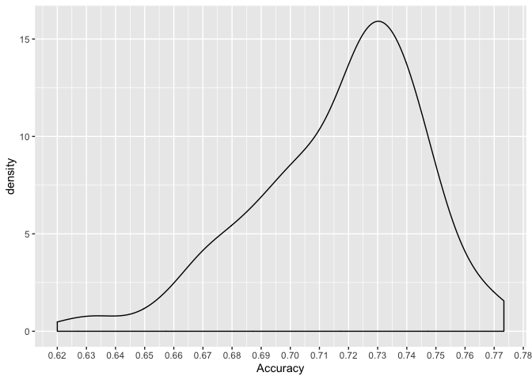

Process data
------------

``` r
data_path <- here::here("scripts/jupyter-note/jupyter-noteboook-data/")
df1 <- data.table::fread(paste0(data_path, "df_result_prediction_model1_gridsearch.csv"), drop = "V1")
df2 <- data.table::fread(paste0(data_path, "df_result_prediction_model2_gridsearch.csv"), drop = "V1")
df3 <- data.table::fread(paste0(data_path, "df_result_prediction_model3_gridsearch.csv"), drop = "V1")
df4 <- data.table::fread(paste0(data_path, "df_result_prediction_model4_gridsearch.csv"), drop = "V1")
df5 <- data.table::fread(paste0(data_path, "df_result_prediction_model5_gridsearch.csv"), drop = "V1")
df6 <- data.table::fread(paste0(data_path, "df_result_prediction_model6_gridsearch.csv"), drop = "V1")
```

``` r
results_gridsearch <- rbind(
  cbind(df1, model = "model1"),
  cbind(df2, model = "model2"),
  cbind(df3, model = "model3"),
  cbind(df4, model = "model4"),
  cbind(df5, model = "model5"),
  cbind(df6, model = "model6")
)

rm(df1, df2, df3, df4, df5, df6)
results_gridsearch %>%
  filter(model == "model6") %>%
  knitr::kable()
```

| Parameters                                                                                                                                                                                                                                                                       |   Accuracy|  Sensitivity|  Specifity| model  |
|:---------------------------------------------------------------------------------------------------------------------------------------------------------------------------------------------------------------------------------------------------------------------------------|----------:|------------:|----------:|:-------|
| {‘activation\_function’: ‘relu’, ‘batch\_norm’: ‘no’, ‘batch\_size’: 4, ‘dropout\_rates’: 0.25, ‘epochs’: 30, ‘input\_dropout\_rates’: 0.25, ‘input\_num\_hidden\_units’: 4, ‘l2\_rate’: 0.01, ‘num\_hidden\_layers’: \[1, 2\], ‘optim\_methods’: ‘Adadelta’, ‘shuffle’: True}   |  0.6666667|    0.7105263|  0.6216216| model6 |
| {‘activation\_function’: ‘relu’, ‘batch\_norm’: ‘no’, ‘batch\_size’: 4, ‘dropout\_rates’: 0.25, ‘epochs’: 30, ‘input\_dropout\_rates’: 0.25, ‘input\_num\_hidden\_units’: 4, ‘l2\_rate’: 0.01, ‘num\_hidden\_layers’: \[1, 2\], ‘optim\_methods’: ‘SGD’, ‘shuffle’: True}        |  0.6733333|    0.4736842|  0.8783784| model6 |
| {‘activation\_function’: ‘relu’, ‘batch\_norm’: ‘no’, ‘batch\_size’: 4, ‘dropout\_rates’: 0.25, ‘epochs’: 30, ‘input\_dropout\_rates’: 0.25, ‘input\_num\_hidden\_units’: 4, ‘l2\_rate’: 0.01, ‘num\_hidden\_layers’: \[3, 3\], ‘optim\_methods’: ‘Adadelta’, ‘shuffle’: True}   |  0.6733333|    0.6710526|  0.6756757| model6 |
| {‘activation\_function’: ‘relu’, ‘batch\_norm’: ‘no’, ‘batch\_size’: 4, ‘dropout\_rates’: 0.25, ‘epochs’: 30, ‘input\_dropout\_rates’: 0.25, ‘input\_num\_hidden\_units’: 4, ‘l2\_rate’: 0.01, ‘num\_hidden\_layers’: \[3, 3\], ‘optim\_methods’: ‘SGD’, ‘shuffle’: True}        |  0.6800000|    0.5657895|  0.7972973| model6 |
| {‘activation\_function’: ‘relu’, ‘batch\_norm’: ‘no’, ‘batch\_size’: 4, ‘dropout\_rates’: 0.25, ‘epochs’: 30, ‘input\_dropout\_rates’: 0.25, ‘input\_num\_hidden\_units’: 8, ‘l2\_rate’: 0.01, ‘num\_hidden\_layers’: \[1, 2\], ‘optim\_methods’: ‘Adadelta’, ‘shuffle’: True}   |  0.7333333|    0.7894737|  0.6756757| model6 |
| {‘activation\_function’: ‘relu’, ‘batch\_norm’: ‘no’, ‘batch\_size’: 4, ‘dropout\_rates’: 0.25, ‘epochs’: 30, ‘input\_dropout\_rates’: 0.25, ‘input\_num\_hidden\_units’: 8, ‘l2\_rate’: 0.01, ‘num\_hidden\_layers’: \[1, 2\], ‘optim\_methods’: ‘SGD’, ‘shuffle’: True}        |  0.6866667|    0.4736842|  0.9054054| model6 |
| {‘activation\_function’: ‘relu’, ‘batch\_norm’: ‘no’, ‘batch\_size’: 4, ‘dropout\_rates’: 0.25, ‘epochs’: 30, ‘input\_dropout\_rates’: 0.25, ‘input\_num\_hidden\_units’: 8, ‘l2\_rate’: 0.01, ‘num\_hidden\_layers’: \[3, 3\], ‘optim\_methods’: ‘Adadelta’, ‘shuffle’: True}   |  0.7200000|    0.6315789|  0.8108108| model6 |
| {‘activation\_function’: ‘relu’, ‘batch\_norm’: ‘no’, ‘batch\_size’: 4, ‘dropout\_rates’: 0.25, ‘epochs’: 30, ‘input\_dropout\_rates’: 0.25, ‘input\_num\_hidden\_units’: 8, ‘l2\_rate’: 0.01, ‘num\_hidden\_layers’: \[3, 3\], ‘optim\_methods’: ‘SGD’, ‘shuffle’: True}        |  0.7200000|    0.6842105|  0.7567568| model6 |
| {‘activation\_function’: ‘relu’, ‘batch\_norm’: ‘no’, ‘batch\_size’: 4, ‘dropout\_rates’: 0.25, ‘epochs’: 30, ‘input\_dropout\_rates’: 0.25, ‘input\_num\_hidden\_units’: 16, ‘l2\_rate’: 0.01, ‘num\_hidden\_layers’: \[1, 2\], ‘optim\_methods’: ‘Adadelta’, ‘shuffle’: True}  |  0.7400000|    0.8026316|  0.6756757| model6 |
| {‘activation\_function’: ‘relu’, ‘batch\_norm’: ‘no’, ‘batch\_size’: 4, ‘dropout\_rates’: 0.25, ‘epochs’: 30, ‘input\_dropout\_rates’: 0.25, ‘input\_num\_hidden\_units’: 16, ‘l2\_rate’: 0.01, ‘num\_hidden\_layers’: \[1, 2\], ‘optim\_methods’: ‘SGD’, ‘shuffle’: True}       |  0.7533333|    0.7894737|  0.7162162| model6 |
| {‘activation\_function’: ‘relu’, ‘batch\_norm’: ‘no’, ‘batch\_size’: 4, ‘dropout\_rates’: 0.25, ‘epochs’: 30, ‘input\_dropout\_rates’: 0.25, ‘input\_num\_hidden\_units’: 16, ‘l2\_rate’: 0.01, ‘num\_hidden\_layers’: \[3, 3\], ‘optim\_methods’: ‘Adadelta’, ‘shuffle’: True}  |  0.6666667|    0.7631579|  0.5675676| model6 |
| {‘activation\_function’: ‘relu’, ‘batch\_norm’: ‘no’, ‘batch\_size’: 4, ‘dropout\_rates’: 0.25, ‘epochs’: 30, ‘input\_dropout\_rates’: 0.25, ‘input\_num\_hidden\_units’: 16, ‘l2\_rate’: 0.01, ‘num\_hidden\_layers’: \[3, 3\], ‘optim\_methods’: ‘SGD’, ‘shuffle’: True}       |  0.7466667|    0.8289474|  0.6621622| model6 |
| {‘activation\_function’: ‘relu’, ‘batch\_norm’: ‘no’, ‘batch\_size’: 8, ‘dropout\_rates’: 0.25, ‘epochs’: 30, ‘input\_dropout\_rates’: 0.25, ‘input\_num\_hidden\_units’: 4, ‘l2\_rate’: 0.01, ‘num\_hidden\_layers’: \[1, 2\], ‘optim\_methods’: ‘Adadelta’, ‘shuffle’: True}   |  0.7266667|    0.7763158|  0.6756757| model6 |
| {‘activation\_function’: ‘relu’, ‘batch\_norm’: ‘no’, ‘batch\_size’: 8, ‘dropout\_rates’: 0.25, ‘epochs’: 30, ‘input\_dropout\_rates’: 0.25, ‘input\_num\_hidden\_units’: 4, ‘l2\_rate’: 0.01, ‘num\_hidden\_layers’: \[1, 2\], ‘optim\_methods’: ‘SGD’, ‘shuffle’: True}        |  0.6533333|    0.3815789|  0.9324324| model6 |
| {‘activation\_function’: ‘relu’, ‘batch\_norm’: ‘no’, ‘batch\_size’: 8, ‘dropout\_rates’: 0.25, ‘epochs’: 30, ‘input\_dropout\_rates’: 0.25, ‘input\_num\_hidden\_units’: 4, ‘l2\_rate’: 0.01, ‘num\_hidden\_layers’: \[3, 3\], ‘optim\_methods’: ‘Adadelta’, ‘shuffle’: True}   |  0.7466667|    0.8552632|  0.6351351| model6 |
| {‘activation\_function’: ‘relu’, ‘batch\_norm’: ‘no’, ‘batch\_size’: 8, ‘dropout\_rates’: 0.25, ‘epochs’: 30, ‘input\_dropout\_rates’: 0.25, ‘input\_num\_hidden\_units’: 4, ‘l2\_rate’: 0.01, ‘num\_hidden\_layers’: \[3, 3\], ‘optim\_methods’: ‘SGD’, ‘shuffle’: True}        |  0.7066667|    0.8421053|  0.5675676| model6 |
| {‘activation\_function’: ‘relu’, ‘batch\_norm’: ‘no’, ‘batch\_size’: 8, ‘dropout\_rates’: 0.25, ‘epochs’: 30, ‘input\_dropout\_rates’: 0.25, ‘input\_num\_hidden\_units’: 8, ‘l2\_rate’: 0.01, ‘num\_hidden\_layers’: \[1, 2\], ‘optim\_methods’: ‘Adadelta’, ‘shuffle’: True}   |  0.7533333|    0.8157895|  0.6891892| model6 |
| {‘activation\_function’: ‘relu’, ‘batch\_norm’: ‘no’, ‘batch\_size’: 8, ‘dropout\_rates’: 0.25, ‘epochs’: 30, ‘input\_dropout\_rates’: 0.25, ‘input\_num\_hidden\_units’: 8, ‘l2\_rate’: 0.01, ‘num\_hidden\_layers’: \[1, 2\], ‘optim\_methods’: ‘SGD’, ‘shuffle’: True}        |  0.7200000|    0.7631579|  0.6756757| model6 |
| {‘activation\_function’: ‘relu’, ‘batch\_norm’: ‘no’, ‘batch\_size’: 8, ‘dropout\_rates’: 0.25, ‘epochs’: 30, ‘input\_dropout\_rates’: 0.25, ‘input\_num\_hidden\_units’: 8, ‘l2\_rate’: 0.01, ‘num\_hidden\_layers’: \[3, 3\], ‘optim\_methods’: ‘Adadelta’, ‘shuffle’: True}   |  0.7200000|    0.6842105|  0.7567568| model6 |
| {‘activation\_function’: ‘relu’, ‘batch\_norm’: ‘no’, ‘batch\_size’: 8, ‘dropout\_rates’: 0.25, ‘epochs’: 30, ‘input\_dropout\_rates’: 0.25, ‘input\_num\_hidden\_units’: 8, ‘l2\_rate’: 0.01, ‘num\_hidden\_layers’: \[3, 3\], ‘optim\_methods’: ‘SGD’, ‘shuffle’: True}        |  0.6800000|    0.5131579|  0.8513514| model6 |
| {‘activation\_function’: ‘relu’, ‘batch\_norm’: ‘no’, ‘batch\_size’: 8, ‘dropout\_rates’: 0.25, ‘epochs’: 30, ‘input\_dropout\_rates’: 0.25, ‘input\_num\_hidden\_units’: 16, ‘l2\_rate’: 0.01, ‘num\_hidden\_layers’: \[1, 2\], ‘optim\_methods’: ‘Adadelta’, ‘shuffle’: True}  |  0.7266667|    0.6842105|  0.7702703| model6 |
| {‘activation\_function’: ‘relu’, ‘batch\_norm’: ‘no’, ‘batch\_size’: 8, ‘dropout\_rates’: 0.25, ‘epochs’: 30, ‘input\_dropout\_rates’: 0.25, ‘input\_num\_hidden\_units’: 16, ‘l2\_rate’: 0.01, ‘num\_hidden\_layers’: \[1, 2\], ‘optim\_methods’: ‘SGD’, ‘shuffle’: True}       |  0.7266667|    0.7236842|  0.7297297| model6 |
| {‘activation\_function’: ‘relu’, ‘batch\_norm’: ‘no’, ‘batch\_size’: 8, ‘dropout\_rates’: 0.25, ‘epochs’: 30, ‘input\_dropout\_rates’: 0.25, ‘input\_num\_hidden\_units’: 16, ‘l2\_rate’: 0.01, ‘num\_hidden\_layers’: \[3, 3\], ‘optim\_methods’: ‘Adadelta’, ‘shuffle’: True}  |  0.7400000|    0.7236842|  0.7567568| model6 |
| {‘activation\_function’: ‘relu’, ‘batch\_norm’: ‘no’, ‘batch\_size’: 8, ‘dropout\_rates’: 0.25, ‘epochs’: 30, ‘input\_dropout\_rates’: 0.25, ‘input\_num\_hidden\_units’: 16, ‘l2\_rate’: 0.01, ‘num\_hidden\_layers’: \[3, 3\], ‘optim\_methods’: ‘SGD’, ‘shuffle’: True}       |  0.7733333|    0.8552632|  0.6891892| model6 |
| {‘activation\_function’: ‘relu’, ‘batch\_norm’: ‘no’, ‘batch\_size’: 16, ‘dropout\_rates’: 0.25, ‘epochs’: 30, ‘input\_dropout\_rates’: 0.25, ‘input\_num\_hidden\_units’: 4, ‘l2\_rate’: 0.01, ‘num\_hidden\_layers’: \[1, 2\], ‘optim\_methods’: ‘Adadelta’, ‘shuffle’: True}  |  0.7333333|    0.7500000|  0.7162162| model6 |
| {‘activation\_function’: ‘relu’, ‘batch\_norm’: ‘no’, ‘batch\_size’: 16, ‘dropout\_rates’: 0.25, ‘epochs’: 30, ‘input\_dropout\_rates’: 0.25, ‘input\_num\_hidden\_units’: 4, ‘l2\_rate’: 0.01, ‘num\_hidden\_layers’: \[1, 2\], ‘optim\_methods’: ‘SGD’, ‘shuffle’: True}       |  0.7066667|    0.8815789|  0.5270270| model6 |
| {‘activation\_function’: ‘relu’, ‘batch\_norm’: ‘no’, ‘batch\_size’: 16, ‘dropout\_rates’: 0.25, ‘epochs’: 30, ‘input\_dropout\_rates’: 0.25, ‘input\_num\_hidden\_units’: 4, ‘l2\_rate’: 0.01, ‘num\_hidden\_layers’: \[3, 3\], ‘optim\_methods’: ‘Adadelta’, ‘shuffle’: True}  |  0.7133333|    0.6578947|  0.7702703| model6 |
| {‘activation\_function’: ‘relu’, ‘batch\_norm’: ‘no’, ‘batch\_size’: 16, ‘dropout\_rates’: 0.25, ‘epochs’: 30, ‘input\_dropout\_rates’: 0.25, ‘input\_num\_hidden\_units’: 4, ‘l2\_rate’: 0.01, ‘num\_hidden\_layers’: \[3, 3\], ‘optim\_methods’: ‘SGD’, ‘shuffle’: True}       |  0.6333333|    0.9210526|  0.3378378| model6 |
| {‘activation\_function’: ‘relu’, ‘batch\_norm’: ‘no’, ‘batch\_size’: 16, ‘dropout\_rates’: 0.25, ‘epochs’: 30, ‘input\_dropout\_rates’: 0.25, ‘input\_num\_hidden\_units’: 8, ‘l2\_rate’: 0.01, ‘num\_hidden\_layers’: \[1, 2\], ‘optim\_methods’: ‘Adadelta’, ‘shuffle’: True}  |  0.7333333|    0.7894737|  0.6756757| model6 |
| {‘activation\_function’: ‘relu’, ‘batch\_norm’: ‘no’, ‘batch\_size’: 16, ‘dropout\_rates’: 0.25, ‘epochs’: 30, ‘input\_dropout\_rates’: 0.25, ‘input\_num\_hidden\_units’: 8, ‘l2\_rate’: 0.01, ‘num\_hidden\_layers’: \[1, 2\], ‘optim\_methods’: ‘SGD’, ‘shuffle’: True}       |  0.7333333|    0.6973684|  0.7702703| model6 |
| {‘activation\_function’: ‘relu’, ‘batch\_norm’: ‘no’, ‘batch\_size’: 16, ‘dropout\_rates’: 0.25, ‘epochs’: 30, ‘input\_dropout\_rates’: 0.25, ‘input\_num\_hidden\_units’: 8, ‘l2\_rate’: 0.01, ‘num\_hidden\_layers’: \[3, 3\], ‘optim\_methods’: ‘Adadelta’, ‘shuffle’: True}  |  0.7266667|    0.7105263|  0.7432432| model6 |
| {‘activation\_function’: ‘relu’, ‘batch\_norm’: ‘no’, ‘batch\_size’: 16, ‘dropout\_rates’: 0.25, ‘epochs’: 30, ‘input\_dropout\_rates’: 0.25, ‘input\_num\_hidden\_units’: 8, ‘l2\_rate’: 0.01, ‘num\_hidden\_layers’: \[3, 3\], ‘optim\_methods’: ‘SGD’, ‘shuffle’: True}       |  0.7333333|    0.6973684|  0.7702703| model6 |
| {‘activation\_function’: ‘relu’, ‘batch\_norm’: ‘no’, ‘batch\_size’: 16, ‘dropout\_rates’: 0.25, ‘epochs’: 30, ‘input\_dropout\_rates’: 0.25, ‘input\_num\_hidden\_units’: 16, ‘l2\_rate’: 0.01, ‘num\_hidden\_layers’: \[1, 2\], ‘optim\_methods’: ‘Adadelta’, ‘shuffle’: True} |  0.6933333|    0.7500000|  0.6351351| model6 |
| {‘activation\_function’: ‘relu’, ‘batch\_norm’: ‘no’, ‘batch\_size’: 16, ‘dropout\_rates’: 0.25, ‘epochs’: 30, ‘input\_dropout\_rates’: 0.25, ‘input\_num\_hidden\_units’: 16, ‘l2\_rate’: 0.01, ‘num\_hidden\_layers’: \[1, 2\], ‘optim\_methods’: ‘SGD’, ‘shuffle’: True}      |  0.7200000|    0.7631579|  0.6756757| model6 |
| {‘activation\_function’: ‘relu’, ‘batch\_norm’: ‘no’, ‘batch\_size’: 16, ‘dropout\_rates’: 0.25, ‘epochs’: 30, ‘input\_dropout\_rates’: 0.25, ‘input\_num\_hidden\_units’: 16, ‘l2\_rate’: 0.01, ‘num\_hidden\_layers’: \[3, 3\], ‘optim\_methods’: ‘Adadelta’, ‘shuffle’: True} |  0.7466667|    0.7631579|  0.7297297| model6 |
| {‘activation\_function’: ‘relu’, ‘batch\_norm’: ‘no’, ‘batch\_size’: 16, ‘dropout\_rates’: 0.25, ‘epochs’: 30, ‘input\_dropout\_rates’: 0.25, ‘input\_num\_hidden\_units’: 16, ‘l2\_rate’: 0.01, ‘num\_hidden\_layers’: \[3, 3\], ‘optim\_methods’: ‘SGD’, ‘shuffle’: True}      |  0.7466667|    0.7894737|  0.7027027| model6 |

``` r
results_gridsearch <- results_gridsearch %>%
  dplyr::select(Parameters, Accuracy) %>%
  mutate(
    Parameters = stringr::str_remove_all(Parameters, "\\{"),
    Parameters = stringr::str_remove_all(Parameters, "\\}")
  ) %>%
  tidyr::separate(
    col = Parameters,
    c(
      "activation_function", "batch_norm", "batch_size",
      "dropout_rates", "epochs", "input_dropout_rates",
      "input_num_hidden_units", "l2_rate", "num_hidden_layers",
      "optim_methods", "shuffle"
    ),
    sep = ", '"
  ) %>%
  dplyr::mutate(
    shuffle = stringr::str_split(shuffle, ":", simplify = TRUE)[, 2],
    optim_methods = stringr::str_split(optim_methods, ":", simplify = TRUE)[, 2],
    num_hidden_layers = stringr::str_split(num_hidden_layers, ":", simplify = TRUE)[, 2],
    l2_rate = stringr::str_split(l2_rate, ":", simplify = TRUE)[, 2],
    input_num_hidden_units = stringr::str_split(input_num_hidden_units, ":", simplify = TRUE)[, 2],
    input_dropout_rates = stringr::str_split(input_dropout_rates, ":", simplify = TRUE)[, 2],
    epochs = stringr::str_split(epochs, ":", simplify = TRUE)[, 2],
    dropout_rates = stringr::str_split(dropout_rates, ":", simplify = TRUE)[, 2],
    batch_size = stringr::str_split(batch_size, ":", simplify = TRUE)[, 2],
    batch_norm = stringr::str_split(batch_norm, ":", simplify = TRUE)[, 2],
    activation_function = stringr::str_split(activation_function, ":", simplify = TRUE)[, 2]
  ) %>%
  dplyr::mutate(
    num_hidden_layers = str_remove_all(num_hidden_layers, "\\["),
    num_hidden_layers = str_remove_all(num_hidden_layers, "\\]")
  ) %>%
  separate(num_hidden_layers, c("Layer1", "Layer2", "Layer3"), sep = "([,])") %>%
  mutate_all(function(x) ifelse(is.na(x), 0, x)) %>%
  dplyr::mutate(
    hidden_layers = (Layer1 != 0) + (Layer2 != 0) + (Layer3 != 0)
  )
```

    ## Warning: Expected 3 pieces. Missing pieces filled with `NA` in 198 rows [1, 2,
    ## 3, 4, 5, 6, 7, 8, 9, 10, 11, 12, 13, 14, 15, 16, 17, 18, 19, 20, ...].

``` r
ggplot(results_gridsearch) +
  aes(x = Accuracy) +
  geom_density() +
  scale_x_continuous(breaks = seq(0.6, 0.8, 0.01))
```


