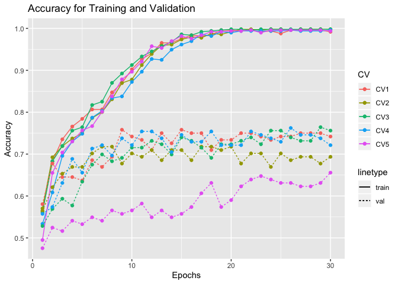
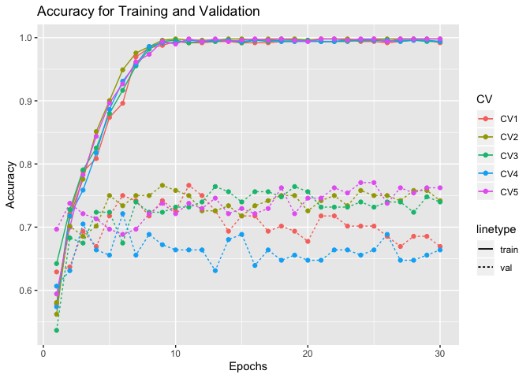
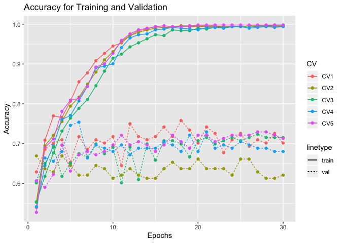
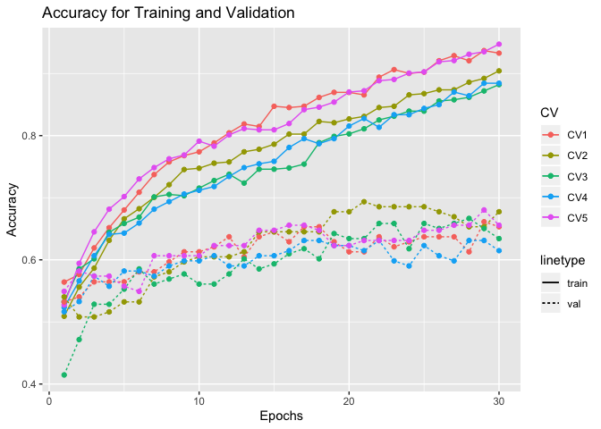
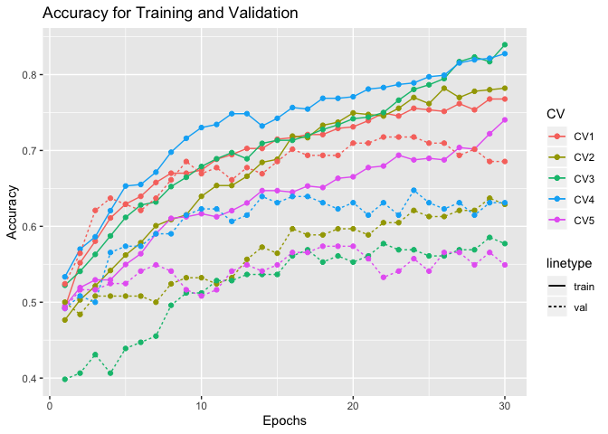
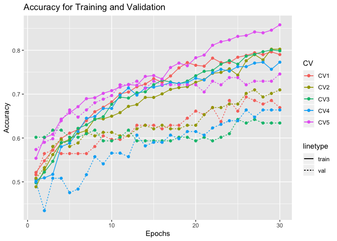

Report on Manually training the model CNN-LSTM
==============================================

Load library
------------

Define function to get the plot of the accuracy
-----------------------------------------------

``` r
get_gg_acc <- function(acc_train_data, acc_val_data){
  
  # Melt data
  acc_train_data_melt <- melt(acc_train_data, id=c("V1"))
  acc_val_data_melt <- melt(acc_val_data, id=c("V1"))
  
  # Rename the data column
  acc_train_data_melt <- acc_train_data_melt %>%
  `colnames<-`(c("epochs", "CV", "acc_train"))

  acc_val_data_melt <- acc_val_data_melt %>%
  `colnames<-`(c("epochs", "CV", "acc_val"))
  
  # Left join into 1 dataframe
  train_val_acc_data <- acc_train_data_melt %>% 
  left_join(., acc_val_data_melt, by = c("epochs", "CV")) %>% 
  mutate(epochs = epochs + 1)
  
  # Plot the accuracy data
  gg_accuracy <- ggplot(train_val_acc_data) +
      aes(x = epochs, group = CV, color = as.factor(CV)) + 
      geom_line(aes(y = acc_train, linetype = "train")) +
      geom_line(aes(y = acc_val, linetype = "val")) +
      geom_point(aes(y = acc_train), size = 1.5) +
      geom_point(aes(y = acc_val), size = 1.5) +
      labs(x = "Epochs", y = "Accuracy", color = "CV") +
      labs(title = "Accuracy for Training and Validation")
  
  return(gg_accuracy)
}
```

Model 1
-------

``` r
acc_train_best1 <- data.table::fread("../../../../results/results/cnn-lstm/df_results_train_best1.csv")
acc_val_best1 <- data.table::fread("../../../../results/results/cnn-lstm/df_results_val_best1.csv")
acc_test_best1 <- data.table::fread("../../../../results/results/cnn-lstm/df_results_test_best1.csv")
```

``` r
get_gg_acc(acc_train_best1, acc_val_best1)
```



``` r
acc_test_best1 <- acc_test_best1 %>% 
  `colnames<-`(c("CV", "Test Acc", "Sensitivity", "Specitivity")) %>% 
  mutate(CV = CV + 1)

acc_test_best1
```

    ##   CV  Test Acc Sensitivity Specitivity
    ## 1  1 0.6600000   0.6973684   0.6216216
    ## 2  2 0.6666667   0.7105263   0.6216216
    ## 3  3 0.6800000   0.7500000   0.6081081
    ## 4  4 0.6800000   0.7368421   0.6216216
    ## 5  5 0.5800000   0.6578947   0.5000000

``` r
mean(acc_test_best1[["Test Acc"]])
```

    ## [1] 0.6533333

Model 2
-------

``` r
acc_train_best2 <- data.table::fread("../../../../results/results/cnn-lstm/df_results_train_best2.csv")
acc_val_best2 <- data.table::fread("../../../../results/results/cnn-lstm/df_results_val_best2.csv")
acc_test_best2 <- data.table::fread("../../../../results/results/cnn-lstm/df_results_test_best2.csv")
```

``` r
get_gg_acc(acc_train_best2, acc_val_best2)
```



``` r
acc_test_best2 <- acc_test_best2 %>% 
  `colnames<-`(c("CV", "Test Acc", "Sensitivity", "Specitivity")) %>% 
  mutate(CV = CV + 1)

acc_test_best2
```

    ##   CV  Test Acc Sensitivity Specitivity
    ## 1  1 0.7466667   0.7894737   0.7027027
    ## 2  2 0.6933333   0.7500000   0.6351351
    ## 3  3 0.6666667   0.7236842   0.6081081
    ## 4  4 0.6600000   0.6578947   0.6621622
    ## 5  5 0.6800000   0.6842105   0.6756757

``` r
mean(acc_test_best2[["Test Acc"]])
```

    ## [1] 0.6893333

Model 3
-------

``` r
acc_train_best3 <- data.table::fread("../../../../results/results/cnn-lstm/df_results_train_best3.csv")
acc_val_best3 <- data.table::fread("../../../../results/results/cnn-lstm/df_results_val_best3.csv")
acc_test_best3 <- data.table::fread("../../../../results/results/cnn-lstm/df_results_test_best3.csv")
```

``` r
get_gg_acc(acc_train_best3, acc_val_best3)
```



``` r
acc_test_best3 <- acc_test_best3 %>% 
  `colnames<-`(c("CV", "Test Acc", "Sensitivity", "Specitivity")) %>% 
  mutate(CV = CV + 1)

acc_test_best3 
```

    ##   CV  Test Acc Sensitivity Specitivity
    ## 1  1 0.7066667   0.7368421   0.6756757
    ## 2  2 0.6333333   0.6973684   0.5675676
    ## 3  3 0.6600000   0.6315789   0.6891892
    ## 4  4 0.6333333   0.6447368   0.6216216
    ## 5  5 0.6866667   0.7236842   0.6486486

``` r
mean(acc_test_best3[["Test Acc"]])
```

    ## [1] 0.664

Model 4
-------

``` r
acc_train_best_model8 <- data.table::fread("../../../../results/results/cnn-lstm/df_results_train_best_model8.csv")
acc_val_best_model8 <- data.table::fread("../../../../results/results/cnn-lstm/df_results_val_best_model8.csv")
acc_test_best_model8 <- data.table::fread("../../../../results/results/cnn-lstm/df_results_test_best_model8.csv")
```

``` r
get_gg_acc(acc_train_best_model8, acc_val_best_model8)
```



``` r
acc_test_best_model8 <- acc_test_best_model8 %>% 
  `colnames<-`(c("CV", "Test Acc", "Sensitivity", "Specitivity")) %>% 
  mutate(CV = CV + 1)

acc_test_best_model8
```

    ##   CV  Test Acc Sensitivity Specitivity
    ## 1  1 0.6533333   0.7236842   0.5810811
    ## 2  2 0.6466667   0.7105263   0.5810811
    ## 3  3 0.5933333   0.5657895   0.6216216
    ## 4  4 0.6400000   0.7500000   0.5270270
    ## 5  5 0.7133333   0.7105263   0.7162162

``` r
mean(acc_test_best_model8[["Test Acc"]])
```

    ## [1] 0.6493333

Model 5
-------

``` r
acc_train_best_model13 <- data.table::fread("../../../../results/results/cnn-lstm/df_results_train_best_model13.csv")
acc_val_best_model13 <- data.table::fread("../../../../results/results/cnn-lstm/df_results_val_best_model13.csv")
acc_test_best_model13 <- data.table::fread("../../../../results/results/cnn-lstm/df_results_test_best_model13.csv")
```

``` r
get_gg_acc(acc_train_best_model13, acc_val_best_model13)
```



``` r
acc_test_best_model13 <- acc_test_best_model13 %>% 
  `colnames<-`(c("CV", "Test Acc", "Sensitivity", "Specitivity")) %>% 
  mutate(CV = CV + 1)

acc_test_best_model13
```

    ##   CV  Test Acc Sensitivity Specitivity
    ## 1  1 0.6266667   0.7105263   0.5405405
    ## 2  2 0.6000000   0.5921053   0.6081081
    ## 3  3 0.6466667   0.6447368   0.6486486
    ## 4  4 0.6733333   0.6842105   0.6621622
    ## 5  5 0.6000000   0.6184211   0.5810811

``` r
mean(acc_test_best_model13[["Test Acc"]])
```

    ## [1] 0.6293333

Model 6
-------

``` r
acc_train_best_model20 <- data.table::fread("../../../../results/results/cnn-lstm/df_results_train_best_model20.csv")
acc_val_best_model20 <- data.table::fread("../../../../results/results/cnn-lstm/df_results_val_best_model20.csv")
acc_test_best_model20 <- data.table::fread("../../../../results/results/cnn-lstm/df_results_test_best_model20.csv")
```

``` r
get_gg_acc(acc_train_best_model20, acc_val_best_model20)
```



``` r
acc_test_best_model20 <- acc_test_best_model20 %>% 
  `colnames<-`(c("CV", "Test Acc", "Sensitivity", "Specitivity")) %>% 
  mutate(CV = CV + 1)

acc_test_best_model20
```

    ##   CV  Test Acc Sensitivity Specitivity
    ## 1  1 0.6133333   0.6710526   0.5540541
    ## 2  2 0.6466667   0.7105263   0.5810811
    ## 3  3 0.6000000   0.6447368   0.5540541
    ## 4  4 0.7000000   0.6578947   0.7432432
    ## 5  5 0.6333333   0.7500000   0.5135135

``` r
mean(acc_test_best_model20[["Test Acc"]])
```

    ## [1] 0.6386667
