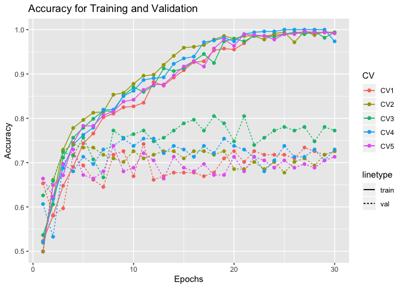
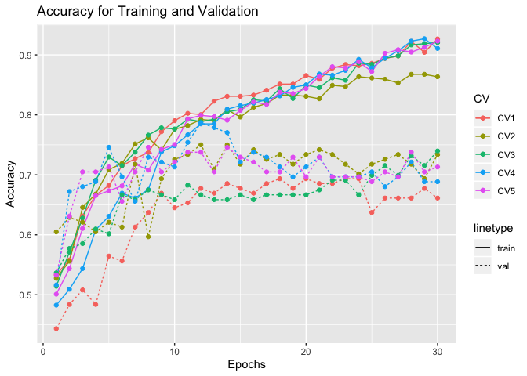
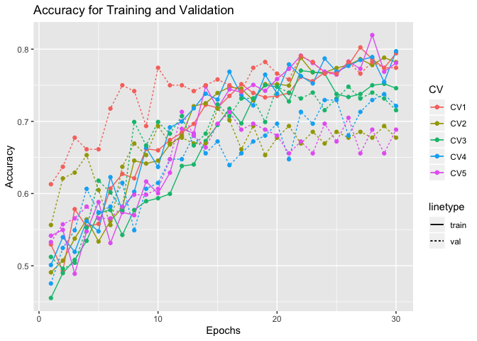

Report on Manually training the model CNN-GRU
=============================================

Load library
------------

Define function to get the plot of the accuracy
-----------------------------------------------

``` r
get_gg_acc <- function(acc_train_data, acc_val_data){
  
  # Melt data
  acc_train_data_melt <- melt(acc_train_data, id=c("V1"))
  acc_val_data_melt <- melt(acc_val_data, id=c("V1"))
  
  # Rename the data column
  acc_train_data_melt <- acc_train_data_melt %>%
  `colnames<-`(c("epochs", "CV", "acc_train"))

  acc_val_data_melt <- acc_val_data_melt %>%
  `colnames<-`(c("epochs", "CV", "acc_val"))
  
  # Left join into 1 dataframe
  train_val_acc_data <- acc_train_data_melt %>% 
  left_join(., acc_val_data_melt, by = c("epochs", "CV")) %>% 
  mutate(epochs = epochs + 1)
  
  # Plot the accuracy data
  gg_accuracy <- ggplot(train_val_acc_data) +
      aes(x = epochs, group = CV, color = as.factor(CV)) + 
      geom_line(aes(y = acc_train, linetype = "train")) +
      geom_line(aes(y = acc_val, linetype = "val")) +
      geom_point(aes(y = acc_train), size = 1.5) +
      geom_point(aes(y = acc_val), size = 1.5) +
      labs(x = "Epochs", y = "Accuracy", color = "CV") +
      labs(title = "Accuracy for Training and Validation")
  
  
  return(gg_accuracy)
}
```

Model 1
-------

``` r
acc_train_best1_gru <- data.table::fread("../../../../results/results/cnn-gru/df_results_train_best1.csv")
acc_val_best1_gru <- data.table::fread("../../../../results/results/cnn-gru/df_results_val_best1.csv")
acc_test_best1_gru <- data.table::fread("../../../../results/results/cnn-gru/df_results_test_best1.csv")
```

``` r
get_gg_acc(acc_train_best1_gru, acc_val_best1_gru)
```



``` r
acc_test_best1_gru <- acc_test_best1_gru %>% 
  `colnames<-`(c("CV", "Test Acc", "Sensitivity", "Specitivity")) %>% 
  mutate(CV = CV + 1)

acc_test_best1_gru
```

    ##   CV  Test Acc Sensitivity Specitivity
    ## 1  1 0.7000000   0.7500000   0.6486486
    ## 2  2 0.6733333   0.6710526   0.6756757
    ## 3  3 0.6600000   0.6578947   0.6621622
    ## 4  4 0.6933333   0.6184211   0.7702703
    ## 5  5 0.7200000   0.7368421   0.7027027

``` r
mean(acc_test_best1_gru[["Test Acc"]])
```

    ## [1] 0.6893333

Model 2
-------

``` r
acc_train_best2_gru <- data.table::fread("../../../../results/results/cnn-gru/df_results_train_best2.csv")
acc_val_best2_gru <- data.table::fread("../../../../results/results/cnn-gru/df_results_val_best2.csv")
acc_test_best2_gru <- data.table::fread("../../../../results/results/cnn-gru/df_results_test_best2.csv")
```

``` r
get_gg_acc(acc_train_best2_gru, acc_val_best2_gru)
```



``` r
acc_test_best2_gru <- acc_test_best2_gru %>% 
  `colnames<-`(c("CV", "Test Acc", "Sensitivity", "Specitivity")) %>% 
  mutate(CV = CV + 1)

acc_test_best2_gru
```

    ##   CV  Test Acc Sensitivity Specitivity
    ## 1  1 0.6200000   0.6447368   0.5945946
    ## 2  2 0.7066667   0.8026316   0.6081081
    ## 3  3 0.6733333   0.6447368   0.7027027
    ## 4  4 0.6866667   0.5394737   0.8378378
    ## 5  5 0.6200000   0.6315789   0.6081081

``` r
mean(acc_test_best2_gru[["Test Acc"]])
```

    ## [1] 0.6613333

Model 3
-------

``` r
acc_train_best_model13_gru <- data.table::fread("../../../../results/results/cnn-gru/df_results_train_best_model13.csv")
acc_val_best_model13_gru <- data.table::fread("../../../../results/results/cnn-gru/df_results_val_best_model13.csv")
acc_test_best_model13_gru <- data.table::fread("../../../../results/results/cnn-gru/df_results_test_best_model13.csv")
```

``` r
get_gg_acc(acc_train_best_model13_gru, acc_val_best_model13_gru)
```



``` r
acc_test_best_model13_gru <- acc_test_best_model13_gru %>% 
  `colnames<-`(c("CV", "Test Acc", "Sensitivity", "Specitivity")) %>% 
  mutate(CV = CV + 1)

acc_test_best_model13_gru
```

    ##   CV  Test Acc Sensitivity Specitivity
    ## 1  1 0.6600000   0.6447368   0.6756757
    ## 2  2 0.6600000   0.6973684   0.6216216
    ## 3  3 0.6866667   0.6973684   0.6756757
    ## 4  4 0.6800000   0.7236842   0.6351351
    ## 5  5 0.6600000   0.6578947   0.6621622

``` r
mean(acc_test_best_model13_gru[["Test Acc"]])
```

    ## [1] 0.6693333
