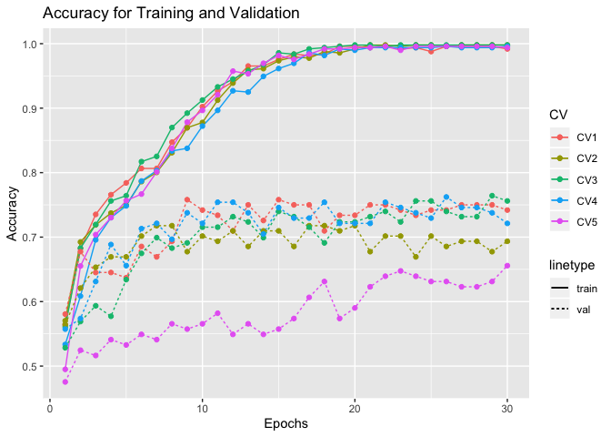
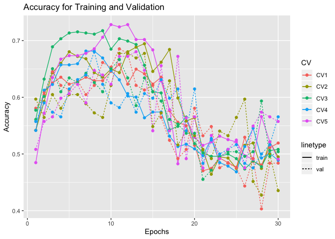
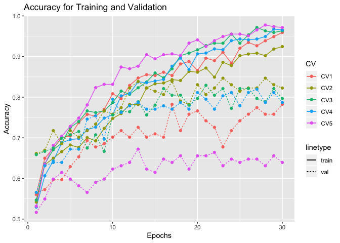
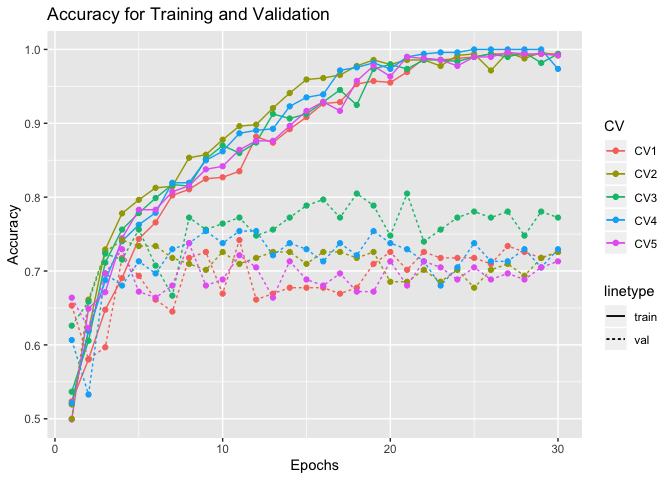
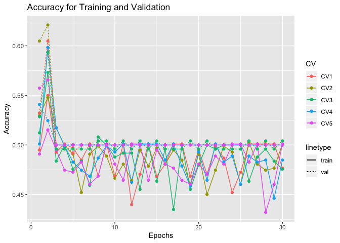
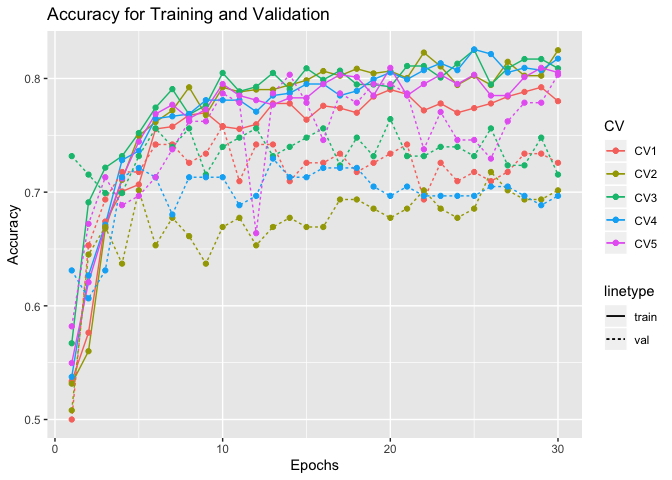
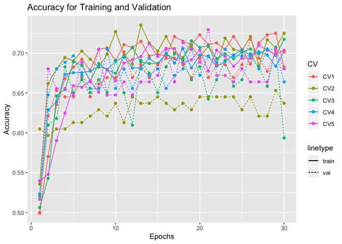

Report on Manually training the model CNN-LSTM after adding regularization
==========================================================================

Load library
------------

Define function to get the plot of the accuracy
-----------------------------------------------

``` r
get_gg_acc <- function(acc_train_data, acc_val_data){
  
  # Melt data
  acc_train_data_melt <- melt(acc_train_data, id=c("V1"))
  acc_val_data_melt <- melt(acc_val_data, id=c("V1"))
  
  # Rename the data column
  acc_train_data_melt <- acc_train_data_melt %>%
  `colnames<-`(c("epochs", "CV", "acc_train"))

  acc_val_data_melt <- acc_val_data_melt %>%
  `colnames<-`(c("epochs", "CV", "acc_val"))
  
  # Left join into 1 dataframe
  train_val_acc_data <- acc_train_data_melt %>% 
  left_join(., acc_val_data_melt, by = c("epochs", "CV")) %>% 
  mutate(epochs = epochs + 1)
  
  # Plot the accuracy data
  gg_accuracy <- ggplot(train_val_acc_data) +
      aes(x = epochs, group = CV, color = as.factor(CV)) + 
      geom_line(aes(y = acc_train, linetype = "train")) +
      geom_line(aes(y = acc_val, linetype = "val")) +
      geom_point(aes(y = acc_train), size = 1.5) +
      geom_point(aes(y = acc_val), size = 1.5) +
      labs(x = "Epochs", y = "Accuracy", color = "CV") +
      labs(title = "Accuracy for Training and Validation")
  
  return(gg_accuracy)
}
```

CNN-LSTM
--------

### Before any regularization

``` r
acc_train_best1 <- data.table::fread("../../../../results/results/cnn-lstm/df_results_train_best1.csv")
acc_val_best1 <- data.table::fread("../../../../results/results/cnn-lstm/df_results_val_best1.csv")
acc_test_best1 <- data.table::fread("../../../../results/results/cnn-lstm/df_results_test_best1.csv")
```

``` r
acc_train_best1
```

    ##     V1       CV1       CV2       CV3       CV4       CV5
    ##  1:  0 0.5641548 0.5702648 0.5609756 0.5334686 0.4949290
    ##  2:  1 0.6822811 0.6924644 0.6829268 0.6085193 0.6551724
    ##  3:  2 0.7352342 0.7189409 0.7195122 0.6957404 0.7038540
    ##  4:  3 0.7657841 0.7372709 0.7560976 0.7302231 0.7302231
    ##  5:  4 0.7841141 0.7494908 0.7642276 0.7484787 0.7565923
    ##  6:  5 0.8065173 0.7861507 0.8170732 0.7870183 0.7667343
    ##  7:  6 0.8065173 0.8004073 0.8252033 0.8032454 0.8012170
    ##  8:  7 0.8472505 0.8309572 0.8699187 0.8336714 0.8377282
    ##  9:  8 0.8696538 0.8696538 0.8922764 0.8377282 0.8782961
    ## 10:  9 0.9022403 0.8778004 0.9126016 0.8722110 0.8965517
    ## 11: 10 0.9266802 0.9124236 0.9329268 0.8965517 0.9208925
    ## 12: 11 0.9409369 0.9389002 0.9451220 0.9269777 0.9574037
    ## 13: 12 0.9653768 0.9592668 0.9573171 0.9249493 0.9533469
    ## 14: 13 0.9653768 0.9613035 0.9674797 0.9492901 0.9695740
    ## 15: 14 0.9755601 0.9735234 0.9857724 0.9614604 0.9817444
    ## 16: 15 0.9837067 0.9796334 0.9837398 0.9695740 0.9756592
    ## 17: 16 0.9816701 0.9775967 0.9918699 0.9858012 0.9837728
    ## 18: 17 0.9837067 0.9877800 0.9939024 0.9817444 0.9918864
    ## 19: 18 0.9959267 0.9857434 0.9959350 0.9918864 0.9918864
    ## 20: 19 0.9959267 0.9918534 0.9979675 0.9898580 0.9939148
    ## 21: 20 0.9938900 0.9979633 0.9979675 0.9939148 0.9939148
    ## 22: 21 0.9959267 0.9979633 0.9959350 0.9939148 0.9959432
    ## 23: 22 0.9918534 0.9959267 0.9979675 0.9939148 0.9898580
    ## 24: 23 0.9938900 0.9979633 0.9979675 0.9939148 0.9959432
    ## 25: 24 0.9877800 0.9979633 0.9979675 0.9939148 0.9959432
    ## 26: 25 0.9959267 0.9959267 0.9979675 0.9959432 0.9959432
    ## 27: 26 0.9959267 0.9979633 0.9979675 0.9939148 0.9959432
    ## 28: 27 0.9959267 0.9979633 0.9979675 0.9939148 0.9959432
    ## 29: 28 0.9959267 0.9979633 0.9979675 0.9939148 0.9959432
    ## 30: 29 0.9918534 0.9979633 0.9979675 0.9959432 0.9939148
    ##     V1       CV1       CV2       CV3       CV4       CV5

``` r
get_gg_acc(acc_train_best1, acc_val_best1)
```



### After regularization

``` r
acc_train_best1_with_reg <- data.table::fread("../../../../results/results/cnn-lstm/df_results_train_best1_with_reg.csv")
acc_val_best1_with_reg <- data.table::fread("../../../../results/results/cnn-lstm/df_results_val_best1_with_reg.csv")
acc_test_best1_with_reg <- data.table::fread("../../../../results/results/cnn-lstm/df_results_test_best1_with_reg.csv")

acc_val_best1_with_reg %>% 
  knitr::kable()
```

|   V1|        CV1|        CV2|        CV3|        CV4|        CV5|
|----:|----------:|----------:|----------:|----------:|----------:|
|    0|  0.5806452|  0.5967742|  0.5772358|  0.5573770|  0.5081967|
|    1|  0.6048387|  0.5645161|  0.6016260|  0.5901639|  0.5573770|
|    2|  0.6451613|  0.6048387|  0.6504065|  0.5737705|  0.5655738|
|    3|  0.6209677|  0.5806452|  0.6097561|  0.5655738|  0.5983607|
|    4|  0.6129032|  0.6048387|  0.6341463|  0.6147541|  0.6065574|
|    5|  0.6290323|  0.6048387|  0.6260163|  0.6311475|  0.6229508|
|    6|  0.6048387|  0.5887097|  0.6422764|  0.6393443|  0.5901639|
|    7|  0.6209677|  0.5725806|  0.6260163|  0.6803279|  0.6475410|
|    8|  0.6612903|  0.5645161|  0.6097561|  0.6229508|  0.6393443|
|    9|  0.6532258|  0.6209677|  0.6504065|  0.5901639|  0.6229508|
|   10|  0.6854839|  0.6774194|  0.6666667|  0.5819672|  0.6721311|
|   11|  0.6774194|  0.6774194|  0.6341463|  0.6065574|  0.6721311|
|   12|  0.6209677|  0.6693548|  0.5853659|  0.5737705|  0.6803279|
|   13|  0.6129032|  0.6774194|  0.6341463|  0.6065574|  0.6475410|
|   14|  0.6209677|  0.5483871|  0.6097561|  0.5983607|  0.5409836|
|   15|  0.5645161|  0.5725806|  0.5934959|  0.6311475|  0.6557377|
|   16|  0.5241935|  0.6290323|  0.5609756|  0.5983607|  0.5409836|
|   17|  0.4919355|  0.5161290|  0.5528455|  0.6147541|  0.6721312|
|   18|  0.5080645|  0.5403226|  0.5365854|  0.5409836|  0.4918033|
|   19|  0.5806452|  0.5322581|  0.5365854|  0.6147541|  0.5655738|
|   20|  0.5322581|  0.5080645|  0.4552846|  0.4836066|  0.4754098|
|   21|  0.5483871|  0.4919355|  0.4715447|  0.5245902|  0.5327869|
|   22|  0.4758064|  0.5403226|  0.4959350|  0.5000000|  0.4918033|
|   23|  0.4838710|  0.5322581|  0.5040650|  0.5081967|  0.5081967|
|   24|  0.4758064|  0.5645161|  0.5040650|  0.5163934|  0.5245902|
|   25|  0.4435484|  0.5967742|  0.4959350|  0.4836066|  0.4754098|
|   26|  0.4919355|  0.4516129|  0.5040650|  0.4754098|  0.5491803|
|   27|  0.4032258|  0.4274194|  0.5934959|  0.5000000|  0.5737705|
|   28|  0.4838710|  0.5000000|  0.4959350|  0.5163934|  0.5655738|
|   29|  0.4838710|  0.4354839|  0.5040650|  0.5655738|  0.5573771|

``` r
get_gg_acc(acc_train_best1_with_reg, acc_val_best1_with_reg)
```



``` r
acc_train_without_actv_reg <- data.table::fread("../../../../results/results/cnn-lstm/df_results_train_best1_without_actv_reg.csv")
acc_val_without_actv_reg <- data.table::fread("../../../../results/results/cnn-lstm/df_results_val_best1_without_actv_reg.csv")
acc_test_without_actv_reg <- data.table::fread("../../../../results/results/cnn-lstm/df_results_test_best1_without_actv_reg.csv")
```

``` r
acc_test_best1_with_reg
```

    ##    V1       acc sensitivity specifity
    ## 1:  0 0.4600000  0.17105263 0.7567568
    ## 2:  1 0.4133333  0.44736842 0.3783784
    ## 3:  2 0.5066667  0.02631579 1.0000000
    ## 4:  3 0.5800000  0.34210526 0.8243243
    ## 5:  4 0.5666667  0.43421053 0.7027027

``` r
get_gg_acc(acc_train_without_actv_reg, acc_val_without_actv_reg)
```



``` r
acc_test_without_actv_reg %>% 
  knitr::kable()
```

|   V1|        acc|  sensitivity|  specifity|
|----:|----------:|------------:|----------:|
|    0|  0.7200000|    0.8157895|  0.6216216|
|    1|  0.6733333|    0.6973684|  0.6486486|
|    2|  0.6800000|    0.6710526|  0.6891892|
|    3|  0.7333333|    0.8684211|  0.5945946|
|    4|  0.6466667|    0.7105263|  0.5810811|

CNN - GRU
---------

### Before Regularization

``` r
acc_train_best1_gru <- data.table::fread("../../../../results/results/cnn-gru/df_results_train_best1.csv")
acc_val_best1_gru <- data.table::fread("../../../../results/results/cnn-gru/df_results_val_best1.csv")
acc_test_best1_gru <- data.table::fread("../../../../results/results/cnn-gru/df_results_test_best1.csv")
```

``` r
get_gg_acc(acc_train_best1_gru, acc_val_best1_gru)
```



``` r
acc_test_best1_gru
```

    ##    V1       acc sensitivity specifity
    ## 1:  0 0.7000000   0.7500000 0.6486486
    ## 2:  1 0.6733333   0.6710526 0.6756757
    ## 3:  2 0.6600000   0.6578947 0.6621622
    ## 4:  3 0.6933333   0.6184211 0.7702703
    ## 5:  4 0.7200000   0.7368421 0.7027027

### After Regularization

``` r
acc_train_best1_gru_with_reg <- data.table::fread("../../../../results/results/cnn-gru/df_results_train_best1_with_reg.csv")
acc_val_best1_gru_with_reg <- data.table::fread("../../../../results/results/cnn-gru/df_results_val_best1_with_reg.csv")
acc_test_best1_gru_with_reg <- data.table::fread("../../../../results/results/cnn-gru/df_results_test_best1_with_reg.csv")
```

``` r
get_gg_acc(acc_train_best1_gru_with_reg, acc_val_best1_gru_with_reg)
```



LSTM Embedding
--------------

``` r
acc_train_best1_lstm_embed <- data.table::fread("../../../../results/results/lstm-embedding/df_results_train_best1_with_reg.csv")
acc_val_best1_lstm_embed <- data.table::fread("../../../../results/results/lstm-embedding/df_results_val_best1_with_reg.csv")
acc_test_best1_lstm_embed <- data.table::fread("../../../../results/results/lstm-embedding/df_results_test_best1_with_reg.csv")
```

``` r
get_gg_acc(acc_train_best1_lstm_embed, acc_val_best1_lstm_embed)
```



``` r
acc_test_best1_lstm_embed
```

    ##    V1       acc sensitivity specifity
    ## 1:  0 0.6666667   0.6710526 0.6621622
    ## 2:  1 0.6866667   0.7105263 0.6621622
    ## 3:  2 0.7200000   0.7763158 0.6621622
    ## 4:  3 0.6666667   0.6578947 0.6756757
    ## 5:  4 0.6866667   0.7105263 0.6621622

GRU Embedding
-------------

``` r
acc_train_best1_gru_embed <- data.table::fread("../../../../results/results/gru-embedding/df_results_train_best1_with_reg.csv")
acc_val_best1_gru_embed <- data.table::fread("../../../../results/results/gru-embedding/df_results_val_best1_with_reg.csv")
acc_test_best1_gru_embed <- data.table::fread("../../../../results/results/gru-embedding/df_results_test_best1_with_reg.csv")
```

``` r
get_gg_acc(acc_train_best1_gru_embed, acc_val_best1_gru_embed)
```



``` r
acc_test_best1_gru_embed
```

    ##    V1       acc sensitivity specifity
    ## 1:  0 0.6600000   0.7368421 0.5810811
    ## 2:  1 0.6466667   0.7500000 0.5405405
    ## 3:  2 0.6533333   0.8157895 0.4864865
    ## 4:  3 0.6666667   0.7368421 0.5945946
    ## 5:  4 0.6400000   0.6315789 0.6486486
