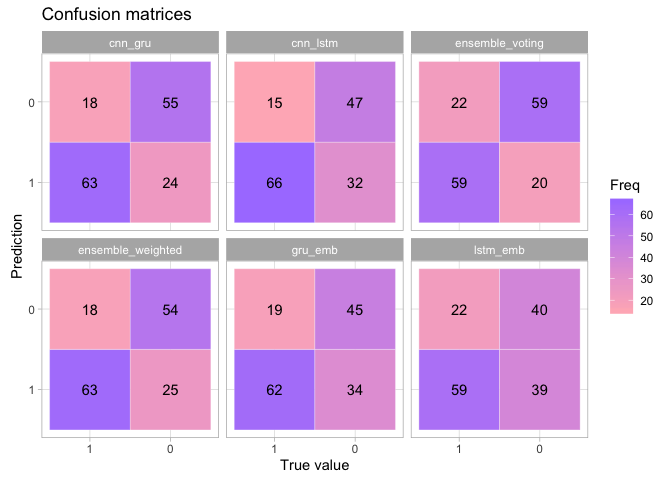
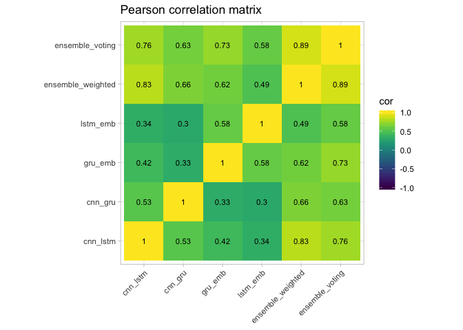

Model Ensemble
==============

Introduction
------------

There are four models that are constructed for effector and non-effector
protein prediction, which are CNN-LSTM, CNN-GRU, LSTM with embedding,
and GRU with embedding. In order to have better perfomance of each model
(better prediction results), model ensembling can be a good option.

Question
--------

Can we get a better perfomance by ensembling all models that we already
constructed?

### Aim

The purpose of this is to show whether doing the model ensemble can
increase the accuracy of prediction.

Methods
-------

There are two ensemble method will be used in this experiments:

-   Weighted average ensemble: the `validation accuracy` will be taken
    as the weight of each model.  
-   Voting classifier

Additionally, in order to achieve the aim, several steps need to be
done:

1.  After getting the least overfitting models (of all four models),
    then each models was run in GPUs with ModelCheckPoint() from keras,
    therefore model all together with all of the weights would be saved
    (in .hdf5 file).

2.  Those pretrained models saved above then will be used to create the
    model ensemble.

Results
-------

### Loading the libraries

``` r
# Load all of the libraries
library(limma)
library(tidyverse)
library(dplyr)
library(caret)
```

### Loading the all of the data

``` r
# Load all of the results file of ensembling
ensemble_results <- data.table::fread("../../../../scripts/jupyter-note/model_ensemble/test_results/df_results_test_two_ensembles.csv", drop = "V1")

# Load the label of data
test_label <- data.table::fread("../../../../data/getting-data-new/binary-class-data/data-sets/testing_label.csv")

# Rename the column name of the test label and change the data into factor
test_label <- test_label %>%
  `colnames<-`(c('sequence'))

test_label <- test_label %>% 
  mutate_each(list(as.factor))
```

### Define functions

#### Function to get the accuracy for each model

``` r
# Define a function to get all accuracy of the models
get_all_acc <- function(data, true_label){
  
  # Change all of the label into factor
  data <- data %>%
    select(-c(sequence)) %>% 
    mutate_each(list(as.factor))
  
  # Get the number of column
  num_col <- ncol(data)
  
  # Initialize the list of accuracy
  list_acc <- numeric(length = num_col)
  
  # Take all the sequence of the label
  true_label <- true_label %>% 
    mutate_each(list(as.factor)) %>% 
    pull(sequence)
  
  # For loop in getting acc for each models
  for (i in 1:num_col){
    pred_each_model <- data %>% 
      pull(colnames(data)[i])
  
    tab <- table(true_label, pred_each_model)
    
    acc_each_model <- confusionMatrix(tab)$overall["Accuracy"]
    
    list_acc[i] <- acc_each_model
  }
  
  # Turn the list into dataframe

  df_acc  <- data.frame(matrix(unlist(list_acc), ncol=length(list_acc), byrow = F)) %>%
    `colnames<-`(c(colnames(data)))

  return(df_acc)
}
```

#### Function to get the Venn diagram

``` r
plot_venn_diagram_limma <- function(data) {
  # Store original column names
  model_names <- colnames(data)

  venn_counts <- data %>%
    # Calculate counts
    dplyr::mutate_all(., as.logical) %>%
    limma::vennCounts() %>%
    `class<-`("matrix") %>%
    as.data.frame() %>%
    # Rename columns
    `colnames<-`(c("A", "B", "C", "D", "E", "G", "Counts")) %>%
    # Group 0000 and 1111 cases
    mutate(Counts = ifelse(A == B & A == C & A == D & A == E & A == G,
                           sum(Counts[A == B & A == C & A == D & A == E & A == G]),
                           Counts)) %>%
    slice(-1) %>%
    # Recover original names
    `colnames<-`(c(model_names, "Counts")) %>%
    # Transform back to VennCounts class
    as.matrix() %>%
    `class<-`("VennCounts")
  
  venn_counts %>%
    limma::vennDiagram(
      # circle.col = c("#f35e5a", "#929705", "#18b56a", "#149ffe", "#de4af0", "#de4af0")
    )
}
```

#### Function to get th confusion Matrix

``` r
plot_confusion_matrices <- function(data, true_label, model_list) {
  conf_matrix_df <- data %>%
    select(-sequence) %>%
    # Add true labels
    dplyr::mutate(Reference = true_label$sequence) %>%
    # Transform into factors
    dplyr::mutate_all(function(x) factor(x, levels = c(1, 0))) %>%
    # Select chosen model only
    pivot_longer(-Reference, names_to = "model", values_to = "Prediction") %>%
    # Filter models
    filter(model %in% model_list) %>% 
    # Calculate frequencies
    table() %>%
    as.data.frame()

  # Make plot
  gg_matrix <- conf_matrix_df %>%
    ggplot() +
    aes(x = Reference, y = Prediction) +
    geom_tile(aes(fill = Freq), colour = "white") +
    geom_text(aes(label = Freq), vjust = 0.5) +
    scale_fill_gradient(low = "lightpink", high = "mediumpurple1") +
    labs(x = "True value", y = "Prediction", title = "Confusion matrices") +
    coord_fixed() +
    facet_wrap(~model) +
    theme_bw() +
    theme(legend.position = "none")

  return(gg_matrix)
}
```

#### Function to get the correlation matrix

``` r
plot_cormat <- function(rfm_df, cor_trans = NULL, variable = NULL) {
  rfm_df <- rfm_df %>%
    dplyr::select_if(is.numeric) %>%
    stats::cor(use = "pairwise.complete.obs") %>%
    # Transform to data frame
    tibble::as_tibble(rownames = "var_x") %>%
    # Prepare for plotting
    tidyr::pivot_longer(
      cols = -var_x,
      names_to = "var_y",
      values_to = "cor"
    ) %>% 
    dplyr::mutate(
      var_x = factor(var_x, levels = unique(.[["var_x"]])),
      var_y = factor(var_y, levels = unique(.[["var_x"]]))
    )
  
  if (!is.null(variable)) {
    rfm_df <- rfm_df %>%
      dplyr::filter(var_x == variable)
  }
  
  # Transform correlation
  if (is.null(cor_trans)) {
    fill_limits <- c(-1, 1)
  } else {
    if (cor_trans == "abs") {
      rfm_df <- rfm_df %>%
        dplyr::mutate(cor = abs(cor))
      fill_limits <- c(0, 1)
    } else if (cor_trans == "squared") {
      rfm_df <- rfm_df %>%
        dplyr::mutate(cor = cor^2)
      fill_limits <- c(0, 1)
    }
  }
  
  # Plot
  gg <- rfm_df %>%
    ggplot() +
    aes(x = var_x, y = var_y, fill = cor) +
    geom_tile() +
    viridis::scale_fill_viridis(limits = fill_limits) +
    coord_fixed() +
    labs(
      title = "Pearson correlation matrix",
      x = NULL,
      y = NULL
    ) +
    geom_text(aes(label = round(cor, 2)), vjust = 0.5, size=3) + 
    theme(axis.text.x = element_text(angle = 45, hjust = 1),
          panel.border = element_blank())
  
  return(gg)
}
```

### Getting the accuracy for the testing results

``` r
# Ensemble results for all epochs
get_all_acc(ensemble_results, test_label) %>% 
  knitr::kable()
```

|  cnn\_lstm|  cnn\_gru|  gru\_emb|  lstm\_emb|  ensemble\_weighted|  ensemble\_voting|
|----------:|---------:|---------:|----------:|-------------------:|-----------------:|
|    0.70625|    0.7375|   0.66875|    0.61875|             0.73125|            0.7375|

### Confusion Matrix

``` r
plot_confusion_matrices(
  data = ensemble_results,
  true_label = test_label,
  model_list = c("cnn_lstm", "cnn_gru", "gru_emb", "lstm_emb", "ensemble_weighted", "ensemble_voting")
) +
  theme_light() +
  ggsave(filename = "confusion_matrices.pdf", width = 8, height = 5, dpi = 192, device = cairo_pdf)
```



### Pearson Correlation Matrix

``` r
plot_cormat(ensemble_results %>% dplyr::select(-c(sequence)), cor_trans = NULL, variable = NULL) +
  theme_light() +
  theme(axis.text.x = element_text(angle = 45, hjust = 1)) +
  ggsave(filename = "correlation_matrices.pdf", width = 6, height = 5, dpi = 192, device = cairo_pdf)
```



``` r
# plot_cormat(ensemble_results %>% dplyr::select(-c(sequence)), cor_trans = "abs", variable = NULL)
```
