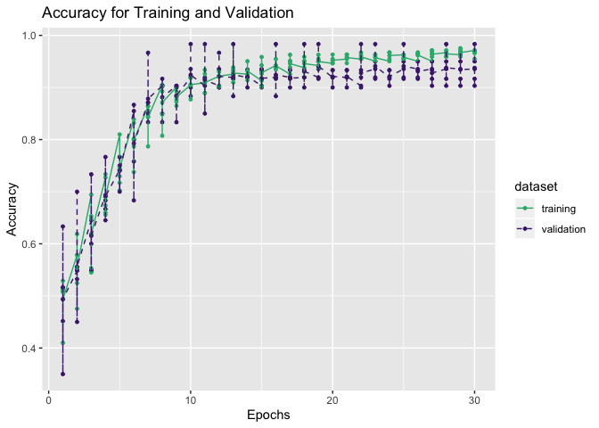
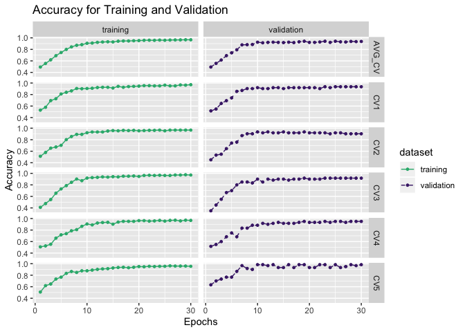
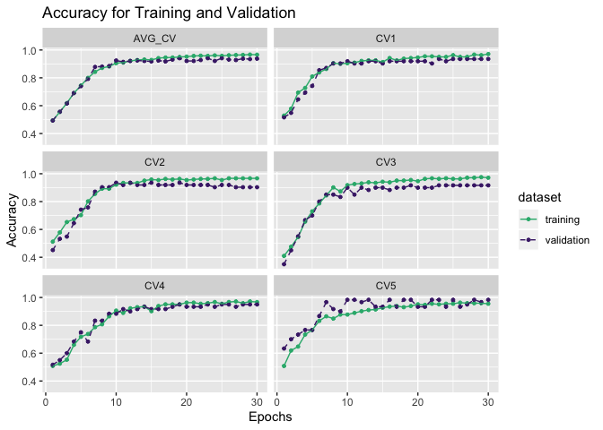
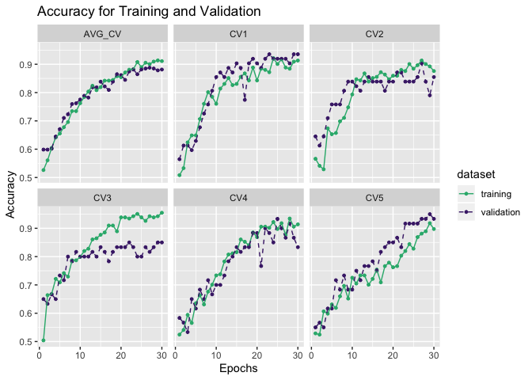
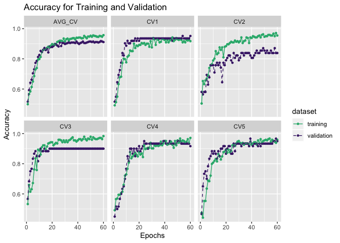
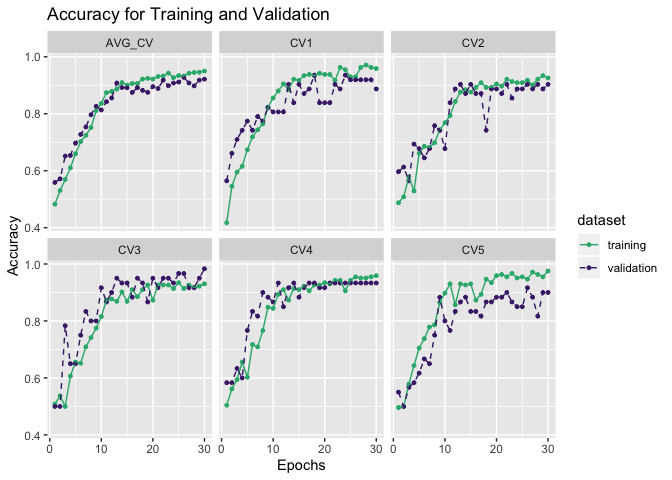
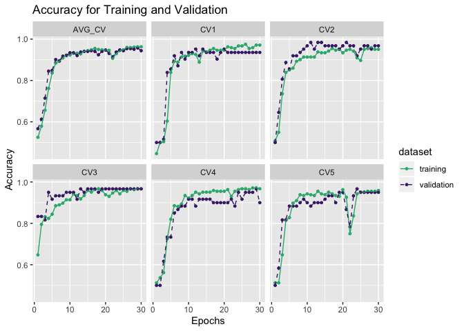

Manual tuning of deep learning models on bacteria dataset
=========================================================

Load library
------------

CNN-GRU
-------

### Hyperparameter Scan

``` r
bacteria_cnn_gru_secreted <- data.table::fread("../../../../../data/secreted_data/training-results/bacteria/df_pred_results_cnn_gru_bacteria_secreted.csv") 

bacteria_cnn_gru_secreted %>% 
  dplyr::arrange(desc(Accuracy)) %>% 
  head(5) %>% 
  knitr::kable()
```

|   V1| Parameters                                                                                                                                                                                                                                                                     |   Accuracy|  Sensitivity|  Specifity|
|----:|:-------------------------------------------------------------------------------------------------------------------------------------------------------------------------------------------------------------------------------------------------------------------------------|----------:|------------:|----------:|
|    6| {‘reg\_rate’: 0.001, ‘optimizers’: ‘Adam’, ‘opt\_go\_backwards’: ‘TRUE’, ‘opt\_dropout\_recurrent’: 0, ‘opt\_dropout’: 0, ‘maxpool\_size’: 2, ‘kernel\_size’: 1, ‘gru\_hidden\_units’: 16, ‘filter\_conv’: 16, ‘epochs’: 30, ‘batch\_size’: 16, ‘activation\_conv’: None}      |  1.0000000|    1.0000000|  1.0000000|
|    7| {‘reg\_rate’: 0.001, ‘optimizers’: ‘Adam’, ‘opt\_go\_backwards’: ‘TRUE’, ‘opt\_dropout\_recurrent’: 0.25, ‘opt\_dropout’: 0, ‘maxpool\_size’: 3, ‘kernel\_size’: 1, ‘gru\_hidden\_units’: 16, ‘filter\_conv’: 32, ‘epochs’: 30, ‘batch\_size’: 8, ‘activation\_conv’: ‘relu’}  |  1.0000000|    1.0000000|  1.0000000|
|   12| {‘reg\_rate’: 0.01, ‘optimizers’: ‘Adam’, ‘opt\_go\_backwards’: ‘TRUE’, ‘opt\_dropout\_recurrent’: 0.25, ‘opt\_dropout’: 0, ‘maxpool\_size’: 3, ‘kernel\_size’: 2, ‘gru\_hidden\_units’: 8, ‘filter\_conv’: 32, ‘epochs’: 30, ‘batch\_size’: 16, ‘activation\_conv’: None}     |  1.0000000|    1.0000000|  1.0000000|
|   19| {‘reg\_rate’: 0.001, ‘optimizers’: ‘Adam’, ‘opt\_go\_backwards’: ‘TRUE’, ‘opt\_dropout\_recurrent’: 0, ‘opt\_dropout’: 0.25, ‘maxpool\_size’: 3, ‘kernel\_size’: 1, ‘gru\_hidden\_units’: 8, ‘filter\_conv’: 8, ‘epochs’: 30, ‘batch\_size’: 16, ‘activation\_conv’: None}     |  0.9868421|    1.0000000|  0.9736842|
|    1| {‘reg\_rate’: 0.001, ‘optimizers’: ‘Adam’, ‘opt\_go\_backwards’: ‘TRUE’, ‘opt\_dropout\_recurrent’: 0, ‘opt\_dropout’: 0.25, ‘maxpool\_size’: 3, ‘kernel\_size’: 1, ‘gru\_hidden\_units’: 32, ‘filter\_conv’: 32, ‘epochs’: 30, ‘batch\_size’: 16, ‘activation\_conv’: ‘relu’} |  0.9868421|    0.9736842|  1.0000000|

``` r
bacteria_cnn_gru_train <- data.table::fread("../../../../../results/secreted_data_run_manually/bacteria/df_results_train_cnn_gru_best_bacteria.csv")
bacteria_cnn_gru_val <- data.table::fread("../../../../../results/secreted_data_run_manually/bacteria/df_results_val_cnn_gru_best_bacteria.csv")

bacteria_cnn_gru_test <- data.table::fread("../../../../../results/secreted_data_run_manually/bacteria/df_results_test_cnn_gru_best_bacteria.csv")

# Mutate to get average for training and validation
bacteria_cnn_gru_train <- bacteria_cnn_gru_train %>%
  mutate(AVG_CV = rowMeans(.[,2:6]))
bacteria_cnn_gru_val <- bacteria_cnn_gru_val %>%
  mutate(AVG_CV = rowMeans(.[,2:6]))
```

``` r
get_gg_acc(bacteria_cnn_gru_train, bacteria_cnn_gru_val)
```



``` r
get_gg_acc(bacteria_cnn_gru_train, bacteria_cnn_gru_val) +
  facet_grid(CV ~ dataset)
```



``` r
get_gg_acc(bacteria_cnn_gru_train, bacteria_cnn_gru_val) +
  facet_wrap(~CV, nrow = 3)
```



``` r
bacteria_cnn_gru_test %>% 
  knitr::kable()
```

|   V1|        acc|  sensitivity|  specifity|
|----:|----------:|------------:|----------:|
|    0|  0.9605263|    0.9473684|  0.9736842|
|    1|  0.9868421|    1.0000000|  0.9736842|
|    2|  0.9605263|    1.0000000|  0.9210526|
|    3|  0.9605263|    0.9210526|  1.0000000|
|    4|  0.9736842|    0.9473684|  1.0000000|

CNN-LSTM
--------

### Hyperparameter Scan

``` r
bacteria_cnn_lstm_secreted <- data.table::fread("../../../../../data/secreted_data/training-results/bacteria/df_pred_results_cnn_lstm_scan_bacteria_secreted.csv")
bacteria_cnn_lstm_secreted_all <- data.table::fread("../../../../../data/secreted_data/training-results/bacteria/all_scan_results_cnn_lstm_scan_bacteria_secreted.csv")


bacteria_cnn_lstm_secreted %>% 
  dplyr::arrange(desc(Accuracy)) %>% 
  head(5) %>% 
  knitr::kable()
```

|   V1| Parameters                                                                                                                                                                                                                |   Accuracy|  Sensitivity|  Specifity|
|----:|:--------------------------------------------------------------------------------------------------------------------------------------------------------------------------------------------------------------------------|----------:|------------:|----------:|
|   13| {‘strides’: 1, ‘padding’: ‘valid’, ‘optimizers’: ‘Adadelta’, ‘number\_hidden\_units’: 8, ‘filters\_LSTM’: 8, ‘filters’: 4, ‘epochs’: 30, ‘batch\_size’: 16, ‘activation\_convolution’: None, ‘activation\_LSTM’: ‘tanh’}  |  1.0000000|    1.0000000|  1.0000000|
|    0| {‘strides’: 1, ‘padding’: ‘valid’, ‘optimizers’: ‘Adam’, ‘number\_hidden\_units’: 8, ‘filters\_LSTM’: 16, ‘filters’: 4, ‘epochs’: 30, ‘batch\_size’: 8, ‘activation\_convolution’: None, ‘activation\_LSTM’: ‘tanh’}      |  0.9868421|    0.9736842|  1.0000000|
|   11| {‘strides’: 1, ‘padding’: ‘valid’, ‘optimizers’: ‘Adadelta’, ‘number\_hidden\_units’: 4, ‘filters\_LSTM’: 16, ‘filters’: 8, ‘epochs’: 30, ‘batch\_size’: 16, ‘activation\_convolution’: None, ‘activation\_LSTM’: ‘tanh’} |  0.9868421|    0.9736842|  1.0000000|
|    3| {‘strides’: 1, ‘padding’: ‘valid’, ‘optimizers’: ‘Adam’, ‘number\_hidden\_units’: 8, ‘filters\_LSTM’: 16, ‘filters’: 8, ‘epochs’: 30, ‘batch\_size’: 16, ‘activation\_convolution’: None, ‘activation\_LSTM’: ‘tanh’}     |  0.9736842|    0.9736842|  0.9736842|
|    4| {‘strides’: 1, ‘padding’: ‘valid’, ‘optimizers’: ‘Adam’, ‘number\_hidden\_units’: 8, ‘filters\_LSTM’: 16, ‘filters’: 4, ‘epochs’: 30, ‘batch\_size’: 16, ‘activation\_convolution’: None, ‘activation\_LSTM’: ‘tanh’}     |  0.9736842|    0.9736842|  0.9736842|

``` r
# Load manually train CNN-LSTM
bacteria_cnn_lstm_train <- data.table::fread("../../../../../results/secreted_data_run_manually/bacteria/df_results_train_cnn_lstm_best_bacteria.csv")
bacteria_cnn_lstm_val <- data.table::fread("../../../../../results/secreted_data_run_manually/bacteria/df_results_val_cnn_lstm_best_bacteria.csv")

bacteria_cnn_lstm_test <- data.table::fread("../../../../../results/secreted_data_run_manually/bacteria/df_results_test_cnn_lstm_best_bacteria.csv")

# Mutate to get average for training and validation
bacteria_cnn_lstm_train <- bacteria_cnn_lstm_train %>%
  mutate(AVG_CV = rowMeans(.[,2:6]))
bacteria_cnn_lstm_val <- bacteria_cnn_lstm_val %>%
  mutate(AVG_CV = rowMeans(.[,2:6]))
```

``` r
get_gg_acc(bacteria_cnn_lstm_train, bacteria_cnn_lstm_val) +
   facet_wrap(~CV, nrow = 2)
```



More epochs

``` r
# Load manually train CNN-LSTM
bacteria_cnn_lstm_train_60epochs <- data.table::fread("../../../../../results/secreted_data_run_manually/bacteria/df_results_train_cnn_lstm_best_bacteria_60epochs.csv")
bacteria_cnn_lstm_val_60epochs <- data.table::fread("../../../../../results/secreted_data_run_manually/bacteria/df_results_val_cnn_lstm_best_bacteria_60epochs.csv")

bacteria_cnn_lstm_test_60epochs <- data.table::fread("../../../../../results/secreted_data_run_manually/bacteria/df_results_test_cnn_lstm_best_bacteria_60epochs.csv")

# Mutate to get average for training and validation
bacteria_cnn_lstm_train_60epochs <- bacteria_cnn_lstm_train_60epochs %>%
  mutate(AVG_CV = rowMeans(.[,2:6]))
bacteria_cnn_lstm_val_60epochs <- bacteria_cnn_lstm_val_60epochs %>%
  mutate(AVG_CV = rowMeans(.[,2:6]))
```

``` r
get_gg_acc(bacteria_cnn_lstm_train_60epochs, bacteria_cnn_lstm_val_60epochs) +
   facet_wrap(~CV, nrow = 2)
```



``` r
bacteria_cnn_lstm_test_60epochs %>% 
  knitr::kable()
```

|   V1|        acc|  sensitivity|  specifity|
|----:|----------:|------------:|----------:|
|    0|  0.9342105|    0.9736842|  0.8947368|
|    1|  0.9342105|    0.9736842|  0.8947368|
|    2|  0.9736842|    0.9736842|  0.9736842|
|    3|  0.9210526|    1.0000000|  0.8421053|
|    4|  0.9342105|    0.9736842|  0.8947368|

``` r
# Load manually train CNN-LSTM
bacteria_lstm_emb_train <- data.table::fread("../../../../../results/secreted_data_run_manually/bacteria/df_results_train_cnn_lstm_best_bacteria.csv")
bacteria_lstm_emb_val <- data.table::fread("../../../../../results/secreted_data_run_manually/bacteria/df_results_val_cnn_lstm_best_bacteria.csv")

bacteria_lstm_emb_test <- data.table::fread("../../../../../results/secreted_data_run_manually/bacteria/df_results_test_cnn_lstm_best_bacteria.csv")

# Mutate to get average for training and validation
bacteria_cnn_lstm_train <- bacteria_cnn_lstm_train %>%
  mutate(AVG_CV = rowMeans(.[,2:6]))
bacteria_cnn_lstm_val <- bacteria_cnn_lstm_val %>%
  mutate(AVG_CV = rowMeans(.[,2:6]))
```

GRU-Embedding
-------------

``` r
# Load manually train CNN-LSTM
bacteria_gru_emb_train <- data.table::fread("../../../../../results/secreted_data_run_manually/bacteria/df_results_train_gru_emb_bacteria.csv")
bacteria_gru_emb_val <- data.table::fread("../../../../../results/secreted_data_run_manually/bacteria/df_results_val_gru_emb_bacteria.csv")
bacteria_gru_emb_test <- data.table::fread("../../../../../results/secreted_data_run_manually/bacteria/df_results_test_gru_emb_bacteria.csv")

# Mutate to get average for training and validation
bacteria_gru_emb_train <- bacteria_gru_emb_train %>%
  mutate(AVG_CV = rowMeans(.[,2:6]))
bacteria_gru_emb_val <- bacteria_gru_emb_val %>%
  mutate(AVG_CV = rowMeans(.[,2:6]))
```

``` r
get_gg_acc(bacteria_gru_emb_train, bacteria_gru_emb_val) +
   facet_wrap(~CV, nrow = 2)
```



LSTM-Embedding
--------------

``` r
# Load manually train CNN-LSTM
bacteria_lstm_emb_train <- data.table::fread("../../../../../results/secreted_data_run_manually/bacteria/df_results_train_lstm_emb_bacteria.csv")
bacteria_lstm_emb_val <- data.table::fread("../../../../../results/secreted_data_run_manually/bacteria/df_results_val_lstm_emb_bacteria.csv")
bacteria_lstm_emb_test <- data.table::fread("../../../../../results/secreted_data_run_manually/bacteria/df_results_test_lstm_emb_bacteria.csv")

# Mutate to get average for training and validation
bacteria_lstm_emb_train <- bacteria_lstm_emb_train %>%
  mutate(AVG_CV = rowMeans(.[,2:6]))
bacteria_lstm_emb_val <- bacteria_lstm_emb_val %>%
  mutate(AVG_CV = rowMeans(.[,2:6]))
```

``` r
get_gg_acc(bacteria_lstm_emb_train, bacteria_lstm_emb_val) +
   facet_wrap(~CV, nrow = 2)
```


