Manually tuning model for Oomycete
==================================

Background
----------

In this report, manually tuning model for oomycete will be perfomed.

Load library
------------

Hyperparameter Scan Results
---------------------------

``` r
oomycete_cnn_gru_secreted <- data.table::fread("../../../../../data/secreted_data/training-results/oomycete/results/secreted_hyper_scan/df_pred_results_cnn_gru_scan_oomycete_secreted.csv")

oomycete_cnn_gru_secreted %>% 
  arrange(desc(Accuracy)) %>% 
  head(6) %>% 
  knitr::kable()
```

|   V1| Parameters                                                                                                                                                                                                                                                                     |   Accuracy|  Sensitivity|  Specifity|
|----:|:-------------------------------------------------------------------------------------------------------------------------------------------------------------------------------------------------------------------------------------------------------------------------------|----------:|------------:|----------:|
|    2| {‘reg\_rate’: 0.001, ‘optimizers’: ‘Adam’, ‘opt\_go\_backwards’: ‘TRUE’, ‘opt\_dropout\_recurrent’: 0.25, ‘opt\_dropout’: 0.25, ‘maxpool\_size’: 3, ‘kernel\_size’: 2, ‘gru\_hidden\_units’: 32, ‘filter\_conv’: 32, ‘epochs’: 30, ‘batch\_size’: 8, ‘activation\_conv’: None} |  0.7647059|    0.8823529|  0.6470588|
|   28| {‘reg\_rate’: 0.001, ‘optimizers’: ‘Adam’, ‘opt\_go\_backwards’: ‘TRUE’, ‘opt\_dropout\_recurrent’: 0, ‘opt\_dropout’: 0, ‘maxpool\_size’: 2, ‘kernel\_size’: 2, ‘gru\_hidden\_units’: 32, ‘filter\_conv’: 32, ‘epochs’: 30, ‘batch\_size’: 4, ‘activation\_conv’: None}       |  0.7647059|    0.9411765|  0.5882353|
|    4| {‘reg\_rate’: 0.001, ‘optimizers’: ‘Adam’, ‘opt\_go\_backwards’: ‘TRUE’, ‘opt\_dropout\_recurrent’: 0.25, ‘opt\_dropout’: 0.25, ‘maxpool\_size’: 3, ‘kernel\_size’: 2, ‘gru\_hidden\_units’: 16, ‘filter\_conv’: 32, ‘epochs’: 30, ‘batch\_size’: 4, ‘activation\_conv’: None} |  0.7352941|    0.8235294|  0.6470588|
|    6| {‘reg\_rate’: 0.001, ‘optimizers’: ‘Adam’, ‘opt\_go\_backwards’: ‘TRUE’, ‘opt\_dropout\_recurrent’: 0.25, ‘opt\_dropout’: 0.25, ‘maxpool\_size’: 3, ‘kernel\_size’: 2, ‘gru\_hidden\_units’: 32, ‘filter\_conv’: 32, ‘epochs’: 30, ‘batch\_size’: 4, ‘activation\_conv’: None} |  0.7352941|    0.8823529|  0.5882353|
|    8| {‘reg\_rate’: 0.001, ‘optimizers’: ‘Adam’, ‘opt\_go\_backwards’: ‘TRUE’, ‘opt\_dropout\_recurrent’: 0.25, ‘opt\_dropout’: 0, ‘maxpool\_size’: 2, ‘kernel\_size’: 2, ‘gru\_hidden\_units’: 8, ‘filter\_conv’: 16, ‘epochs’: 30, ‘batch\_size’: 8, ‘activation\_conv’: ‘relu’}   |  0.7352941|    0.7647059|  0.7058824|
|   18| {‘reg\_rate’: 0.001, ‘optimizers’: ‘Adam’, ‘opt\_go\_backwards’: ‘TRUE’, ‘opt\_dropout\_recurrent’: 0.25, ‘opt\_dropout’: 0, ‘maxpool\_size’: 2, ‘kernel\_size’: 2, ‘gru\_hidden\_units’: 32, ‘filter\_conv’: 32, ‘epochs’: 30, ‘batch\_size’: 8, ‘activation\_conv’: None}    |  0.7352941|    0.9411765|  0.5294118|

### CNN-GRU

``` r
# Load the results data od oomycete with only 30 epochs
oomycete_cnn_gru_train_30epochs <- data.table::fread("../../../../../results/secreted_data_run_manually/oomycete/df_results_train_cnn_gru_best_oomycete_30epochs.csv")
oomycete_cnn_gru_val_30epochs <- data.table::fread("../../../../../results/secreted_data_run_manually/oomycete/df_results_val_cnn_gru_best_oomycete_30epochs.csv")
oomycete_cnn_gru_test_30epochs <- data.table::fread("../../../../../results/secreted_data_run_manually/oomycete/df_results_test_cnn_gru_best_oomycete_30epochs.csv")
```

``` r
get_gg_acc(oomycete_cnn_gru_train_30epochs, oomycete_cnn_gru_val_30epochs) +
   facet_wrap(~CV, nrow = 2)
```

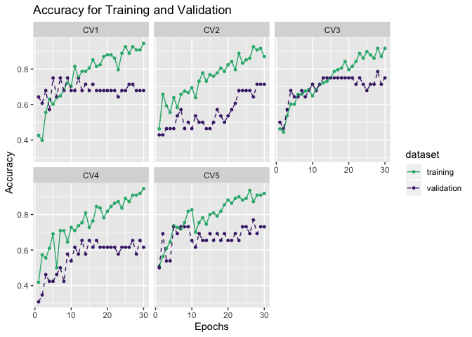

``` r
# Load the results data od oomycete with 50 epochs
oomycete_cnn_gru_train_50epochs <- data.table::fread("../../../../../results/secreted_data_run_manually/oomycete/df_results_train_cnn_gru_best_oomycete_50epochs.csv")
oomycete_cnn_gru_val_50epochs <- data.table::fread("../../../../../results/secreted_data_run_manually/oomycete/df_results_val_cnn_gru_best_oomycete_50epochs.csv")
oomycete_cnn_gru_test_50epochs <- data.table::fread("../../../../../results/secreted_data_run_manually/oomycete/df_results_test_cnn_gru_best_oomycete_50epochs.csv")
```

``` r
get_gg_acc(oomycete_cnn_gru_train_50epochs, oomycete_cnn_gru_val_50epochs) +
   facet_wrap(~CV, nrow = 2)
```

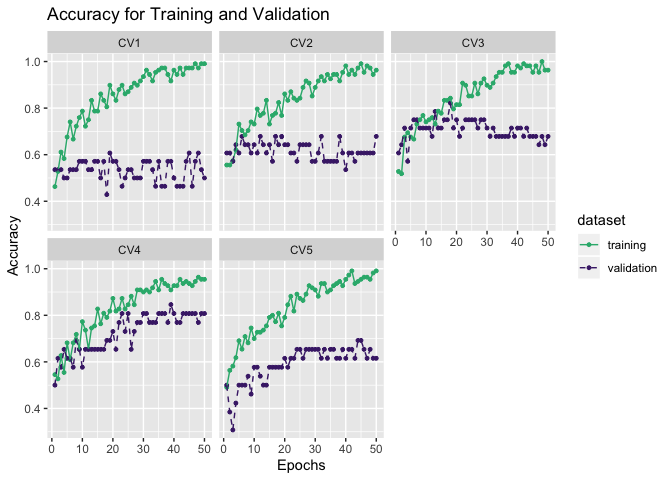

Making comparison on the test data

``` r
oomycete_compare <- rbind(oomycete_cnn_gru_test_30epochs %>% 
  dplyr::select(V1, acc) %>% 
    dplyr::mutate(epochs = 30), 
  oomycete_cnn_gru_test_50epochs %>% 
    dplyr::select(V1, acc) %>% 
    dplyr::mutate(epochs = 50))
```

``` r
plot_comparison(oomycete_compare, V1, acc, epochs, show_label = TRUE, label_digits = 3) 
```

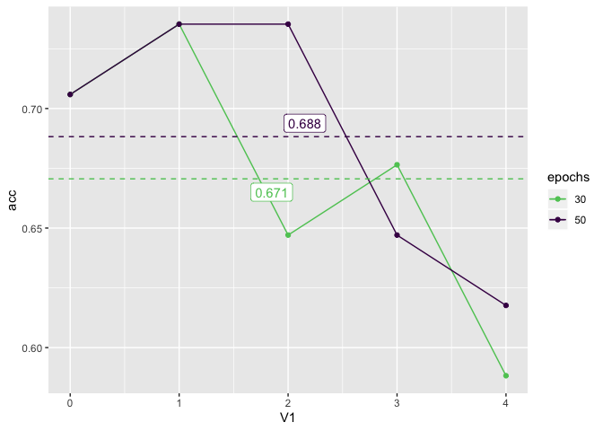

#### Take the second best model

``` r
# Load the results data od oomycete with 50 epochs
oomycete_cnn_gru_train_secondbest <- data.table::fread("../../../../../results/secreted_data_run_manually/oomycete/df_results_train_cnn_gru_best_second_oomycete.csv")
oomycete_cnn_gru_val_secondbest <- data.table::fread("../../../../../results/secreted_data_run_manually/oomycete/df_results_val_cnn_gru_best_second_oomycete.csv")
oomycete_cnn_gru_test_secondbest <- data.table::fread("../../../../../results/secreted_data_run_manually/oomycete/df_results_test_cnn_gru_best_second_oomycete.csv")
```

``` r
get_gg_acc(oomycete_cnn_gru_train_secondbest, oomycete_cnn_gru_val_secondbest) +
   facet_wrap(~CV, nrow = 2)
```


Now, using the dropout 0.5, get the result:

``` r
# Load the results data od oomycete with 50 epochs
oomycete_cnn_gru_train_secondbest_drop05 <- data.table::fread("../../../../../results/secreted_data_run_manually/oomycete/df_results_train_cnn_gru_best_second_oomycete_drop05.csv")
oomycete_cnn_gru_val_secondbest_drop05 <- data.table::fread("../../../../../results/secreted_data_run_manually/oomycete/df_results_val_cnn_gru_best_second_oomycete_drop05.csv")
oomycete_cnn_gru_test_secondbest_drop05 <- data.table::fread("../../../../../results/secreted_data_run_manually/oomycete/df_results_test_cnn_gru_best_second_oomycete_drop05.csv")
```

``` r
get_gg_acc(oomycete_cnn_gru_train_secondbest_drop05, oomycete_cnn_gru_val_secondbest_drop05) +
   facet_wrap(~CV, nrow = 2)
```

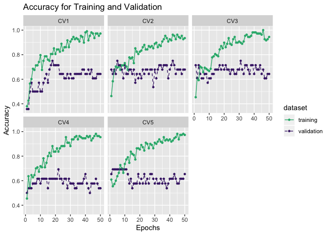

Making comparison on the test data

``` r
oomycete_compare_secondbest <- rbind(oomycete_cnn_gru_test_secondbest %>% 
  dplyr::select(V1, acc) %>% 
    dplyr::mutate(dropout = 0), 
  oomycete_cnn_gru_test_secondbest_drop05 %>% 
    dplyr::select(V1, acc) %>% 
    dplyr::mutate(dropout = 0.5))
```

``` r
plot_comparison(oomycete_compare_secondbest, V1, acc, dropout, show_label = TRUE, label_digits = 3) 
```

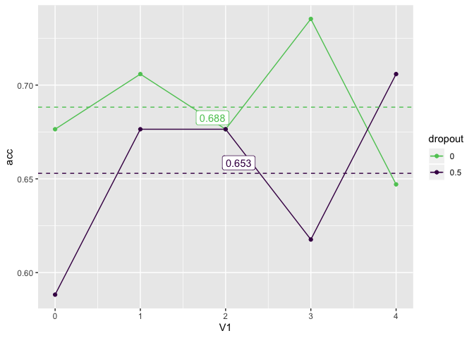

#### Take the third best model

``` r
oomycete_cnn_gru_third_model_train <- data.table::fread("../../../../../results/secreted_data_run_manually/oomycete/df_results_train_cnn_gru_best_third_oomycete_batch8.csv")
oomycete_cnn_gru_third_model_val <- data.table::fread("../../../../../results/secreted_data_run_manually/oomycete/df_results_val_cnn_gru_best_third_oomycete_batch8.csv")
oomycete_cnn_gru_third_model_test <- data.table::fread("../../../../../results/secreted_data_run_manually/oomycete/df_results_test_cnn_gru_best_third_oomycete_batch8.csv")


get_gg_acc(oomycete_cnn_gru_third_model_train, oomycete_cnn_gru_third_model_val) +
   facet_wrap(~CV, nrow = 2)
```

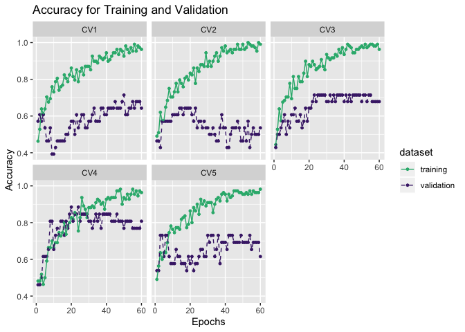

#### Take the fifth best model

``` r
oomycete_cnn_gru_fifth_model_train <- data.table::fread("../../../../../results/secreted_data_run_manually/oomycete/df_results_train_cnn_gru_best_fifth.csv")
oomycete_cnn_gru_fifth_model_val <- data.table::fread("../../../../../results/secreted_data_run_manually/oomycete/df_results_val_cnn_gru_best_fifth.csv")
oomycete_cnn_gru_fifth_model_test <- data.table::fread("../../../../../results/secreted_data_run_manually/oomycete/df_results_test_cnn_gru_best_fifth.csv")


get_gg_acc(oomycete_cnn_gru_fifth_model_train, oomycete_cnn_gru_fifth_model_val) +
   facet_wrap(~CV, nrow = 2)
```

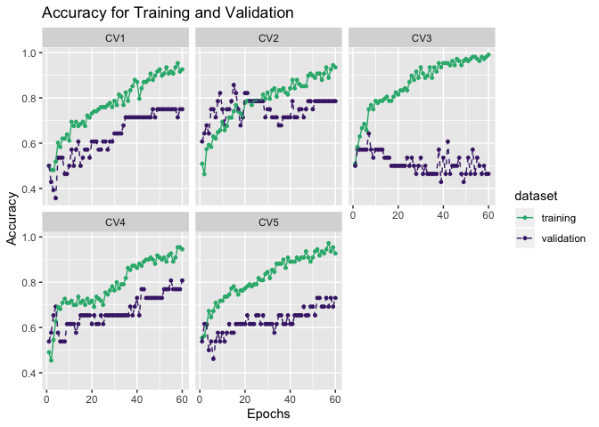

Bt decreasing the number of filter convolution to 8, it is hopfefully
can decrease the overfitting

``` r
oomycete_cnn_gru_fifth_model_train_filter8 <- data.table::fread("../../../../../results/secreted_data_run_manually/oomycete/df_results_train_cnn_gru_best_fifth_filter8.csv")
oomycete_cnn_gru_fifth_model_val_filter8 <- data.table::fread("../../../../../results/secreted_data_run_manually/oomycete/df_results_val_cnn_gru_best_fifth_filter8.csv")
oomycete_cnn_gru_fifth_model_test_filter8 <- data.table::fread("../../../../../results/secreted_data_run_manually/oomycete/df_results_test_cnn_gru_best_fifth_filter8.csv")


get_gg_acc(oomycete_cnn_gru_fifth_model_train_filter8, oomycete_cnn_gru_fifth_model_val_filter8) +
   facet_wrap(~CV, nrow = 2)
```

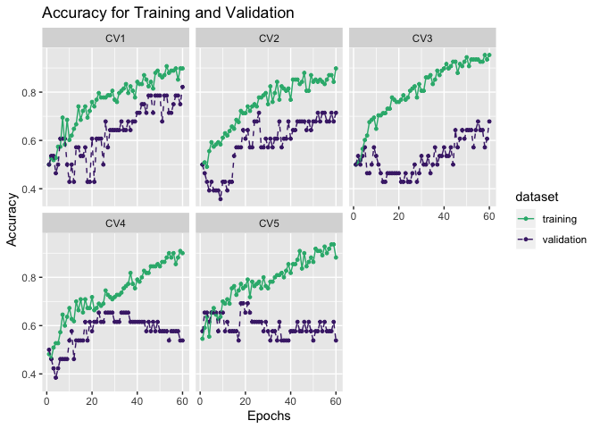

#### Comparing the evaluation on the test data

``` r
oomycete_compare_fifthbest <- rbind(oomycete_cnn_gru_fifth_model_test %>% 
  dplyr::select(V1, acc) %>% 
    dplyr::mutate(filters = 16), 
  oomycete_cnn_gru_fifth_model_test_filter8 %>% 
    dplyr::select(V1, acc) %>% 
    dplyr::mutate(filters = 8))
```

``` r
plot_comparison(oomycete_compare_fifthbest, V1, acc, filters, show_label = TRUE, label_digits = 3) 
```

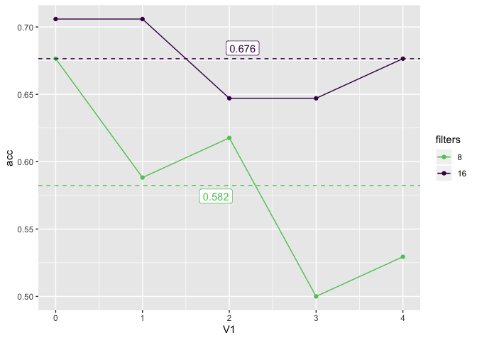

### CNN-LSTM

``` r
oomycete_cnn_lstm_secreted <- data.table::fread("../../../../../data/secreted_data/training-results/oomycete/results/secreted_hyper_scan/df_pred_results_cnn_lstm_scan_oomycete_secreted_data.csv")


oomycete_cnn_lstm_secreted %>% 
  arrange(desc(Accuracy)) %>% 
  head(5) %>% 
  knitr::kable()
```

|   V1| Parameters                                                                                                                                                                                                                 |   Accuracy|  Sensitivity|  Specifity|
|----:|:---------------------------------------------------------------------------------------------------------------------------------------------------------------------------------------------------------------------------|----------:|------------:|----------:|
|   11| {‘strides’: 1, ‘padding’: ‘valid’, ‘optimizers’: ‘Adadelta’, ‘number\_hidden\_units’: 4, ‘filters\_LSTM’: 16, ‘filters’: 8, ‘epochs’: 30, ‘batch\_size’: 16, ‘activation\_convolution’: None, ‘activation\_LSTM’: ‘tanh’}  |  0.7352941|    0.6470588|  0.8235294|
|   12| {‘strides’: 1, ‘padding’: ‘valid’, ‘optimizers’: ‘Adadelta’, ‘number\_hidden\_units’: 4, ‘filters\_LSTM’: 8, ‘filters’: 16, ‘epochs’: 30, ‘batch\_size’: 16, ‘activation\_convolution’: None, ‘activation\_LSTM’: ‘tanh’}  |  0.7352941|    0.8823529|  0.5882353|
|   16| {‘strides’: 1, ‘padding’: ‘valid’, ‘optimizers’: ‘Adadelta’, ‘number\_hidden\_units’: 8, ‘filters\_LSTM’: 16, ‘filters’: 16, ‘epochs’: 30, ‘batch\_size’: 16, ‘activation\_convolution’: None, ‘activation\_LSTM’: ‘tanh’} |  0.7352941|    0.7647059|  0.7058824|
|   20| {‘strides’: 1, ‘padding’: ‘valid’, ‘optimizers’: ‘Adam’, ‘number\_hidden\_units’: 8, ‘filters\_LSTM’: 4, ‘filters’: 8, ‘epochs’: 30, ‘batch\_size’: 8, ‘activation\_convolution’: None, ‘activation\_LSTM’: ‘tanh’}        |  0.7352941|    0.8823529|  0.5882353|
|    4| {‘strides’: 1, ‘padding’: ‘valid’, ‘optimizers’: ‘Adadelta’, ‘number\_hidden\_units’: 8, ‘filters\_LSTM’: 16, ‘filters’: 8, ‘epochs’: 30, ‘batch\_size’: 16, ‘activation\_convolution’: None, ‘activation\_LSTM’: ‘tanh’}  |  0.7058824|    0.7058824|  0.7058824|

#### Manually tuning for the fourth model

{‘strides’: 1, ‘padding’: ‘valid’, ‘optimizers’: ‘Adam’,
‘number\_hidden\_units’: 8, ‘filters\_LSTM’: 4, ‘filters’: 8, ‘epochs’:
30, ‘batch\_size’: 8, ‘activation\_convolution’: None,
‘activation\_LSTM’: ‘tanh’}

``` r
oomycete_cnn_lstm_fourth_model_train <- data.table::fread("../../../../../results/secreted_data_run_manually/oomycete/df_results_train_cnn_lstm_best_oomycete.csv")
oomycete_cnn_lstm_fourth_model_val <- data.table::fread("../../../../../results/secreted_data_run_manually/oomycete/df_results_val_cnn_lstm_best_oomycete.csv")
oomycete_cnn_lstm_fourth_model_test <- data.table::fread("../../../../../results/secreted_data_run_manually/oomycete/df_results_test_cnn_lstm_best_oomycete.csv")

oomycete_cnn_lstm_fourth_model_train <- oomycete_cnn_lstm_fourth_model_train %>% 
  dplyr::mutate(AVG_CV =rowMeans(.[,2:6]))

oomycete_cnn_lstm_fourth_model_val <- oomycete_cnn_lstm_fourth_model_val %>% 
  dplyr::mutate(AVG_CV =rowMeans(.[,2:6]))


get_gg_acc(oomycete_cnn_lstm_fourth_model_train, oomycete_cnn_lstm_fourth_model_val) +
   facet_wrap(~CV, nrow = 2)
```

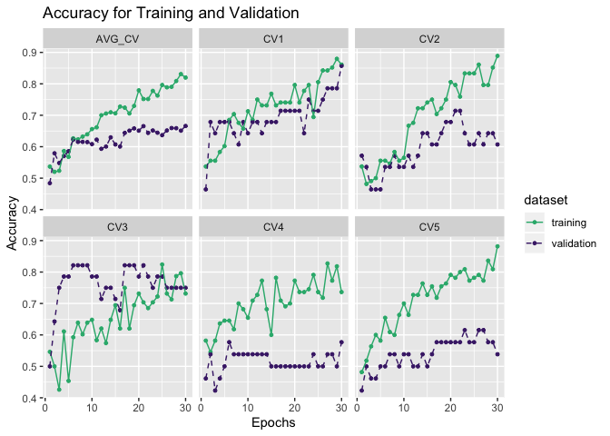

more epochs on CNN-LSTM

``` r
oomycete_cnn_lstm_60epochs_train <- data.table::fread("../../../../../results/secreted_data_run_manually/oomycete/df_results_train_cnn_lstm_best_oomycete_60epochs.csv")
oomycete_cnn_lstm_60epochs_val <- data.table::fread("../../../../../results/secreted_data_run_manually/oomycete/df_results_val_cnn_lstm_best_oomycete_60epochs.csv")
oomycete_cnn_lstm_60epochs_test <- data.table::fread("../../../../../results/secreted_data_run_manually/oomycete/df_results_test_cnn_lstm_best_oomycete_60epochs.csv")


oomycete_cnn_lstm_60epochs_train <- oomycete_cnn_lstm_60epochs_train %>% 
  dplyr::mutate(AVG_CV =rowMeans(.[,2:6]))

oomycete_cnn_lstm_60epochs_val <- oomycete_cnn_lstm_60epochs_val %>% 
  dplyr::mutate(AVG_CV =rowMeans(.[,2:6]))

get_gg_acc(oomycete_cnn_lstm_60epochs_train, oomycete_cnn_lstm_60epochs_val) +
   facet_wrap(~CV, nrow = 2)
```

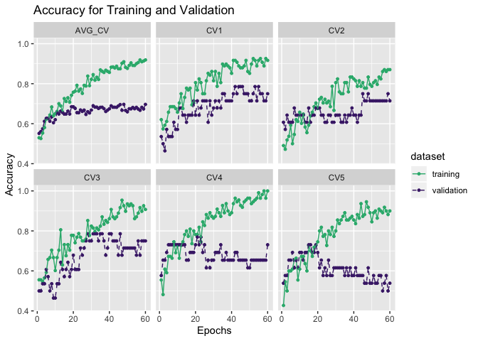

``` r
oomycete_cnn_lstm_60epochs_test
```

    ##    V1       acc sensitivity specifity
    ## 1:  0 0.5000000   0.5294118 0.4705882
    ## 2:  1 0.5000000   0.7058824 0.2941176
    ## 3:  2 0.6764706   0.7058824 0.6470588
    ## 4:  3 0.8235294   0.8823529 0.7647059
    ## 5:  4 0.7352941   0.7058824 0.7647059

#### Comparing the evaluation on the test data

``` r
oomycete_compare_fouthmodel <- rbind(oomycete_cnn_lstm_fourth_model_test %>% 
  dplyr::select(V1, acc) %>% 
    dplyr::mutate(epochs = 30), 
  oomycete_cnn_lstm_60epochs_test %>% 
    dplyr::select(V1, acc) %>% 
    dplyr::mutate(epochs = 60))
```

``` r
plot_comparison(oomycete_compare_fouthmodel, V1, acc, epochs, show_label = TRUE, label_digits = 3) 
```

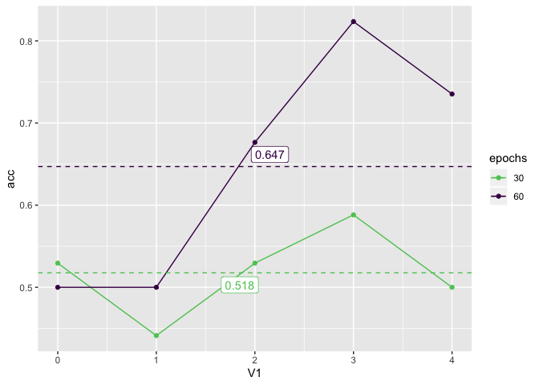

### LSTM-Emb

``` r
oomycete_lstm_emb_train <- data.table::fread("../../../../../results/secreted_data_run_manually/oomycete/df_results_train_lstm_emb_oomycete.csv")
oomycete_lstm_emb_val <- data.table::fread("../../../../../results/secreted_data_run_manually/oomycete/df_results_val_lstm_emb_oomycete.csv")
oomycete_lstm_emb_test <- data.table::fread("../../../../../results/secreted_data_run_manually/oomycete/df_results_test_lstm_emb_oomycete.csv")

oomycete_lstm_emb_train <- oomycete_lstm_emb_train %>% 
  dplyr::mutate(AVG_CV =rowMeans(.[,2:6]))

oomycete_lstm_emb_val  <- oomycete_lstm_emb_val  %>% 
  dplyr::mutate(AVG_CV =rowMeans(.[,2:6]))


get_gg_acc(oomycete_lstm_emb_train, oomycete_lstm_emb_val) +
   facet_wrap(~CV, nrow = 2)
```

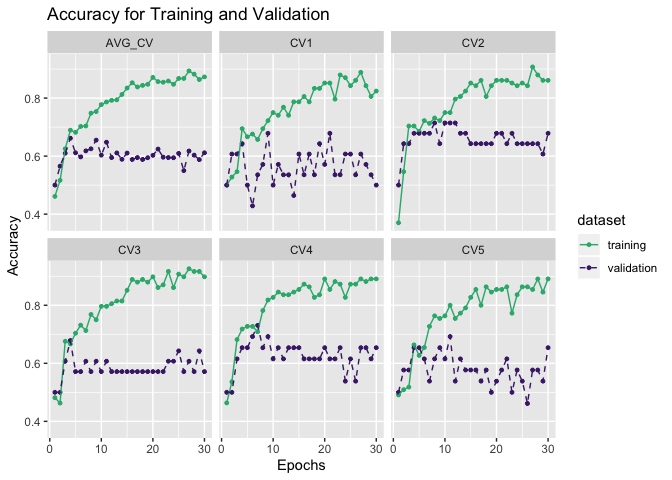

``` r
oomycete_lstm_emb_train <- data.table::fread("../../../../../results/secreted_data_run_manually/oomycete/df_results_train_lstm_emb_oomycete_lstm16.csv")
oomycete_lstm_emb_val <- data.table::fread("../../../../../results/secreted_data_run_manually/oomycete/df_results_val_lstm_emb_oomycete_lstm16.csv")
oomycete_lstm_emb_test <- data.table::fread("../../../../../results/secreted_data_run_manually/oomycete/df_results_test_lstm_emb_oomycete_lstm16.csv")

oomycete_lstm_emb_train <- oomycete_lstm_emb_train %>% 
  dplyr::mutate(AVG_CV =rowMeans(.[,2:6]))

oomycete_lstm_emb_val  <- oomycete_lstm_emb_val  %>% 
  dplyr::mutate(AVG_CV =rowMeans(.[,2:6]))


get_gg_acc(oomycete_lstm_emb_train, oomycete_lstm_emb_val) +
   facet_wrap(~CV, nrow = 2)
```


Reduce the size of the filter from 32 to 16, and we will see what
happened:

``` r
oomycete_lstm_emb_train <- data.table::fread("../../../../../results/secreted_data_run_manually/oomycete/df_results_train_lstm_emb_oomycete_lstm16_outputdim_32.csv")
oomycete_lstm_emb_val <- data.table::fread("../../../../../results/secreted_data_run_manually/oomycete/df_results_val_lstm_emb_oomycete_lstm16_outputdim_32.csv")
oomycete_lstm_emb_test <- data.table::fread("../../../../../results/secreted_data_run_manually/oomycete/df_results_test_lstm_emb_oomycete_lstm16_outputdim_32.csv")

oomycete_lstm_emb_train <- oomycete_lstm_emb_train %>% 
  dplyr::mutate(AVG_CV =rowMeans(.[,2:6]))

oomycete_lstm_emb_val  <- oomycete_lstm_emb_val  %>% 
  dplyr::mutate(AVG_CV =rowMeans(.[,2:6]))


get_gg_acc(oomycete_lstm_emb_train, oomycete_lstm_emb_val) +
   facet_wrap(~CV, nrow = 2)
```

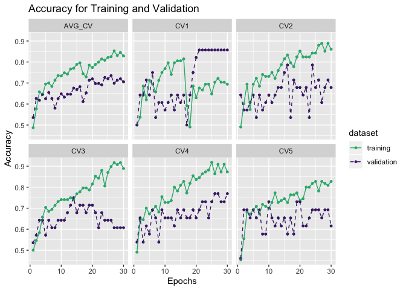

### GRU-Emb

``` r
oomycete_gru_emb_train <- data.table::fread("../../../../../results/secreted_data_run_manually/oomycete/df_results_train_gru_emb_oomycete.csv")
oomycete_gru_emb_val <- data.table::fread("../../../../../results/secreted_data_run_manually/oomycete/df_results_val_gru_emb_oomycete.csv")
oomycete_gru_emb_test <- data.table::fread("../../../../../results/secreted_data_run_manually/oomycete/df_results_test_gru_emb_oomycete.csv")

oomycete_gru_emb_train <- oomycete_gru_emb_train %>% 
  dplyr::mutate(AVG_CV =rowMeans(.[,2:6]))

oomycete_gru_emb_val  <- oomycete_gru_emb_val  %>% 
  dplyr::mutate(AVG_CV =rowMeans(.[,2:6]))

get_gg_acc(oomycete_gru_emb_train, oomycete_gru_emb_val) +
   facet_wrap(~CV, nrow = 2)
```

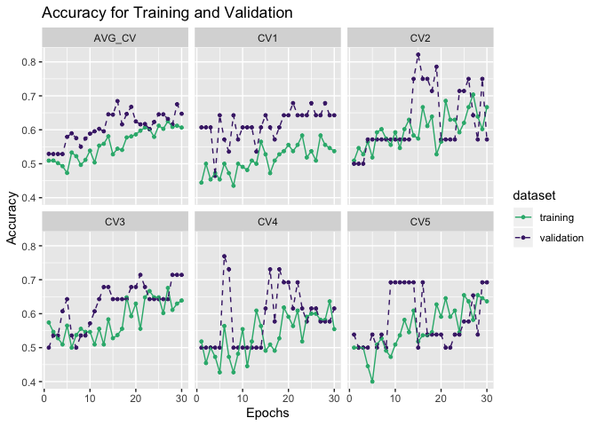

By training them for more epochs, then now we can read the data:

``` r
oomycete_gru_emb_train_60epochs <- data.table::fread("../../../../../results/secreted_data_run_manually/oomycete/df_results_train_gru_emb_oomycete_60epochs.csv")
oomycete_gru_emb_val_60epochs <- data.table::fread("../../../../../results/secreted_data_run_manually/oomycete/df_results_val_gru_emb_oomycete_60epochs.csv")
oomycete_gru_emb_test_60epochs <- data.table::fread("../../../../../results/secreted_data_run_manually/oomycete/df_results_test_gru_emb_oomycete_60epochs.csv")

oomycete_gru_emb_train_60epochs <- oomycete_gru_emb_train_60epochs %>% 
  dplyr::mutate(AVG_CV =rowMeans(.[,2:6]))

oomycete_gru_emb_val_60epochs <- oomycete_gru_emb_val_60epochs  %>% 
  dplyr::mutate(AVG_CV =rowMeans(.[,2:6]))

get_gg_acc(oomycete_gru_emb_train_60epochs, oomycete_gru_emb_val_60epochs) +
   facet_wrap(~CV, nrow = 2) +
   theme_light()
```

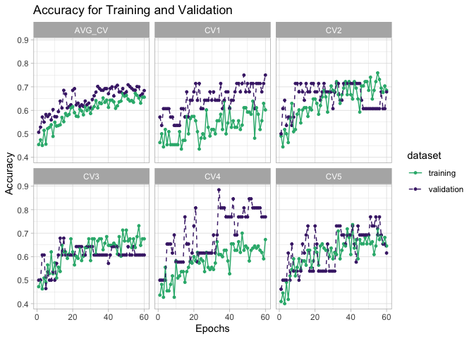

``` r
oomycete_gru_emb_test_60epochs %>% 
  knitr::kable()
```

|   V1|        acc|  sensitivity|  specifity|
|----:|----------:|------------:|----------:|
|    0|  0.5882353|    0.4117647|  0.7647059|
|    1|  0.6176471|    0.6470588|  0.5882353|
|    2|  0.7058824|    0.5882353|  0.8235294|
|    3|  0.6764706|    0.7058824|  0.6470588|
|    4|  0.5882353|    0.3529412|  0.8235294|

``` r
oomycete_compare_gru_emb <- rbind(oomycete_gru_emb_test %>% 
  dplyr::select(V1, acc) %>% 
    dplyr::mutate(epochs = 30), 
  oomycete_gru_emb_test_60epochs %>% 
    dplyr::select(V1, acc) %>% 
    dplyr::mutate(epochs = 60))
```

``` r
plot_comparison(oomycete_compare_gru_emb, V1, acc, epochs, show_label = TRUE, label_digits = 3) 
```

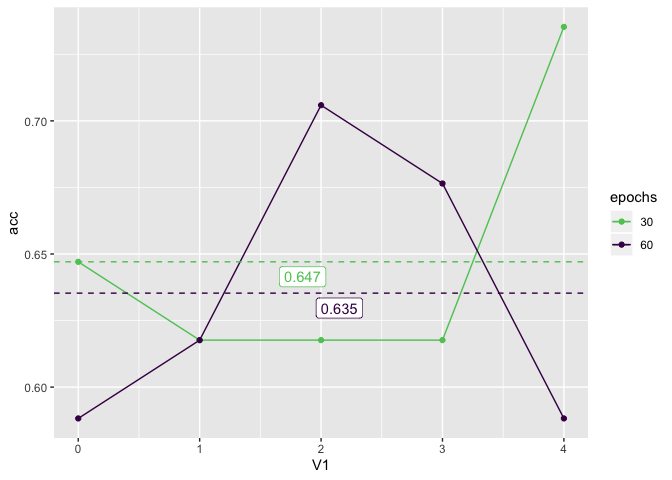
