Model Ensemble of for Models using different data
=================================================

Introduction
------------

There are four models that are constructed for effector and non-effector
protein prediction, which are CNN-LSTM, CNN-GRU, LSTM with embedding,
and GRU with embedding. In order to have better perfomance of each model
(better prediction results), model ensembling can be a good option.

Question
--------

How are the results if we ensemble the four models using different
pathogen data?

### Aim

The purpose of this is to show whether doing the model ensemble can
increase the accuracy of prediction.

Methods
-------

There are two ensemble method will be used in this experiments:

-   Weighted average ensemble: the `validation accuracy` will be taken
    as the weight of each model.  
-   Voting classifier

Additionally, in order to achieve the aim, several steps need to be
done:

1.  After getting the least overfitting models (of all four models),
    then each models was run in GPUs with ModelCheckPoint() from keras,
    therefore model all together with all of the weights would be saved
    (in .hdf5 file).

2.  Those pretrained models saved above then will be used to create the
    model ensemble.

### Loading the libraries

### Define functions

#### Function to get the accuracy for each model

``` r
# Define a function to get all accuracy of the models
get_all_acc <- function(data, true_label){
  
  # Change all of the label into factor
  data <- data %>%
    select(-c(sequence)) %>% 
    mutate_each(list(as.factor))
  
  # Get the number of column
  num_col <- ncol(data)
  
  # Initialize the list of accuracy
  list_acc <- numeric(length = num_col)
  
  # For loop in getting acc for each models
  for (i in 1:num_col){
    pred_each_model <- data %>% 
      pull(colnames(data)[i])
  
    tab <- table(true_label %>% 
                   pull(), 
                 pred_each_model)
    
    acc_each_model <- confusionMatrix(tab)$overall["Accuracy"]
    
    list_acc[i] <- acc_each_model
  }
  
  # Turn the list into dataframe

  df_acc  <- data.frame(matrix(unlist(list_acc), ncol=length(list_acc), byrow = F)) %>%
    `colnames<-`(c(colnames(data)))

  return(df_acc)
}
```

#### Function to get th confusion Matrix

``` r
plot_confusion_matrices <- function(data, true_label, model_list) {
  conf_matrix_df <- data %>%
    select(-sequence) %>%
    # Add true labels
    dplyr::mutate(Reference = true_label$label) %>%
    # Transform into factors
    dplyr::mutate_all(function(x) factor(x, levels = c(1, 0))) %>%
    # Select chosen model only
    pivot_longer(-Reference, names_to = "model", values_to = "Prediction") %>%
    # Filter models
    filter(model %in% model_list) %>% 
    mutate(model = factor(model, levels = model_list)) %>%
    # Calculate frequencies
    table() %>%
    as.data.frame()

  # Make plot
  gg_matrix <- conf_matrix_df %>%
    ggplot() +
    aes(x = Reference, y = Prediction) +
    geom_tile(aes(fill = Freq), colour = "white") +
    geom_text(aes(label = Freq), vjust = 0.5) +
    # scale_fill_gradient(low = "lightpink", high = "mediumpurple1") +
    scale_fill_viridis_c(begin = 0.1, end = 1) +
    labs(x = "True value", y = "Prediction") +
    coord_fixed() +
    facet_wrap(~model) +
    theme_bw() +
    theme(legend.position = "none")

  return(gg_matrix)
}
```

#### Function to get the correlation matrix

``` r
plot_cormat <- function(rfm_df, cor_trans = NULL, variable = NULL) {
  rfm_df <- rfm_df %>%
    dplyr::select_if(is.numeric) %>%
    stats::cor(use = "pairwise.complete.obs") %>%
    # Transform to data frame
    tibble::as_tibble(rownames = "var_x") %>%
    # Prepare for plotting
    tidyr::pivot_longer(
      cols = -var_x,
      names_to = "var_y",
      values_to = "cor"
    ) %>% 
    dplyr::mutate(
      var_x = factor(var_x, levels = unique(.[["var_x"]])),
      var_y = factor(var_y, levels = unique(.[["var_x"]]))
    )
  
  if (!is.null(variable)) {
    rfm_df <- rfm_df %>%
      dplyr::filter(var_x == variable)
  }
  
  # Transform correlation
  if (is.null(cor_trans)) {
    fill_limits <- c(-1, 1)
  } else {
    if (cor_trans == "abs") {
      rfm_df <- rfm_df %>%
        dplyr::mutate(cor = abs(cor))
      fill_limits <- c(0, 1)
    } else if (cor_trans == "squared") {
      rfm_df <- rfm_df %>%
        dplyr::mutate(cor = cor^2)
      fill_limits <- c(0, 1)
    }
  }
  
  # Plot
  gg <- rfm_df %>%
    ggplot() +
    aes(x = var_x, y = var_y, fill = cor) +
    geom_tile() +
    viridis::scale_fill_viridis(limits = fill_limits) +
    coord_fixed() +
    labs(
      x = NULL,
      y = NULL
    ) +
    geom_text(aes(label = round(cor, 2)), vjust = 0.5, size=3) + 
    theme(axis.text.x = element_text(angle = 45, hjust = 1),
          panel.border = element_blank())
  
  return(gg)
}
```

### Plot to get clustered correlation

``` r
plot_clustered_correlation <- function(data, cellsize, ncolor, ...) {
  data %>%
    stats::cor(method = "pearson") %>%
    pheatmap::pheatmap(
      mat = .,
      color = viridisLite::viridis(ncolor, begin = 0, end = 1),
      cellheight = cellsize,
      cellwidth = cellsize,
      border_color = NA,
      display_numbers = TRUE,
      breaks = seq(-1, 1, 2 / ncolor),
      ...
    )
}
```

Bacteria
--------

### Loading the data

``` r
# Load all of the results file of ensembling
bacteria_ensemble_results <- data.table::fread("../../../../../scripts/jupyter-note/model_ensemble/pred_result/bacteria/df_pred_ens_bacteria.csv", drop = "V1")


# Load the label of data
bacteria_test_label <- data.table::fread("../../../../../data/secreted_data/ready_to_process/splitted-data/bacteria_testing.csv")

# Rename the column name of the test label and change the data into factor
bacteria_test_label <- bacteria_test_label %>%
  dplyr::select(label)

bacteria_test_label <- bacteria_test_label %>% 
  mutate_each(list(as.factor))
```

### Getting the accuracy for the testing results for bacteria data

``` r
# Ensemble results for all epochs
get_all_acc(bacteria_ensemble_results, bacteria_test_label) 
```

    ##    cnn_lstm   cnn_gru   gru_emb  lstm_emb ensemble_weighted ensemble_voting
    ## 1 0.9605263 0.9736842 0.9342105 0.9736842         0.9868421       0.9868421

### Confusion Matrix

``` r
plot_confusion_matrices(
  data = bacteria_ensemble_results,
  true_label = bacteria_test_label,
  model_list = c("cnn_lstm", "cnn_gru", "gru_emb", "lstm_emb", "ensemble_weighted", "ensemble_voting")
) +
  theme_light()  +
  ggsave(filename = "confusion_matrices_bacteria.pdf", width = 8, height = 5, dpi = 192, device = cairo_pdf)
```

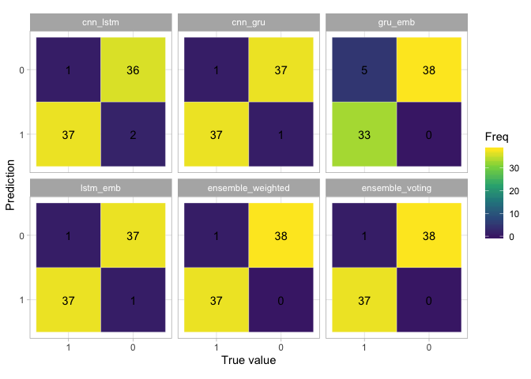

### Pearson Correlation Matrix

``` r
plot_cormat(bacteria_ensemble_results %>% dplyr::select(-c(sequence)), cor_trans = NULL, variable = NULL) +
  theme_light() +
  theme(axis.text.x = element_text(angle = 45, hjust = 1)) 
```

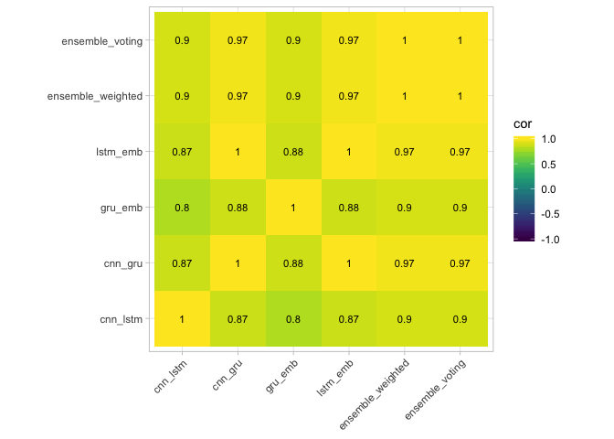

``` r
# +
#   ggsave(filename = "correlation_matrices_bacteria.pdf", width = 6, height = 5, dpi = 192, device = cairo_pdf)
```

``` r
bacteria <- plot_clustered_correlation(
  data = bacteria_ensemble_results %>% dplyr::select(-c(sequence)),
  cellsize = 30,
  ncolor = 500,
  silent = TRUE,
  legend_breaks = seq(-1, 1, 0.5),
  number_format = "%.2f",
  fontsize_row = 8.5,
  fontsize_col = 8.5,
  angle_col = 45
) %>% 
ggplotify::as.ggplot()

bacteria 
```

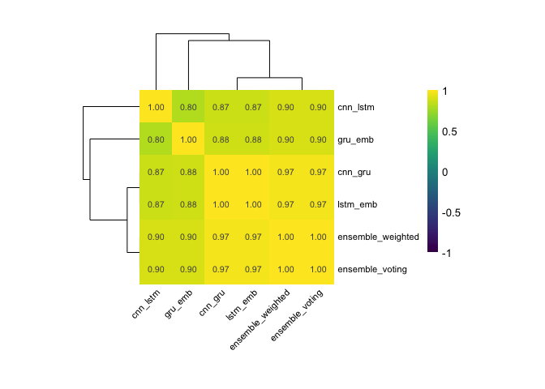

All
---

### Loading the data

``` r
# Load all of the results file of ensembling
all_ensemble_results <- data.table::fread("../../../../../scripts/jupyter-note/model_ensemble/pred_result/all/df_pred_ens_all.csv", drop = "V1")

# Load the label of data
all_test_label <- data.table::fread("../../../../../data/secreted_data/ready_to_process/splitted-data/all_testing.csv")

# Rename the column name of the test label and change the data into factor
all_test_label <- all_test_label %>%
  dplyr::select(label)

all_test_label <- all_test_label %>% 
  mutate_each(list(as.factor))
```

### Getting the accuracy

``` r
# Ensemble results for all epochs
get_all_acc(all_ensemble_results, all_test_label) 
```

    ##    cnn_lstm   cnn_gru   gru_emb lstm_emb ensemble_weighted ensemble_voting
    ## 1 0.8445946 0.8445946 0.7837838 0.777027         0.8445946       0.8648649

### Confusion Matrix

``` r
plot_confusion_matrices(
  data = all_ensemble_results,
  true_label = all_test_label,
  model_list = c("cnn_lstm", "cnn_gru", "gru_emb", "lstm_emb", "ensemble_weighted", "ensemble_voting")
) +
  theme_light() 
```

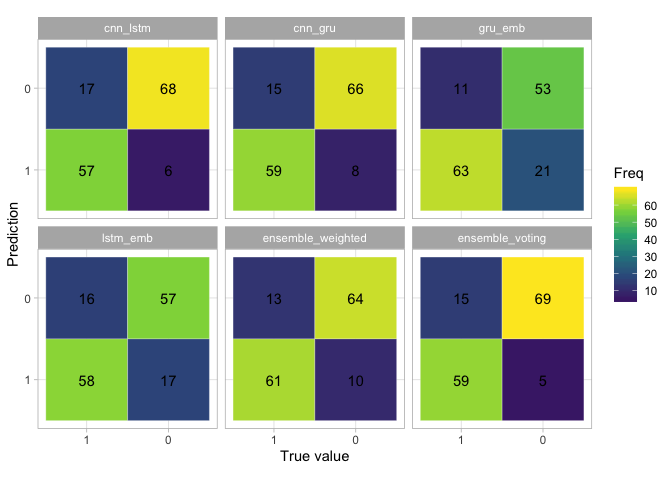

### Pearson Correlation Matrix

``` r
plot_cormat(all_ensemble_results %>% dplyr::select(-c(sequence)), cor_trans = NULL, variable = NULL) +
  theme_light() +
  theme(axis.text.x = element_text(angle = 45, hjust = 1)) 
```

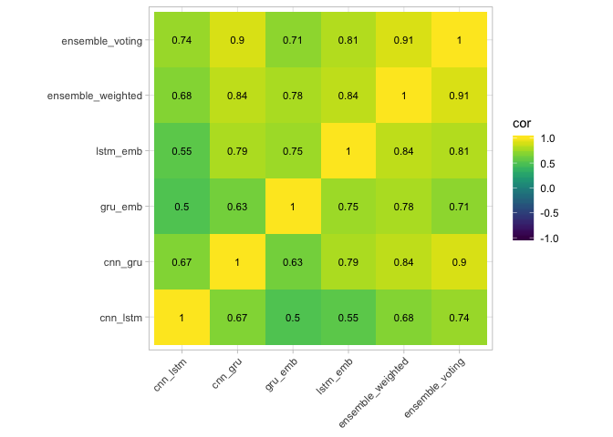

``` r
all <- plot_clustered_correlation(
  data = all_ensemble_results %>% dplyr::select(-c(sequence)),
  cellsize = 30,
  ncolor = 500,
  silent = TRUE,
  legend_breaks = seq(-1, 1, 0.5),
  number_format = "%.2f",
  fontsize_row = 8.5,
  fontsize_col = 8.5,
  angle_col = 45
) %>% 
ggplotify::as.ggplot()

all  
```

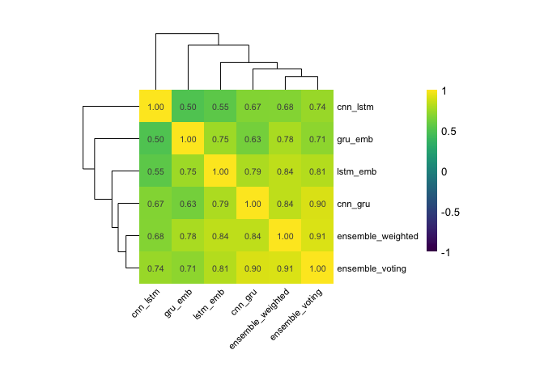

Oomyecte
--------

### Loading the data

``` r
# Load all of the results file of ensembling
oomycete_ensemble_results <- data.table::fread("../../../../../scripts/jupyter-note/model_ensemble/pred_result/oomycete/df_pred_ens_oomycete.csv", drop = "V1")

# Load the label of data
oomycete_test_label <- data.table::fread("../../../../../data/secreted_data/ready_to_process/splitted-data/oomycete_testing.csv")

# Rename the column name of the test label and change the data into factor
oomycete_test_label <- oomycete_test_label%>%
  dplyr::select(label)

oomycete_test_label <- oomycete_test_label %>% 
  mutate_each(list(as.factor))
```

### Getting the accuracy

``` r
# Ensemble results for all epochs
get_all_acc(oomycete_ensemble_results, oomycete_test_label) 
```

    ##    cnn_lstm   cnn_gru   gru_emb  lstm_emb ensemble_weighted ensemble_voting
    ## 1 0.8235294 0.7058824 0.6470588 0.6764706         0.6764706       0.7647059

``` r
plot_confusion_matrices(
  data = oomycete_ensemble_results,
  true_label = oomycete_test_label,
  model_list = c("cnn_lstm", "cnn_gru", "gru_emb", "lstm_emb", "ensemble_weighted", "ensemble_voting")
) +
  theme_light() 
```

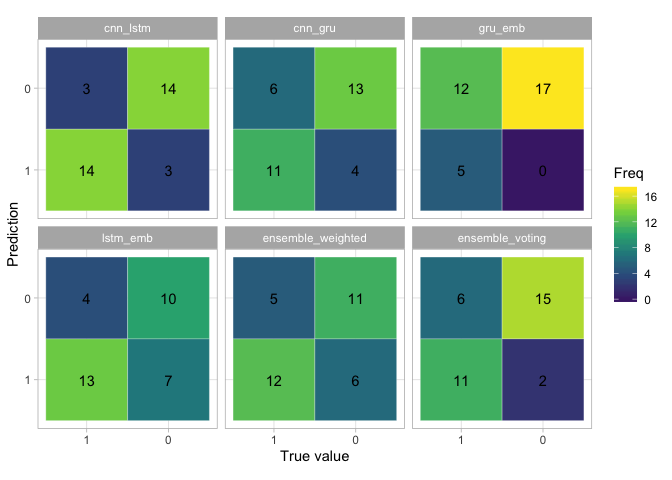

``` r
# +
#   ggsave(filename = "confusion_matrices_oomycete.pdf", width = 8, height = 5, dpi = 192, device = cairo_pdf)
```

### Pearson Correlation Matrix

``` r
plot_cormat(oomycete_ensemble_results %>% dplyr::select(-c(sequence)), cor_trans = NULL, variable = NULL) +
  theme_light() +
  theme(axis.text.x = element_text(angle = 45, hjust = 1)) 
```

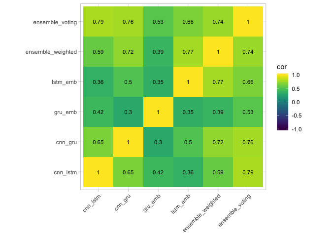

``` r
oomycete <- plot_clustered_correlation(
  data = oomycete_ensemble_results %>% dplyr::select(-c(sequence)),
  cellsize = 30,
  ncolor = 500,
  silent = TRUE,
  legend_breaks = seq(-1, 1, 0.5),
  number_format = "%.2f",
  fontsize_row = 8.5,
  fontsize_col = 8.5,
  angle_col = 45
) %>% 
ggplotify::as.ggplot()

oomycete  
```

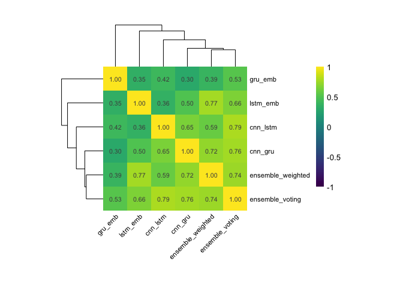

``` r
# + 
#   ggsave(filename = "correlation_oomycete_fungi.pdf", width = 8, height = 5, dpi = 192, device = cairo_pdf)
```

Fungi
-----

``` r
# Load all of the results file of ensembling
fungi_ensemble_results <- data.table::fread("../../../../../scripts/jupyter-note/model_ensemble/pred_result/fungi/df_pred_ens_fungi.csv", drop = "V1")

fungi_ensemble_results_2models <- data.table::fread("../../../../../scripts/jupyter-note/model_ensemble/pred_result/fungi/df_pred_ens_fungi_2models.csv", drop = "V1")

fungi_ensemble_results_cnnlstm_gruemb <- data.table::fread("../../../../../scripts/jupyter-note/model_ensemble/pred_result/fungi/df_pred_ens_fungi_cnnlstm_gruemb.csv", drop = "V1")

# Load the label of data
fungi_test_label <- data.table::fread("../../../../../data/secreted_data/ready_to_process/splitted-data/fungi_testing.csv")

# Rename the column name of the test label and change the data into factor
fungi_test_label <- fungi_test_label %>%
  dplyr::select(label)

fungi_test_label <- fungi_test_label %>% 
  mutate_each(list(as.factor))
```

### Getting the accuracy

``` r
# Ensemble results for all epochs
get_all_acc(fungi_ensemble_results, fungi_test_label) 
```

    ##    cnn_lstm   cnn_gru   gru_emb  lstm_emb ensemble_weighted ensemble_voting
    ## 1 0.8421053 0.7105263 0.6052632 0.6578947         0.7894737       0.6578947

``` r
# Ensemble results for all epochs
get_all_acc(fungi_ensemble_results_2models, fungi_test_label) 
```

    ##    cnn_lstm   cnn_gru ensemble_weighted ensemble_voting
    ## 1 0.8421053 0.7105263         0.8421053       0.7894737

``` r
# Ensemble results for all epochs
get_all_acc(fungi_ensemble_results_cnnlstm_gruemb, fungi_test_label) 
```

    ##    cnn_lstm   gru_emb ensemble_weighted ensemble_voting
    ## 1 0.8421053 0.6052632         0.7631579       0.6578947

``` r
pivot_ensemble_results <- function(data, label, ensemble_text) {
  left_join(
  get_all_acc(data, label) %>% 
    tidyr::pivot_longer(cols = -starts_with("ensemble_"), names_to = "model1", values_to = "accuracy1") %>% 
    slice(1),
  get_all_acc(data, label) %>% 
    tidyr::pivot_longer(cols = -starts_with("ensemble_"), names_to = "model2", values_to = "accuracy2") %>% 
    slice(2),
    by = c("ensemble_weighted", "ensemble_voting")
  ) %>% 
    mutate(ensemble = ensemble_text) %>% 
    select(ensemble, model1, accuracy1, model2, accuracy2, ensemble_weighted, ensemble_voting)
}
```

``` r
# Making table for reports
all_ensembles_table <- rbind(
  pivot_ensemble_results(fungi_ensemble_results_2models, fungi_test_label, "Ensemble 1"),
  pivot_ensemble_results(fungi_ensemble_results_cnnlstm_lstmemb, fungi_test_label, "Ensemble 2"),
  pivot_ensemble_results(fungi_ensemble_results_cnnlstm_gruemb, fungi_test_label, "Ensemble 3")
) 
  
all_ensembles_table %>% 
  mutate(
    model1 = stringr::str_to_upper(model1) %>% stringr::str_replace("_", "--"),
    model2 = stringr::str_to_upper(model2) %>% stringr::str_replace("_", "--")
  ) %>% 
  `colnames<-`(c("Ensemble", "Model 1", "Acc. 1", "Model 2", "Acc. 2", "Ens. Weighted", "Ens. Voting")) %>% 
  xtable::xtable(
    digits = 7,
    booktabs = TRUE,
    caption = "asd",
    label = "tab:asd"
  )
```

``` r
plot_confusion_matrices(
  data = fungi_ensemble_results,
  true_label = fungi_test_label,
  model_list = c("cnn_lstm", "cnn_gru", "gru_emb", "lstm_emb", "ensemble_weighted", "ensemble_voting")
) +
  theme_light() 
```

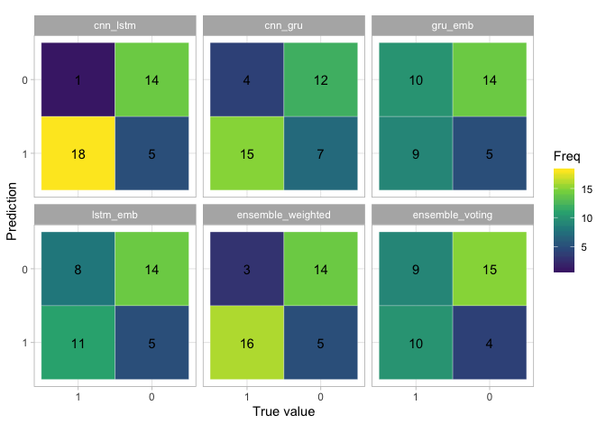

``` r
# +
  # ggsave(filename = "confusion_matrices_fungi.pdf", width = 8, height = 5, dpi = 192, device = cairo_pdf)
```

``` r
fungi <- plot_clustered_correlation(
  data = fungi_ensemble_results %>% dplyr::select(-c(sequence)),
  cellsize = 30,
  ncolor = 500,
  silent = TRUE,
  legend_breaks = seq(-1, 1, 0.5),
  number_format = "%.2f",
  fontsize_row = 8.5,
  fontsize_col = 8.5,
  angle_col = 45
) %>% 
ggplotify::as.ggplot() 

fungi 
```

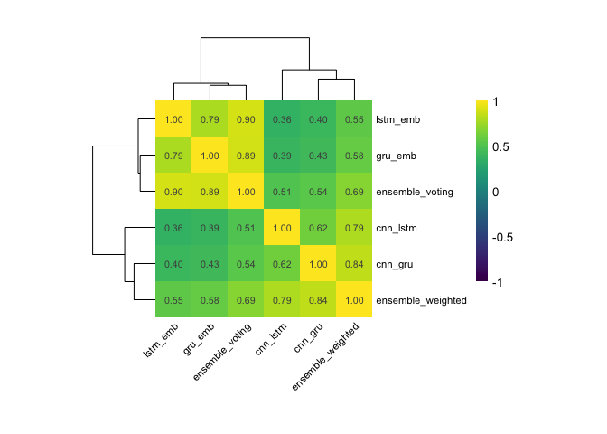

``` r
# + 
#   ggsave(filename = "correlation_matrix_fungi.pdf", width = 8, height = 5, dpi = 192, device = cairo_pdf)
```
