Plot sequence logo for each dataset
===================================

Introduction
------------

Based on the result of the convolutional layers on CNN-GRU model, we
have some information of the highly activated position of the sequences
for each datasets. Using that information, we can plot the sequence logo
for each.

Load library
------------

``` r
# Define path 
dir_path <- here::here("data/secreted_data/ready_to_process/splitted-data/")
```

Define function
---------------

``` r
# Function to get the data 
get_seqlogo <- function(data, method_plot, start_pos, end_pos, file_name){
  
  data <- data %>% 
    dplyr::mutate(sequence = substr(Sequence, start_pos, end_pos)) 
  
  # Define the length of the sequence string selected
  len_seq_str = end_pos - start_pos + 1
  
  # Define additional column to get the value of the length of sequence 
  data_with_length <- data %>% 
    rowwise() %>% 
    dplyr::mutate(len = nchar(sequence))
  
  # Take all data with the same length
  data_with_length <- data_with_length %>% 
    dplyr::filter(!len < len_seq_str)
  
  gg_seqlogo <- ggseqlogo(data_with_length$sequence, method = method_plot, seq_type = "aa") +
  scale_x_continuous(breaks = seq(1, len_seq_str, 1), labels = seq(start_pos, end_pos, 1)) +
  labs(x = "Position")
  
  gg_seqlogo + theme_bw()+
  theme(panel.grid.major = element_line(colour = "#FFFFFF"),
        panel.grid.minor = element_line(colour = "#FFFFFF")) +
  ggsave(filename = file_name, width = 10, height = 5, device = cairo_pdf)
  
  return(gg_seqlogo)
} 
```

Bacteria
--------

``` r
train_bacteria <- paste0(dir_path, "bacteria_training.csv") %>% 
  data.table::fread() 

val_bacteria <- paste0(dir_path, "bacteria_validation.csv") %>%
  data.table::fread()  

test_bacteria <- paste0(dir_path, "bacteria_testing.csv") %>% 
  data.table::fread() 

all_bacteria <- rbind(train_bacteria, val_bacteria, test_bacteria)
```

``` r
# Take only effector data
train_bacteria_eff <- train_bacteria %>% 
  dplyr::filter(label == 1)
  
val_bacteria_eff <- val_bacteria %>% 
  dplyr::filter(label == 1)

test_bacteria_eff <- test_bacteria %>% 
  dplyr::filter(label == 1)
```

### Load the fig for the most activated


### Comparing for all data

``` r
get_seqlogo(train_bacteria, 'bits', start_pos = 25, end_pos = 50, file_name = "../../../../jupyter-note/heatmaps/fig/bacteria_train_seqlogo.pdf")
```

    ## Scale for 'x' is already present. Adding another scale for 'x', which will
    ## replace the existing scale.

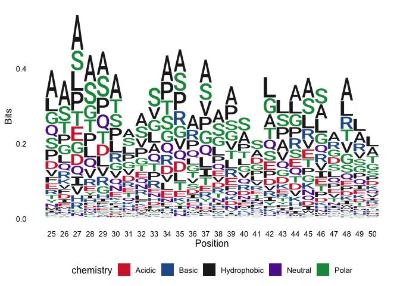

``` r
get_seqlogo(val_bacteria, 'bits', start_pos = 25, end_pos = 50, file_name = "../../../../jupyter-note/heatmaps/fig/bacteria_val_seqlogo.pdf")
```

    ## Scale for 'x' is already present. Adding another scale for 'x', which will
    ## replace the existing scale.

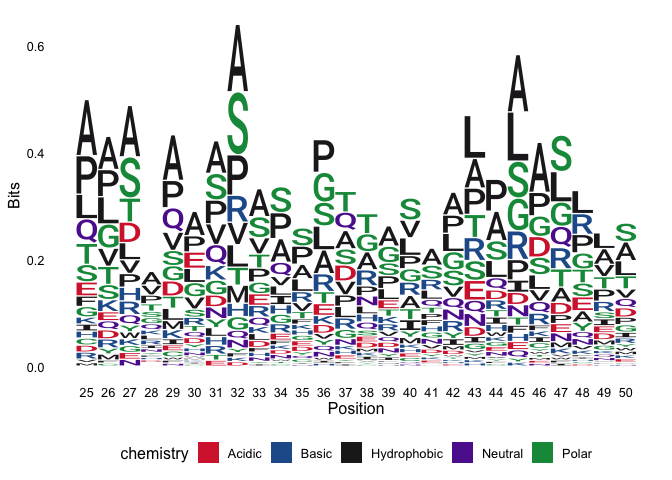

``` r
get_seqlogo(test_bacteria, 'bits', start_pos = 25, end_pos = 50, file_name = "../../../../jupyter-note/heatmaps/fig/bacteria_test_seqlogo.pdf")
```

    ## Scale for 'x' is already present. Adding another scale for 'x', which will
    ## replace the existing scale.

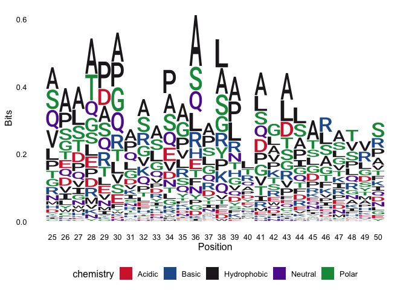

Fungi
-----

``` r
train_fungi <- paste0(dir_path, "fungi_training.csv") %>% 
  data.table::fread()

val_fungi <- paste0(dir_path, "fungi_validation.csv") %>%
  data.table::fread()  

test_fungi <- paste0(dir_path, "fungi_testing.csv") %>% 
  data.table::fread()  
```

### Load the fig for the most activated


### Comparing for all data

``` r
get_seqlogo(train_fungi, 'bits', start_pos = 30, end_pos = 75, file_name = "../../../../jupyter-note/heatmaps/fig/fungi_train_seqlogo.pdf")
```

    ## Scale for 'x' is already present. Adding another scale for 'x', which will
    ## replace the existing scale.

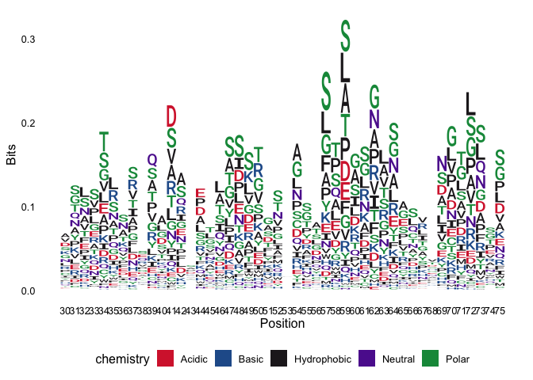

``` r
get_seqlogo(val_fungi, 'bits', start_pos = 30, end_pos = 75, file_name = "../../../../jupyter-note/heatmaps/fig/fungi_val_seqlogo.pdf")
```

    ## Scale for 'x' is already present. Adding another scale for 'x', which will
    ## replace the existing scale.

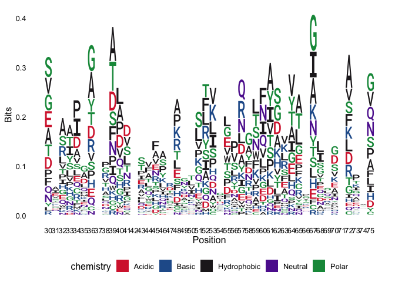

``` r
get_seqlogo(test_fungi, 'bits', start_pos = 30, end_pos = 75, file_name = "../../../../jupyter-note/heatmaps/fig/fungi_test_seqlogo.pdf")
```

    ## Scale for 'x' is already present. Adding another scale for 'x', which will
    ## replace the existing scale.

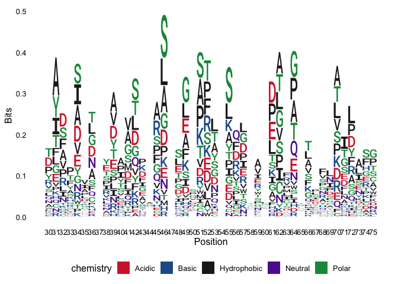

Oomycete
--------

### Load the fig for the most activated


### Comparing for all data

``` r
oomycete_train <- paste0(dir_path, "oomycete_training.csv") %>% 
  data.table::fread()

oomycete_val <- paste0(dir_path, "oomycete_validation.csv") %>%
  data.table::fread() 

oomycete_test <- paste0(dir_path, "oomycete_testing.csv") %>% 
  data.table::fread() 
```

### First peak

``` r
get_seqlogo(oomycete_train, 'bits', start_pos = 15, end_pos = 40, file_name = "../../../../jupyter-note/heatmaps/fig/oomycete_train_seqlogo_1.pdf")
```

    ## Scale for 'x' is already present. Adding another scale for 'x', which will
    ## replace the existing scale.

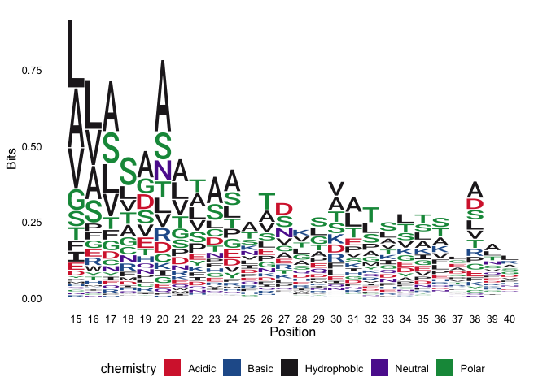

``` r
get_seqlogo(oomycete_val, 'bits', start_pos = 15, end_pos = 40, file_name = "../../../../jupyter-note/heatmaps/fig/oomycete_val_seqlogo_1.pdf")
```

    ## Scale for 'x' is already present. Adding another scale for 'x', which will
    ## replace the existing scale.

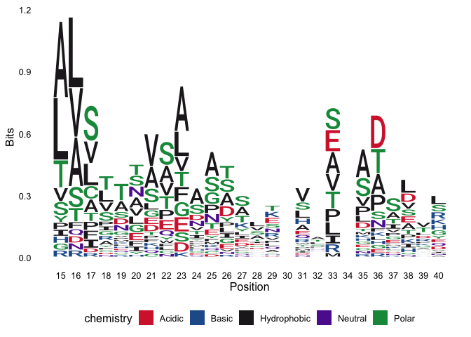

``` r
get_seqlogo(oomycete_test, 'bits', start_pos = 15, end_pos = 40, file_name = "../../../../jupyter-note/heatmaps/fig/oomycete_test_seqlogo_1.pdf")
```

    ## Scale for 'x' is already present. Adding another scale for 'x', which will
    ## replace the existing scale.

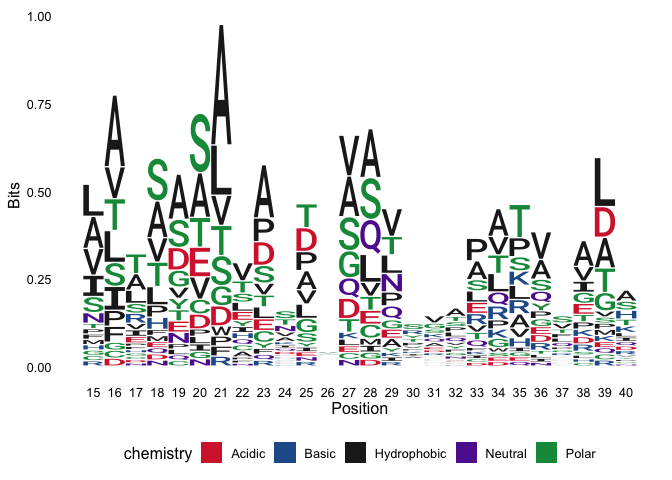

### Second peak

``` r
get_seqlogo(oomycete_train, 'bits', start_pos = 45, end_pos = 70, file_name = "../../../../jupyter-note/heatmaps/fig/oomycete_train_seqlogo_2.pdf")
```

    ## Scale for 'x' is already present. Adding another scale for 'x', which will
    ## replace the existing scale.

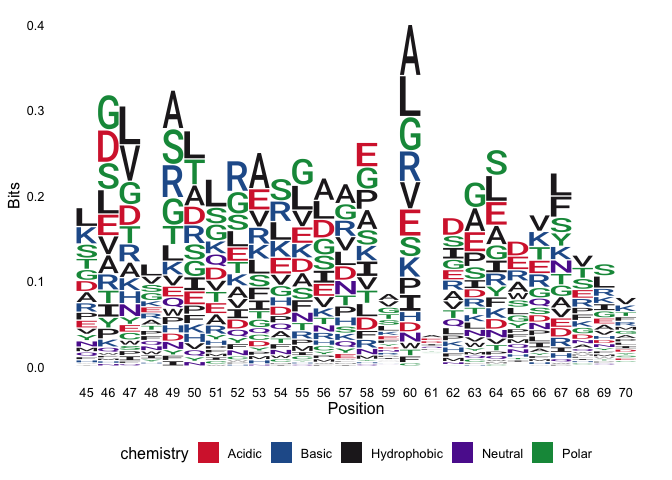

``` r
get_seqlogo(oomycete_val, 'bits', start_pos = 45, end_pos = 70, file_name = "../../../../jupyter-note/heatmaps/fig/oomycete_val_seqlogo_2.pdf")
```

    ## Scale for 'x' is already present. Adding another scale for 'x', which will
    ## replace the existing scale.

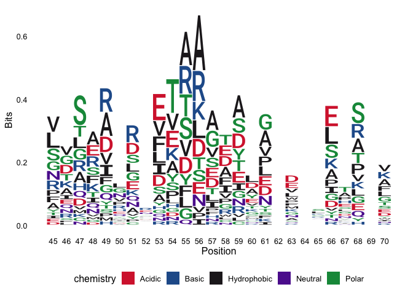

``` r
get_seqlogo(oomycete_test, 'bits', start_pos = 45, end_pos = 70, file_name = "../../../../jupyter-note/heatmaps/fig/oomycete_test_seqlogo_2.pdf")
```

    ## Scale for 'x' is already present. Adding another scale for 'x', which will
    ## replace the existing scale.

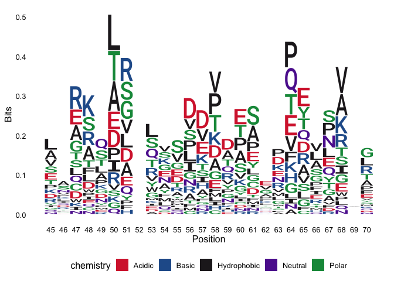
