Manually tuning model for Fungi
===============================

Background
----------

In this report, manually tuning models for pathogen fungi will be done.

``` r
library(tidyverse)
```

    ## ── Attaching packages ────────────────────────────────────────────────────────────────────────────────────────────── tidyverse 1.3.0 ──

    ## ✓ ggplot2 3.2.1     ✓ purrr   0.3.3
    ## ✓ tibble  2.1.3     ✓ dplyr   0.8.3
    ## ✓ tidyr   1.0.0     ✓ stringr 1.4.0
    ## ✓ readr   1.3.1     ✓ forcats 0.4.0

    ## ── Conflicts ───────────────────────────────────────────────────────────────────────────────────────────────── tidyverse_conflicts() ──
    ## x dplyr::filter() masks stats::filter()
    ## x dplyr::lag()    masks stats::lag()

``` r
library(patchwork)
library(parscanlogreader)
source("../../../r-functions/plot_training_vs_validation.R")
```

    ## 
    ## Attaching package: 'reshape'

    ## The following object is masked from 'package:dplyr':
    ## 
    ##     rename

    ## The following objects are masked from 'package:tidyr':
    ## 
    ##     expand, smiths

``` r
#import the package
library(randomForest)
```

    ## randomForest 4.6-14

    ## Type rfNews() to see new features/changes/bug fixes.

    ## 
    ## Attaching package: 'randomForest'

    ## The following object is masked from 'package:dplyr':
    ## 
    ##     combine

    ## The following object is masked from 'package:ggplot2':
    ## 
    ##     margin

Results from hypeparameter scan
-------------------------------

``` r
fungi_cnn_gru_secreted <- data.table::fread("../../../../../data/secreted_data/training-results/fungi/df_pred_results_cnn_gru_fungi_secreted.csv")

fungi_cnn_gru_secreted %>% 
  arrange(desc(Accuracy)) %>% 
  knitr::kable()
```

|   V1| Parameters                                                                                                                                                                                                                                                                       |   Accuracy|  Sensitivity|  Specifity|
|----:|:---------------------------------------------------------------------------------------------------------------------------------------------------------------------------------------------------------------------------------------------------------------------------------|----------:|------------:|----------:|
|   22| {‘reg\_rate’: 0.001, ‘optimizers’: ‘Adam’, ‘opt\_go\_backwards’: ‘TRUE’, ‘opt\_dropout\_recurrent’: 0, ‘opt\_dropout’: 0, ‘maxpool\_size’: 2, ‘kernel\_size’: 1, ‘gru\_hidden\_units’: 8, ‘filter\_conv’: 8, ‘epochs’: 30, ‘batch\_size’: 8, ‘activation\_conv’: None}           |  0.8157895|    0.7368421|  0.8947368|
|   21| {‘reg\_rate’: 0.01, ‘optimizers’: ‘Adam’, ‘opt\_go\_backwards’: ‘TRUE’, ‘opt\_dropout\_recurrent’: 0, ‘opt\_dropout’: 0.25, ‘maxpool\_size’: 3, ‘kernel\_size’: 2, ‘gru\_hidden\_units’: 8, ‘filter\_conv’: 8, ‘epochs’: 30, ‘batch\_size’: 8, ‘activation\_conv’: None}         |  0.7894737|    0.7894737|  0.7894737|
|    2| {‘reg\_rate’: 0.01, ‘optimizers’: ‘Adam’, ‘opt\_go\_backwards’: ‘TRUE’, ‘opt\_dropout\_recurrent’: 0, ‘opt\_dropout’: 0, ‘maxpool\_size’: 3, ‘kernel\_size’: 2, ‘gru\_hidden\_units’: 8, ‘filter\_conv’: 8, ‘epochs’: 30, ‘batch\_size’: 4, ‘activation\_conv’: ‘relu’}          |  0.7631579|    0.6315789|  0.8947368|
|    5| {‘reg\_rate’: 0.01, ‘optimizers’: ‘Adam’, ‘opt\_go\_backwards’: ‘TRUE’, ‘opt\_dropout\_recurrent’: 0.25, ‘opt\_dropout’: 0, ‘maxpool\_size’: 2, ‘kernel\_size’: 2, ‘gru\_hidden\_units’: 16, ‘filter\_conv’: 16, ‘epochs’: 30, ‘batch\_size’: 4, ‘activation\_conv’: None}       |  0.7631579|    0.8421053|  0.6842105|
|   11| {‘reg\_rate’: 0.01, ‘optimizers’: ‘Adam’, ‘opt\_go\_backwards’: ‘TRUE’, ‘opt\_dropout\_recurrent’: 0.25, ‘opt\_dropout’: 0.25, ‘maxpool\_size’: 2, ‘kernel\_size’: 2, ‘gru\_hidden\_units’: 16, ‘filter\_conv’: 16, ‘epochs’: 30, ‘batch\_size’: 8, ‘activation\_conv’: None}    |  0.7631579|    0.7894737|  0.7368421|
|    8| {‘reg\_rate’: 0.001, ‘optimizers’: ‘Adam’, ‘opt\_go\_backwards’: ‘TRUE’, ‘opt\_dropout\_recurrent’: 0, ‘opt\_dropout’: 0.25, ‘maxpool\_size’: 3, ‘kernel\_size’: 2, ‘gru\_hidden\_units’: 8, ‘filter\_conv’: 16, ‘epochs’: 30, ‘batch\_size’: 8, ‘activation\_conv’: None}       |  0.7631579|    0.7894737|  0.7368421|
|    6| {‘reg\_rate’: 0.01, ‘optimizers’: ‘Adam’, ‘opt\_go\_backwards’: ‘TRUE’, ‘opt\_dropout\_recurrent’: 0.25, ‘opt\_dropout’: 0, ‘maxpool\_size’: 3, ‘kernel\_size’: 2, ‘gru\_hidden\_units’: 8, ‘filter\_conv’: 8, ‘epochs’: 30, ‘batch\_size’: 4, ‘activation\_conv’: ‘relu’}       |  0.7368421|    0.7894737|  0.6842105|
|   10| {‘reg\_rate’: 0.01, ‘optimizers’: ‘Adam’, ‘opt\_go\_backwards’: ‘TRUE’, ‘opt\_dropout\_recurrent’: 0.25, ‘opt\_dropout’: 0.25, ‘maxpool\_size’: 3, ‘kernel\_size’: 2, ‘gru\_hidden\_units’: 16, ‘filter\_conv’: 16, ‘epochs’: 30, ‘batch\_size’: 4, ‘activation\_conv’: None}    |  0.7368421|    0.7368421|  0.7368421|
|   19| {‘reg\_rate’: 0.01, ‘optimizers’: ‘Adam’, ‘opt\_go\_backwards’: ‘TRUE’, ‘opt\_dropout\_recurrent’: 0.25, ‘opt\_dropout’: 0, ‘maxpool\_size’: 2, ‘kernel\_size’: 1, ‘gru\_hidden\_units’: 8, ‘filter\_conv’: 8, ‘epochs’: 30, ‘batch\_size’: 4, ‘activation\_conv’: None}         |  0.7105263|    0.5789474|  0.8421053|
|   14| {‘reg\_rate’: 0.01, ‘optimizers’: ‘Adam’, ‘opt\_go\_backwards’: ‘TRUE’, ‘opt\_dropout\_recurrent’: 0.25, ‘opt\_dropout’: 0, ‘maxpool\_size’: 2, ‘kernel\_size’: 2, ‘gru\_hidden\_units’: 8, ‘filter\_conv’: 8, ‘epochs’: 30, ‘batch\_size’: 8, ‘activation\_conv’: ‘relu’}       |  0.7105263|    0.6315789|  0.7894737|
|   15| {‘reg\_rate’: 0.01, ‘optimizers’: ‘Adam’, ‘opt\_go\_backwards’: ‘TRUE’, ‘opt\_dropout\_recurrent’: 0, ‘opt\_dropout’: 0.25, ‘maxpool\_size’: 2, ‘kernel\_size’: 2, ‘gru\_hidden\_units’: 16, ‘filter\_conv’: 16, ‘epochs’: 30, ‘batch\_size’: 8, ‘activation\_conv’: ‘relu’}     |  0.7105263|    0.6842105|  0.7368421|
|   17| {‘reg\_rate’: 0.01, ‘optimizers’: ‘Adam’, ‘opt\_go\_backwards’: ‘TRUE’, ‘opt\_dropout\_recurrent’: 0.25, ‘opt\_dropout’: 0.25, ‘maxpool\_size’: 2, ‘kernel\_size’: 2, ‘gru\_hidden\_units’: 8, ‘filter\_conv’: 16, ‘epochs’: 30, ‘batch\_size’: 4, ‘activation\_conv’: ‘relu’}   |  0.7105263|    0.7368421|  0.6842105|
|   24| {‘reg\_rate’: 0.001, ‘optimizers’: ‘Adam’, ‘opt\_go\_backwards’: ‘TRUE’, ‘opt\_dropout\_recurrent’: 0.25, ‘opt\_dropout’: 0.25, ‘maxpool\_size’: 3, ‘kernel\_size’: 1, ‘gru\_hidden\_units’: 8, ‘filter\_conv’: 8, ‘epochs’: 30, ‘batch\_size’: 8, ‘activation\_conv’: ‘relu’}   |  0.7105263|    0.6842105|  0.7368421|
|    4| {‘reg\_rate’: 0.01, ‘optimizers’: ‘Adam’, ‘opt\_go\_backwards’: ‘TRUE’, ‘opt\_dropout\_recurrent’: 0.25, ‘opt\_dropout’: 0, ‘maxpool\_size’: 3, ‘kernel\_size’: 2, ‘gru\_hidden\_units’: 16, ‘filter\_conv’: 16, ‘epochs’: 30, ‘batch\_size’: 8, ‘activation\_conv’: None}       |  0.7105263|    0.6315789|  0.7894737|
|    1| {‘reg\_rate’: 0.001, ‘optimizers’: ‘Adam’, ‘opt\_go\_backwards’: ‘TRUE’, ‘opt\_dropout\_recurrent’: 0, ‘opt\_dropout’: 0, ‘maxpool\_size’: 3, ‘kernel\_size’: 2, ‘gru\_hidden\_units’: 16, ‘filter\_conv’: 8, ‘epochs’: 30, ‘batch\_size’: 8, ‘activation\_conv’: ‘relu’}        |  0.6842105|    0.5263158|  0.8421053|
|    7| {‘reg\_rate’: 0.001, ‘optimizers’: ‘Adam’, ‘opt\_go\_backwards’: ‘TRUE’, ‘opt\_dropout\_recurrent’: 0, ‘opt\_dropout’: 0.25, ‘maxpool\_size’: 3, ‘kernel\_size’: 1, ‘gru\_hidden\_units’: 16, ‘filter\_conv’: 8, ‘epochs’: 30, ‘batch\_size’: 4, ‘activation\_conv’: None}       |  0.6842105|    0.8421053|  0.5263158|
|   13| {‘reg\_rate’: 0.01, ‘optimizers’: ‘Adam’, ‘opt\_go\_backwards’: ‘TRUE’, ‘opt\_dropout\_recurrent’: 0.25, ‘opt\_dropout’: 0, ‘maxpool\_size’: 2, ‘kernel\_size’: 1, ‘gru\_hidden\_units’: 16, ‘filter\_conv’: 8, ‘epochs’: 30, ‘batch\_size’: 4, ‘activation\_conv’: ‘relu’}      |  0.6578947|    0.6842105|  0.6315789|
|   25| {‘reg\_rate’: 0.01, ‘optimizers’: ‘Adam’, ‘opt\_go\_backwards’: ‘TRUE’, ‘opt\_dropout\_recurrent’: 0.25, ‘opt\_dropout’: 0, ‘maxpool\_size’: 2, ‘kernel\_size’: 1, ‘gru\_hidden\_units’: 16, ‘filter\_conv’: 8, ‘epochs’: 30, ‘batch\_size’: 8, ‘activation\_conv’: None}        |  0.6578947|    0.5789474|  0.7368421|
|   27| {‘reg\_rate’: 0.001, ‘optimizers’: ‘sgd’, ‘opt\_go\_backwards’: ‘TRUE’, ‘opt\_dropout\_recurrent’: 0.25, ‘opt\_dropout’: 0, ‘maxpool\_size’: 3, ‘kernel\_size’: 2, ‘gru\_hidden\_units’: 16, ‘filter\_conv’: 8, ‘epochs’: 30, ‘batch\_size’: 4, ‘activation\_conv’: ‘relu’}      |  0.6578947|    0.4736842|  0.8421053|
|   18| {‘reg\_rate’: 0.01, ‘optimizers’: ‘Adam’, ‘opt\_go\_backwards’: ‘TRUE’, ‘opt\_dropout\_recurrent’: 0, ‘opt\_dropout’: 0.25, ‘maxpool\_size’: 2, ‘kernel\_size’: 2, ‘gru\_hidden\_units’: 16, ‘filter\_conv’: 8, ‘epochs’: 30, ‘batch\_size’: 8, ‘activation\_conv’: ‘relu’}      |  0.6315790|    0.5789474|  0.6842105|
|    9| {‘reg\_rate’: 0.001, ‘optimizers’: ‘Adam’, ‘opt\_go\_backwards’: ‘TRUE’, ‘opt\_dropout\_recurrent’: 0.25, ‘opt\_dropout’: 0, ‘maxpool\_size’: 3, ‘kernel\_size’: 1, ‘gru\_hidden\_units’: 16, ‘filter\_conv’: 8, ‘epochs’: 30, ‘batch\_size’: 4, ‘activation\_conv’: ‘relu’}     |  0.6315789|    0.6842105|  0.5789474|
|   16| {‘reg\_rate’: 0.001, ‘optimizers’: ‘Adam’, ‘opt\_go\_backwards’: ‘TRUE’, ‘opt\_dropout\_recurrent’: 0.25, ‘opt\_dropout’: 0.25, ‘maxpool\_size’: 2, ‘kernel\_size’: 1, ‘gru\_hidden\_units’: 16, ‘filter\_conv’: 16, ‘epochs’: 30, ‘batch\_size’: 8, ‘activation\_conv’: ‘relu’} |  0.6052632|    0.6315789|  0.5789474|
|    0| {‘reg\_rate’: 0.001, ‘optimizers’: ‘Adam’, ‘opt\_go\_backwards’: ‘TRUE’, ‘opt\_dropout\_recurrent’: 0, ‘opt\_dropout’: 0, ‘maxpool\_size’: 3, ‘kernel\_size’: 2, ‘gru\_hidden\_units’: 16, ‘filter\_conv’: 8, ‘epochs’: 30, ‘batch\_size’: 4, ‘activation\_conv’: None}          |  0.5789474|    0.5789474|  0.5789474|
|   20| {‘reg\_rate’: 0.01, ‘optimizers’: ‘Adam’, ‘opt\_go\_backwards’: ‘TRUE’, ‘opt\_dropout\_recurrent’: 0.25, ‘opt\_dropout’: 0, ‘maxpool\_size’: 3, ‘kernel\_size’: 1, ‘gru\_hidden\_units’: 16, ‘filter\_conv’: 8, ‘epochs’: 30, ‘batch\_size’: 8, ‘activation\_conv’: None}        |  0.5789474|    0.3684211|  0.7894737|
|    3| {‘reg\_rate’: 0.001, ‘optimizers’: ‘Adam’, ‘opt\_go\_backwards’: ‘TRUE’, ‘opt\_dropout\_recurrent’: 0, ‘opt\_dropout’: 0, ‘maxpool\_size’: 3, ‘kernel\_size’: 2, ‘gru\_hidden\_units’: 8, ‘filter\_conv’: 8, ‘epochs’: 30, ‘batch\_size’: 4, ‘activation\_conv’: ‘relu’}         |  0.5789474|    0.3157895|  0.8421053|
|   12| {‘reg\_rate’: 0.01, ‘optimizers’: ‘Adam’, ‘opt\_go\_backwards’: ‘TRUE’, ‘opt\_dropout\_recurrent’: 0, ‘opt\_dropout’: 0, ‘maxpool\_size’: 3, ‘kernel\_size’: 1, ‘gru\_hidden\_units’: 8, ‘filter\_conv’: 8, ‘epochs’: 30, ‘batch\_size’: 8, ‘activation\_conv’: None}            |  0.5789474|    0.4210526|  0.7368421|
|   26| {‘reg\_rate’: 0.01, ‘optimizers’: ‘sgd’, ‘opt\_go\_backwards’: ‘TRUE’, ‘opt\_dropout\_recurrent’: 0, ‘opt\_dropout’: 0, ‘maxpool\_size’: 3, ‘kernel\_size’: 2, ‘gru\_hidden\_units’: 16, ‘filter\_conv’: 16, ‘epochs’: 30, ‘batch\_size’: 8, ‘activation\_conv’: ‘relu’}         |  0.5526316|    0.4736842|  0.6315789|
|   29| {‘reg\_rate’: 0.001, ‘optimizers’: ‘sgd’, ‘opt\_go\_backwards’: ‘TRUE’, ‘opt\_dropout\_recurrent’: 0, ‘opt\_dropout’: 0, ‘maxpool\_size’: 2, ‘kernel\_size’: 2, ‘gru\_hidden\_units’: 8, ‘filter\_conv’: 8, ‘epochs’: 30, ‘batch\_size’: 4, ‘activation\_conv’: None}            |  0.5263158|    0.4736842|  0.5789474|
|   28| {‘reg\_rate’: 0.001, ‘optimizers’: ‘sgd’, ‘opt\_go\_backwards’: ‘TRUE’, ‘opt\_dropout\_recurrent’: 0.25, ‘opt\_dropout’: 0.25, ‘maxpool\_size’: 3, ‘kernel\_size’: 1, ‘gru\_hidden\_units’: 16, ‘filter\_conv’: 16, ‘epochs’: 30, ‘batch\_size’: 4, ‘activation\_conv’: None}    |  0.4736842|    0.3157895|  0.6315789|
|   23| {‘reg\_rate’: 0.001, ‘optimizers’: ‘sgd’, ‘opt\_go\_backwards’: ‘TRUE’, ‘opt\_dropout\_recurrent’: 0.25, ‘opt\_dropout’: 0.25, ‘maxpool\_size’: 3, ‘kernel\_size’: 2, ‘gru\_hidden\_units’: 8, ‘filter\_conv’: 16, ‘epochs’: 30, ‘batch\_size’: 8, ‘activation\_conv’: ‘relu’}   |  0.4210526|    0.4736842|  0.3684211|

``` r
fungi_cnn_gru_secreted  <- fungi_cnn_gru_secreted %>%  
  separate(Parameters, c("reg_rate", "optimizers", "opt_go_backwards", "opt_dropout_recurrent", "opt_dropout", "maxpool_size", "kernel_size", "gru_hidden_units", "filter_conv", "epochs", "batch_size", "activation_conv"), sep = ", ")
```

``` r
fungi_cnn_gru_secreted <- fungi_cnn_gru_secreted %>% 
  # dplyr::select(-c(V1, Accuracy)) %>%
  mutate_at(
    .vars = dplyr::vars(reg_rate, optimizers, opt_go_backwards, opt_dropout_recurrent, opt_dropout, maxpool_size, kernel_size, gru_hidden_units, filter_conv, epochs, batch_size, activation_conv),
    .funs = function(x) {
      stringr::str_replace_all(
        string = x,
        pattern = "(.+?:)",
        replacement = ""
      )  %>% 
  stringr::str_remove_all("\\'|\\}")
    }
  )
```

``` r
fungi_cnn_gru_secreted %>% 
  dplyr::select(-c(V1, Accuracy)) 
```

    ##    reg_rate optimizers opt_go_backwards opt_dropout_recurrent opt_dropout
    ## 1     0.001       Adam             TRUE                     0           0
    ## 2     0.001       Adam             TRUE                     0           0
    ## 3      0.01       Adam             TRUE                     0           0
    ## 4     0.001       Adam             TRUE                     0           0
    ## 5      0.01       Adam             TRUE                  0.25           0
    ## 6      0.01       Adam             TRUE                  0.25           0
    ## 7      0.01       Adam             TRUE                  0.25           0
    ## 8     0.001       Adam             TRUE                     0        0.25
    ## 9     0.001       Adam             TRUE                     0        0.25
    ## 10    0.001       Adam             TRUE                  0.25           0
    ## 11     0.01       Adam             TRUE                  0.25        0.25
    ## 12     0.01       Adam             TRUE                  0.25        0.25
    ## 13     0.01       Adam             TRUE                     0           0
    ## 14     0.01       Adam             TRUE                  0.25           0
    ## 15     0.01       Adam             TRUE                  0.25           0
    ## 16     0.01       Adam             TRUE                     0        0.25
    ## 17    0.001       Adam             TRUE                  0.25        0.25
    ## 18     0.01       Adam             TRUE                  0.25        0.25
    ## 19     0.01       Adam             TRUE                     0        0.25
    ## 20     0.01       Adam             TRUE                  0.25           0
    ## 21     0.01       Adam             TRUE                  0.25           0
    ## 22     0.01       Adam             TRUE                     0        0.25
    ## 23    0.001       Adam             TRUE                     0           0
    ## 24    0.001        sgd             TRUE                  0.25        0.25
    ## 25    0.001       Adam             TRUE                  0.25        0.25
    ## 26     0.01       Adam             TRUE                  0.25           0
    ## 27     0.01        sgd             TRUE                     0           0
    ## 28    0.001        sgd             TRUE                  0.25           0
    ## 29    0.001        sgd             TRUE                  0.25        0.25
    ## 30    0.001        sgd             TRUE                     0           0
    ##    maxpool_size kernel_size gru_hidden_units filter_conv epochs batch_size
    ## 1             3           2               16           8     30          4
    ## 2             3           2               16           8     30          8
    ## 3             3           2                8           8     30          4
    ## 4             3           2                8           8     30          4
    ## 5             3           2               16          16     30          8
    ## 6             2           2               16          16     30          4
    ## 7             3           2                8           8     30          4
    ## 8             3           1               16           8     30          4
    ## 9             3           2                8          16     30          8
    ## 10            3           1               16           8     30          4
    ## 11            3           2               16          16     30          4
    ## 12            2           2               16          16     30          8
    ## 13            3           1                8           8     30          8
    ## 14            2           1               16           8     30          4
    ## 15            2           2                8           8     30          8
    ## 16            2           2               16          16     30          8
    ## 17            2           1               16          16     30          8
    ## 18            2           2                8          16     30          4
    ## 19            2           2               16           8     30          8
    ## 20            2           1                8           8     30          4
    ## 21            3           1               16           8     30          8
    ## 22            3           2                8           8     30          8
    ## 23            2           1                8           8     30          8
    ## 24            3           2                8          16     30          8
    ## 25            3           1                8           8     30          8
    ## 26            2           1               16           8     30          8
    ## 27            3           2               16          16     30          8
    ## 28            3           2               16           8     30          4
    ## 29            3           1               16          16     30          4
    ## 30            2           2                8           8     30          4
    ##    activation_conv Sensitivity Specifity
    ## 1             None   0.5789474 0.5789474
    ## 2             relu   0.5263158 0.8421053
    ## 3             relu   0.6315789 0.8947368
    ## 4             relu   0.3157895 0.8421053
    ## 5             None   0.6315789 0.7894737
    ## 6             None   0.8421053 0.6842105
    ## 7             relu   0.7894737 0.6842105
    ## 8             None   0.8421053 0.5263158
    ## 9             None   0.7894737 0.7368421
    ## 10            relu   0.6842105 0.5789474
    ## 11            None   0.7368421 0.7368421
    ## 12            None   0.7894737 0.7368421
    ## 13            None   0.4210526 0.7368421
    ## 14            relu   0.6842105 0.6315789
    ## 15            relu   0.6315789 0.7894737
    ## 16            relu   0.6842105 0.7368421
    ## 17            relu   0.6315789 0.5789474
    ## 18            relu   0.7368421 0.6842105
    ## 19            relu   0.5789474 0.6842105
    ## 20            None   0.5789474 0.8421053
    ## 21            None   0.3684211 0.7894737
    ## 22            None   0.7894737 0.7894737
    ## 23            None   0.7368421 0.8947368
    ## 24            relu   0.4736842 0.3684211
    ## 25            relu   0.6842105 0.7368421
    ## 26            None   0.5789474 0.7368421
    ## 27            relu   0.4736842 0.6315789
    ## 28            relu   0.4736842 0.8421053
    ## 29            None   0.3157895 0.6315789
    ## 30            None   0.4736842 0.5789474

Short analysis using Randomforest
---------------------------------

``` r
data <- fungi_cnn_gru_secreted %>% 
  dplyr::select(-c("Sensitivity", "Specifity"))

cols <- c("reg_rate", "optimizers", "opt_go_backwards", "opt_dropout_recurrent", "opt_dropout", "maxpool_size", "kernel_size", "gru_hidden_units", "filter_conv", "epochs", "batch_size", "activation_conv")

data[cols] <- lapply(data[cols], factor)

data %>% 
  colnames()
```

    ##  [1] "V1"                    "reg_rate"              "optimizers"           
    ##  [4] "opt_go_backwards"      "opt_dropout_recurrent" "opt_dropout"          
    ##  [7] "maxpool_size"          "kernel_size"           "gru_hidden_units"     
    ## [10] "filter_conv"           "epochs"                "batch_size"           
    ## [13] "activation_conv"       "Accuracy"

``` r
# Perform training:
test <- randomForest(Accuracy ~ .,
                            data = data, 
                            ntree = 100, 
                            mtry = 2, 
                            importance=TRUE)
```

``` r
mtry_list <- c(2:10)

num_iter <- length(mtry_list)
var_explained <- numeric(length = num_iter)

for (i in 1:num_iter) {
  rf_classifier <- randomForest(
    Accuracy ~ .,
    data = data,
    ntree = 1000,
    mtry = mtry_list[i],
    importance = TRUE
  )
  var_explained[i] <- rf_classifier$rsq[1000] * 100
}


df <- data.frame(mtry_list, var_explained)

df %>% 
  knitr::kable()
```

|  mtry\_list|  var\_explained|
|-----------:|---------------:|
|           2|        6.805991|
|           3|        4.915831|
|           4|        7.137806|
|           5|        6.874858|
|           6|        6.675006|
|           7|        6.638919|
|           8|        7.904149|
|           9|        6.928390|
|          10|        7.746492|

``` r
gg <- ggplot(df) +
  aes(x = mtry_list, y = var_explained) +
  geom_point()


gg
```

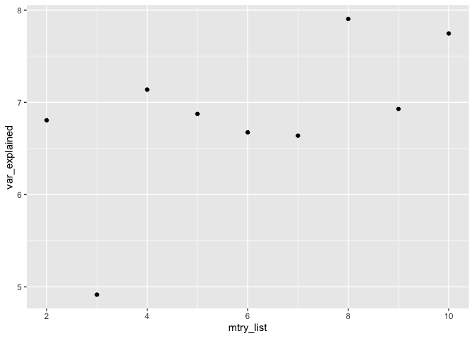

Model
-----

``` bash
# Define the base model architecture
def simple_CNN_GRU(filter_conv,
                         kernel_size,
                         maxpool_size,
                         activation_conv,
                         gru_hidden_units,
                   opt_dropout,
                   opt_dropout_recurrent,
                   opt_go_backwards,
                   reg_rate,
                         optimizers):
  model = Sequential()
  model.add(Conv1D(filters = filter_conv,
                       kernel_size = kernel_size,
                       strides = 1,
                     activation = activation_conv,
                     input_shape =  (4034, 20)))
  model.add(MaxPooling1D(maxpool_size))
  model.add(Bidirectional(GRU(units = gru_hidden_units,
                                activation = 'tanh',
                                recurrent_activation = 'hard_sigmoid',
                                kernel_regularizer = regularizers.l2(reg_rate),
                                recurrent_regularizer = regularizers.l2(reg_rate),
                                dropout = opt_dropout,
                                recurrent_dropout = opt_dropout_recurrent,
                                go_backwards = opt_go_backwards)))
  model.add(Dense(1, activation = 'sigmoid'))
  model.compile(loss = 'binary_crossentropy',
                optimizer = optimizers,
                metrics = ['accuracy'])
  print(model.summary())
  return model
  
  
 model = simple_CNN_GRU(filter_conv = 8,
                                 kernel_size = 1,
                                 maxpool_size = 2,
                                 activation_conv = None,
                                 gru_hidden_units = 8,
                           opt_dropout = 0,
                           opt_dropout_recurrent = 0,
                           opt_go_backwards = 'TRUE',
                           reg_rate = 0.001,
                                 optimizers = 'Adam')

    # Fit the model
    history_fit = model.fit(x_train[train], y_train[train], epochs = 60, batch_size = 8, verbose = 1, shuffle = 1, validation_data = (x_train[test], y_train[test]))
```

Load library
------------

### CNN-GRU results

``` r
# Load data for 30 epochs
fungi_cnn_gru_train_30epochs <- data.table::fread("../../../../../results/secreted_data_run_manually/fungi/df_results_train_cnn_gru_best_fungi.csv")
fungi_cnn_gru_val_30epochs <- data.table::fread("../../../../../results/secreted_data_run_manually/fungi/df_results_val_cnn_gru_best_fungi.csv")
fungi_cnn_gru_test_30epochs <- data.table::fread("../../../../../results/secreted_data_run_manually/fungi/df_results_test_cnn_gru_best_fungi.csv")


# Adding the average on the table 

fungi_cnn_gru_train_30epochs <- fungi_cnn_gru_train_30epochs %>% 
  dplyr::mutate(AVG_CV = rowMeans(.[,2:6]))

fungi_cnn_gru_val_30epochs <- fungi_cnn_gru_val_30epochs %>% 
  dplyr::mutate(AVG_CV =rowMeans(.[,2:6]))
```

``` r
get_gg_acc(fungi_cnn_gru_train_30epochs, fungi_cnn_gru_val_30epochs,  plot_title = "") +
  facet_wrap(~CV, nrow = 2 )
```

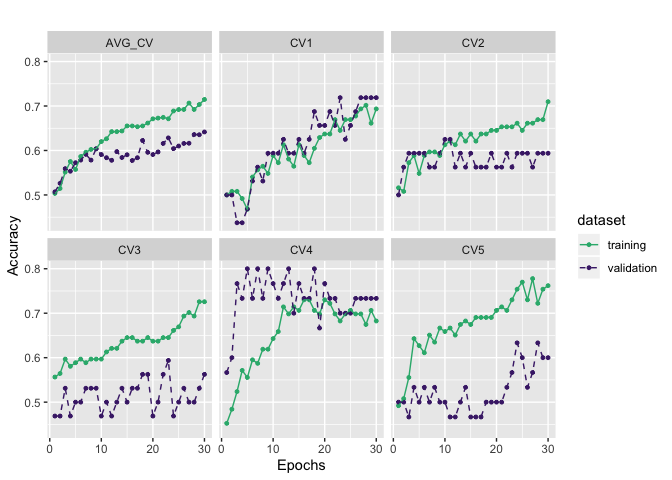

#### Change the epochs – train the model longer

From the figure above, it seems that the accuracy can increase futher,
therefore increasing the number epochs will give us better idea:

``` r
# Load data results for 60 epochs
fungi_cnn_gru_train_60epochs <- data.table::fread("../../../../../results/secreted_data_run_manually/fungi/df_results_train_cnn_gru_best_fungi_60epochs.csv")
fungi_cnn_gru_val_60epochs <- data.table::fread("../../../../../results/secreted_data_run_manually/fungi/df_results_val_cnn_gru_best_fungi_60epochs.csv")
fungi_cnn_gru_test_60epochs <- data.table::fread("../../../../../results/secreted_data_run_manually/fungi/df_results_test_cnn_gru_best_fungi_60epochs.csv")

# Load data results for 100 epochs
fungi_cnn_gru_train_100epochs <- data.table::fread("../../../../../results/secreted_data_run_manually/fungi/df_results_train_cnn_gru_best_fungi_100epochs.csv")
fungi_cnn_gru_val_100epochs <- data.table::fread("../../../../../results/secreted_data_run_manually/fungi/df_results_val_cnn_gru_best_fungi_100epochs.csv")
fungi_cnn_gru_test_100epochs <- data.table::fread("../../../../../results/secreted_data_run_manually/fungi/df_results_test_cnn_gru_best_fungi_100epochs.csv")
```

``` r
# Adding the average for the training models with 60 epochs
fungi_cnn_gru_train_60epochs <- fungi_cnn_gru_train_60epochs %>% 
  dplyr::mutate(AVG_CV = rowMeans(.[,2:6]))

fungi_cnn_gru_val_60epochs <- fungi_cnn_gru_val_60epochs %>% 
  dplyr::mutate(AVG_CV =rowMeans(.[,2:6]))

# Adding the average for the training models with 100 epochs
fungi_cnn_gru_train_100epochs <- fungi_cnn_gru_train_100epochs %>% 
  dplyr::mutate(AVG_CV = rowMeans(.[,2:6]))

fungi_cnn_gru_val_100epochs <- fungi_cnn_gru_val_100epochs %>% 
  dplyr::mutate(AVG_CV =rowMeans(.[,2:6]))
```

``` r
# Results with 60 epochs
get_gg_acc(fungi_cnn_gru_train_60epochs, fungi_cnn_gru_val_60epochs) +
   facet_wrap(~CV, nrow = 2)
```

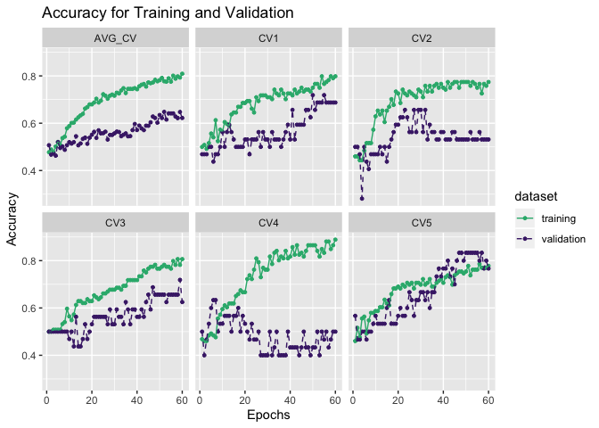

``` r
# Results with 60 epochs
get_gg_acc(fungi_cnn_gru_train_100epochs, fungi_cnn_gru_val_100epochs) +
   facet_wrap(~CV, nrow = 2)
```

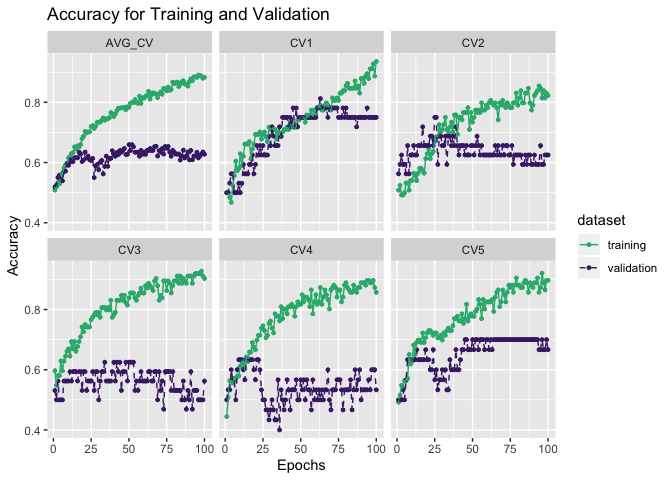

#### Comparing three prediction results on the test data with different epochs

``` r
diff_epochs <- rbind(fungi_cnn_gru_test_30epochs  %>% 
  dplyr::select(V1, acc) %>% 
    dplyr::mutate(epochs = 30),
  fungi_cnn_gru_test_60epochs  %>% 
  dplyr::select(V1, acc)  %>% 
    dplyr::mutate(epochs = 60), 
  fungi_cnn_gru_test_100epochs  %>% 
  dplyr::select(V1, acc)  %>% 
    dplyr::mutate(epochs = 100))

plot_comparison(diff_epochs , V1, acc, epochs, show_label = TRUE, label_digits = 3) 
```

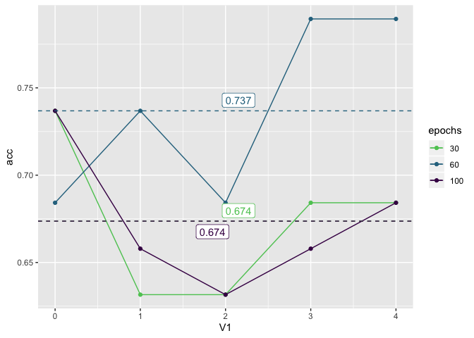

From the results above, as we can see, the longer we train the data, the
hinger the gap between training accuracy and validation accuracy,
meaning the model is overfitting here.

#### Change the value of regularion rate from `0.001 to 0.01`

``` r
# Load data for 30 epochs
cnn_gru_train_60epochs_regrate001 <- data.table::fread("../../../../../results/secreted_data_run_manually/fungi/df_results_train_cnn_gru_best_fungi_60epochs_regrate001.csv")
cnn_gru_val_60epochs_regrate001 <- data.table::fread("../../../../../results/secreted_data_run_manually/fungi/df_results_val_cnn_gru_best_fungi_60epochs_regrate001.csv")
cnn_gru_test_60epochs_regrate001 <- data.table::fread("../../../../../results/secreted_data_run_manually/fungi/df_results_test_cnn_gru_best_fungi_60epochs_regrate001.csv")


# Adding the average on the table 

cnn_gru_train_60epochs_regrate001 <- cnn_gru_train_60epochs_regrate001 %>% 
  dplyr::mutate(AVG_CV = rowMeans(.[,2:6]))

cnn_gru_val_60epochs_regrate001 <- cnn_gru_val_60epochs_regrate001 %>% 
  dplyr::mutate(AVG_CV =rowMeans(.[,2:6]))

get_gg_acc(cnn_gru_train_60epochs_regrate001, cnn_gru_val_60epochs_regrate001) +
   facet_wrap(~CV, nrow = 2)
```

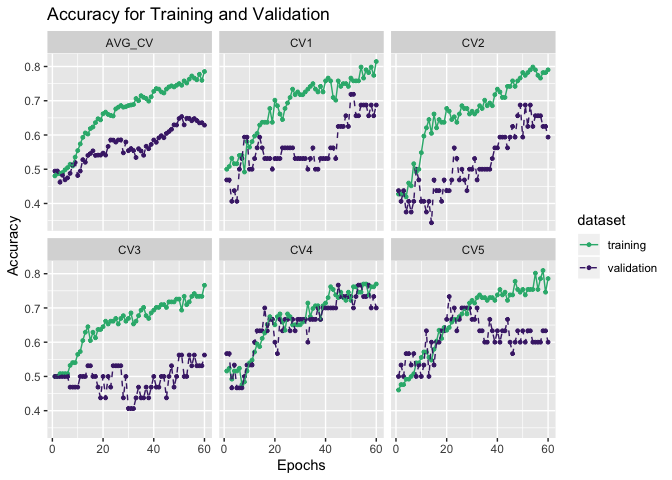

``` r
# Results with 60 epochs
get_gg_acc(fungi_cnn_gru_train_60epochs, fungi_cnn_gru_val_60epochs) +
   facet_wrap(~CV, nrow = 2)
```


#### Comparing the prediction results with different regularization rate

``` r
compare_test_pred <- fungi_cnn_gru_test_60epochs %>% 
  dplyr::select(V1, acc) %>% 
  mutate(Regrate = "0.001") %>% 
  rbind(cnn_gru_test_60epochs_regrate001 %>% 
          dplyr::select(V1, acc) %>% 
          mutate(Regrate = "0.01")) %>% 
  `colnames<-` (c("CV", "acc", "regrate"))
```

``` r
plot_comparison(
  data = compare_test_pred ,
  x_var = CV,
  y_var = acc,
  group_var = regrate
)
```

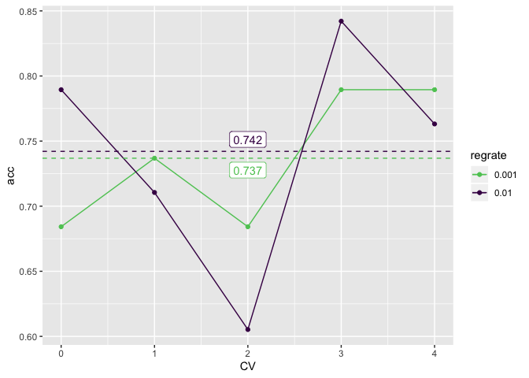

Chnaging the filter to have higher filter

simple\_CNN\_GRU(filter\_conv = 16, kernel\_size = 1, maxpool\_size = 2,
activation\_conv = None, gru\_hidden\_units = 8, opt\_dropout = 0,
opt\_dropout\_recurrent = 0, opt\_go\_backwards = ‘TRUE’, reg\_rate =
0.01, optimizers = ‘Adam’)

epochs = 16

``` r
fungi_cnn_gru_train_filterconv16 <- data.table::fread("../../../../../results/secreted_data_run_manually/fungi/df_results_train_cnn_gru_best_fungi_60epochs_filterconv16.csv")
fungi_cnn_gru_val_filterconv16 <- data.table::fread("../../../../../results/secreted_data_run_manually/fungi/df_results_val_cnn_gru_best_fungi_60epochs_filterconv16.csv")
fungi_cnn_gru_test_filterconv16 <- data.table::fread("../../../../../results/secreted_data_run_manually/fungi/df_results_test_cnn_gru_best_fungi_60epochs_filterconv16.csv")


fungi_cnn_gru_train_filterconv16 <- fungi_cnn_gru_train_filterconv16 %>% 
  mutate(AVG_CV = rowMeans(.[,2:6]))

fungi_cnn_gru_val_filterconv16 <- fungi_cnn_gru_val_filterconv16 %>% 
  mutate(AVG_CV = rowMeans(.[,2:6]))
```

``` r
get_gg_acc(fungi_cnn_gru_train_filterconv16, fungi_cnn_gru_val_filterconv16) +
   facet_wrap(~CV, nrow = 2)
```

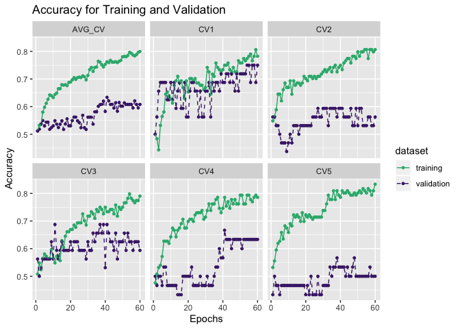

It seems if we are using filter convolution = 16, it is more overfitting
than using only 8. Therefore, we will stick with filter conv = 8. And
now I am going to introduce dropout to the system, using the

``` r
fungi_cnn_gru_train_filterconv8_drop025 <- data.table::fread("../../../../../results/secreted_data_run_manually/fungi/df_results_train_cnn_gru_best_fungi_60epochs_filterconv8_drop025.csv")

fungi_cnn_gru_val_filterconv8_drop025 <- data.table::fread("../../../../../results/secreted_data_run_manually/fungi/df_results_val_cnn_gru_best_fungi_60epochs_filterconv8_drop025.csv")

fungi_cnn_gru_test_filterconv8_drop025 <- data.table::fread("../../../../../results/secreted_data_run_manually/fungi/df_results_test_cnn_gru_best_fungi_60epochs_filterconv8_drop025.csv")


fungi_cnn_gru_train_filterconv8_drop025 <- fungi_cnn_gru_train_filterconv8_drop025 %>% 
  mutate(AVG_CV = rowMeans(.[,2:6]))

fungi_cnn_gru_val_filterconv8_drop025 <- fungi_cnn_gru_val_filterconv8_drop025 %>% 
  mutate(AVG_CV = rowMeans(.[,2:6]))
```

``` r
get_gg_acc(fungi_cnn_gru_train_filterconv8_drop025, fungi_cnn_gru_val_filterconv8_drop025) +
   facet_wrap(~CV, nrow = 2)
```

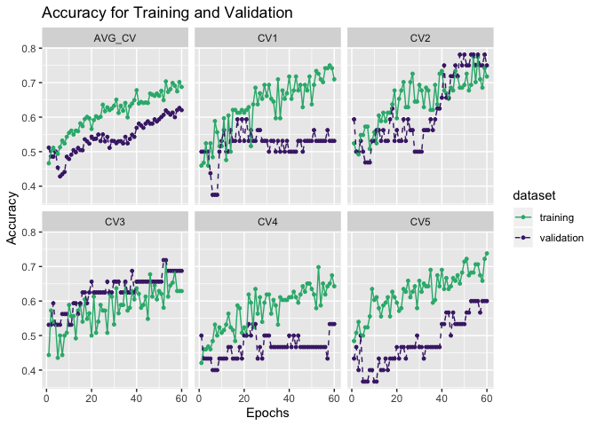

``` r
fungi_cnn_gru_test_filterconv8_drop025
```

    ##    V1       acc sensitivity specifity
    ## 1:  0 0.7631579   0.7894737 0.7368421
    ## 2:  1 0.6842105   0.5263158 0.8421053
    ## 3:  2 0.6578947   0.6315789 0.6842105
    ## 4:  3 0.5789474   0.5789474 0.5789474
    ## 5:  4 0.6578947   0.6315789 0.6842105

``` r
fungi_cnn_gru_test_60epochs
```

    ##    V1       acc sensitivity specifity
    ## 1:  0 0.6842105   0.8421053 0.5263158
    ## 2:  1 0.7368421   0.5789474 0.8947368
    ## 3:  2 0.6842105   0.7368421 0.6315789
    ## 4:  3 0.7894737   0.7368421 0.8421053
    ## 5:  4 0.7894737   0.7894737 0.7894737

``` r
compare_test_pred_with_diff_dropout <- fungi_cnn_gru_test_60epochs %>% 
  dplyr::select(V1, acc) %>% 
  mutate(Dropout = 0) %>% 
  rbind(fungi_cnn_gru_test_filterconv8_drop025 %>% 
          dplyr::select(V1, acc) %>% 
          mutate(Dropout = 0.25)) %>% 
  `colnames<-` (c("CV", "Acc", "Dropout"))
```

``` r
plot_comparison(
  data = compare_test_pred_with_diff_dropout,
  x_var = CV,
  y_var = Acc,
  group_var = Dropout
)
```

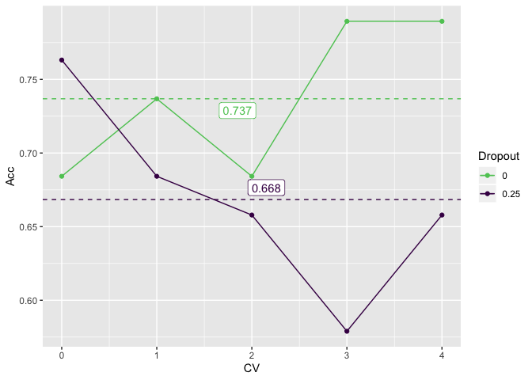

GRU - Embedding
---------------

``` r
fungi_gru_embeding_all <- data.table::fread("../../../../../data/secreted_data/training-results/fungi/fungi_scan_results_gru_embedding_scan_fungi.csv") %>% 
  select(params, mean_test_score)

fungi_gru_embeding_all %>% 
  # dplyr::filter(params == "{‘reg_rate’: 0.001, ‘outputdim’: 16, ‘optimizers’: ‘Adam’, ‘opt_go_backwards’: ‘FALSE’, ‘opt_dropout_recurrent’: 0, ‘opt_dropout’: 0, ‘gru_hidden_units’: 32, ‘epochs’: 30, ‘batch_size’: 8}") %>% 
  dplyr::arrange(desc(mean_test_score)) %>%
  head(20) %>% 
  knitr::kable()
```

| params                                                                                                                                                                                                     |  mean\_test\_score|
|:-----------------------------------------------------------------------------------------------------------------------------------------------------------------------------------------------------------|------------------:|
| {‘reg\_rate’: 0.001, ‘outputdim’: 16, ‘optimizers’: ‘Adam’, ‘opt\_go\_backwards’: ‘FALSE’, ‘opt\_dropout\_recurrent’: 0, ‘opt\_dropout’: 0, ‘gru\_hidden\_units’: 16, ‘epochs’: 30, ‘batch\_size’: 8}      |          0.7115385|
| {‘reg\_rate’: 0.001, ‘outputdim’: 16, ‘optimizers’: ‘Adam’, ‘opt\_go\_backwards’: ‘FALSE’, ‘opt\_dropout\_recurrent’: 0, ‘opt\_dropout’: 0, ‘gru\_hidden\_units’: 32, ‘epochs’: 30, ‘batch\_size’: 8}      |          0.7051282|
| {‘reg\_rate’: 0.001, ‘outputdim’: 16, ‘optimizers’: ‘Adam’, ‘opt\_go\_backwards’: ‘TRUE’, ‘opt\_dropout\_recurrent’: 0, ‘opt\_dropout’: 0, ‘gru\_hidden\_units’: 32, ‘epochs’: 30, ‘batch\_size’: 8}       |          0.7051282|
| {‘reg\_rate’: 0.001, ‘outputdim’: 32, ‘optimizers’: ‘Adam’, ‘opt\_go\_backwards’: ‘FALSE’, ‘opt\_dropout\_recurrent’: 0, ‘opt\_dropout’: 0, ‘gru\_hidden\_units’: 16, ‘epochs’: 30, ‘batch\_size’: 8}      |          0.7051282|
| {‘reg\_rate’: 0.001, ‘outputdim’: 32, ‘optimizers’: ‘Adam’, ‘opt\_go\_backwards’: ‘TRUE’, ‘opt\_dropout\_recurrent’: 0, ‘opt\_dropout’: 0, ‘gru\_hidden\_units’: 16, ‘epochs’: 30, ‘batch\_size’: 16}      |          0.6987180|
| {‘reg\_rate’: 0.001, ‘outputdim’: 32, ‘optimizers’: ‘Adadelta’, ‘opt\_go\_backwards’: ‘TRUE’, ‘opt\_dropout\_recurrent’: 0, ‘opt\_dropout’: 0, ‘gru\_hidden\_units’: 16, ‘epochs’: 30, ‘batch\_size’: 16}  |          0.6987180|
| {‘reg\_rate’: 0.001, ‘outputdim’: 16, ‘optimizers’: ‘Adam’, ‘opt\_go\_backwards’: ‘TRUE’, ‘opt\_dropout\_recurrent’: 0, ‘opt\_dropout’: 0, ‘gru\_hidden\_units’: 8, ‘epochs’: 30, ‘batch\_size’: 8}        |          0.6923077|
| {‘reg\_rate’: 0.001, ‘outputdim’: 32, ‘optimizers’: ‘Adadelta’, ‘opt\_go\_backwards’: ‘FALSE’, ‘opt\_dropout\_recurrent’: 0, ‘opt\_dropout’: 0, ‘gru\_hidden\_units’: 16, ‘epochs’: 30, ‘batch\_size’: 16} |          0.6858974|
| {‘reg\_rate’: 0.001, ‘outputdim’: 8, ‘optimizers’: ‘Adam’, ‘opt\_go\_backwards’: ‘TRUE’, ‘opt\_dropout\_recurrent’: 0, ‘opt\_dropout’: 0, ‘gru\_hidden\_units’: 32, ‘epochs’: 30, ‘batch\_size’: 8}        |          0.6858974|
| {‘reg\_rate’: 0.01, ‘outputdim’: 32, ‘optimizers’: ‘Adam’, ‘opt\_go\_backwards’: ‘FALSE’, ‘opt\_dropout\_recurrent’: 0, ‘opt\_dropout’: 0, ‘gru\_hidden\_units’: 16, ‘epochs’: 30, ‘batch\_size’: 8}       |          0.6666667|
| {‘reg\_rate’: 0.01, ‘outputdim’: 16, ‘optimizers’: ‘Adam’, ‘opt\_go\_backwards’: ‘FALSE’, ‘opt\_dropout\_recurrent’: 0, ‘opt\_dropout’: 0, ‘gru\_hidden\_units’: 32, ‘epochs’: 30, ‘batch\_size’: 8}       |          0.6666667|
| {‘reg\_rate’: 0.001, ‘outputdim’: 16, ‘optimizers’: ‘Adadelta’, ‘opt\_go\_backwards’: ‘TRUE’, ‘opt\_dropout\_recurrent’: 0, ‘opt\_dropout’: 0, ‘gru\_hidden\_units’: 8, ‘epochs’: 30, ‘batch\_size’: 16}   |          0.6538462|
| {‘reg\_rate’: 0.01, ‘outputdim’: 32, ‘optimizers’: ‘Adam’, ‘opt\_go\_backwards’: ‘TRUE’, ‘opt\_dropout\_recurrent’: 0, ‘opt\_dropout’: 0, ‘gru\_hidden\_units’: 16, ‘epochs’: 30, ‘batch\_size’: 8}        |          0.6538462|
| {‘reg\_rate’: 0.001, ‘outputdim’: 16, ‘optimizers’: ‘Adadelta’, ‘opt\_go\_backwards’: ‘TRUE’, ‘opt\_dropout\_recurrent’: 0, ‘opt\_dropout’: 0, ‘gru\_hidden\_units’: 32, ‘epochs’: 30, ‘batch\_size’: 16}  |          0.6474359|
| {‘reg\_rate’: 0.01, ‘outputdim’: 32, ‘optimizers’: ‘Adam’, ‘opt\_go\_backwards’: ‘TRUE’, ‘opt\_dropout\_recurrent’: 0, ‘opt\_dropout’: 0, ‘gru\_hidden\_units’: 16, ‘epochs’: 30, ‘batch\_size’: 16}       |          0.6346154|
| {‘reg\_rate’: 0.01, ‘outputdim’: 16, ‘optimizers’: ‘Adadelta’, ‘opt\_go\_backwards’: ‘TRUE’, ‘opt\_dropout\_recurrent’: 0, ‘opt\_dropout’: 0, ‘gru\_hidden\_units’: 32, ‘epochs’: 30, ‘batch\_size’: 8}    |          0.6346154|
| {‘reg\_rate’: 0.01, ‘outputdim’: 32, ‘optimizers’: ‘Adam’, ‘opt\_go\_backwards’: ‘FALSE’, ‘opt\_dropout\_recurrent’: 0, ‘opt\_dropout’: 0, ‘gru\_hidden\_units’: 8, ‘epochs’: 30, ‘batch\_size’: 8}        |          0.6282051|
| {‘reg\_rate’: 0.01, ‘outputdim’: 16, ‘optimizers’: ‘Adadelta’, ‘opt\_go\_backwards’: ‘FALSE’, ‘opt\_dropout\_recurrent’: 0, ‘opt\_dropout’: 0, ‘gru\_hidden\_units’: 8, ‘epochs’: 30, ‘batch\_size’: 8}    |          0.6217949|
| {‘reg\_rate’: 0.01, ‘outputdim’: 32, ‘optimizers’: ‘Adam’, ‘opt\_go\_backwards’: ‘TRUE’, ‘opt\_dropout\_recurrent’: 0, ‘opt\_dropout’: 0, ‘gru\_hidden\_units’: 8, ‘epochs’: 30, ‘batch\_size’: 8}         |          0.6217949|
| {‘reg\_rate’: 0.01, ‘outputdim’: 8, ‘optimizers’: ‘Adam’, ‘opt\_go\_backwards’: ‘FALSE’, ‘opt\_dropout\_recurrent’: 0, ‘opt\_dropout’: 0, ‘gru\_hidden\_units’: 16, ‘epochs’: 30, ‘batch\_size’: 16}       |          0.6153846|

``` r
fungi_gru_embeding_all_pred <- data.table::fread("../../../../../data/secreted_data/training-results/fungi/df_pred_results_gru_embedding_scan_fungi.csv") 

fungi_gru_embeding_all_pred %>% 
  dplyr::arrange(desc(Accuracy)) %>% 
  knitr::kable()
```

|   V1| Parameters                                                                                                                                                                                                 |   Accuracy|  Sensitivity|  Specifity|
|----:|:-----------------------------------------------------------------------------------------------------------------------------------------------------------------------------------------------------------|----------:|------------:|----------:|
|    1| {‘reg\_rate’: 0.001, ‘outputdim’: 16, ‘optimizers’: ‘Adam’, ‘opt\_go\_backwards’: ‘FALSE’, ‘opt\_dropout\_recurrent’: 0, ‘opt\_dropout’: 0, ‘gru\_hidden\_units’: 32, ‘epochs’: 30, ‘batch\_size’: 8}      |  0.6315790|    0.6842105|  0.5789474|
|    9| {‘reg\_rate’: 0.01, ‘outputdim’: 32, ‘optimizers’: ‘Adam’, ‘opt\_go\_backwards’: ‘FALSE’, ‘opt\_dropout\_recurrent’: 0, ‘opt\_dropout’: 0, ‘gru\_hidden\_units’: 16, ‘epochs’: 30, ‘batch\_size’: 8}       |  0.6315789|    0.6315789|  0.6315789|
|   10| {‘reg\_rate’: 0.01, ‘outputdim’: 16, ‘optimizers’: ‘Adam’, ‘opt\_go\_backwards’: ‘FALSE’, ‘opt\_dropout\_recurrent’: 0, ‘opt\_dropout’: 0, ‘gru\_hidden\_units’: 32, ‘epochs’: 30, ‘batch\_size’: 8}       |  0.6315789|    0.6315789|  0.6315789|
|    0| {‘reg\_rate’: 0.001, ‘outputdim’: 16, ‘optimizers’: ‘Adam’, ‘opt\_go\_backwards’: ‘FALSE’, ‘opt\_dropout\_recurrent’: 0, ‘opt\_dropout’: 0, ‘gru\_hidden\_units’: 16, ‘epochs’: 30, ‘batch\_size’: 8}      |  0.6315789|    0.6842105|  0.5789474|
|    8| {‘reg\_rate’: 0.001, ‘outputdim’: 8, ‘optimizers’: ‘Adam’, ‘opt\_go\_backwards’: ‘TRUE’, ‘opt\_dropout\_recurrent’: 0, ‘opt\_dropout’: 0, ‘gru\_hidden\_units’: 32, ‘epochs’: 30, ‘batch\_size’: 8}        |  0.6315789|    0.7368421|  0.5263158|
|    4| {‘reg\_rate’: 0.001, ‘outputdim’: 32, ‘optimizers’: ‘Adam’, ‘opt\_go\_backwards’: ‘TRUE’, ‘opt\_dropout\_recurrent’: 0, ‘opt\_dropout’: 0, ‘gru\_hidden\_units’: 16, ‘epochs’: 30, ‘batch\_size’: 16}      |  0.6052632|    0.5789474|  0.6315789|
|    6| {‘reg\_rate’: 0.001, ‘outputdim’: 16, ‘optimizers’: ‘Adam’, ‘opt\_go\_backwards’: ‘TRUE’, ‘opt\_dropout\_recurrent’: 0, ‘opt\_dropout’: 0, ‘gru\_hidden\_units’: 8, ‘epochs’: 30, ‘batch\_size’: 8}        |  0.6052632|    0.5789474|  0.6315789|
|    5| {‘reg\_rate’: 0.001, ‘outputdim’: 32, ‘optimizers’: ‘Adadelta’, ‘opt\_go\_backwards’: ‘TRUE’, ‘opt\_dropout\_recurrent’: 0, ‘opt\_dropout’: 0, ‘gru\_hidden\_units’: 16, ‘epochs’: 30, ‘batch\_size’: 16}  |  0.5789474|    0.6842105|  0.4736842|
|    7| {‘reg\_rate’: 0.001, ‘outputdim’: 32, ‘optimizers’: ‘Adadelta’, ‘opt\_go\_backwards’: ‘FALSE’, ‘opt\_dropout\_recurrent’: 0, ‘opt\_dropout’: 0, ‘gru\_hidden\_units’: 16, ‘epochs’: 30, ‘batch\_size’: 16} |  0.5789474|    0.6842105|  0.4736842|
|   16| {‘reg\_rate’: 0.01, ‘outputdim’: 32, ‘optimizers’: ‘Adam’, ‘opt\_go\_backwards’: ‘FALSE’, ‘opt\_dropout\_recurrent’: 0, ‘opt\_dropout’: 0, ‘gru\_hidden\_units’: 8, ‘epochs’: 30, ‘batch\_size’: 8}        |  0.5789474|    0.6315789|  0.5263158|
|    3| {‘reg\_rate’: 0.001, ‘outputdim’: 32, ‘optimizers’: ‘Adam’, ‘opt\_go\_backwards’: ‘FALSE’, ‘opt\_dropout\_recurrent’: 0, ‘opt\_dropout’: 0, ‘gru\_hidden\_units’: 16, ‘epochs’: 30, ‘batch\_size’: 8}      |  0.5789474|    0.4736842|  0.6842105|
|   12| {‘reg\_rate’: 0.01, ‘outputdim’: 32, ‘optimizers’: ‘Adam’, ‘opt\_go\_backwards’: ‘TRUE’, ‘opt\_dropout\_recurrent’: 0, ‘opt\_dropout’: 0, ‘gru\_hidden\_units’: 16, ‘epochs’: 30, ‘batch\_size’: 8}        |  0.5526316|    0.6842105|  0.4210526|
|   13| {‘reg\_rate’: 0.001, ‘outputdim’: 16, ‘optimizers’: ‘Adadelta’, ‘opt\_go\_backwards’: ‘TRUE’, ‘opt\_dropout\_recurrent’: 0, ‘opt\_dropout’: 0, ‘gru\_hidden\_units’: 32, ‘epochs’: 30, ‘batch\_size’: 16}  |  0.5526316|    0.6315789|  0.4736842|
|    2| {‘reg\_rate’: 0.001, ‘outputdim’: 16, ‘optimizers’: ‘Adam’, ‘opt\_go\_backwards’: ‘TRUE’, ‘opt\_dropout\_recurrent’: 0, ‘opt\_dropout’: 0, ‘gru\_hidden\_units’: 32, ‘epochs’: 30, ‘batch\_size’: 8}       |  0.5526316|    0.4210526|  0.6842105|
|   11| {‘reg\_rate’: 0.001, ‘outputdim’: 16, ‘optimizers’: ‘Adadelta’, ‘opt\_go\_backwards’: ‘TRUE’, ‘opt\_dropout\_recurrent’: 0, ‘opt\_dropout’: 0, ‘gru\_hidden\_units’: 8, ‘epochs’: 30, ‘batch\_size’: 16}   |  0.5526316|    0.5263158|  0.5789474|
|   14| {‘reg\_rate’: 0.01, ‘outputdim’: 32, ‘optimizers’: ‘Adam’, ‘opt\_go\_backwards’: ‘TRUE’, ‘opt\_dropout\_recurrent’: 0, ‘opt\_dropout’: 0, ‘gru\_hidden\_units’: 16, ‘epochs’: 30, ‘batch\_size’: 16}       |  0.5263158|    0.5789474|  0.4736842|
|   15| {‘reg\_rate’: 0.01, ‘outputdim’: 16, ‘optimizers’: ‘Adadelta’, ‘opt\_go\_backwards’: ‘TRUE’, ‘opt\_dropout\_recurrent’: 0, ‘opt\_dropout’: 0, ‘gru\_hidden\_units’: 32, ‘epochs’: 30, ‘batch\_size’: 8}    |  0.5263158|    0.6315789|  0.4210526|
|   17| {‘reg\_rate’: 0.01, ‘outputdim’: 16, ‘optimizers’: ‘Adadelta’, ‘opt\_go\_backwards’: ‘FALSE’, ‘opt\_dropout\_recurrent’: 0, ‘opt\_dropout’: 0, ‘gru\_hidden\_units’: 8, ‘epochs’: 30, ‘batch\_size’: 8}    |  0.5263158|    0.6315789|  0.4210526|
|   18| {‘reg\_rate’: 0.01, ‘outputdim’: 32, ‘optimizers’: ‘Adam’, ‘opt\_go\_backwards’: ‘TRUE’, ‘opt\_dropout\_recurrent’: 0, ‘opt\_dropout’: 0, ‘gru\_hidden\_units’: 8, ‘epochs’: 30, ‘batch\_size’: 8}         |  0.5263158|    0.6315789|  0.4210526|
|   19| {‘reg\_rate’: 0.01, ‘outputdim’: 8, ‘optimizers’: ‘Adam’, ‘opt\_go\_backwards’: ‘FALSE’, ‘opt\_dropout\_recurrent’: 0, ‘opt\_dropout’: 0, ‘gru\_hidden\_units’: 16, ‘epochs’: 30, ‘batch\_size’: 16}       |  0.4473684|    0.5789474|  0.3157895|

### Manually running

``` r
fungi_gru_emb_train <-  data.table::fread("../../../../../results/secreted_data_run_manually/fungi/df_results_train_gru_emb_best_fungi.csv")
fungi_gru_emb_val <- data.table::fread("../../../../../results/secreted_data_run_manually/fungi/df_results_val_gru_emb_best_fungi.csv")


# Get the avergae of the acc for each cross validation
fungi_gru_emb_train <- fungi_gru_emb_train %>% 
  mutate(AVG_CV = rowMeans(.[,2:6]))

fungi_gru_emb_val <- fungi_gru_emb_val %>% 
  mutate(AVG_CV = rowMeans(.[,2:6]))
```

``` r
get_gg_acc(fungi_gru_emb_train, fungi_gru_emb_val) +
   facet_wrap(~CV, nrow = 2)
```

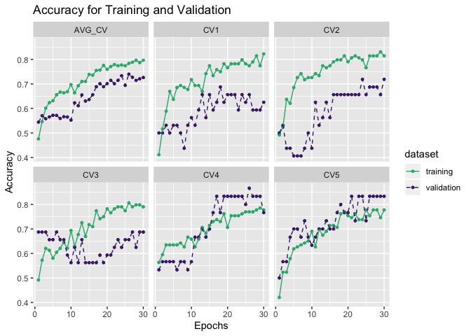

As we can see, it seems that the training need more epochs

``` r
fungi_gru_emb_test <- data.table::fread("../../../../../results/secreted_data_run_manually/fungi/df_results_test_gru_emb_best_fungi.csv")

fungi_gru_emb_test %>% 
  knitr::kable()
```

|   V1|        acc|  sensitivity|  specifity|
|----:|----------:|------------:|----------:|
|    0|  0.6842105|    0.6842105|  0.6842105|
|    1|  0.5789474|    0.5789474|  0.5789474|
|    2|  0.5789474|    0.6315789|  0.5263158|
|    3|  0.6315789|    0.6315789|  0.6315789|
|    4|  0.5789474|    0.6842105|  0.4736842|

More epochs:

``` r
fungi_gru_emb_train_60epochs <-  data.table::fread("../../../../../results/secreted_data_run_manually/fungi/df_results_train_gru_emb_best_fungi_60epochs.csv")
fungi_gru_emb_val_60epochs <- data.table::fread("../../../../../results/secreted_data_run_manually/fungi/df_results_val_gru_emb_best_fungi_60epochs.csv")
fungi_gru_emb_test_60epochs <- data.table::fread("../../../../../results/secreted_data_run_manually/fungi/df_results_test_gru_emb_best_fungi_60epochs.csv")


# Get the avergae of the acc for each cross validation
fungi_gru_emb_train_60epochs <- fungi_gru_emb_train_60epochs %>% 
  mutate(AVG_CV = rowMeans(.[,2:6]))

fungi_gru_emb_val_60epochs <- fungi_gru_emb_val_60epochs %>% 
  mutate(AVG_CV = rowMeans(.[,2:6]))
```

``` r
get_gg_acc(fungi_gru_emb_train_60epochs, fungi_gru_emb_val_60epochs) +
   facet_wrap(~CV, nrow = 2)
```

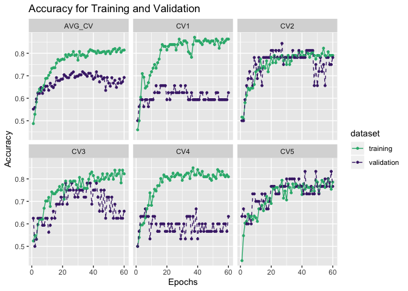

``` r
fungi_gru_emb_compare <- rbind(fungi_gru_emb_test %>% 
  dplyr::select(V1, acc) %>% 
    dplyr::mutate(epochs = 30), 
fungi_gru_emb_test_60epochs %>% 
    dplyr::select(V1, acc) %>% 
    dplyr::mutate(epochs = 60))

plot_comparison(fungi_gru_emb_compare, V1, acc, epochs, show_label = TRUE, label_digits = 3) 
```

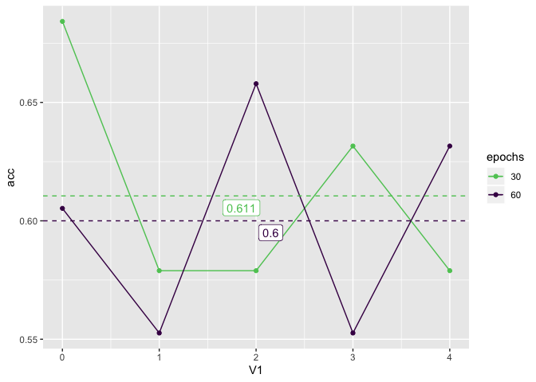

LSTM-Embedding
--------------

``` r
fungi_lstm_emb <- data.table::fread("../../../../../data/secreted_data/training-results/fungi/all_scan_results_lstm_emb_scan_fungi.csv") %>% 
  dplyr::select(params, mean_test_score)

fungi_lstm_emb %>% 
  dplyr::arrange(desc(mean_test_score)) %>% 
  knitr::kable()
```

| params                                                                                                                                                                                                    |  mean\_test\_score|
|:----------------------------------------------------------------------------------------------------------------------------------------------------------------------------------------------------------|------------------:|
| {‘reg\_rate’: 0.01, ‘outputdim’: 16, ‘optimizers’: ‘Adam’, ‘opt\_go\_backwards’: ‘FALSE’, ‘opt\_dropout\_recurrent’: 0, ‘opt\_dropout’: 0, ‘lstm\_hidden\_units’: 32, ‘epochs’: 30, ‘batch\_size’: 8}     |          0.7179487|
| {‘reg\_rate’: 0.01, ‘outputdim’: 16, ‘optimizers’: ‘Adam’, ‘opt\_go\_backwards’: ‘TRUE’, ‘opt\_dropout\_recurrent’: 0, ‘opt\_dropout’: 0.25, ‘lstm\_hidden\_units’: 32, ‘epochs’: 30, ‘batch\_size’: 8}   |          0.7179487|
| {‘reg\_rate’: 0.001, ‘outputdim’: 32, ‘optimizers’: ‘Adam’, ‘opt\_go\_backwards’: ‘TRUE’, ‘opt\_dropout\_recurrent’: 0, ‘opt\_dropout’: 0, ‘lstm\_hidden\_units’: 32, ‘epochs’: 30, ‘batch\_size’: 4}     |          0.7115385|
| {‘reg\_rate’: 0.01, ‘outputdim’: 32, ‘optimizers’: ‘Adam’, ‘opt\_go\_backwards’: ‘FALSE’, ‘opt\_dropout\_recurrent’: 0, ‘opt\_dropout’: 0.25, ‘lstm\_hidden\_units’: 32, ‘epochs’: 30, ‘batch\_size’: 4}  |          0.7115385|
| {‘reg\_rate’: 0.001, ‘outputdim’: 64, ‘optimizers’: ‘Adam’, ‘opt\_go\_backwards’: ‘TRUE’, ‘opt\_dropout\_recurrent’: 0, ‘opt\_dropout’: 0.25, ‘lstm\_hidden\_units’: 32, ‘epochs’: 30, ‘batch\_size’: 8}  |          0.6987180|
| {‘reg\_rate’: 0.01, ‘outputdim’: 64, ‘optimizers’: ‘Adam’, ‘opt\_go\_backwards’: ‘TRUE’, ‘opt\_dropout\_recurrent’: 0, ‘opt\_dropout’: 0, ‘lstm\_hidden\_units’: 32, ‘epochs’: 30, ‘batch\_size’: 8}      |          0.6987180|
| {‘reg\_rate’: 0.001, ‘outputdim’: 32, ‘optimizers’: ‘Adam’, ‘opt\_go\_backwards’: ‘TRUE’, ‘opt\_dropout\_recurrent’: 0, ‘opt\_dropout’: 0.25, ‘lstm\_hidden\_units’: 16, ‘epochs’: 30, ‘batch\_size’: 4}  |          0.6987179|
| {‘reg\_rate’: 0.001, ‘outputdim’: 32, ‘optimizers’: ‘Adam’, ‘opt\_go\_backwards’: ‘FALSE’, ‘opt\_dropout\_recurrent’: 0, ‘opt\_dropout’: 0.25, ‘lstm\_hidden\_units’: 16, ‘epochs’: 30, ‘batch\_size’: 4} |          0.6987179|
| {‘reg\_rate’: 0.001, ‘outputdim’: 16, ‘optimizers’: ‘Adam’, ‘opt\_go\_backwards’: ‘TRUE’, ‘opt\_dropout\_recurrent’: 0, ‘opt\_dropout’: 0, ‘lstm\_hidden\_units’: 32, ‘epochs’: 30, ‘batch\_size’: 4}     |          0.6987179|
| {‘reg\_rate’: 0.01, ‘outputdim’: 16, ‘optimizers’: ‘Adam’, ‘opt\_go\_backwards’: ‘TRUE’, ‘opt\_dropout\_recurrent’: 0, ‘opt\_dropout’: 0, ‘lstm\_hidden\_units’: 32, ‘epochs’: 30, ‘batch\_size’: 8}      |          0.6923077|
| {‘reg\_rate’: 0.001, ‘outputdim’: 64, ‘optimizers’: ‘Adam’, ‘opt\_go\_backwards’: ‘FALSE’, ‘opt\_dropout\_recurrent’: 0, ‘opt\_dropout’: 0, ‘lstm\_hidden\_units’: 32, ‘epochs’: 30, ‘batch\_size’: 8}    |          0.6858974|
| {‘reg\_rate’: 0.001, ‘outputdim’: 32, ‘optimizers’: ‘Adam’, ‘opt\_go\_backwards’: ‘FALSE’, ‘opt\_dropout\_recurrent’: 0, ‘opt\_dropout’: 0.25, ‘lstm\_hidden\_units’: 16, ‘epochs’: 30, ‘batch\_size’: 8} |          0.6858974|
| {‘reg\_rate’: 0.01, ‘outputdim’: 32, ‘optimizers’: ‘Adam’, ‘opt\_go\_backwards’: ‘TRUE’, ‘opt\_dropout\_recurrent’: 0, ‘opt\_dropout’: 0, ‘lstm\_hidden\_units’: 32, ‘epochs’: 30, ‘batch\_size’: 4}      |          0.6858974|
| {‘reg\_rate’: 0.01, ‘outputdim’: 64, ‘optimizers’: ‘Adam’, ‘opt\_go\_backwards’: ‘FALSE’, ‘opt\_dropout\_recurrent’: 0, ‘opt\_dropout’: 0.25, ‘lstm\_hidden\_units’: 16, ‘epochs’: 30, ‘batch\_size’: 4}  |          0.6858974|
| {‘reg\_rate’: 0.001, ‘outputdim’: 16, ‘optimizers’: ‘Adam’, ‘opt\_go\_backwards’: ‘FALSE’, ‘opt\_dropout\_recurrent’: 0, ‘opt\_dropout’: 0, ‘lstm\_hidden\_units’: 32, ‘epochs’: 30, ‘batch\_size’: 8}    |          0.6794872|
| {‘reg\_rate’: 0.01, ‘outputdim’: 32, ‘optimizers’: ‘Adam’, ‘opt\_go\_backwards’: ‘TRUE’, ‘opt\_dropout\_recurrent’: 0, ‘opt\_dropout’: 0, ‘lstm\_hidden\_units’: 32, ‘epochs’: 30, ‘batch\_size’: 8}      |          0.6794872|
| {‘reg\_rate’: 0.01, ‘outputdim’: 32, ‘optimizers’: ‘Adam’, ‘opt\_go\_backwards’: ‘TRUE’, ‘opt\_dropout\_recurrent’: 0, ‘opt\_dropout’: 0, ‘lstm\_hidden\_units’: 16, ‘epochs’: 30, ‘batch\_size’: 8}      |          0.6794872|
| {‘reg\_rate’: 0.01, ‘outputdim’: 32, ‘optimizers’: ‘Adam’, ‘opt\_go\_backwards’: ‘FALSE’, ‘opt\_dropout\_recurrent’: 0, ‘opt\_dropout’: 0.25, ‘lstm\_hidden\_units’: 16, ‘epochs’: 30, ‘batch\_size’: 4}  |          0.6794872|
| {‘reg\_rate’: 0.01, ‘outputdim’: 32, ‘optimizers’: ‘Adam’, ‘opt\_go\_backwards’: ‘FALSE’, ‘opt\_dropout\_recurrent’: 0, ‘opt\_dropout’: 0, ‘lstm\_hidden\_units’: 32, ‘epochs’: 30, ‘batch\_size’: 4}     |          0.6730769|
| {‘reg\_rate’: 0.001, ‘outputdim’: 64, ‘optimizers’: ‘Adam’, ‘opt\_go\_backwards’: ‘TRUE’, ‘opt\_dropout\_recurrent’: 0, ‘opt\_dropout’: 0, ‘lstm\_hidden\_units’: 32, ‘epochs’: 30, ‘batch\_size’: 8}     |          0.6666667|
| {‘reg\_rate’: 0.001, ‘outputdim’: 16, ‘optimizers’: ‘Adam’, ‘opt\_go\_backwards’: ‘TRUE’, ‘opt\_dropout\_recurrent’: 0, ‘opt\_dropout’: 0, ‘lstm\_hidden\_units’: 16, ‘epochs’: 30, ‘batch\_size’: 4}     |          0.6666667|
| {‘reg\_rate’: 0.001, ‘outputdim’: 64, ‘optimizers’: ‘Adam’, ‘opt\_go\_backwards’: ‘FALSE’, ‘opt\_dropout\_recurrent’: 0, ‘opt\_dropout’: 0.25, ‘lstm\_hidden\_units’: 16, ‘epochs’: 30, ‘batch\_size’: 8} |          0.6602564|
| {‘reg\_rate’: 0.001, ‘outputdim’: 32, ‘optimizers’: ‘Adam’, ‘opt\_go\_backwards’: ‘TRUE’, ‘opt\_dropout\_recurrent’: 0, ‘opt\_dropout’: 0, ‘lstm\_hidden\_units’: 16, ‘epochs’: 30, ‘batch\_size’: 8}     |          0.6602564|
| {‘reg\_rate’: 0.001, ‘outputdim’: 64, ‘optimizers’: ‘Adam’, ‘opt\_go\_backwards’: ‘FALSE’, ‘opt\_dropout\_recurrent’: 0, ‘opt\_dropout’: 0, ‘lstm\_hidden\_units’: 16, ‘epochs’: 30, ‘batch\_size’: 8}    |          0.6410256|
| {‘reg\_rate’: 0.001, ‘outputdim’: 32, ‘optimizers’: ‘sgd’, ‘opt\_go\_backwards’: ‘FALSE’, ‘opt\_dropout\_recurrent’: 0, ‘opt\_dropout’: 0.25, ‘lstm\_hidden\_units’: 16, ‘epochs’: 30, ‘batch\_size’: 4}  |          0.5320513|
| {‘reg\_rate’: 0.001, ‘outputdim’: 64, ‘optimizers’: ‘sgd’, ‘opt\_go\_backwards’: ‘FALSE’, ‘opt\_dropout\_recurrent’: 0, ‘opt\_dropout’: 0, ‘lstm\_hidden\_units’: 16, ‘epochs’: 30, ‘batch\_size’: 4}     |          0.5064103|
| {‘reg\_rate’: 0.001, ‘outputdim’: 64, ‘optimizers’: ‘sgd’, ‘opt\_go\_backwards’: ‘TRUE’, ‘opt\_dropout\_recurrent’: 0, ‘opt\_dropout’: 0.25, ‘lstm\_hidden\_units’: 16, ‘epochs’: 30, ‘batch\_size’: 8}   |          0.5000000|
| {‘reg\_rate’: 0.001, ‘outputdim’: 64, ‘optimizers’: ‘sgd’, ‘opt\_go\_backwards’: ‘TRUE’, ‘opt\_dropout\_recurrent’: 0, ‘opt\_dropout’: 0, ‘lstm\_hidden\_units’: 16, ‘epochs’: 30, ‘batch\_size’: 4}      |          0.4935897|
| {‘reg\_rate’: 0.001, ‘outputdim’: 16, ‘optimizers’: ‘sgd’, ‘opt\_go\_backwards’: ‘FALSE’, ‘opt\_dropout\_recurrent’: 0, ‘opt\_dropout’: 0, ‘lstm\_hidden\_units’: 16, ‘epochs’: 30, ‘batch\_size’: 4}     |          0.4935897|
| {‘reg\_rate’: 0.01, ‘outputdim’: 16, ‘optimizers’: ‘sgd’, ‘opt\_go\_backwards’: ‘TRUE’, ‘opt\_dropout\_recurrent’: 0, ‘opt\_dropout’: 0, ‘lstm\_hidden\_units’: 16, ‘epochs’: 30, ‘batch\_size’: 4}       |          0.4871795|
| {‘reg\_rate’: 0.001, ‘outputdim’: 16, ‘optimizers’: ‘sgd’, ‘opt\_go\_backwards’: ‘FALSE’, ‘opt\_dropout\_recurrent’: 0, ‘opt\_dropout’: 0, ‘lstm\_hidden\_units’: 32, ‘epochs’: 30, ‘batch\_size’: 4}     |          0.4871795|
| {‘reg\_rate’: 0.001, ‘outputdim’: 32, ‘optimizers’: ‘sgd’, ‘opt\_go\_backwards’: ‘TRUE’, ‘opt\_dropout\_recurrent’: 0, ‘opt\_dropout’: 0.25, ‘lstm\_hidden\_units’: 16, ‘epochs’: 30, ‘batch\_size’: 8}   |          0.4807692|
| {‘reg\_rate’: 0.001, ‘outputdim’: 16, ‘optimizers’: ‘sgd’, ‘opt\_go\_backwards’: ‘TRUE’, ‘opt\_dropout\_recurrent’: 0, ‘opt\_dropout’: 0.25, ‘lstm\_hidden\_units’: 32, ‘epochs’: 30, ‘batch\_size’: 4}   |          0.4807692|
| {‘reg\_rate’: 0.001, ‘outputdim’: 16, ‘optimizers’: ‘sgd’, ‘opt\_go\_backwards’: ‘FALSE’, ‘opt\_dropout\_recurrent’: 0, ‘opt\_dropout’: 0, ‘lstm\_hidden\_units’: 16, ‘epochs’: 30, ‘batch\_size’: 8}     |          0.4743590|
| {‘reg\_rate’: 0.001, ‘outputdim’: 32, ‘optimizers’: ‘sgd’, ‘opt\_go\_backwards’: ‘TRUE’, ‘opt\_dropout\_recurrent’: 0, ‘opt\_dropout’: 0, ‘lstm\_hidden\_units’: 16, ‘epochs’: 30, ‘batch\_size’: 8}      |          0.4743590|
| {‘reg\_rate’: 0.01, ‘outputdim’: 32, ‘optimizers’: ‘sgd’, ‘opt\_go\_backwards’: ‘TRUE’, ‘opt\_dropout\_recurrent’: 0, ‘opt\_dropout’: 0.25, ‘lstm\_hidden\_units’: 16, ‘epochs’: 30, ‘batch\_size’: 8}    |          0.4679487|
| {‘reg\_rate’: 0.01, ‘outputdim’: 64, ‘optimizers’: ‘sgd’, ‘opt\_go\_backwards’: ‘FALSE’, ‘opt\_dropout\_recurrent’: 0, ‘opt\_dropout’: 0, ‘lstm\_hidden\_units’: 32, ‘epochs’: 30, ‘batch\_size’: 4}      |          0.4679487|
| {‘reg\_rate’: 0.001, ‘outputdim’: 32, ‘optimizers’: ‘sgd’, ‘opt\_go\_backwards’: ‘TRUE’, ‘opt\_dropout\_recurrent’: 0, ‘opt\_dropout’: 0.25, ‘lstm\_hidden\_units’: 32, ‘epochs’: 30, ‘batch\_size’: 4}   |          0.4679487|
| {‘reg\_rate’: 0.01, ‘outputdim’: 16, ‘optimizers’: ‘sgd’, ‘opt\_go\_backwards’: ‘FALSE’, ‘opt\_dropout\_recurrent’: 0, ‘opt\_dropout’: 0.25, ‘lstm\_hidden\_units’: 16, ‘epochs’: 30, ‘batch\_size’: 4}   |          0.4679487|
| {‘reg\_rate’: 0.001, ‘outputdim’: 16, ‘optimizers’: ‘sgd’, ‘opt\_go\_backwards’: ‘FALSE’, ‘opt\_dropout\_recurrent’: 0, ‘opt\_dropout’: 0, ‘lstm\_hidden\_units’: 32, ‘epochs’: 30, ‘batch\_size’: 8}     |          0.4615385|
| {‘reg\_rate’: 0.01, ‘outputdim’: 32, ‘optimizers’: ‘sgd’, ‘opt\_go\_backwards’: ‘TRUE’, ‘opt\_dropout\_recurrent’: 0, ‘opt\_dropout’: 0, ‘lstm\_hidden\_units’: 32, ‘epochs’: 30, ‘batch\_size’: 8}       |          0.4615385|
| {‘reg\_rate’: 0.001, ‘outputdim’: 16, ‘optimizers’: ‘sgd’, ‘opt\_go\_backwards’: ‘TRUE’, ‘opt\_dropout\_recurrent’: 0, ‘opt\_dropout’: 0, ‘lstm\_hidden\_units’: 32, ‘epochs’: 30, ‘batch\_size’: 4}      |          0.4615385|
| {‘reg\_rate’: 0.001, ‘outputdim’: 64, ‘optimizers’: ‘sgd’, ‘opt\_go\_backwards’: ‘TRUE’, ‘opt\_dropout\_recurrent’: 0, ‘opt\_dropout’: 0, ‘lstm\_hidden\_units’: 16, ‘epochs’: 30, ‘batch\_size’: 8}      |          0.4551282|
| {‘reg\_rate’: 0.001, ‘outputdim’: 16, ‘optimizers’: ‘sgd’, ‘opt\_go\_backwards’: ‘TRUE’, ‘opt\_dropout\_recurrent’: 0, ‘opt\_dropout’: 0.25, ‘lstm\_hidden\_units’: 32, ‘epochs’: 30, ‘batch\_size’: 8}   |          0.4551282|
| {‘reg\_rate’: 0.01, ‘outputdim’: 16, ‘optimizers’: ‘sgd’, ‘opt\_go\_backwards’: ‘TRUE’, ‘opt\_dropout\_recurrent’: 0, ‘opt\_dropout’: 0.25, ‘lstm\_hidden\_units’: 16, ‘epochs’: 30, ‘batch\_size’: 8}    |          0.4551282|
| {‘reg\_rate’: 0.01, ‘outputdim’: 16, ‘optimizers’: ‘sgd’, ‘opt\_go\_backwards’: ‘TRUE’, ‘opt\_dropout\_recurrent’: 0, ‘opt\_dropout’: 0, ‘lstm\_hidden\_units’: 16, ‘epochs’: 30, ‘batch\_size’: 8}       |          0.4551282|
| {‘reg\_rate’: 0.001, ‘outputdim’: 16, ‘optimizers’: ‘sgd’, ‘opt\_go\_backwards’: ‘FALSE’, ‘opt\_dropout\_recurrent’: 0, ‘opt\_dropout’: 0.25, ‘lstm\_hidden\_units’: 16, ‘epochs’: 30, ‘batch\_size’: 8}  |          0.4551282|
| {‘reg\_rate’: 0.001, ‘outputdim’: 32, ‘optimizers’: ‘sgd’, ‘opt\_go\_backwards’: ‘FALSE’, ‘opt\_dropout\_recurrent’: 0, ‘opt\_dropout’: 0.25, ‘lstm\_hidden\_units’: 32, ‘epochs’: 30, ‘batch\_size’: 8}  |          0.4551282|
| {‘reg\_rate’: 0.001, ‘outputdim’: 64, ‘optimizers’: ‘sgd’, ‘opt\_go\_backwards’: ‘FALSE’, ‘opt\_dropout\_recurrent’: 0, ‘opt\_dropout’: 0, ‘lstm\_hidden\_units’: 32, ‘epochs’: 30, ‘batch\_size’: 8}     |          0.4551282|
| {‘reg\_rate’: 0.001, ‘outputdim’: 64, ‘optimizers’: ‘sgd’, ‘opt\_go\_backwards’: ‘FALSE’, ‘opt\_dropout\_recurrent’: 0, ‘opt\_dropout’: 0.25, ‘lstm\_hidden\_units’: 16, ‘epochs’: 30, ‘batch\_size’: 8}  |          0.4551282|

### Manually running

``` r
fungi_lstm_emb_train <-  data.table::fread("../../../../../results/secreted_data_run_manually/fungi/df_results_train_lstm_emb_fungi.csv")
fungi_lstm_emb_val <- data.table::fread("../../../../../results/secreted_data_run_manually/fungi/df_results_val_lstm_emb_fungi.csv")
fungi_lstm_emb_test <- data.table::fread("../../../../../results/secreted_data_run_manually/fungi/df_results_test_lstm_emb_fungi.csv")


# Get the avergae of the acc for each cross validation
fungi_lstm_emb_train <- fungi_lstm_emb_train %>% 
  mutate(AVG_CV = rowMeans(.[,2:6]))

fungi_lstm_emb_val <- fungi_lstm_emb_val %>% 
  mutate(AVG_CV = rowMeans(.[,2:6]))

fungi_lstm_emb_test %>% 
  knitr::kable()
```

|   V1|        acc|  sensitivity|  specifity|
|----:|----------:|------------:|----------:|
|    0|  0.7105263|    0.7894737|  0.6315789|
|    1|  0.5526316|    0.4210526|  0.6842105|
|    2|  0.5789474|    0.4210526|  0.7368421|
|    3|  0.6315789|    0.6842105|  0.5789474|
|    4|  0.7105263|    0.6842105|  0.7368421|

``` r
get_gg_acc(fungi_lstm_emb_train, fungi_lstm_emb_val) +
   facet_wrap(~CV, nrow = 2)
```

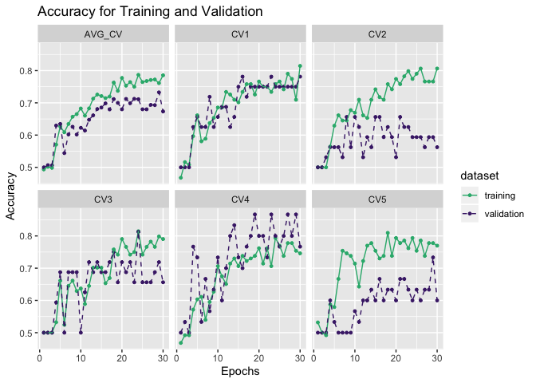

``` r
fungi_lstm_emb_train_60epochs <-  data.table::fread("../../../../../results/secreted_data_run_manually/fungi/df_results_train_lstm_emb_fungi_60epochs.csv")
fungi_lstm_emb_val_60epochs <-  data.table::fread("../../../../../results/secreted_data_run_manually/fungi/df_results_val_lstm_emb_fungi_60epochs.csv")
fungi_lstm_emb_test_60epochs <-  data.table::fread("../../../../../results/secreted_data_run_manually/fungi/df_results_test_lstm_emb_fungi_60epochs.csv")

# Get the avergae of the acc for each cross validation
fungi_lstm_emb_train_60epochs <- fungi_lstm_emb_train_60epochs %>% 
  mutate(AVG_CV = rowMeans(.[,2:6]))

fungi_lstm_emb_val_60epochs <- fungi_lstm_emb_val_60epochs %>% 
  mutate(AVG_CV = rowMeans(.[,2:6]))
```

``` r
get_gg_acc(fungi_lstm_emb_train_60epochs, fungi_lstm_emb_val_60epochs) +
   facet_wrap(~CV, nrow = 2)
```

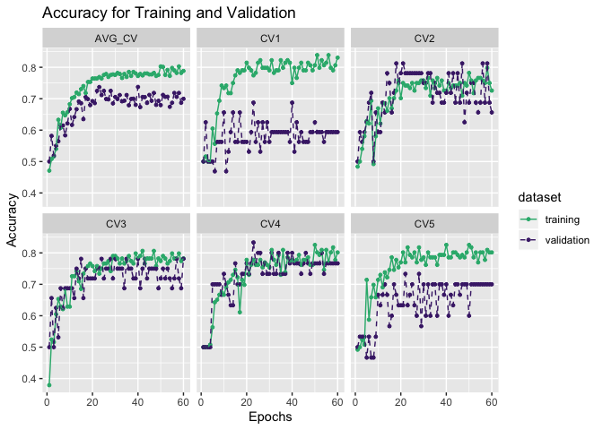

``` r
fungi_lstm_emb_test_60epochs %>% 
  knitr::kable()
```

|   V1|        acc|  sensitivity|  specifity|
|----:|----------:|------------:|----------:|
|    0|  0.6578947|    0.6842105|  0.6315789|
|    1|  0.6315789|    0.6842105|  0.5789474|
|    2|  0.6578947|    0.5789474|  0.7368421|
|    3|  0.6842105|    0.7368421|  0.6315789|
|    4|  0.6842105|    0.6315789|  0.7368421|

Making comparison on the test data

``` r
fungi_lstm_emb_compare <- rbind(fungi_lstm_emb_test %>% 
  dplyr::select(V1, acc) %>% 
    dplyr::mutate(epochs = 30), 
 fungi_lstm_emb_test_60epochs %>% 
    dplyr::select(V1, acc) %>% 
    dplyr::mutate(epochs = 60))
```

``` r
plot_comparison(fungi_lstm_emb_compare, V1, acc, epochs, show_label = TRUE, label_digits = 3) 
```

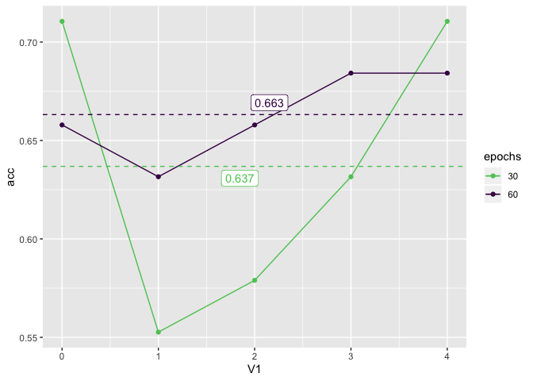

CNN-LSTM
--------

``` r
cnn_lstm_file <- "../../../../../data/secreted_data/training-results/fungi/0003-cnn-lstm-scan-fungi-secreted.log"
cnn_lstm_params_list <- c(
  "strides", "padding", "optimizers", "number_hidden_units",
  "filters_LSTM", "filters", 
  "batch_size", "activation_convolution", "activation_LSTM", "epochs"
)
cnn_lstm_numeric_params <- c(
  "strides", "number_hidden_units", "filters_LSTM",
  "filters", "epochs", "batch_size"
)
```

``` r
cnn_lstm_log_data_raw <- cnn_lstm_file %>%
  parscanlogreader::read_raw_log() %>%
  parscanlogreader::clean_log_data()

cnn_lstm_log_data <- cnn_lstm_log_data_raw %>%
  parscanlogreader::summarise_log_data() %>% 
  dplyr::arrange(desc(acc_mean)) %>% 
  tidyr::drop_na()
```

``` r
cnn_lstm_log_data %>%
  head(10) %>% 
  knitr::kable()
```

| model | epochs |  strides| padding | optimizers |  number\_hidden\_units|  filters\_LSTM|  filters|  batch\_size| activation\_convolution | activation\_LSTM |  loss\_mean|   loss\_sd|  acc\_mean|    acc\_sd|
|:------|:-------|--------:|:--------|:-----------|----------------------:|--------------:|--------:|------------:|:------------------------|:-----------------|-----------:|----------:|----------:|----------:|
| 14    | 30     |        1| valid   | Adadelta   |                      8|             16|       16|            8| None                    | tanh             |     0.43824|  0.0916506|    0.91500|  0.0220227|
| 27    | 30     |        1| valid   | Adadelta   |                      8|              8|       16|            4| None                    | tanh             |     0.47364|  0.0471451|    0.90864|  0.0280936|
| 5     | 30     |        1| valid   | Adam       |                      8|             16|        4|            4| None                    | tanh             |     0.32448|  0.0655768|    0.90228|  0.0205230|
| 19    | 30     |        1| valid   | Adam       |                      8|             16|       16|           16| None                    | tanh             |     0.53042|  0.0684273|    0.87974|  0.0407227|
| 22    | 30     |        1| valid   | Adadelta   |                      8|             16|        8|            8| None                    | tanh             |     0.42108|  0.0575685|    0.87178|  0.0315696|
| 24    | 30     |        1| valid   | Adadelta   |                      8|              4|       16|            8| None                    | tanh             |     0.57182|  0.0432251|    0.86864|  0.0266917|
| 7     | 30     |        1| valid   | Adam       |                      8|              8|       16|           16| None                    | tanh             |     0.54728|  0.0618198|    0.86540|  0.0190210|
| 9     | 30     |        1| valid   | Adam       |                      8|              8|        8|            8| None                    | tanh             |     0.46572|  0.0810692|    0.86060|  0.0236178|
| 28    | 30     |        1| valid   | Adadelta   |                      4|             16|       16|            4| None                    | tanh             |     0.55172|  0.0604550|    0.84936|  0.0689206|
| 33    | 30     |        1| valid   | Adadelta   |                      4|             16|        8|            4| None                    | tanh             |     0.50126|  0.0278796|    0.82050|  0.0499325|

By getting the best value, we can then use the best combination of
hyperparameter setting above to train manually.

``` r
fungi_cnn_lstm_train <- data.table::fread("../../../../../results/secreted_data_run_manually/fungi/df_results_train_cnn_lstm_best_fungi.csv")
fungi_cnn_lstm_val <- data.table::fread("../../../../../results/secreted_data_run_manually/fungi/df_results_val_cnn_lstm_best_fungi.csv")
fungi_cnn_lstm_test <-  data.table::fread("../../../../../results/secreted_data_run_manually/fungi/df_results_test_cnn_lstm_best_fungi.csv")

fungi_cnn_lstm_train <- fungi_cnn_lstm_train %>% 
  mutate(AVG_CV = rowMeans(.[,2:6]))

fungi_cnn_lstm_val <- fungi_cnn_lstm_val %>% 
  mutate(AVG_CV = rowMeans(.[,2:6]))

get_gg_acc(fungi_cnn_lstm_train, fungi_cnn_lstm_val) +
   facet_wrap(~CV, nrow = 2)
```


``` r
fungi_cnn_lstm_train_filter8_filterlstm8 <- data.table::fread("../../../../../results/secreted_data_run_manually/fungi/df_results_train_cnn_lstm_best_fungi_filter8_filterlstm8.csv")
fungi_cnn_lstm_val_filter8_filterlstm8 <- data.table::fread("../../../../../results/secreted_data_run_manually/fungi/df_results_val_cnn_lstm_best_fungi_filter8_filterlstm8.csv")
fungi_cnn_lstm_test_filter8_filterlstm8 <-  data.table::fread("../../../../../results/secreted_data_run_manually/fungi/df_results_test_cnn_lstm_best_fungi_filter8_filterlstm8.csv")

fungi_cnn_lstm_train_filter8_filterlstm8 <- fungi_cnn_lstm_train_filter8_filterlstm8 %>% 
  mutate(AVG_CV = rowMeans(.[,2:6]))

fungi_cnn_lstm_val_filter8_filterlstm8 <- fungi_cnn_lstm_val_filter8_filterlstm8 %>% 
  mutate(AVG_CV = rowMeans(.[,2:6]))

get_gg_acc(fungi_cnn_lstm_train_filter8_filterlstm8, fungi_cnn_lstm_val_filter8_filterlstm8 ) +
   facet_wrap(~CV, nrow = 2)
```

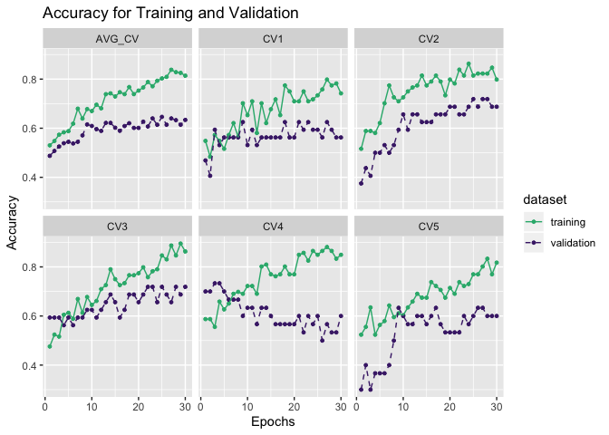

#### Comparing the prediction results with different regularization rate

``` r
compare_test_cnn_lstm <- fungi_cnn_lstm_test %>% 
  dplyr::select(V1, acc) %>% 
  mutate(filter = "16") %>% 
  rbind(fungi_cnn_lstm_test_filter8_filterlstm8%>% 
          dplyr::select(V1, acc) %>% 
          mutate(filter = "8")) %>% 
  `colnames<-` (c("CV", "acc", "filter"))
```

``` r
plot_comparison(
  data = compare_test_cnn_lstm,
  x_var = CV,
  y_var = acc,
  group_var = filter
)
```

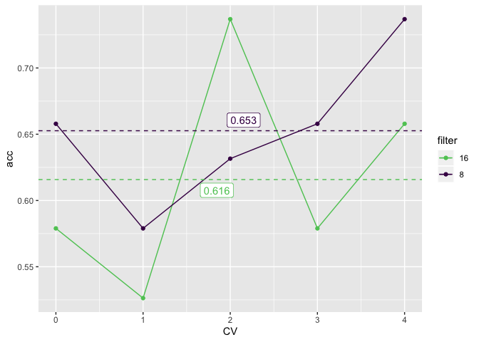

Another experiment: trying to run both case longer like 60 epochs, and
see how the reults will be, either it will be super overfitting for both
or not.

``` r
fungi_cnn_lstm_train_filter8_filterlstm8_60epochs <- data.table::fread("../../../../../results/secreted_data_run_manually/fungi/df_results_train_cnn_lstm_best_fungi_filter8_filterlstm8_epochs60.csv")
fungi_cnn_lstm_val_filter8_filterlstm8_60epochs <- data.table::fread("../../../../../results/secreted_data_run_manually/fungi/df_results_val_cnn_lstm_best_fungi_filter8_filterlstm8_epochs60.csv")
fungi_cnn_lstm_test_filter8_filterlstm8_60epochs <-  data.table::fread("../../../../../results/secreted_data_run_manually/fungi/df_results_test_cnn_lstm_best_fungi_filter8_filterlstm8_epochs60.csv")

fungi_cnn_lstm_train_filter8_filterlstm8_60epochs <- fungi_cnn_lstm_train_filter8_filterlstm8_60epochs %>% 
  mutate(AVG_CV = rowMeans(.[,2:6]))

fungi_cnn_lstm_val_filter8_filterlstm8_60epochs <- fungi_cnn_lstm_val_filter8_filterlstm8_60epochs  %>% 
  mutate(AVG_CV = rowMeans(.[,2:6]))

get_gg_acc(fungi_cnn_lstm_train_filter8_filterlstm8_60epochs, fungi_cnn_lstm_val_filter8_filterlstm8_60epochs) +
   facet_wrap(~CV, nrow = 2)
```

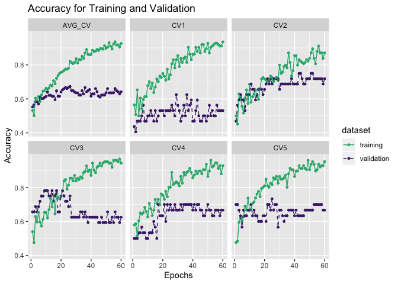

We can change the number of bacth to 16

``` r
fungi_cnn_lstm_train_filter8_filterlstm8_batch16 <- data.table::fread("../../../../../results/secreted_data_run_manually/fungi/df_results_train_cnn_lstm_best_fungi_filter8_filterlstm8_batch16.csv")
fungi_cnn_lstm_val_filter8_filterlstm8_batch16 <- data.table::fread("../../../../../results/secreted_data_run_manually/fungi/df_results_val_cnn_lstm_best_fungi_filter8_filterlstm8_batch16.csv")
fungi_cnn_lstm_test_filter8_filterlstm8_batch16 <-  data.table::fread("../../../../../results/secreted_data_run_manually/fungi/df_results_test_cnn_lstm_best_fungi_filter8_filterlstm8_batch16.csv")


fungi_cnn_lstm_train_filter8_filterlstm8_batch16 <- fungi_cnn_lstm_train_filter8_filterlstm8_batch16 %>% 
  mutate(AVG_CV = rowMeans(.[,2:6]))

fungi_cnn_lstm_val_filter8_filterlstm8_batch16 <- fungi_cnn_lstm_val_filter8_filterlstm8_batch16  %>% 
  mutate(AVG_CV = rowMeans(.[,2:6]))

get_gg_acc(fungi_cnn_lstm_train_filter8_filterlstm8_batch16, fungi_cnn_lstm_val_filter8_filterlstm8_batch16) +
   facet_wrap(~CV, nrow = 2)
```

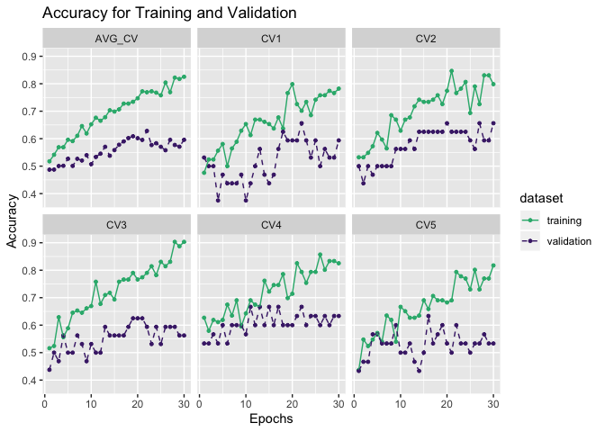
