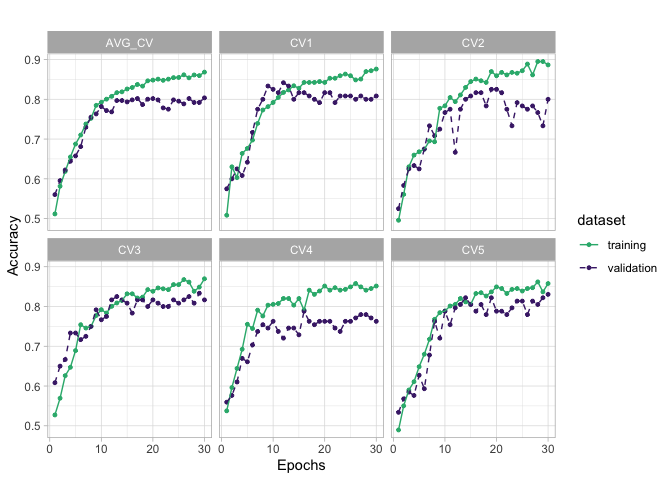
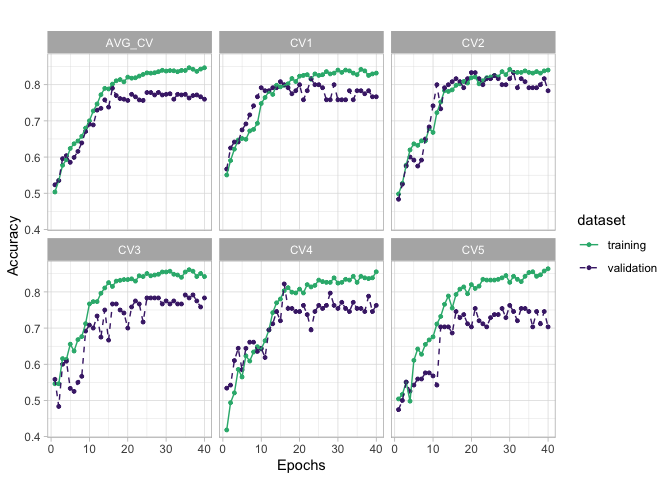
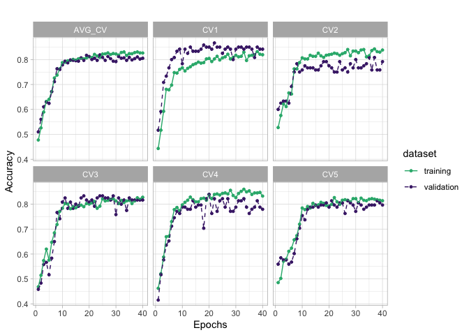
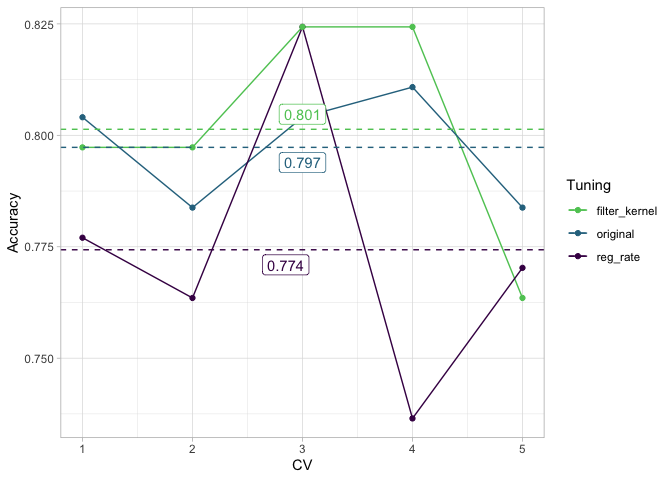
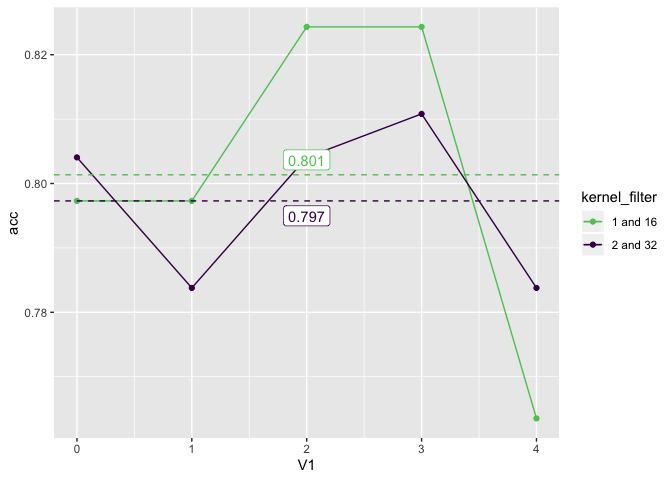
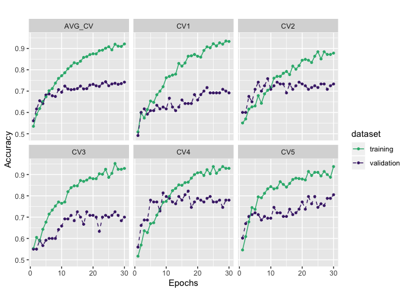
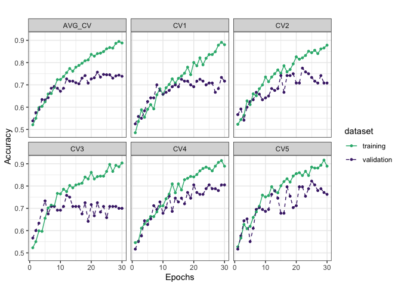
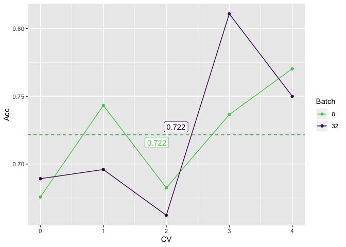
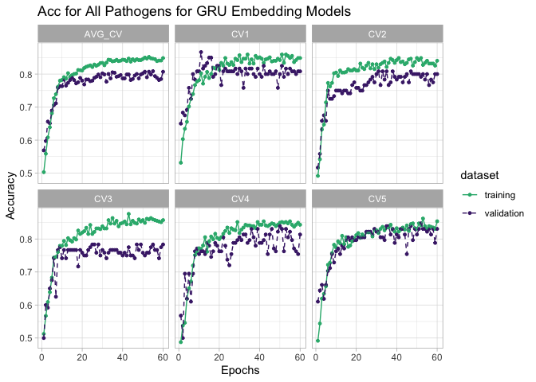
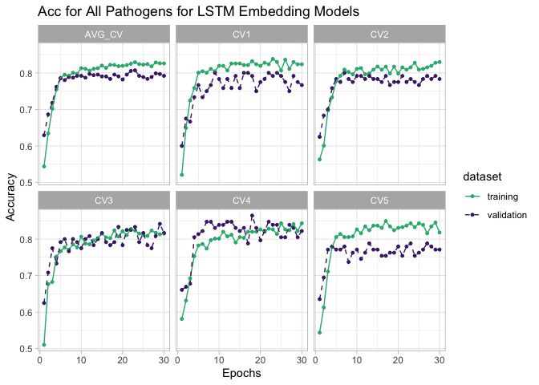

Manually tuning model for All datasets together
===============================================

Load library
------------

Hyperparameter Scan
-------------------

``` r
all_data_cnn_gru_pred_res <-  data.table::fread("../../../../../data/secreted_data/training-results/all/df_pred_results_cnn_gru_all.csv")
all_data_cnn_gru <-  data.table::fread("../../../../../data/secreted_data/training-results/all/all_scan_results_cnn_gru_all.csv") %>% 
  dplyr::select(params, mean_test_score)

all_data_cnn_gru_pred_res %>% 
  dplyr::arrange(desc(Accuracy)) %>% 
  head(5) %>% 
  knitr::kable()
```

|   V1| Parameters                                                                                                                                                                                                                                                                  |   Accuracy|  Sensitivity|  Specifity|
|----:|:----------------------------------------------------------------------------------------------------------------------------------------------------------------------------------------------------------------------------------------------------------------------------|----------:|------------:|----------:|
|   25| {‘reg\_rate’: 0.001, ‘optimizers’: ‘Adam’, ‘opt\_go\_backwards’: ‘TRUE’, ‘opt\_dropout\_recurrent’: 0, ‘opt\_dropout’: 0, ‘maxpool\_size’: 2, ‘kernel\_size’: 2, ‘gru\_hidden\_units’: 16, ‘filter\_conv’: 8, ‘epochs’: 30, ‘batch\_size’: 32, ‘activation\_conv’: ‘relu’}  |  0.8445946|    0.8108108|  0.8783784|
|    0| {‘reg\_rate’: 0.001, ‘optimizers’: ‘Adam’, ‘opt\_go\_backwards’: ‘TRUE’, ‘opt\_dropout\_recurrent’: 0, ‘opt\_dropout’: 0, ‘maxpool\_size’: 3, ‘kernel\_size’: 2, ‘gru\_hidden\_units’: 8, ‘filter\_conv’: 32, ‘epochs’: 30, ‘batch\_size’: 8, ‘activation\_conv’: None}     |  0.8310811|    0.8108108|  0.8513514|
|   15| {‘reg\_rate’: 0.001, ‘optimizers’: ‘Adam’, ‘opt\_go\_backwards’: ‘TRUE’, ‘opt\_dropout\_recurrent’: 0, ‘opt\_dropout’: 0, ‘maxpool\_size’: 3, ‘kernel\_size’: 2, ‘gru\_hidden\_units’: 16, ‘filter\_conv’: 16, ‘epochs’: 30, ‘batch\_size’: 16, ‘activation\_conv’: ‘relu’} |  0.8243243|    0.7837838|  0.8648649|
|   21| {‘reg\_rate’: 0.001, ‘optimizers’: ‘Adam’, ‘opt\_go\_backwards’: ‘TRUE’, ‘opt\_dropout\_recurrent’: 0, ‘opt\_dropout’: 0, ‘maxpool\_size’: 3, ‘kernel\_size’: 2, ‘gru\_hidden\_units’: 8, ‘filter\_conv’: 16, ‘epochs’: 30, ‘batch\_size’: 32, ‘activation\_conv’: ‘relu’}  |  0.8175676|    0.7702703|  0.8648649|
|    8| {‘reg\_rate’: 0.01, ‘optimizers’: ‘Adam’, ‘opt\_go\_backwards’: ‘TRUE’, ‘opt\_dropout\_recurrent’: 0, ‘opt\_dropout’: 0, ‘maxpool\_size’: 3, ‘kernel\_size’: 2, ‘gru\_hidden\_units’: 8, ‘filter\_conv’: 32, ‘epochs’: 30, ‘batch\_size’: 32, ‘activation\_conv’: None}     |  0.8108108|    0.7297297|  0.8918919|

``` r
all_data_cnn_gru %>% 
  dplyr::arrange(desc(mean_test_score)) %>% 
  head(10) %>% 
  knitr::kable()
```

| params                                                                                                                                                                                                                                                                      |  mean\_test\_score|
|:----------------------------------------------------------------------------------------------------------------------------------------------------------------------------------------------------------------------------------------------------------------------------|------------------:|
| {‘reg\_rate’: 0.001, ‘optimizers’: ‘Adam’, ‘opt\_go\_backwards’: ‘TRUE’, ‘opt\_dropout\_recurrent’: 0, ‘opt\_dropout’: 0, ‘maxpool\_size’: 3, ‘kernel\_size’: 2, ‘gru\_hidden\_units’: 8, ‘filter\_conv’: 32, ‘epochs’: 30, ‘batch\_size’: 8, ‘activation\_conv’: None}     |          0.8238255|
| {‘reg\_rate’: 0.001, ‘optimizers’: ‘Adam’, ‘opt\_go\_backwards’: ‘TRUE’, ‘opt\_dropout\_recurrent’: 0, ‘opt\_dropout’: 0, ‘maxpool\_size’: 2, ‘kernel\_size’: 2, ‘gru\_hidden\_units’: 16, ‘filter\_conv’: 16, ‘epochs’: 30, ‘batch\_size’: 16, ‘activation\_conv’: None}   |          0.8204698|
| {‘reg\_rate’: 0.001, ‘optimizers’: ‘Adam’, ‘opt\_go\_backwards’: ‘TRUE’, ‘opt\_dropout\_recurrent’: 0, ‘opt\_dropout’: 0, ‘maxpool\_size’: 3, ‘kernel\_size’: 2, ‘gru\_hidden\_units’: 16, ‘filter\_conv’: 32, ‘epochs’: 30, ‘batch\_size’: 16, ‘activation\_conv’: ‘relu’} |          0.8137584|
| {‘reg\_rate’: 0.001, ‘optimizers’: ‘Adam’, ‘opt\_go\_backwards’: ‘TRUE’, ‘opt\_dropout\_recurrent’: 0, ‘opt\_dropout’: 0, ‘maxpool\_size’: 2, ‘kernel\_size’: 2, ‘gru\_hidden\_units’: 8, ‘filter\_conv’: 32, ‘epochs’: 30, ‘batch\_size’: 16, ‘activation\_conv’: ‘relu’}  |          0.8137584|
| {‘reg\_rate’: 0.001, ‘optimizers’: ‘Adam’, ‘opt\_go\_backwards’: ‘TRUE’, ‘opt\_dropout\_recurrent’: 0, ‘opt\_dropout’: 0, ‘maxpool\_size’: 2, ‘kernel\_size’: 2, ‘gru\_hidden\_units’: 8, ‘filter\_conv’: 16, ‘epochs’: 30, ‘batch\_size’: 8, ‘activation\_conv’: None}     |          0.8120805|
| {‘reg\_rate’: 0.001, ‘optimizers’: ‘Adam’, ‘opt\_go\_backwards’: ‘TRUE’, ‘opt\_dropout\_recurrent’: 0, ‘opt\_dropout’: 0, ‘maxpool\_size’: 3, ‘kernel\_size’: 2, ‘gru\_hidden\_units’: 16, ‘filter\_conv’: 32, ‘epochs’: 30, ‘batch\_size’: 16, ‘activation\_conv’: None}   |          0.8120805|
| {‘reg\_rate’: 0.001, ‘optimizers’: ‘Adam’, ‘opt\_go\_backwards’: ‘TRUE’, ‘opt\_dropout\_recurrent’: 0, ‘opt\_dropout’: 0, ‘maxpool\_size’: 3, ‘kernel\_size’: 2, ‘gru\_hidden\_units’: 8, ‘filter\_conv’: 16, ‘epochs’: 30, ‘batch\_size’: 8, ‘activation\_conv’: None}     |          0.8104027|
| {‘reg\_rate’: 0.01, ‘optimizers’: ‘Adam’, ‘opt\_go\_backwards’: ‘TRUE’, ‘opt\_dropout\_recurrent’: 0, ‘opt\_dropout’: 0, ‘maxpool\_size’: 3, ‘kernel\_size’: 2, ‘gru\_hidden\_units’: 16, ‘filter\_conv’: 32, ‘epochs’: 30, ‘batch\_size’: 8, ‘activation\_conv’: ‘relu’}   |          0.8087248|
| {‘reg\_rate’: 0.01, ‘optimizers’: ‘Adam’, ‘opt\_go\_backwards’: ‘TRUE’, ‘opt\_dropout\_recurrent’: 0, ‘opt\_dropout’: 0, ‘maxpool\_size’: 3, ‘kernel\_size’: 2, ‘gru\_hidden\_units’: 8, ‘filter\_conv’: 32, ‘epochs’: 30, ‘batch\_size’: 32, ‘activation\_conv’: None}     |          0.8053691|
| {‘reg\_rate’: 0.001, ‘optimizers’: ‘Adam’, ‘opt\_go\_backwards’: ‘TRUE’, ‘opt\_dropout\_recurrent’: 0, ‘opt\_dropout’: 0, ‘maxpool\_size’: 2, ‘kernel\_size’: 2, ‘gru\_hidden\_units’: 8, ‘filter\_conv’: 8, ‘epochs’: 30, ‘batch\_size’: 8, ‘activation\_conv’: ‘relu’}    |          0.8036913|

### All data-CNN-GRU

``` r
all_cnn_gru_train <- data.table::fread("../../../../../results/secreted_data_run_manually/all/df_results_train_cnn_gru_best_all.csv")
all_cnn_gru_val <- data.table::fread("../../../../../results/secreted_data_run_manually/all/df_results_val_cnn_gru_best_all.csv")
all_cnn_gru_test <- data.table::fread("../../../../../results/secreted_data_run_manually/all/df_results_test_cnn_gru_best_all.csv")

# Adding the average of the accuracy of each training and validation data
all_cnn_gru_train<- all_cnn_gru_train %>% 
  dplyr::mutate(AVG_CV = rowMeans(.[,2:6]))

all_cnn_gru_val <- all_cnn_gru_val %>% 
  dplyr::mutate(AVG_CV =rowMeans(.[,2:6]))
```

``` r
get_gg_acc(all_cnn_gru_train, all_cnn_gru_val, plot_title = "") +
  facet_wrap(~CV, nrow = 2) + 
  theme_light() +
  ggsave(filename = "running_best_model_all_new.pdf", width = 6.5, height = 4, device = cairo_pdf)
```



``` r
  #ggsave("running_best_model_all.pdf")
```

Slighty, we can see that the model is a lil bit overfitting, we can
change some parameters and see how it changes the accuracy results of
the model.

### Change the regularization rate from 0.001 to 0.01

``` r
all_cnn_gru_train_regrate001 <- data.table::fread("../../../../../results/secreted_data_run_manually/all/df_results_train_cnn_gru_best_all_regrate001.csv")
all_cnn_gru_val_regrate001 <- data.table::fread("../../../../../results/secreted_data_run_manually/all/df_results_val_cnn_gru_best_all_regrate001.csv")
all_cnn_gru_test_regrate001 <- data.table::fread("../../../../../results/secreted_data_run_manually/all/df_results_test_cnn_gru_best_all_regrate001.csv")

# Adding the average of the accuracy of each training and validation data
all_cnn_gru_train_regrate001 <- all_cnn_gru_train_regrate001 %>% 
  dplyr::mutate(AVG_CV = rowMeans(.[,2:6]))

all_cnn_gru_val_regrate001 <- all_cnn_gru_val_regrate001 %>% 
  dplyr::mutate(AVG_CV =rowMeans(.[,2:6]))

get_gg_acc(all_cnn_gru_train_regrate001, all_cnn_gru_val_regrate001,  plot_title = "") +
  facet_wrap(~CV, nrow = 2 ) +
  theme_light() +
  ggsave(filename = "tuning_regrate_to_001.pdf", width = 6.5, height = 4, device = cairo_pdf)
```



### Change to different convolution filter and number of kernel

As we can see from the performance above, changing the regularization
rate from 0.001 to 0.01 did not really help on tackling the overfitting,
instead the accuracy a little bit droppped. Therefore now, we are going
to find another paramameter we can tune.

``` r
all_cnn_gru_train_convfilter16_kernel1 <- data.table::fread("../../../../../results/secreted_data_run_manually/all/df_results_train_cnn_gru_best_all_convfilter16_kernel1.csv")
all_cnn_gru_val_convfilter16_kernel1 <- data.table::fread("../../../../../results/secreted_data_run_manually/all/df_results_val_cnn_gru_best_all_convfilter16_kernel1.csv")
all_cnn_gru_test_convfilter16_kernel1 <- data.table::fread("../../../../../results/secreted_data_run_manually/all/df_results_test_cnn_gru_best_all_convfilter16_kernel1.csv")

# Adding the average of the accuracy of each training and validation data
all_cnn_gru_train_convfilter16_kernel1 <- all_cnn_gru_train_convfilter16_kernel1 %>% 
  dplyr::mutate(AVG_CV = rowMeans(.[,2:6]))

all_cnn_gru_val_convfilter16_kernel1 <- all_cnn_gru_val_convfilter16_kernel1 %>% 
  dplyr::mutate(AVG_CV =rowMeans(.[,2:6]))
```

``` r
get_gg_acc(all_cnn_gru_train_convfilter16_kernel1, all_cnn_gru_val_convfilter16_kernel1, plot_title = "") + 
  facet_wrap(~CV, nrow = 2) + 
  #ggsave("turning_kernel_all.pdf")
  theme_light() +
  ggsave(filename = "tuning_kernel_and_filter.pdf", width = 6.5, height = 4, device = cairo_pdf)
```



``` r
# Compare the testing prediction results between models with model with kernel 1 and kernel 2 or conv filter 16 and 32
diff_tuning <- rbind(all_cnn_gru_test  %>% 
  dplyr::select(V1, acc) %>% 
    dplyr::mutate(tuning = "original"),
   all_cnn_gru_test_regrate001  %>% 
  dplyr::select(V1, acc)  %>% 
    dplyr::mutate(tuning = "reg_rate"),
  all_cnn_gru_test_convfilter16_kernel1 %>% 
    dplyr::select(V1, acc) %>% 
    dplyr::mutate(tuning = "filter_kernel")
  ) %>% 
  mutate(V1 = V1 + 1)

diff_tuning  <- diff_tuning %>% 
  `colnames<-`(c("CV", "Accuracy", "Tuning"))

plot_comparison(diff_tuning, CV, Accuracy, Tuning , show_label = TRUE, label_digits = 3) + 
  theme_light() +
  ggsave(filename = "comparison_diff_tuning.pdf", width = 7, height = 3.5, device = cairo_pdf)
```



``` r
# Compare the testing prediction results between models with model with kernel 1 and kernel 2 or conv filter 16 and 32
diff_kernel_filter <- rbind(all_cnn_gru_test  %>% 
  dplyr::select(V1, acc) %>% 
    dplyr::mutate(kernel_filter = "2 and 32"),
   all_cnn_gru_test_convfilter16_kernel1  %>% 
  dplyr::select(V1, acc)  %>% 
    dplyr::mutate(kernel_filter = "1 and 16"))

plot_comparison(diff_kernel_filter, V1, acc, kernel_filter , show_label = TRUE, label_digits = 3) 
```



CNN-LSTM
--------

Due to HPC service disruption, the process of hyper paramter scan was
stopped, and now I am reading the logs (6/3/2020):

``` r
all_cnn_lstm_file <- "../../../../../data/secreted_data/training-results/all/0001-cnn-lstm-scan-all.log"
all_cnn_lstm_params_list <- c(
  "strides", "padding", "optimizers", "number_hidden_units",
  "filters_LSTM", "filters", 
  "batch_size", "activation_convolution", "activation_LSTM", "epochs"
)
all_cnn_lstm_numeric_params <- c(
  "strides", "number_hidden_units", "filters_LSTM",
  "filters", "epochs", "batch_size"
)
```

``` r
all_cnn_lstm_log_data_raw <- all_cnn_lstm_file %>%
  parscanlogreader::read_raw_log() %>%
  parscanlogreader::clean_log_data()

all_cnn_lstm_log_data <- all_cnn_lstm_log_data_raw %>%
  parscanlogreader::summarise_log_data() %>% 
  dplyr::arrange(desc(acc_mean)) %>% 
  tidyr::drop_na()
```

``` r
all_cnn_lstm_log_data %>%
  head(4) %>% 
  knitr::kable()
```

| model    | epochs    |    strides| padding    | optimizers    |   number\_hidden\_units|   filters\_LSTM|     filters|  batch\_size| activation\_convolution | activation\_LSTM |  loss\_mean|   loss\_sd|  acc\_mean|    acc\_sd|
|:---------|:----------|----------:|:-----------|:--------------|-----------------------:|---------------:|-----------:|------------:|:------------------------|:-----------------|-----------:|----------:|----------:|----------:|
| 3        | 30        |          1| valid      | Adam          |                       8|              32|          32|           32| None                    | tanh             |     0.45778|  0.0394035|    0.96396|  0.0034479|
| 15       | 30        |          1| valid      | Adadelta      |                       8|              32|          32|            8| None                    | tanh             |     0.37630|  0.0210718|    0.95595|  0.0028991|
| 4        | 30        |          1| valid      | Adadelta      |                       8|              16|          32|           32| None                    | tanh             |     0.50504|  0.0579452|    0.95216|  0.0266972|
| 8        | 30        |          1| valid      | Adadelta      |                       8|               8|          16|            8| None                    | tanh             |     0.39414|  0.0792540|    0.93034|  0.0332688|
| The manu | al tuning |  will be e| xperimente | d on the mode |  l 8, while the filters|  are less big t|  han the fi|         rst.|                         |                  |            |           |           |           |

Now we can see the results of the manual tunning of the CNN-LSTM on all
pathogen datasets:

``` r
all_cnn_lstm_train <- data.table::fread("../../../../../results/secreted_data_run_manually/all/df_results_train_cnn_lstm_best_all.csv")
all_cnn_lstm_val <- data.table::fread("../../../../../results/secreted_data_run_manually/all/df_results_val_cnn_lstm_best_all.csv")
all_cnn_lstm_test <- data.table::fread("../../../../../results/secreted_data_run_manually/all/df_results_test_cnn_lstm_best_all.csv")
```

``` r
all_cnn_lstm_train <- all_cnn_lstm_train %>% 
  dplyr::mutate(AVG_CV = rowMeans(.[,2:6]))

all_cnn_lstm_val  <- all_cnn_lstm_val  %>% 
  dplyr::mutate(AVG_CV = rowMeans(.[,2:6]))

get_gg_acc(all_cnn_lstm_train, all_cnn_lstm_val, plot_title = "") + 
  facet_wrap(~CV, nrow = 2)
```



``` r
all_cnn_lstm_test
```

    ##    V1       acc sensitivity specifity
    ## 1:  0 0.6891892   0.8243243 0.5540541
    ## 2:  1 0.6959459   0.7702703 0.6216216
    ## 3:  2 0.6621622   0.7027027 0.6216216
    ## 4:  3 0.8108108   0.7972973 0.8243243
    ## 5:  4 0.7500000   0.7432432 0.7567568

``` bash
model = build_model_conv1D_lstm(filters = 16,
                                    filters_LSTM = 8,
                                    strides = 1,
                                    padding = "valid",
                                    activation_convolution = None,
                                    activation_LSTM = 'tanh',
                                    optimizers = 'Adadelta',
                                    number_hidden_units = 8)
    # Fit the model
    history_fit = model.fit(x_train[train], y_train[train], epochs = 60, batch_size = 8, verbose = 1, shuffle = 1, validation_data = (x_train[test], y_train[test]))
```

Now we can try to increase the batch size to 32 and see how it goes.

``` r
all_cnn_lstm_train_batch32 <- data.table::fread("../../../../../results/secreted_data_run_manually/all/df_results_train_cnn_lstm_best_all_epochs60.csv")
all_cnn_lstm_val_batch32 <- data.table::fread("../../../../../results/secreted_data_run_manually/all/df_results_val_cnn_lstm_best_all_epochs60.csv")
all_cnn_lstm_test_batch32 <- data.table::fread("../../../../../results/secreted_data_run_manually/all/df_results_test_cnn_lstm_best_all_epochs60.csv")
```

``` r
all_cnn_lstm_train_batch32 <- all_cnn_lstm_train_batch32 %>% 
  dplyr::mutate(AVG_CV = rowMeans(.[,2:6]))

all_cnn_lstm_val_batch32  <- all_cnn_lstm_val_batch32  %>% 
  dplyr::mutate(AVG_CV = rowMeans(.[,2:6]))

get_gg_acc(all_cnn_lstm_train_batch32, all_cnn_lstm_val_batch32, plot_title = "") + 
  facet_wrap(~CV, nrow = 2) +
  theme_bw()
```



### Comparing two results

``` r
compare_cnn_lstm_all <- all_cnn_lstm_test %>% 
  dplyr::select(V1, acc) %>% 
  mutate(batch = 32) %>% 
  rbind(all_cnn_lstm_test_batch32 %>% 
          dplyr::select(V1, acc) %>% 
          mutate(batch = 8)) %>% 
  `colnames<-` (c("CV", "Acc", "Batch"))
```

``` r
plot_comparison(
  data = compare_cnn_lstm_all,
  x_var = CV,
  y_var = Acc,
  group_var = Batch
)
```



GRU-Embedding
-------------

``` r
all_gru_emb_file <- "../../../../../data/secreted_data/training-results/all/0004-gru-embedding_scan_all.log"
all_gru_emb_params_list <- c(
  "reg_rate", "outputdim", "optimizers", "opt_go_backwards", 
  "opt_dropout_recurrent", "opt_dropout", "gru_hidden_units", "epochs", 
  "batch_size" 
)

all_gru_emb_numeric_params <- c(
  "reg_rate", "outputdim", "opt_dropout_recurrent", 
  "opt_dropout", "gru_hidden_units", "epochs", "batch_size" 
)
```

``` r
all_gru_emb_log_data_raw <- all_gru_emb_file %>%
  parscanlogreader::read_raw_log() %>%
  parscanlogreader::clean_log_data()

all_gru_emb_log_data_data <- all_gru_emb_log_data_raw %>%
  parscanlogreader::summarise_log_data() %>% 
  dplyr::arrange(desc(acc_mean)) %>% 
  tidyr::drop_na()
```

``` r
all_gru_emb_log_data_data %>%
  head(10) %>% 
  knitr::kable()
```

| model | epochs |  reg\_rate|  outputdim| optimizers | opt\_go\_backwards |  opt\_dropout\_recurrent|  opt\_dropout|  gru\_hidden\_units|  batch\_size|  loss\_mean|   loss\_sd|  acc\_mean|    acc\_sd|
|:------|:-------|----------:|----------:|:-----------|:-------------------|------------------------:|-------------:|-------------------:|------------:|-----------:|----------:|----------:|----------:|
| 3     | 30     |      0.001|         48| Adadelta   | TRUE               |                        0|             0|                  32|           16|     0.37258|  0.0139738|  0.8385000|  0.0123444|
| 11    | 30     |      0.001|         48| Adadelta   | FALSE              |                        0|             0|                  32|           16|     0.37752|  0.0114661|  0.8347400|  0.0117483|
| 9     | 30     |      0.001|         32| Adadelta   | FALSE              |                        0|             0|                  16|           16|     0.37236|  0.0170912|  0.8343200|  0.0086543|
| 12    | 30     |      0.001|         32| Adadelta   | FALSE              |                        0|             0|                  32|           16|     0.37038|  0.0159924|  0.8339000|  0.0086822|
| 7     | 30     |      0.001|         48| Adadelta   | FALSE              |                        0|             0|                  16|           16|     0.36588|  0.0274547|  0.8317800|  0.0204726|
| 19    | 30     |      0.001|         32| Adadelta   | TRUE               |                        0|             0|                  16|           16|     0.38080|  0.0319967|  0.8314333|  0.0209977|
| 6     | 30     |      0.001|         48| Adam       | FALSE              |                        0|             0|                  32|           16|     0.37716|  0.0192642|  0.8305400|  0.0091164|
| 13    | 30     |      0.001|         32| Adadelta   | TRUE               |                        0|             0|                  32|           16|     0.37580|  0.0153678|  0.8284400|  0.0082455|
| 16    | 30     |      0.001|         48| Adam       | TRUE               |                        0|             0|                  32|           16|     0.37296|  0.0095046|  0.8221400|  0.0108226|
| 10    | 30     |      0.001|         48| Adadelta   | TRUE               |                        0|             0|                  16|           32|     0.40868|  0.0208865|  0.8217200|  0.0177787|

Now, we can check the results of manual training of manually checking of
the model GRU-Embedding

``` r
all_gru_emb_train <- data.table::fread("../../../../../results/secreted_data_run_manually/all/df_results_train_gru_emb_all.csv")
all_gru_emb_val <- data.table::fread("../../../../../results/secreted_data_run_manually/all/df_results_val_gru_emb_all.csv")
all_gru_emb_test <- data.table::fread("../../../../../results/secreted_data_run_manually/all/df_results_test_gru_emb_all.csv")

# Adding the average of the accuracy of each training and validation data
all_gru_emb_train <- all_gru_emb_train %>% 
  dplyr::mutate(AVG_CV = rowMeans(.[,2:6]))

all_gru_emb_val <- all_gru_emb_val %>% 
  dplyr::mutate(AVG_CV =rowMeans(.[,2:6]))


get_gg_acc(all_gru_emb_train, all_gru_emb_val, plot_title = "Acc for All Pathogens for GRU Embedding Models") + 
  facet_wrap(~CV, nrow = 2) + 
  #ggsave("turning_kernel_all.pdf")
  theme_light() 
```



``` r
# +
#   ggsave(filename = "turning_kernel_all_new.pdf", width = 4, height = 5, dpi = 192, device = cairo_pdf)
```

``` r
all_gru_emb_test
```

    ##    V1       acc sensitivity specifity
    ## 1:  0 0.8040541   0.8108108 0.7972973
    ## 2:  1 0.8243243   0.7432432 0.9054054
    ## 3:  2 0.7702703   0.7297297 0.8108108
    ## 4:  3 0.7905405   0.7567568 0.8243243
    ## 5:  4 0.8243243   0.7027027 0.9459459

LSTM-Embedding
--------------

``` r
all_lstm_emb_train <- data.table::fread("../../../../../results/secreted_data_run_manually/all/df_results_train_lstm_emb_all.csv")
all_lstm_emb_val <- data.table::fread("../../../../../results/secreted_data_run_manually/all/df_results_val_lstm_emb_all.csv")
all_lstm_emb_test <- data.table::fread("../../../../../results/secreted_data_run_manually/all/df_results_test_lstm_emb_all.csv")

# Adding the average of the accuracy of each training and validation data
all_lstm_emb_train <- all_lstm_emb_train %>% 
  dplyr::mutate(AVG_CV = rowMeans(.[,2:6]))

all_lstm_emb_val <- all_lstm_emb_val %>% 
  dplyr::mutate(AVG_CV =rowMeans(.[,2:6]))


get_gg_acc(all_lstm_emb_train, all_lstm_emb_val, plot_title = "Acc for All Pathogens for LSTM Embedding Models") + 
  facet_wrap(~CV, nrow = 2) + 
  #ggsave("turning_kernel_all.pdf")
  theme_light() 
```



``` r
all_lstm_emb_test
```

    ##    V1       acc sensitivity specifity
    ## 1:  0 0.7972973   0.7027027 0.8918919
    ## 2:  1 0.8243243   0.7702703 0.8783784
    ## 3:  2 0.7770270   0.7702703 0.7837838
    ## 4:  3 0.7500000   0.8648649 0.6351351
    ## 5:  4 0.8108108   0.7567568 0.8648649
