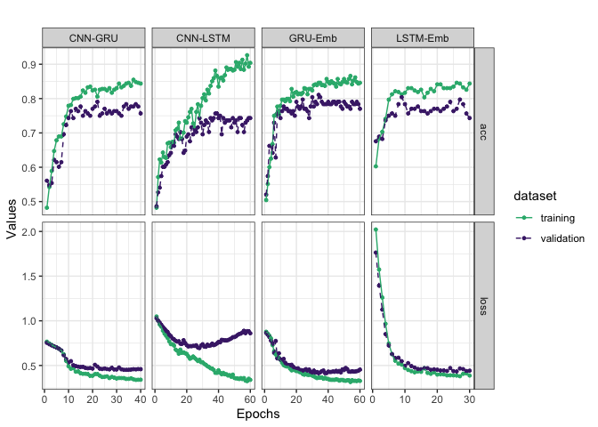
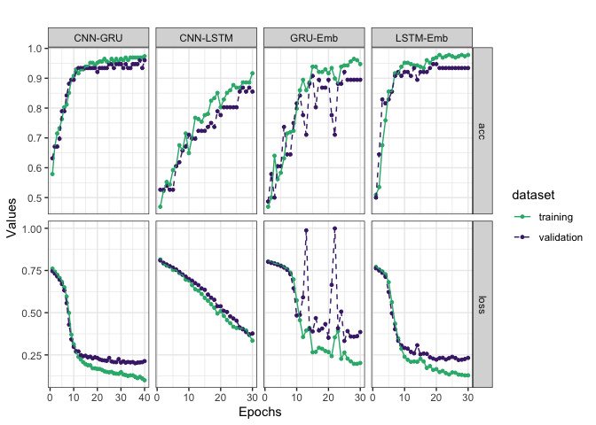
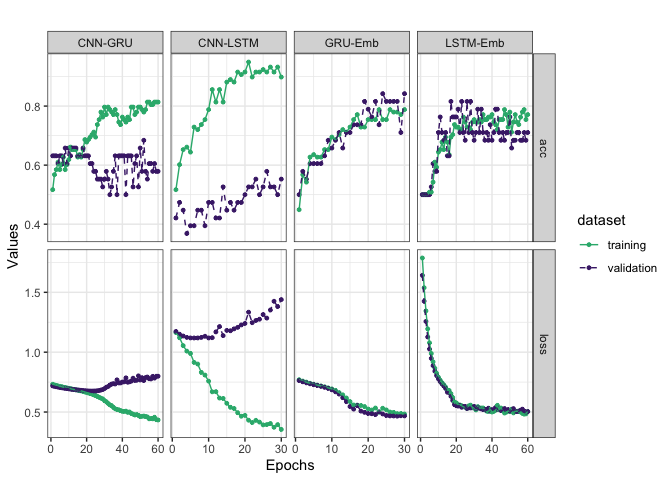
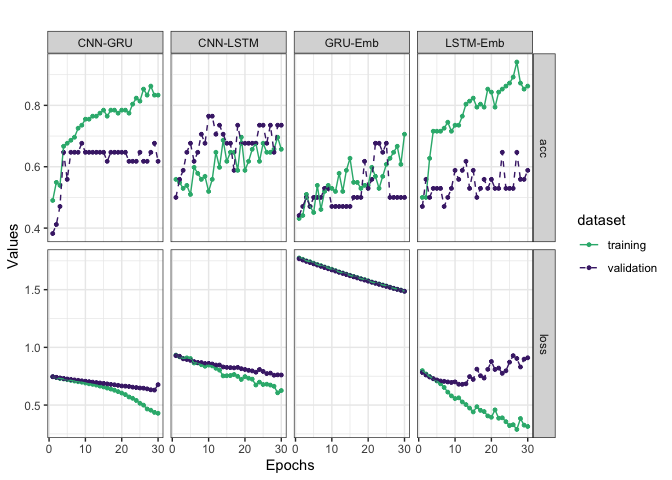

Final results and hyperparamater settings for each model of each pathogen datasets
==================================================================================

Introduction
------------

In this report, final hyperparameter settings that will be used to get
the final enseble model for each pathogen dataset and each model.

Function
--------

``` r
library(tidyverse)
```

    ## ── Attaching packages ────────────────────────────────────────────────────────────────────────────────────────────── tidyverse 1.3.0 ──

    ## ✓ ggplot2 3.2.1     ✓ purrr   0.3.3
    ## ✓ tibble  2.1.3     ✓ dplyr   0.8.3
    ## ✓ tidyr   1.0.0     ✓ stringr 1.4.0
    ## ✓ readr   1.3.1     ✓ forcats 0.4.0

    ## ── Conflicts ───────────────────────────────────────────────────────────────────────────────────────────────── tidyverse_conflicts() ──
    ## x dplyr::filter() masks stats::filter()
    ## x dplyr::lag()    masks stats::lag()

``` r
library(ggplot2)
```

``` r
get_gg_acc_loss <- function(train_data, val_data, plot_title = "Accuracy for Training and Validation") {
  
  # Add dummy model variable if it's not specified on the data
  if (!("model" %in% colnames(train_data))) {
    train_data <- train_data %>% 
      mutate(model = NA)
  }
  if (!("model" %in% colnames(val_data))) {
    val_data <- val_data %>% 
      mutate(model = NA)
  }
  
  # Melt data
  train_data_melt <- train_data %>%
    dplyr::rename(epochs = V1) %>%
    tidyr::pivot_longer(
      cols = -c(epochs, model),
      names_to = "variable",
      values_to = "train"
    )

  val_data_melt <- val_data %>%
    dplyr::rename(epochs = V1) %>%
    tidyr::pivot_longer(
      cols = -c(epochs, model),
      names_to = "variable",
      values_to = "val"
    )

  # Rename the data column
  train_data_melt <- train_data_melt %>%
    `colnames<-`(c("epochs", "model", "metrics", "train"))

  val_data_melt <- val_data_melt %>%
    `colnames<-`(c("epochs", "model", "metrics", "val"))

  # Left join into 1 dataframe
  train_val_data <- train_data_melt %>%
    left_join(
      val_data_melt,
      by = c("epochs", "model", "metrics")
    ) %>%
    mutate(epochs = epochs + 1) %>%
    tidyr::pivot_longer(
      cols = -c(epochs, model, metrics),
      names_to = "dataset",
      values_to = "values"
    ) %>%
    mutate(
      dataset = case_when(
        dataset == "val" ~ "validation",
        dataset == "train" ~ "training"
      )
    )
  
  # Plot the accuracy data
  gg_accuracy <- ggplot(train_val_data) +
    aes(
      x = epochs,
      y = values,
      color = dataset,
      group = dataset,
      linetype = dataset
    ) +
    geom_point(size = 1) +
    geom_line() +
    scale_color_viridis_d(begin = 0.65, end = 0.1) +
    scale_linetype_manual(values = c("validation" = "dashed", "training" = "solid")) +
    labs(title = plot_title, x = "Epochs", y = "Values")

  return(gg_accuracy)
}
```

All data
--------

``` r
all_cnn_gru_train <- data.table::fread("../../../../../data/secreted_data/final_results/all/df_results_all_train_cnn_gru_secreted.csv")
all_cnn_gru_val <- data.table::fread("../../../../../data/secreted_data/final_results/all/df_results_all_val_cnn_gru_secreted.csv")

# Load lstm_emb model results 
all_lstm_emb_train <- data.table::fread("../../../../../data/secreted_data/final_results/all/df_all_saved_models_lstm_emb_train.csv")
all_lstm_emb_val <- data.table::fread("../../../../../data/secreted_data/final_results/all/df_all_saved_models_lstm_emb_val.csv")

# Load gru_emb model results 
all_gru_emb_train <- data.table::fread("../../../../../data/secreted_data/final_results/all/df_all_saved_models_gru_emb_train.csv")
all_gru_emb_val <- data.table::fread("../../../../../data/secreted_data/final_results/all/df_all_saved_models_gru_emb_val.csv")

# Load cnn_lstm model results 
all_cnn_lstm_train <- data.table::fread("../../../../../data/secreted_data/final_results/all/df_results_all_train_cnn_lstm_secreted.csv")
all_cnn_lstm_val <- data.table::fread("../../../../../data/secreted_data/final_results/all/df_results_all_val_cnn_lstm_secreted.csv")
```

``` r
# Run with new function

get_gg_acc_loss(
  train_data = rbind(
    all_cnn_lstm_train %>% mutate(model = "CNN-LSTM"),
    all_cnn_gru_train %>% mutate(model = "CNN-GRU"), 
    all_lstm_emb_train %>% mutate(model = "LSTM-Emb"), 
    all_gru_emb_train %>% mutate(model = "GRU-Emb")
  ),
  val_data = rbind(
    all_cnn_lstm_val %>% mutate(model = "CNN-LSTM"),
    all_cnn_gru_val %>% mutate(model = "CNN-GRU"), 
    all_lstm_emb_val %>% mutate(model = "LSTM-Emb"), 
    all_gru_emb_val %>% mutate(model = "GRU-Emb")
  ), plot_title = ""
) + 
  facet_grid(metrics ~ model, scales = "free") +
  theme_bw() + 
  ggsave(filename = "final_results_all.pdf", width = 10, height = 5, device = cairo_pdf)
```



Bacteria
--------

``` r
# Load cnn model results
bacteria_cnn_lstm_train <- data.table::fread("../../../../../data/secreted_data/final_results/bacteria/df_results_bacteria_train_cnn_lstm_secreted_30epochs.csv")
bacteria_cnn_lstm_val <- data.table::fread("../../../../../data/secreted_data/final_results/bacteria/df_results_bacteria_val_cnn_lstm_secreted_30epochs.csv")

# Load cnn gru model results
bacteria_cnn_gru_train <- data.table::fread("../../../../../data/secreted_data/final_results/bacteria/df_results_bacteria_train_cnn_secreted.csv")
bacteria_cnn_gru_val <- data.table::fread("../../../../../data/secreted_data/final_results/bacteria/df_results_bacteria_val_cnn_secreted.csv")

# Load lstm_emb model results 
bacteria_lstm_emb_train <- data.table::fread("../../../../../data/secreted_data/final_results/bacteria/df_bac_saved_models_lstm_emb_train.csv")
bacteria_lstm_emb_val <- data.table::fread("../../../../../data/secreted_data/final_results/bacteria/df_bac_saved_models_lstm_emb_val.csv")

# Load gru_emb model results 
bacteria_gru_emb_train <- data.table::fread("../../../../../data/secreted_data/final_results/bacteria/df_bac_saved_models_gru_emb_train.csv")
bacteria_gru_emb_val <- data.table::fread("../../../../../data/secreted_data/final_results/bacteria/df_bac_saved_models_gru_emb_val.csv")
```

``` r
# Run with new function

get_gg_acc_loss(
  train_data = rbind(
    bacteria_cnn_lstm_train %>% mutate(model = "CNN-LSTM"), 
    bacteria_cnn_gru_train %>% mutate(model = "CNN-GRU"), 
    bacteria_lstm_emb_train %>% mutate(model = "LSTM-Emb"), 
    bacteria_gru_emb_train %>% mutate(model = "GRU-Emb")
  ),
  val_data = rbind(
    bacteria_cnn_lstm_val %>% mutate(model = "CNN-LSTM"), 
    bacteria_cnn_gru_val %>% mutate(model = "CNN-GRU"), 
    bacteria_lstm_emb_val %>% mutate(model = "LSTM-Emb"), 
    bacteria_gru_emb_val %>% mutate(model = "GRU-Emb")
  ), plot_title = ""
) + 
  facet_grid(metrics ~ model, scales = "free") +
  theme_bw() +
  ggsave(filename = "final_results_bacteria.pdf", width = 10, height = 5, device = cairo_pdf)
```



Fungi
-----

``` r
# CNN-GRU
fungi_cnn_gru_train_old <- data.table::fread("../../../../../data/secreted_data/final_results/fungi/df_results_train_cnn_gru_fungi_secreted_data_60epochs.csv")
fungi_cnn_gru_val_old <- data.table::fread("../../../../../data/secreted_data/final_results/fungi/df_results_val_cnn_gru_fungi_secreted_data_60epochs.csv")

fungi_cnn_gru_train_rec_dropout02 <- data.table::fread("../../../../../data/secreted_data/final_results/fungi/df_results_train_cnn_gru_fungi_secreted_data_rec_dropout02.csv")
fungi_cnn_gru_val_rec_dropout02 <- data.table::fread("../../../../../data/secreted_data/final_results/fungi/df_results_val_cnn_gru_fungi_secreted_data_rec_dropout02.csv")

fungi_cnn_gru_train <- data.table::fread("../../../../../data/secreted_data/final_results/fungi/df_results_train_cnn_gru_fungi_secreted_data.csv")
fungi_cnn_gru_val <- data.table::fread("../../../../../data/secreted_data/final_results/fungi/df_results_val_cnn_gru_fungi_secreted_data.csv")

# CNN-LSTM
fungi_cnn_lstm_train <- data.table::fread("../../../../../data/secreted_data/final_results/fungi/df_results_train_saved_cnn_lstm_fungi_secreted_data_2.csv")
fungi_cnn_lstm_val <- data.table::fread("../../../../../data/secreted_data/final_results/fungi/df_results_val_saved_cnn_lstm_fungi_secreted_data_2.csv")

# fungi_cnn_lstm_train_batch8 <- data.table::fread("../../../../../data/secreted_data/final_results/fungi/df_results_train_saved_cnn_lstm_fungi_secreted_data_batch8.csv")
# fungi_cnn_lstm_val_batch8 <- data.table::fread("../../../../../data/secreted_data/final_results/fungi/df_results_val_saved_cnn_lstm_fungi_secreted_data_batch8.csv")


# LSTM Embedding
fungi_lstm_emb_train <- data.table::fread("../../../../../data/secreted_data/final_results/fungi/df_fungi_saved_models_lstm_emb_train.csv")
fungi_lstm_emb_val <- data.table::fread("../../../../../data/secreted_data/final_results/fungi/df_fungi_saved_models_lstm_emb_val.csv")

# GRU Emb
fungi_gru_emb_train <- data.table::fread("../../../../../data/secreted_data/final_results/fungi/df_fungi_saved_models_gru_emb_train.csv")
fungi_gru_emb_val <- data.table::fread("../../../../../data/secreted_data/final_results/fungi/df_fungi_saved_models_gru_emb_val.csv")
```

``` r
get_gg_acc_loss(
  train_data = rbind(
    fungi_cnn_lstm_train %>% mutate(model = "CNN-LSTM"),
    fungi_cnn_gru_train_old %>% mutate(model = "CNN-GRU"),
    # fungi_cnn_gru_train_rec_dropout02 %>% mutate(model = "CNN-GRU"),
    # fungi_cnn_gru_train %>% mutate(model = "CNN-GRU"),
    fungi_lstm_emb_train %>% mutate(model = "LSTM-Emb"),
    fungi_gru_emb_train %>% mutate(model = "GRU-Emb")
  ),
  val_data = rbind(
    fungi_cnn_lstm_val %>% mutate(model = "CNN-LSTM"),
    fungi_cnn_gru_val_old %>% mutate(model = "CNN-GRU"),
    # fungi_cnn_gru_val_rec_dropout02 %>% mutate(model = "CNN-GRU"),
    # fungi_cnn_gru_val %>% mutate(model = "CNN-GRU"),
    fungi_lstm_emb_val %>% mutate(model = "LSTM-Emb"),
    fungi_gru_emb_val %>% mutate(model = "GRU-Emb")
  ), plot_title = ""
) + 
  facet_grid(metrics ~ model, scales = "free") +
  theme_bw() + 
  ggsave(filename = "final_results_fungi.pdf", width = 10, height = 5, device = cairo_pdf)
```



Oomycete
--------

``` r
oomycete_cnn_gru_train <- data.table::fread("../../../../../data/secreted_data/final_results/oomycete/df_results_oomycete_train_cnn_gru_saved_model.csv")
oomycete_cnn_gru_val <- data.table::fread("../../../../../data/secreted_data/final_results/oomycete/df_results_oomycete_val_cnn_gru_saved_model.csv")

oomycete_gru_emb_train <- data.table::fread("../../../../../data/secreted_data/final_results/oomycete/df_oomycete_saved_models_gru_emb_train.csv")
oomycete_gru_emb_val <- data.table::fread("../../../../../data/secreted_data/final_results/oomycete/df_oomycete_saved_models_gru_emb_val.csv")

oomycete_lstm_emb_train <- data.table::fread("../../../../../data/secreted_data/final_results/oomycete/df_oomycete_saved_models_lstm_emb_train.csv")
oomycete_lstm_emb_val <- data.table::fread("../../../../../data/secreted_data/final_results/oomycete/df_oomycete_saved_models_lstm_emb_val.csv")

oomycete_cnn_lstm_train <- data.table::fread("../../../../../data/secreted_data/final_results/oomycete/df_results_train_saved_cnn_lstm_oomycete_secreted_data.csv")
oomycete_cnn_lstm_val <- data.table::fread("../../../../../data/secreted_data/final_results/oomycete/df_results_val_saved_cnn_lstm_oomycete_secreted_data.csv")
```

``` r
# Run with new function

get_gg_acc_loss(
  train_data = rbind(
    oomycete_cnn_lstm_train  %>% mutate(model = "CNN-LSTM"),
    oomycete_cnn_gru_train %>% mutate(model = "CNN-GRU"),
    oomycete_lstm_emb_train %>% mutate(model = "LSTM-Emb"), 
    oomycete_gru_emb_train %>% mutate(model = "GRU-Emb")
  ),
  val_data = rbind(
    oomycete_cnn_lstm_val  %>% mutate(model = "CNN-LSTM"),
   oomycete_cnn_gru_val %>% mutate(model = "CNN-GRU"),
    oomycete_lstm_emb_val %>% mutate(model = "LSTM-Emb"),
   oomycete_gru_emb_val %>% mutate(model = "GRU-Emb")
  ), plot_title = ""
) + 
  facet_grid(metrics ~ model, scales = "free") +
  theme_bw()+
  ggsave(filename = "final_results_oomycete.pdf", width = 10, height = 5, device = cairo_pdf)
```


