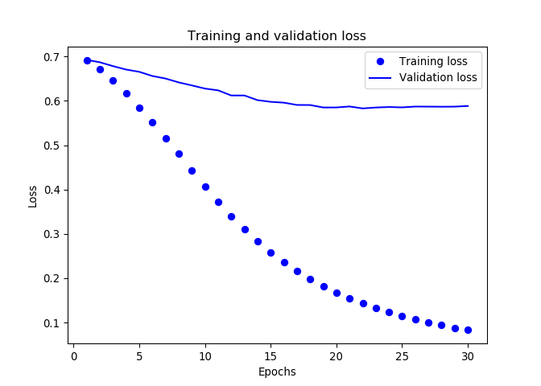
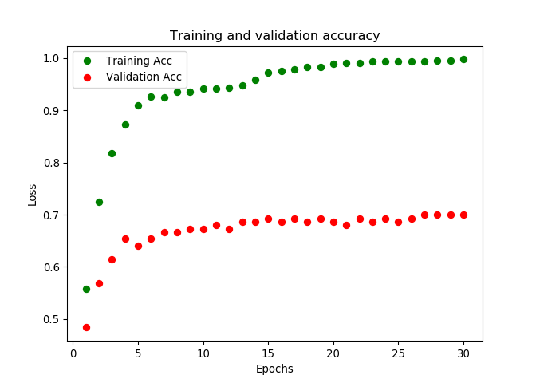

Simple Fully Dense Model for Effector and Non-effector Protein
==============================================================

In this report, the fully conected model will be developed for the
encoded effector and non-effector data.

Introduction
------------

Since new encoding method was done, we will use two kind of data on the
same models.

Load the python library
-----------------------

``` r
library(keras)
```

``` python
import numpy as np
from keras import models
```

    ## Using TensorFlow backend.

``` python
from keras import layers
from keras import losses
from keras import metrics
from keras import optimizers
from keras.layers import Dense, Dropout
```

Load the encoded data
---------------------

There are two kind of data that will be used for each model, which are
encoded by integer encoding and also onehot encoding.

``` python
x_train = np.load('../getting-data-current/data-sets/x_train.npy')
x_dev = np.load('../getting-data-current/data-sets/x_val.npy')
x_test = np.load('../getting-data-current/data-sets/x_test.npy')

y_train = np.load('../getting-data-current/data-sets/y_train.npy')
y_dev = np.load('../getting-data-current/data-sets/y_val.npy')
y_test = np.load('../getting-data-current/data-sets/y_test.npy')
```

We can print the shape of the one hot encoded data

``` python
print(x_train.shape)
```

    ## (462, 4034, 20)

``` python
print(x_dev.shape)
```

    ## (153, 4034, 20)

``` python
print(x_test.shape)
```

    ## (150, 4034, 20)

We need to reshape the data in order so it can be fed to fully connected
model.

``` python
x_train = x_train.reshape(462, 80680)
x_dev = x_dev.reshape(153, 80680)
x_test = x_test.reshape(150, 80680)
```

Fully connected model with integer encoded data
-----------------------------------------------

``` python
model_first = models.Sequential()
model_first.add(Dense(3, activation = 'relu', input_dim = 80680))
model_first.add(Dense(1, activation='sigmoid'))
model_first.compile(optimizer = 'sgd',
                    loss = 'binary_crossentropy',
                    metrics = ['accuracy'])
history = model_first.fit(x = x_train, 
                          y = y_train, 
                          epochs = 30, 
                          batch_size = 16, 
                          validation_data = (x_dev, y_dev), 
                          verbose = 0)
```

### Visualizing the result

``` python
import matplotlib.pyplot as plt

history_dict = history.history
history_dict.keys()
```

    ## dict_keys(['val_loss', 'val_acc', 'loss', 'acc'])

``` python
['val_loss', 'val_acc', 'loss', 'acc']
```

    ## ['val_loss', 'val_acc', 'loss', 'acc']

``` python
plt.clf()
loss_values = history_dict['loss']
val_loss_values = history_dict['val_loss']
epochs = range(1, len(loss_values) + 1)
print(epochs)
```

    ## range(1, 31)

``` python
plt.plot(epochs, loss_values, 'bo', label="Training loss")
plt.plot(epochs, val_loss_values, 'b', label="Validation loss")
plt.title('Training and validation loss')
plt.xlabel('Epochs')
plt.ylabel('Loss')
plt.legend()

plt.show()
```



``` python
plt.clf()
acc_values = history_dict['acc']
val_acc_values = history_dict['val_acc']
epochs = range(1, len(acc_values) + 1)
print(epochs)
```

    ## range(1, 31)

``` python
plt.plot(epochs, acc_values, 'go', label="Training Acc")
plt.plot(epochs, val_acc_values, 'ro', label="Validation Acc")
plt.title('Training and validation accuracy')
plt.xlabel('Epochs')
plt.ylabel('Loss')
plt.legend()

plt.show()
```



### Predict the test data

``` python
#  retrain the model
from keras.layers import Dense, Dropout
model_first = models.Sequential()
model_first.add(Dense(3, activation = 'relu', input_dim = 80680))
model_first.add(Dense(1, activation='sigmoid'))

model_first.compile(optimizer = 'sgd',
                    loss = 'binary_crossentropy',
                    metrics = ['accuracy'])
                    
history = model_first.fit(x = x_train, 
                          y = y_train, 
                          epochs = 3, 
                          batch_size = 16,
                          verbose = 0)

#  evaluate using the test data set
results = model_first.evaluate(x_test, y_test)
```

    ## 
    ##  32/150 [=====>........................] - ETA: 0s
    ## 128/150 [========================>.....] - ETA: 0s
    ## 150/150 [==============================] - 0s 2ms/step

``` python
print(model_first.metrics_names)
```

    ## ['loss', 'acc']

``` python
print(results)
```

    ## [0.6527139115333557, 0.6533333357175192]
