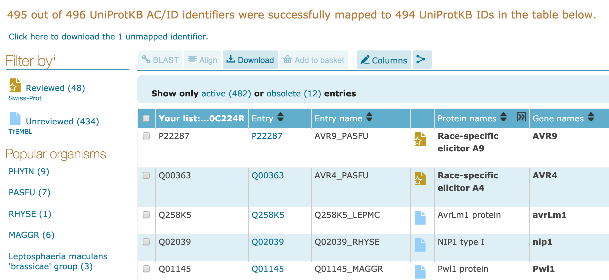

# Getting the data and data analysis

This report will present how we get and clean the data.

### Getting the Protein IDs

The data are the protein amino acids sequence data. The sequences can be retrieved from `uni-prot.org` with the protein IDs obtained from `phi-base.org` by putting keyword *effector (plant avirulence determinant)*. However, due to the unavailability of then download option on `phi-base.org` website, then complete data can be obtained from `phi-base` github repository on `https://github.com/PHI-base/data/tree/master/releases`. Then we can import and clean the data on `R` using `tidyverse` library. And from the data we obtained which is `phi-base_v4-6_2018-12-05.csv`, we can filter the data only for  *effector (plant avirulence determinant)*. The data are saved into `phi-base_current.csv`.

```r
library(tidyverse)

phi_base <- data.table::fread("data/phi-base_current.csv", header = TRUE)

# filter all of the data with 'plant avirulence determinant' information
phi_small <- phi_base %>%
  dplyr::filter_all(any_vars(str_detect(., 'plant avirulence determinant')))

# select only the protein ID data
phi_proteinID <- phi_small %>%
  dplyr::select(`Protein ID`)


# find the unique values and remove all of the rows that the IDs are not available
proteinID_unique <- unique(phi_proteinID) %>%
  dplyr::filter_all(any_vars(!str_detect(., 'no data found')))
```

### Retriving the protein sequence

After we made sure that there is no redundancy in our data, we can use the protein IDs data to retrieve the sequence amino acids sequence data on `uni-prot.org`, and we will get data in `.fatsa` file format. The protein IDs that we obtained from 'phi-base.org` is around 496 protein IDs, however only 482 that are succesfully mapped on `uni-prot.org`.



### Reading and cleaning the data

Using R, we can read and clean the data. In order to read the sequence data in `.fasta` format file on `R`, we can use package `seqinr` together with `tidyverse`. 

```{r}
library(seqinr)

# Read FASTA file
fasta_data <- seqinr::read.fasta("../../data/uniprot-data-mapped.fasta")
```

After we read the `.fasta` data, we can see how the data look like, as follows.

```{r}
fasta_data[[1]]
```

The data is saved in attribute format, therefore, we can do the following to get the data that we need (the name of pathogen and their sequence) in dataframe.

```r
# Number of entries
num_data <- fasta_data %>% length()


# Create empty data frame
parsed_data <- data.frame(
  pathogen = rep(NA, num_data),
  sequence = rep(NA, num_data)
)

for (i in 1:num_data) {
  # Read 'Annot' attribute and parse the string between 'OS=' and 'OX='
  pathogen <- fasta_data[[i]] %>%
    attr("Annot") %>%
    sub(".*OS= *(.*?) *OX=.*", "\\1", .)

  # Concatenate the vector of the sequence into a single string
  sequence <- fasta_data[[i]] %>%
    as.character() %>%
    toupper() %>%
    paste(collapse = "")

  # Input values into data frame
  parsed_data[i,] <- cbind(pathogen, sequence)
}

# Save data frame into CSV file
write.csv(parsed_data, "data/uniprot-data-mapped.csv", row.names = FALSE)
```

We have data frame with two columns, the first column is the organism pathogen name and the second one is the sequence data. 

```{r}
uniprot_data <- data.table::fread("../../data/uniprot-data-mapped.csv")
```

### Analysing the data

As we analyze further the data, the name of pathogen is not unique, since some of the organism with the same species name are the strains (those with *pv*). 

```{r}
library(tidyverse)

# view the head of the data with restricted number of strings
uniprot_data[40:50,] %>%
  mutate(sequence = substr(sequence, 1, 30)) %>% 
  head(20)  %>%
  knitr::kable()
```

Let us take a look further the data we have right now. Here we have many organism name which start with `Pseudomonas syringae`. Considering the perfomance of deep learning that will be better if we have more data training, then we need to be careful in defining the problem. 


```{r}
library(tidyverse)

# view the head of the data with restricted number of strings
uniprot_data  %>% 
   dplyr::filter(str_detect(pathogen, "Pseudomonas syringae"))  %>%
   head(20)  %>%
   mutate(sequence = substr(sequence, 1, 30)) %>% 
   knitr::kable()

```

One alternative we can do is defining the problem as predicting the organism of effector proteins (inclusing the strains). By defining as preceding, then now we can neglect the pathovar for each species by taking the first two words of each pathogen species, by doing the following. 

```r
num <- nrow(uniprot_data)
num

# Create empty data frame
new_parsed_data <- data.frame(
  new_pathogen = rep(NA, num),
  new_sequence = rep(NA, num)
)

for (i in 1:num){
  new_pathogen <- word(parsed_data[['pathogen']][i],1,2, sep=" ")
  
  new_sequence <- uniprot_data[['sequence']][i]
  
  new_parsed_data[i,] <- cbind(new_pathogen, new_sequence)
  
}

```

Now, we can load the data, and take an analysis further


```{r}
new_parsed_data <- data.table::fread("../../data/new_parsed_data.csv", header = TRUE) %>% 
  dplyr::select(-V1)
```

```{r}
# view the head of the data with restricted number of strings
new_parsed_data[40:50,] %>% 
  head(10) %>% 
  mutate(new_sequence = substr(new_sequence, 1, 30)) %>% 
  knitr::kable()
```

By doing previous steps, we have more training data for some pathogen species. However, some species only have single sequence which is not enough to be learned by deep learning models. 


```{r}
library(tidyverse)
count_new_pathogen <- new_parsed_data %>%
  group_by(new_pathogen) %>%
  summarise(count = n())

knitr::kable(count_new_pathogen)
```

### Further discussion

By looking at the data, and did a little analysis, we can do probably several options:

1. Continue with the data obtained above, but we can limit/threshold only for the species with enough data (for instance, more than 40 sequences). Then the organism with the number sequences under the threshold will not be used as data training.
2. The second option is to re-define the problem, for instance instead of identifying the organism as multi-class classification, we can change to binary classification (effector or non-effector) by getting non-effector proteins data.  


 
