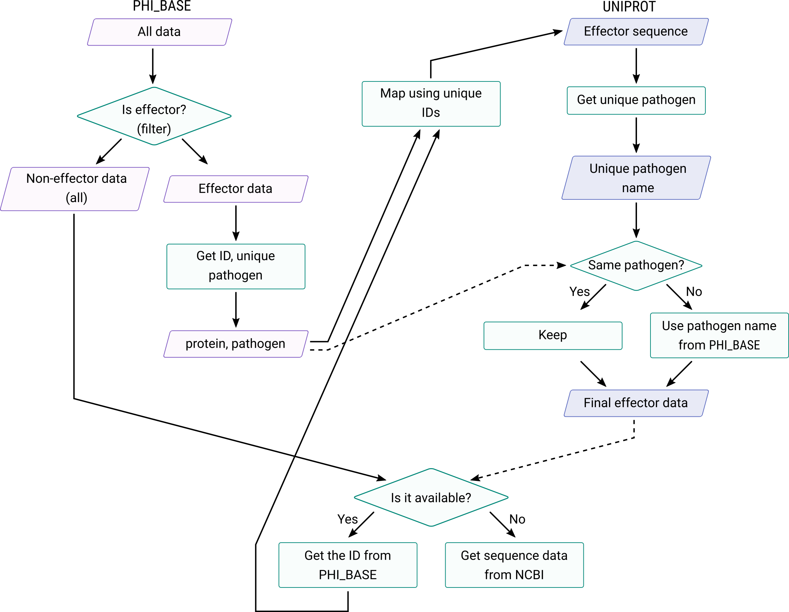
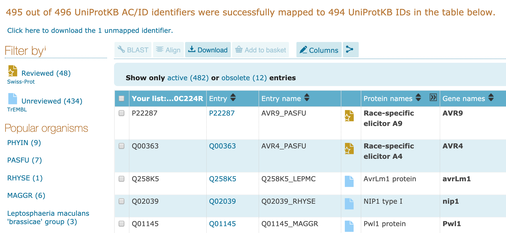

# Getting the data and data analysis

This report will present how we get and clean the data for both effector protein and noneffector protein data. 
The data are the protein amino acids sequence data. The sequences can be retrieved from `uni-prot.org` with the protein IDs obtained from `phi-base.org` by putting keyword **effector (plant avirulence determinant)**. However, due to the unavailability of then download option on `phi-base.org` website, then the complete data can be obtained from [`phi-base` github repository](https://github.com/PHI-base/data/tree/master/releases). Figure is the diagram of how we get the data.




## Effector Data 

We can then import and clean the data on `R` using `tidyverse` library. And from the data we obtained which is `phi-base_v4-6_2018-12-05.csv` (the data are saved into `phi-base-main.csv`.), we can filter the data only for  **effector (plant avirulence determinant)** to get the effector data. 

```{r}
library(tidyverse)

phi_base <- data.table::fread("../../../data/getting-data-old/phi-base-main.csv", header = TRUE)

# filter all of the data with 'plant avirulence determinant' information
phi_effector <- phi_base %>%
  dplyr::filter_all(any_vars(str_detect(., 'plant avirulence determinant')))

# select only the protein ID data
phi_effector_proteinID <- phi_effector %>%
  dplyr::select(`Protein ID`, `Pathogen species`)


# find the unique values and remove all of the rows that the IDs are not available
phi_effector_proteinID_unique <- phi_effector_proteinID %>%
  group_by(`Protein ID`) %>% 
  summarise(`Pathogen species` = first(`Pathogen species`)) %>% 
  dplyr::filter_all(all_vars(!str_detect(., 'no data found')))

phi_effector_proteinID_unique %>% 
  group_by(`Pathogen species`) %>%
  summarise(count = n())

# Salmonella_ids <- phi_effector_proteinID_unique %>%  
#   dplyr::filter(`Pathogen species` == "Salmonella enterica") %>%
#   select(`Protein ID`)

write.csv(phi_effector_proteinID_unique, "../../../data/getting-data-old/phi_effector_proteinID_unique.csv")
phi_effector_proteinID_unique
```

### Retriving the protein sequence

After we made sure that there is no redundancy in our data, we can use the protein IDs data to retrieve the sequence amino acids sequence data on `uni-prot.org`, and we will get data in `.fatsa` file format. The protein IDs that we obtained from 'phi-base.org` is around 496 protein IDs, however only 482 that are succesfully mapped on `uni-prot.org` due to the deleted data. 



### Reading and cleaning the data

Using R, we can read and clean the data. In order to read the sequence data in `.fasta` format file on `R`, we can use package `seqinr` together with `tidyverse`. 

```{r}
library(seqinr)

# Read FASTA file
fasta_data <- seqinr::read.fasta("../../../data/getting-data-old/uniprot-data-mapped.fasta")
```

After we read the `.fasta` data, we can see how the data look like, as follows.

```{r}
fasta_data[[1]]
```

The data is saved in attribute format, therefore, we can do the following to get the data that we need (the name of pathogen and their sequence) in dataframe.

```r
# Number of entries
num_data <- fasta_data %>% length()


# Create empty data frame
parsed_data <- data.frame(
  pathogen = rep(NA, num_data),
  sequence = rep(NA, num_data)
)

for (i in 1:num_data) {
  # Read 'Annot' attribute and parse the string between 'OS=' and 'OX='
  pathogen <- fasta_data[[i]] %>%
    attr("Annot") %>%
    sub(".*OS= *(.*?) *OX=.*", "\\1", .)

  # Concatenate the vector of the sequence into a single string
  sequence <- fasta_data[[i]] %>%
    as.character() %>%
    toupper() %>%
    paste(collapse = "")

  # Input values into data frame
  parsed_data[i,] <- cbind(pathogen, sequence)
}

# Save data frame into CSV file
write.csv(parsed_data, "../../../data/getting-data-old/uniprot-data-mapped.csv", row.names = FALSE)
```

We have data frame with two columns, the first column is the organism pathogen name and the second one is the sequence data. 

```{r}
uniprot_data <- data.table::fread("../../../data/getting-data-old/uniprot-data-mapped.csv", header = TRUE)
```

### Analysing the data

In order to make the data processing easier (for instance, grouping data and also later on getting the noneffector data), we will only take the first two words of the pathogen name. As we can see below for instance, we will not take any *pv* of *Pseudomonas syringae*. 


```{r}
library(tidyverse)

# view the head of the data with restricted number of strings
uniprot_data %>%
  dplyr::filter(str_detect(pathogen, "Pseudomonas syringae")) %>%
  head(20) %>%
  mutate(sequence = substr(sequence, 1, 30)) %>%
  knitr::kable()
```

One alternative we can do is defining the problem as predicting the pathogen species which only include the first two words of their name, by doing the following. 

```r
num <- nrow(uniprot_data)
num

# Create empty data frame
uniprot_effector_short_pathogen_name <- data.frame(
  new_pathogen = rep(NA, num),
  new_sequence = rep(NA, num)
)

for (i in 1:num){
  new_pathogen <- word(parsed_data[['pathogen']][i],1,2, sep=" ")
  
  new_sequence <- uniprot_data[['sequence']][i]
  
  uniprot_effector_short_pathogen_name[i,] <- cbind(new_pathogen, new_sequence)
  
}

```
It can be done easier by 

```{r}
uniprot_effector_short_pathogen_name <- uniprot_data %>%
  mutate(pathogen_short = word(pathogen, 1, 2, sep = " "))
```
By doing previous steps, we have more training data for some pathogen species, as we can see below. 


```{r}
library(tidyverse)
uniprot_short_pathogen_name_count <- uniprot_effector_short_pathogen_name %>%
  mutate(pathogen_short = ifelse(pathogen_short == "Salmonella typhi", "Salmonella typhimurium", pathogen_short)) %>%
  group_by(pathogen_short) %>%
  summarise(
    count = n(),
    protein_id = paste(protein_id, collapse = " ")
  )
```

```{r}
knitr::kable(uniprot_short_pathogen_name_count %>% select(-protein_id)) 
nrow(uniprot_data)
```


### Checking the consistency of protein IDs and pathogen name of data obtained from Phi-base and Uniprot

For getting the noneffector data, ideally, we need to get the same number of data of each organism in effector data. However, due to the uncosistency problem between the data obtained in uniprot and phi-base, we one source that can be used as reference, in this case we can use Phi-base data as a reference. 

Some minor incosistency problems mentioned previously are:

1. Different proteinID after mapping (with the same sequence)
2. Different pathogen name with the same IDs (that biologically it is normal, but since we deal with data, it would be easier to make them consistent)

In order to getting more information regarding the problems above, we can analyse the data that contains all of information inclusing list of proteinIDs data from Phi-base and the mapped results in uni-prot. 

```{r}
library(tidyverse)

# read the mapping result from phi-base unique proteinIDs to uniprot -- retrieved in .csv
uniprot_raw <- data.table::fread("../../../data/getting-data-old/uniprot-results-mapped-raw.csv", fill = TRUE, sep = "\t")

# rename a column of protein IDs obtained from phi-base, and the entry IDs from
uniprot_raw <- uniprot_raw %>%
  rename(phi_ids = `yourlist:M201904266746803381A1F0E0DB47453E0216320D065C43S`, uniprot_ids = `Entry`)

# getting the ids which are different between phi-base and uniprot
diff_phi_uniprot_ids <- uniprot_raw %>%
  dplyr::filter(!(phi_ids %in% intersect(uniprot_raw[['phi_ids']], uniprot_raw[['uniprot_ids']]))) %>%
  select(`phi_ids`, `uniprot_ids`, `Organism`)

# matching the ids that can be mapped vs ids that have sequence available

uniprot_ids_with_unavailable_seq <- uniprot_raw %>%
  dplyr::filter(!(uniprot_ids %in% intersect(uniprot_effector_short_pathogen_name[['protein_id']], uniprot_raw[['uniprot_ids']])))

uniprot_ids_with_available_seq <- uniprot_raw %>%
  dplyr::filter((uniprot_ids %in% intersect(uniprot_effector_short_pathogen_name[['protein_id']], uniprot_raw[['uniprot_ids']])))

# matching the IDs

uniprot_effector_with_proteinID_correction <- uniprot_effector_short_pathogen_name %>%
  mutate('protein_id' = ifelse(protein_id == uniprot_ids_with_available_seq[['phi_ids']], protein_id, uniprot_ids_with_available_seq[['phi_ids']])) %>%
  select(`protein_id`, `pathogen_short`, `sequence`)

# since only 482 ids available then now we can filter

phi_proteinID_list <- phi_effector_proteinID_unique %>%
  dplyr::select(`Protein ID`) %>%
  unlist()

uniprot_proteinID_list <- uniprot_effector_with_proteinID_correction %>%
  dplyr::select(protein_id) %>%
  unique() %>%
  unlist()

phi_ids_available_in_uniprot <- phi_effector_proteinID_unique %>%
  dplyr::filter(`Protein ID` %in% dplyr::intersect(phi_proteinID_list, uniprot_proteinID_list))

#  getting the difference of the pathogen name and the ids

uniprot_pathogen_name_unique <- uniprot_effector_with_proteinID_correction %>%
  dplyr::select(pathogen_short) %>%
  unique() %>%
  unlist()

phi_pathogen_name_unique <- phi_effector_proteinID_unique %>%
  dplyr::select(`Pathogen species`) %>%
  unique() %>%
  unlist()

phi_uniprot_diff_pathogen_name <- uniprot_effector_with_proteinID_correction %>%
  dplyr::filter(!(pathogen_short %in% intersect(uniprot_pathogen_name_unique, phi_pathogen_name_unique)))


phi_uniprot_diff_pathogen_name  <- phi_uniprot_diff_pathogen_name %>%
  dplyr::select(`protein_id`, `pathogen_short`) %>%
  mutate(pathogen_short = ifelse(pathogen_short == "Salmonella typhi", "Salmonella typhimurium", pathogen_short)) %>%
  group_by(pathogen_short) %>%
  summarise(count = n(), protein_id = paste(protein_id, collapse = " "))


# getting all of the ids in

ids_diff_pathogen_name <- phi_uniprot_diff_pathogen_name  %>%
  dplyr::summarise(all_ids = paste(protein_id, collapse = " ")) %>%
  unlist() %>%
  strsplit(" ") %>%
  unlist() %>%
  unname()


# getting the true name for then phi-base
phi_correct_pathogen_name <- phi_ids_available_in_uniprot %>%
  dplyr::filter(`Protein ID` %in% ids_diff_pathogen_name) %>%
  dplyr::select(`Pathogen species`, `Protein ID`) %>%
  rename(pathogen_short = `Pathogen species`, protein_id = `Protein ID`) %>%
  group_by(protein_id, pathogen_short) %>%
  summarise()

effector_data <- uniprot_effector_with_proteinID_correction %>%
  left_join(., phi_correct_pathogen_name, by = "protein_id") %>%
  mutate(
    pathogen_short = ifelse(is.na(pathogen_short.y), pathogen_short.x, pathogen_short.y),
    name_src = ifelse(is.na(pathogen_short.y), "uniprot", "phi_base"),
    name_src = as.factor(name_src)
  ) %>%
  dplyr::select(-pathogen_short.x, -pathogen_short.y)

effector <- effector_data %>% 
  select(sequence) %>% 
  mutate(label = as.factor(1))

write.csv(effector_data, "../../../data/getting-data-old/effector_with_IDs_organism.csv", row.names = FALSE)
write.csv(effector, "../../../data/getting-data-old/effector.csv", row.names = FALSE)
```

Then now, we have the final data which is `effector_data` with consistent proteinIDs and pathogen name. 

## Non-effector Data

We need to get the non-effector data with the same number data as the effector data for both total and also for each species. 

```{r}
#  count how many sample data of effector of each pathogen species
effector_data_count_each_organism_sample <- effector_data %>%
  group_by(pathogen_short) %>%
  summarise(count = n())

effector_data_count_each_organism_sample_list <- effector_data_count_each_organism_sample %>%
  dplyr::summarise(all_ids = paste(pathogen_short, collapse = "|")) %>%
  unlist() %>%
  strsplit("\\|") %>%
  unlist() %>%
  unname()
```

```{r}
effector_data_count_each_organism_sample %>% 
  knitr::kable()
```


### Getting the non-effector data from the Phi-base

Next step will be filter all of the data which is not effector from the data obtained from phi-base. 

```{r}
effector_rowids <- phi_base %>%
  tibble::rowid_to_column() %>%
  dplyr::filter_all(any_vars(str_detect(., "plant avirulence determinant"))) %>%
  select(rowid) %>%
  unlist() %>%
  unname()

noneffector <- phi_base %>%
  tibble::rowid_to_column() %>%
  filter(!(rowid %in% effector_rowids)) %>%
  rename(pathogen_short = `Pathogen species`) %>% 
  select(-rowid)

noneffector <- noneffector %>% 
  filter(!str_detect(`Protein ID`, 'no data found')) %>% 
  select(`Protein ID`, pathogen_short) 

noneffector_group_by_IDs <- noneffector %>% 
  group_by(`Protein ID`) %>% 
  summarise(pathogen_short = first(pathogen_short))
```

### Checking the availability non-effcetor sample for each organism

```{r}
# noneffector %>%
#   dplyr::select(pathogen_short) %>%
#   mutate(word_count = stringr::str_count(pathogen_short, "\\S+")) %>%
#   # unique()
#   filter(word_count > 2)

uniq_noneffector_data <- noneffector_group_by_IDs %>%
  group_by(pathogen_short) %>%
  summarise(count = n())

uniq_noneffector_data

# Make lookup table
uniq_available_noneffector_data <- effector_data_count_each_organism_sample %>%
  left_join(uniq_noneffector_data, by = "pathogen_short") 
```

```{r}
uniq_available_noneffector_data %>% 
    knitr::kable()
```

From the list above, as we can see from Phi-base data, there are some unavailable non-effector data from some species, and also for some pathogen some species, there are some available data but less then the number that we actually need (we call it partially available). 

```{r}
# Check if there's enough observations
uniq_available_noneffector_data %>%
  filter(count.x > count.y)
```

We can then define the availability of data into three categories, for the species whose the data:

1. Fully available in Phi-base
2. Partially available
3. Not available

In the case of partially available data, we will separately from phi-base and NCBI. 

#### Getting the noneffector that fully available in Phi-base

```{r}
# Perfect available data
good_available_noneffector_data <- uniq_available_noneffector_data %>%
  filter(!is.na(count.y)) %>%
  filter(count.x <= count.y) %>%
  select(-count.y) %>%
  rename(count = count.x)
```
```{r}

good_available_noneffector_data 
good_available_noneffector_data %>% 
  summarise(sum(count))
```


```{r}
# function to get noneffector data from phi-base
get_sample_of_noneffectors <- function(reference_count_data, source_data, count = "count") {
  # Number of entries
  num_reference <- nrow(reference_count_data)

  # Create empty data frame
  noneffector_looped <- data.frame(matrix(ncol = ncol(source_data), nrow = 0))

  colnames(noneffector_looped) <- colnames(source_data)

  for (i in 1:num_reference) {
    data_in_rows <- source_data %>%
      dplyr::filter(pathogen_short == reference_count_data[[i, "pathogen_short"]]) %>%
      group_by(`Protein ID`) %>%
      slice(1) %>%
      ungroup() %>%
      head(reference_count_data[[i, count]])

    noneffector_looped <- noneffector_looped %>%
      rbind(., data_in_rows)
  }

  return(noneffector_looped)
}

noneffector_data_from_phi_base <- get_sample_of_noneffectors(good_available_noneffector_data, noneffector, "count")

nrow(noneffector_data_from_phi_base)
```


#### Get the noneffector that are partially available in the phi-base 

Deal with partial available data and the data which are not available

```{r}
partial_available_noneffector_data <- uniq_available_noneffector_data %>%
  filter(count.x > count.y) %>% 
  mutate(available_count = count.y, not_available_count = count.x - count.y) %>% 
  select(pathogen_short, available_count, not_available_count)
```
```{r}
partial_available_noneffector_data 
```


By using te function created previously, we can easily get the data of the non-effector in phi-base table:

```{r}
noneffector_data_from_phi_base_partial <- get_sample_of_noneffectors(partial_available_noneffector_data, noneffector, count = "available_count")
```

```{r}
noneffector_data_from_phi_base_partial
```

```{r}
# combine full_available and only partially available

noneffector_data_from_phi_base_full <- rbind(noneffector_data_from_phi_base, noneffector_data_from_phi_base_partial)

nrow(noneffector_data_from_phi_base_full)

noneffector_protein_IDs_full <- noneffector_data_from_phi_base_full %>% 
  select(`Protein ID`)

write.csv(noneffector_protein_IDs_full, "../../../data/getting-data-old/noneffector_protein_IDs_full.csv")
```

#### Get the noneffector that are not available in the phi-base

We can gather all of the data that are not available in Phi-base by doing the following

```{r}
non_available_noneffector_data <- uniq_available_noneffector_data %>% 
  filter(is.na(count.y) | count.x > count.y) %>% 
  mutate(count.y = ifelse(is.na(count.y), 0, count.y)) %>% 
  mutate(not_available_count = ifelse(count.y == 0, count.x, count.x - count.y)) %>% 
  select(pathogen_short, not_available_count)

# uniq_available_noneffector_data
non_available_noneffector_data %>% 
  knitr::kable()

write.csv(non_available_noneffector_data, "../../../data/getting-data-old/non_available_noneffector_data.csv")
```

Using the reference list `non_available_noneffector_data.csv`, we can get manually  get the data from NCBI, and we can combine all together the data that are partially available and fully available. 


