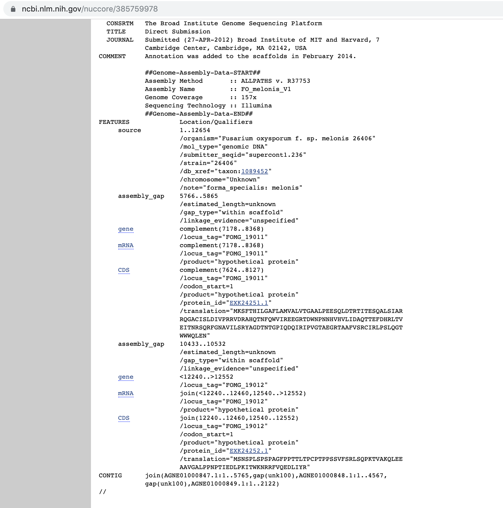
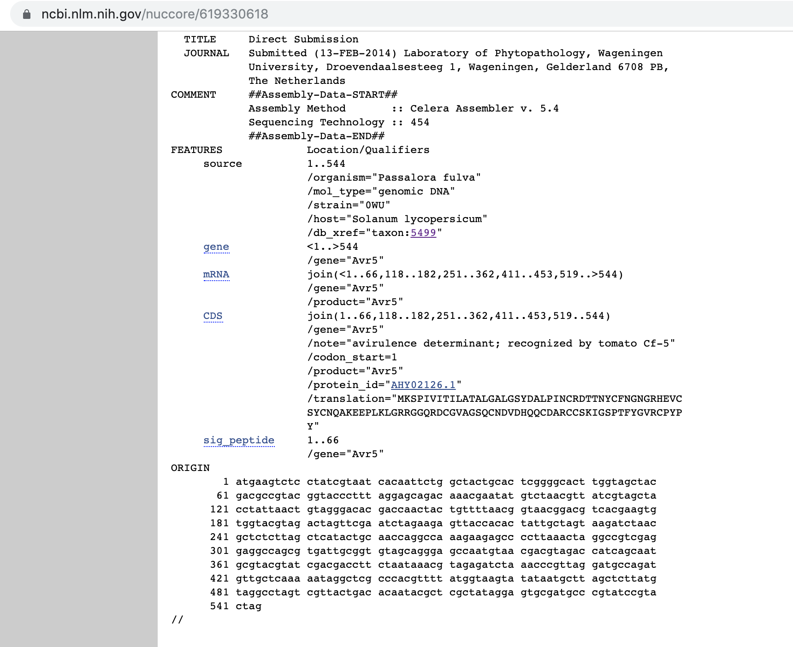
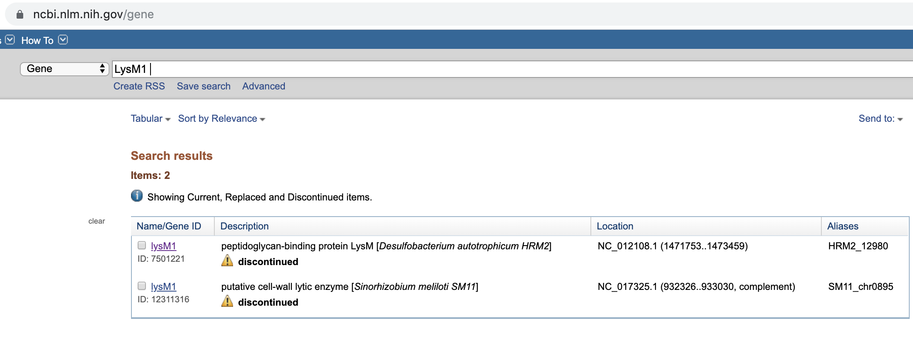
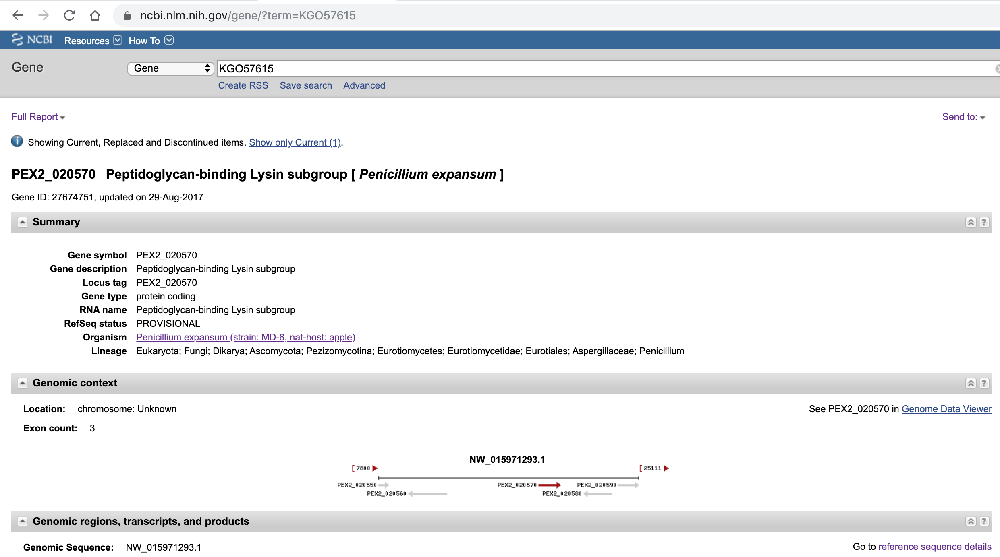
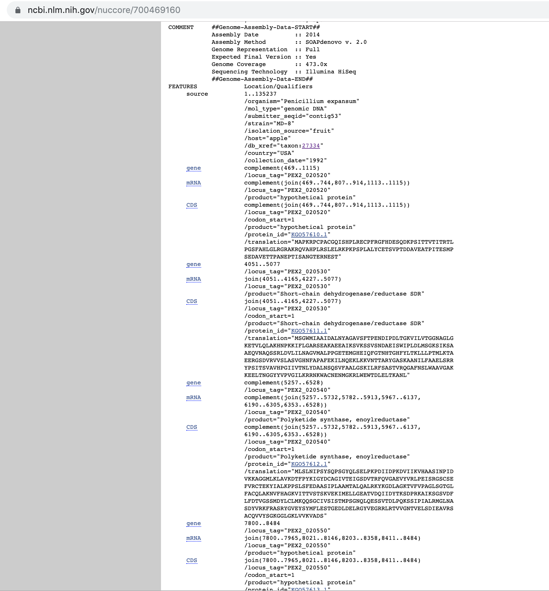

# Checking how we can get negative (secreted) protein data from `rentrez` effectively 

## Introduction

In this report, I will check how the the `rentrez` works, for all of the `GeneID`, in particularly (from `0001_get_secretd_data.Rmd`):

  1. Does have any NCBI ID 
  2. Does not have
  
## Experimental plan

Taking an example of ID for each case above, and then check links of database using known GeneID we have. 
  
## Execution

### Protein that does not have GeneID

```{r}
# Load lib
library(rentrez)
```


#### Example 1 

```{r}
# Take an example of protein with the ID = `W9ZT25`, GeneID = `EXK24251`, Gene = `AVRFOM2`
# Using both GeneID and Gene, let us check if we can find any id for gene ID in NCBI

# Using Gene
entrez_search(db = "gene", term = "AVRFOM2")$ids

# Using Gene ID
entrez_search(db = "gene", term = "EXK24251")$ids
```

Since there is no information regarding the unique gene id in NCBI, then we can try to immediately check the entrez link database:

```{r}
links_XK24251 <- entrez_link(dbfrom='protein', id = "EXK24251" , db='all')$links
links_XK24251
```

```{r}
# Get the ID of protein in Nuccore database
links_XK24251$protein_nuccore
```

```{r}
# Get the ID of protein in Nucleotide database
links_XK24251$protein_nucleotide
```

SInce the results are exactly the same ID, then I assume, they are exactly same database. Also, according to this thread in Biostar [Question: Biopython Entrez difference between nuccore and nucleotide databases](https://www.biostars.org/p/161430/). 

Then now, we can try to retrive proteinID, by doing these steps:

```{r}
entrez_link(dbfrom = "nuccore", id = "385759978", db = "all")$links$nuccore_protein
```

Here is how it looks when we enter the ID in NCBI website:



Then we will get two protein IDs(here is the look from the NCBI website):

Using the protein IDs above then now we can easily retrive the sequence data. 

#### Example 2

```{r}
# Take an example of protein with the ID = `A0A023UJQ9`, GeneID = `AHY02126`, Gene = `Avr5(CfCE1)`
# Using both GeneID and Gene, let us check if we can find any id for gene ID in NCBI

# Using Gene
entrez_search(db = "gene", term = "Avr5(CfCE1)")$ids

# Using Gene ID
entrez_search(db = "gene", term = "AHY02126")$ids
```


```{r}
links_AHY02126 <- entrez_link(dbfrom='protein', id = "AHY02126" , db='all')$links
links_AHY02126
```

```{r}
# Get the ID of protein in Nuccore database
links_AHY02126$protein_nuccore
```

```{r}
# Get the ID of protein in Nucleotide database
links_AHY02126$protein_nucleotide
```

```{r}
entrez_link(dbfrom = "nuccore", id = "619330618", db = "all")$links$nuccore_protein
```

Here is the reults when we input the ID in NCBI website



If the result is only one proteinID, then it is actually protein that we already have, then we can retrieve the protein from the known protein ID and strains. 

### Protein that does have GeneID

```{r}
# Take an example of protein with the ID = `A0A0A2ILW0`, GeneID = `KGO57615`, Gene = `LysM1`
# Using both GeneID and Gene, let us check if we can find any id for gene ID in NCBI

# Using Gene
entrez_search(db = "gene", term = "LysM1")$ids
```



```{r}
# Using Gene ID
entrez_search(db = "gene", term = "KGO57615")$ids
```



Since using the GeneID is more unique and refer to the exact gene for the protein we need, we will use the GeneID in this case:

```{r}
links_KGO57615 <- entrez_link(dbfrom='protein', id = "KGO57615" , db='all')$links
links_KGO57615
```

```{r}
links_KGO57615$protein_nuccore
```

```{r}
links_KGO57615$protein_nucleotide
```


```{r}
entrez_link(dbfrom = "nuccore", id = "700469160", db = "all")$links$nuccore_protein
```

In this case we have many protein, these proteins will later on will be analysed using the SignalP. 


