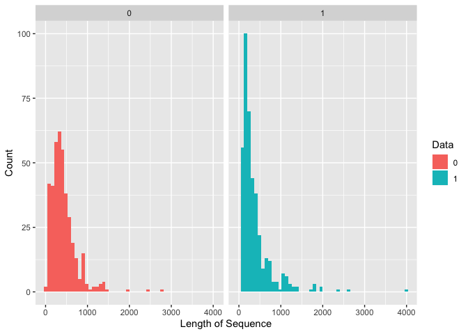
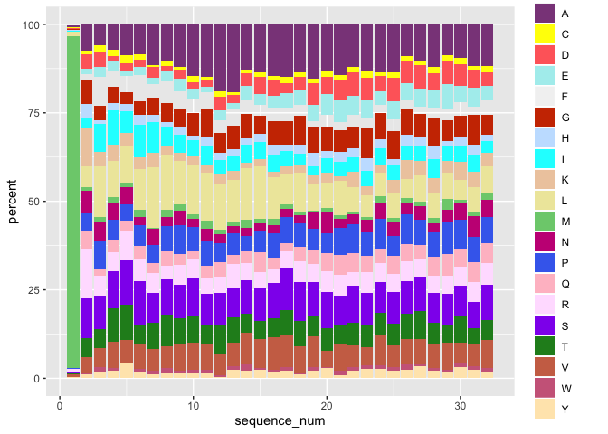

Analysis of the Effector and Noneffector Sequence Data
======================================================

Introduction
------------

Before getting to know further whether the protein are identical or not
(we can determine by using BLAST), first of all, we can do simple
stastical analysis on the sequences themselves.

Distribution of the length of sequence
--------------------------------------

``` r
# Read CSV of the effector data
effector_data <- data.table::fread("effector_data.csv")

# Read CSV of the noneffector data 
non_effector_data <- data.table::fread("non_effector_data.csv")
```

``` r
effector_seq <- effector_data %>% 
  dplyr::select(Sequence) %>% 
  rename(., sequence = Sequence) %>% 
  mutate(data = 1)

non_effector_seq <- non_effector_data %>% 
  dplyr::select(sequence) %>% 
  mutate(data = 0)

seq_all <- effector_seq %>% 
  rbind(non_effector_seq)
```

``` r
# Count the length of the string

library(stringr)
seq_info <- seq_all %>% 
  rowwise() %>% 
  dplyr::mutate(len = stringr::str_length(sequence))
```

``` r
seq_info %>% 
  summary(len)
```

    ##    sequence              data             len        
    ##  Length:800         Min.   :0.0000   Min.   :  32.0  
    ##  Class :character   1st Qu.:0.0000   1st Qu.: 174.5  
    ##  Mode  :character   Median :1.0000   Median : 311.0  
    ##                     Mean   :0.5025   Mean   : 402.3  
    ##                     3rd Qu.:1.0000   3rd Qu.: 483.5  
    ##                     Max.   :1.0000   Max.   :4034.0

Plot using ggplot()

``` r
ggplot(seq_info) +
  geom_histogram(aes(len, fill = as.factor(data)), bins = 50) +
  facet_wrap(~data) +
  labs(x = "Length of Sequence", y = "Count", fill = "Data")
```



``` r
# Show how many data have length for more than 2000 chars

seq_info %>% 
  dplyr::filter(len > 2000) %>% 
  # Show only the beginning of sequence
  mutate(sequence = substr(sequence, 1, 30)) %>% 
  knitr::kable()
```

| sequence                       |  data|   len|
|:-------------------------------|-----:|-----:|
| MRDEMWNTATEPIAIIGSGCKFPGGSTTPS |     1|  4034|
| MKFNRTHRNLPPAHVGHTTRGHAPAPAGPQ |     1|  2338|
| MPSRMGYSRISSGLNASRGASPAPQPDTPP |     1|  2574|
| MTLFNGSNGANGTSSGHGAHPSANGFHNAA |     0|  2410|
| MFLKQQQQQPVEADFVDCQSTPRAGGPVAG |     0|  2758|

Analyzing Amino Acids in Protein Sequence data
----------------------------------------------

### Sequence Logo of the Amino acids letters proportion

``` r
# Load the library 
library(ggseqlogo)

# Generate the sequence logo
seqs <- seq_all %>% 
  mutate(sequence = substr(sequence, 1, 32)) %>% 
  dplyr::select(sequence)

write_csv(seqs, "seqs.csv", col_names = FALSE)

ggseqlogo(seqs, seq_type='aa') 
```


``` r
# + theme(axis.text.x = element_blank())
```

### Plot of the proportion using bar chart for each position

``` r
# Calculate the proportion of each amino acids 

sep_seqs <- seqs %>% 
  tidyr::separate(sequence, c("1", "2", "3", "4", "5", "6", "7", "8", "9", "10",
                "11", "12", "13", "14", "15", "16", "17", "18", "19", "20", 
                "21", "22", "23", "24", "25", "26", "27", "28", "29", "30", 
                "31", "32"))
```

    ## Warning: Expected 32 pieces. Missing pieces filled with `NA` in 800
    ## rows [1, 2, 3, 4, 5, 6, 7, 8, 9, 10, 11, 12, 13, 14, 15, 16, 17, 18, 19,
    ## 20, ...].

``` r
sep_seqs <- seqs %>% 
  mutate(len = stringr::str_length(sequence)) %>% 
  tidyr::separate(sequence, into = as.character(1:max(.$len)), sep = 1:max(.$len), remove = FALSE)
    
# first_position <- seqs %>% 
#   mutate("1" = substr(sequence, 1, 1), 
#          "2" = substr(sequence, 2, 2),
#          "3" = substr(sequence, 3, 3),
#          "4" = substr(sequence, 4, 4),
#          "5" = substr(sequence, 5, 5),
#          "6" = substr(sequence, 6, 6),
#          "7" = substr(sequence, 7, 7),
#          "8" = substr(sequence, 8, 8),
#          "9" = substr(sequence, 9, 9),
#          "10" = substr(sequence, 10, 10),
#          "11" = substr(sequence, 11, 11), 
#          "12" = substr(sequence, 12, 12))
```

``` r
sep_seqs_transpose <- sep_seqs %>% 
  dplyr::select(paste0(1:32)) %>% 
  t() %>% 
  as.data.frame() %>% 
  tidyr::unite(new_seq, as.character(paste0("V", 1:800)), sep = "", remove = FALSE) %>% 
  select(new_seq) 

sep_seqs_transpose$seq <- sep_seqs_transpose$new_seq

sep_seqs_transpose_counts <- sep_seqs_transpose %>% 
  rowwise() %>% 
  mutate(
  G_count = stringr::str_count(new_seq, "G"),
  A_count = stringr::str_count(new_seq, "A"),
  L_count = stringr::str_count(new_seq, "L"),
  M_count = stringr::str_count(new_seq, "M"),
  F_count = stringr::str_count(new_seq, "F"),
  W_count = stringr::str_count(new_seq, "W"),
  K_count = stringr::str_count(new_seq, "K"),
  Q_count = stringr::str_count(new_seq, "Q"),
  E_count = stringr::str_count(new_seq, "E"),
  S_count = stringr::str_count(new_seq, "S"),
  P_count = stringr::str_count(new_seq, "P"),
  V_count = stringr::str_count(new_seq, "V"),
  I_count = stringr::str_count(new_seq, "I"),
  C_count = stringr::str_count(new_seq, "C"),
  Y_count = stringr::str_count(new_seq, "Y"),
  H_count = stringr::str_count(new_seq, "H"),
  R_count = stringr::str_count(new_seq, "R"),
  N_count = stringr::str_count(new_seq, "N"),
  D_count = stringr::str_count(new_seq, "D"),
  T_count = stringr::str_count(new_seq, "T")
)

sep_seqs_transpose_proportion <- sep_seqs_transpose_counts %>% 
  rowwise() %>% 
  mutate(
  G_percent = G_count / stringr::str_length(new_seq) * 100,
  A_percent = A_count / stringr::str_length(new_seq) * 100,
  L_percent = L_count / stringr::str_length(new_seq) * 100,
  M_percent = M_count / stringr::str_length(new_seq) * 100,
  F_percent = F_count / stringr::str_length(new_seq) * 100,
  W_percent = W_count / stringr::str_length(new_seq) * 100,
  K_percent = K_count / stringr::str_length(new_seq) * 100,
  Q_percent = Q_count / stringr::str_length(new_seq) * 100,
  E_percent = E_count / stringr::str_length(new_seq) * 100,
  S_percent = S_count / stringr::str_length(new_seq) * 100,
  P_percent = P_count / stringr::str_length(new_seq) * 100,
  V_percent = V_count / stringr::str_length(new_seq) * 100,
  I_percent = I_count / stringr::str_length(new_seq) * 100,
  C_percent = C_count / stringr::str_length(new_seq) * 100,
  Y_percent = Y_count / stringr::str_length(new_seq) * 100,
  H_percent = H_count / stringr::str_length(new_seq) * 100,
  R_percent = R_count / stringr::str_length(new_seq) * 100,
  N_percent = N_count / stringr::str_length(new_seq) * 100,
  D_percent = D_count / stringr::str_length(new_seq) * 100,
  T_percent = T_count / stringr::str_length(new_seq) * 100
) %>% 
  select(ends_with("_percent"))

saveRDS(sep_seqs_transpose_proportion, "sep_seqs_transpose_proportion.RDS")
```

``` r
sep_seqs_proportion_melt <- sep_seqs_transpose_proportion %>% 
  # Transform rowids into a column
  tibble::rowid_to_column(var = "sequence_num") %>% 
  # Melt the data to make is sparse instead of a matrix
  reshape2::melt(id.var = "sequence_num", value.name = "percent") %>% 
  # Rename aminoacids
  mutate(variable = stringr::str_remove_all(variable, "_percent")) %>% 
  rename(aminoacid = variable)


ggplot(sep_seqs_proportion_melt) +
  aes(x = sequence_num, y = percent, group = aminoacid, fill = aminoacid) +
  geom_col(position = "stack") +
  scale_fill_manual(values = c("M" = "palegreen3", 
                               "G" = "orangered3", 
                               "A" = "orchid4", 
                               "L" = "palegoldenrod",
                               "E" = "paleturquoise2", 
                               "W" = "palevioletred3",
                               "K" = "peachpuff2", 
                               "Q" = "pink", 
                               "E" = "plum", 
                               "S" = "purple2",
                               "P" = "royalblue2",
                               "V" = "salmon3",
                               "I" = "cyan",
                               "C" = "yellow1",
                               "Y" = "wheat1", 
                               "H" = "slategray1", 
                               "R" = "thistle1",
                               "N" = "mediumvioletred", 
                               "D" = "indianred1",
                               "T" = "forestgreen"))
```



``` r
  # viridis::scale_fill_viridis(discrete = TRUE)
```
